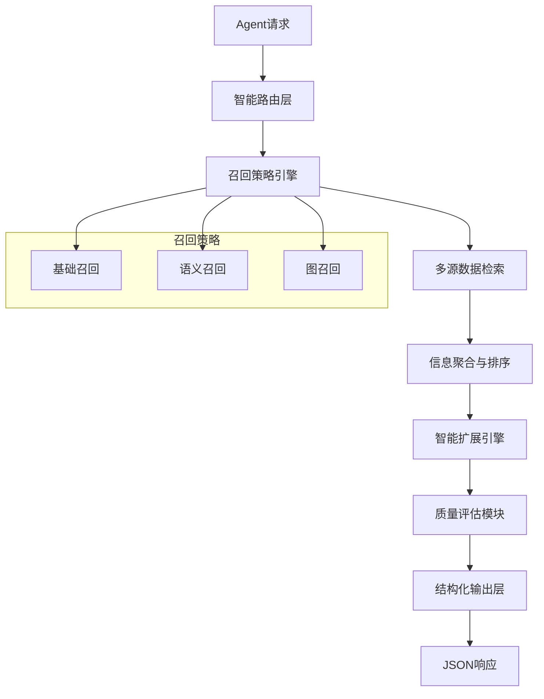

# 记忆召回API封装设计文档

## 概述

本文档描述了MOYAN智能顾问系统中记忆召回服务的API架构设计。该API负责智能信息检索、上下文构建和结构化数据返回，为上层Agent提供高质量的记忆数据支持。

## 设计原则

### 核心哲学
- **模块化原则**: API作为独立的信息检索服务，专注于数据召回和结构化
- **单一职责**: 专注于信息检索，不承担推理和决策责任
- **可扩展性**: 支持多种召回策略和扩展算法
- **高性能**: 通过缓存、索引和并行处理优化响应时间

### 架构边界
```
Agent → [记忆召回API] → [数据源]
         ↑
    结构化JSON返回
```

## 系统架构

### 整体架构图


### 核心组件

#### 1. 智能路由层 (SmartRouter)
负责请求解析和策略选择：
- 查询意图识别
- 问题类型分类
- 召回策略选择
- 预算分配决策

#### 2. 召回策略引擎 (RetrievalStrategyEngine)
实现多种召回算法：
- 关键词匹配召回
- 语义相似度召回
- 图遍历召回
- 混合召回策略

#### 3. 智能扩展引擎 (IntelligentExpander)
基于相关性的差异化扩展：
- 深度扩展（高相关性节点）
- 浅层扩展（中相关性节点）
- 信号提取（低相关性节点）

#### 4. 质量评估模块 (QualityAssessor)
评估召回结果质量：
- 信息充足度评分
- 交叉一致性验证
- 冲突检测与标记
- 置信度计算

## API接口规范

### 核心接口

#### POST /api/v1/memory/retrieve
智能记忆召回接口

**请求参数:**
```json
{
  "query": "拍摄者去了几次厨房？",
  "query_type_hint": "counting_question",
  "retrieval_config": {
    "max_primary_nodes": 2,
    "max_secondary_nodes": 5,
    "max_weak_signals": 10,
    "expansion_depth": {
      "primary": 3,
      "secondary": 1,
      "weak": 0
    },
    "quality_threshold": 0.3,
    "enable_cross_validation": true
  },
  "context": {
    "conversation_id": "conv_12345",
    "previous_queries": ["什么是厨房场景？"],
    "user_preferences": {
      "response_style": "detailed",
      "language": "zh-CN"
    }
  }
}
```

**响应结构:**
```json
{
  "status": "success",
  "request_id": "req_abc123",
  "timestamp": "2025-01-28T10:30:00Z",
  "processing_time_ms": 193.81,
  "query_metadata": {
    "query": "拍摄者去了几次厨房？",
    "detected_query_type": "counting_question",
    "intent_analysis": {
      "primary_intent": "count_events",
      "entities": [
        {"type": "subject", "value": "拍摄者", "confidence": 0.9},
        {"type": "location", "value": "厨房", "confidence": 0.95},
        {"type": "action", "value": "去", "confidence": 0.8}
      ]
    },
    "total_nodes_found": 40,
    "strategy_used": "hybrid_weighted_aggregation"
  },
  "memory_layers": {
    "primary_context": {
      "description": "核心信息层 - 高相关性节点及深度扩展",
      "total_weight": 0.7,
      "nodes": [
        {
          "node_id": "clip_66",
          "relevance_score": 0.85,
          "content": "厨房场景 - 人物出现",
          "source": "video_segment",
          "metadata": {
            "timestamp": "00:03:24",
            "confidence": 0.9,
            "source_reliability": 0.85
          },
          "expansion_depth": 3,
          "expanded_nodes": [
            {
              "node_id": "clip_66_1",
              "relationship": "temporal_context",
              "content": "时间戳: 00:03:24",
              "relevance_score": 0.75,
              "confidence": 0.9
            },
            {
              "node_id": "clip_66_2",
              "relationship": "spatial_context",
              "content": "厨房位置：一楼东侧",
              "relevance_score": 0.65,
              "confidence": 0.8
            }
          ]
        },
        {
          "node_id": "clip_105",
          "relevance_score": 0.82,
          "content": "厨房场景 - 人物出现",
          "source": "video_segment",
          "metadata": {
            "timestamp": "00:15:42",
            "confidence": 0.88,
            "source_reliability": 0.85
          },
          "expansion_depth": 3,
          "expanded_nodes": [...]
        }
      ]
    },
    "secondary_context": {
      "description": "辅助信息层 - 中等相关性节点及浅层扩展",
      "total_weight": 0.25,
      "nodes": [
        {
          "node_id": "kitchen_environment_1",
          "relevance_score": 0.65,
          "content": "厨房环境描述：现代化厨具，明亮采光",
          "source": "scene_description",
          "expansion_depth": 1,
          "expanded_nodes": [
            {
              "node_id": "kitchen_env_1_1",
              "relationship": "detail",
              "content": "厨具品牌：西门子",
              "relevance_score": 0.55
            }
          ]
        }
      ]
    },
    "weak_signals": {
      "description": "边缘信号层 - 低相关性节点的关键信息",
      "total_weight": 0.05,
      "nodes": [
        {
          "node_id": "motion_pattern_1",
          "relevance_score": 0.45,
          "key_signal": "移动轨迹：从客厅到厨房",
          "confidence": 0.6,
          "source": "motion_analysis"
        },
        {
          "node_id": "audio_context_1",
          "relevance_score": 0.42,
          "key_signal": "声音背景：厨房操作声",
          "confidence": 0.7,
          "source": "audio_analysis"
        }
      ]
    }
  },
  "quality_metrics": {
    "information_sufficiency": 45,
    "cross_validation_score": 0.78,
    "conflict_detection": [],
    "coverage_analysis": {
      "entity_coverage": 0.9,
      "temporal_coverage": 0.7,
      "semantic_coverage": 0.8
    },
    "recommended_action": "sufficient_for_answer",
    "confidence_score": 0.82
  },
  "api_metadata": {
    "version": "1.0.0",
    "processing_stages": {
      "query_parsing": "15ms",
      "retrieval": "120ms",
      "expansion": "45ms",
      "quality_assessment": "13.81ms"
    },
    "cache_hit": false,
    "expansion_budget_used": {
      "primary": "70%",
      "secondary": "25%",
      "weak": "5%"
    },
    "data_sources": [
      {"type": "video_segments", "count": 25},
      {"type": "scene_descriptions", "count": 10},
      {"type": "metadata", "count": 5}
    ]
  }
}
```

### 辅助接口

#### GET /api/v1/memory/health
健康检查接口

#### POST /api/v1/memory/feedback
反馈收集接口

#### GET /api/v1/memory/metrics
性能指标接口

## 核心算法

### 1. 智能召回算法

```python
class IntelligentRetrieval:
    def retrieve(self, query: str, config: RetrievalConfig) -> MemoryResponse:
        # 步骤1: 查询理解
        parsed_query = self.query_parser.parse(query)

        # 步骤2: 策略选择
        strategy = self.strategy_selector.select(parsed_query)

        # 步骤3: 多路召回
        results = self.multi_retrieve(parsed_query, strategy)

        # 步骤4: 智能排序
        ranked_results = self.intelligent_rank(results, parsed_query)

        # 步骤5: 差异化扩展
        expanded_results = self.differential_expansion(ranked_results, config)

        # 步骤6: 质量评估
        quality_metrics = self.assess_quality(expanded_results, query)

        # 步骤7: 构建响应
        return self.build_response(expanded_results, quality_metrics)
```

### 2. 分层权重分配算法

```python
def calculate_layer_weights(relevance_scores: List[float]) -> Dict[str, float]:
    """
    根据相关性分数计算各层权重
    """
    sorted_scores = sorted(relevance_scores, reverse=True)

    # 动态权重分配
    if sorted_scores[0] > 0.8:  # 存在高相关性节点
        return {"primary": 0.7, "secondary": 0.25, "weak": 0.05}
    elif sorted_scores[0] > 0.6:  # 中等相关性为主
        return {"primary": 0.5, "secondary": 0.4, "weak": 0.1}
    else:  # 低相关性，需要更多信息
        return {"primary": 0.3, "secondary": 0.5, "weak": 0.2}
```

### 3. 扩展深度控制算法

```python
def determine_expansion_depth(node_score: float, layer_type: str) -> int:
    """
    根据节点分数和层级确定扩展深度
    """
    base_depths = {"primary": 3, "secondary": 1, "weak": 0}

    if node_score > 0.9:
        return base_depths[layer_type] + 1
    elif node_score > 0.7:
        return base_depths[layer_type]
    else:
        return max(0, base_depths[layer_type] - 1)
```

## 性能优化

### 1. 缓存策略
- **查询缓存**: 缓存常见查询结果
- **节点缓存**: 缓存扩展节点信息
- **分层缓存**: 不同层级使用不同TTL

### 2. 并行处理
- **并行召回**: 多个召回策略并行执行
- **并行扩展**: 不同节点并行扩展
- **流水线处理**: 召回、排序、扩展流水线

### 3. 索引优化
- **倒排索引**: 支持快速关键词检索
- **向量索引**: 支持语义相似度检索
- **图索引**: 支持快速图遍历

## 质量保证

### 1. 质量评估指标
- **信息充足度**: 评估信息是否足够回答问题
- **一致性分数**: 评估信息之间的一致性
- **覆盖率分析**: 评估问题各维度的覆盖程度
- **置信度计算**: 综合评估回答的可信度

### 2. 冲突检测
```python
def detect_conflicts(nodes: List[Node]) -> List[Conflict]:
    """
    检测节点间的冲突信息
    """
    conflicts = []

    for i, node1 in enumerate(nodes):
        for node2 in nodes[i+1:]:
            if is_conflicting(node1, node2):
                conflicts.append(Conflict(
                    node1_id=node1.id,
                    node2_id=node2.id,
                    conflict_type=classify_conflict(node1, node2),
                    severity=calculate_severity(node1, node2)
                ))

    return conflicts
```

### 3. 交叉验证
- **多源验证**: 不同来源信息的交叉验证
- **时序验证**: 时间序列信息的逻辑验证
- **语义验证**: 语义一致性的验证

## 使用示例

### 基础使用
```python
# 客户端调用示例
from memory_api_client import MemoryAPIClient

client = MemoryAPIClient(base_url="http://localhost:8080")

response = client.retrieve(
    query="拍摄者去了几次厨房？",
    query_type_hint="counting_question",
    retrieval_config={
        "max_primary_nodes": 2,
        "max_secondary_nodes": 5,
        "quality_threshold": 0.3
    }
)

# 处理响应
if response.status == "success":
    primary_info = response.memory_layers.primary_context.nodes
    answer = generate_answer(primary_info)
    print(f"答案: {answer}")
```

### 高级使用
```python
# 自定义召回策略
custom_config = RetrievalConfig(
    strategy="hybrid_weighted",
    expansion_config=ExpansionConfig(
        primary_depth=4,
        secondary_depth=2,
        enable_graph_expansion=True
    ),
    quality_config=QualityConfig(
        min_confidence=0.7,
        enable_cross_validation=True,
        conflict_resolution="auto"
    )
)

response = client.retrieve_with_config(
    query="分析视频中的人物行为模式",
    config=custom_config
)
```

## 部署架构

### 1. 服务架构
```
┌─────────────────┐    ┌─────────────────┐    ┌─────────────────┐
│   Load Balancer │    │   API Gateway   │    │  Memory Service │
│       (Nginx)   │───▶│     (Kong)      │───▶│   (FastAPI)     │
└─────────────────┘    └─────────────────┘    └─────────────────┘
                                                       │
                       ┌─────────────────┐             │
                       │   Cache Layer   │◄────────────┤
                       │      (Redis)    │             │
                       └─────────────────┘             │
                                                       │
┌─────────────────┐    ┌─────────────────┐             │
│  Monitoring     │    │   Data Sources  │◄────────────┘
│   (Prometheus)  │    │ (Elasticsearch) │
└─────────────────┘    │    (Neo4j)      │
                       │   (PostgreSQL)  │
                       └─────────────────┘
```

### 2. 扩展性设计
- **水平扩展**: 支持多实例部署
- **数据分片**: 支持数据水平分片
- **异步处理**: 支持异步任务处理
- **熔断机制**: 支持服务降级和熔断

## 监控指标

### 1. 性能指标
- **响应时间**: P50, P95, P99延迟
- **吞吐量**: QPS, 并发请求数
- **资源使用**: CPU, 内存, 网络
- **缓存命中率**: 查询缓存, 节点缓存命中率

### 2. 质量指标
- **召回准确率**: 召回结果的相关性
- **信息充足度**: 评估信息完整性
- **用户满意度**: 基于用户反馈的满意度

### 3. 业务指标
- **请求成功率**: 成功响应比例
- **错误率**: 各类错误的发生率
- **用户活跃度**: 日活, 月活用户数

## 版本规划

### v1.0 (当前版本)
- 基础召回功能
- 分层扩展策略
- 质量评估机制
- 基础监控指标

### v1.1 (计划中)
- 智能预算分配
- 动态策略调整
- 高级冲突检测
- A/B测试框架

### v2.0 (未来版本)
- 机器学习优化
- 实时学习机制
- 多模态召回支持
- 联邦学习支持

---

*本文档版本: v1.0*
*最后更新: 2025-01-28*
*维护者: MOYAN架构团队*