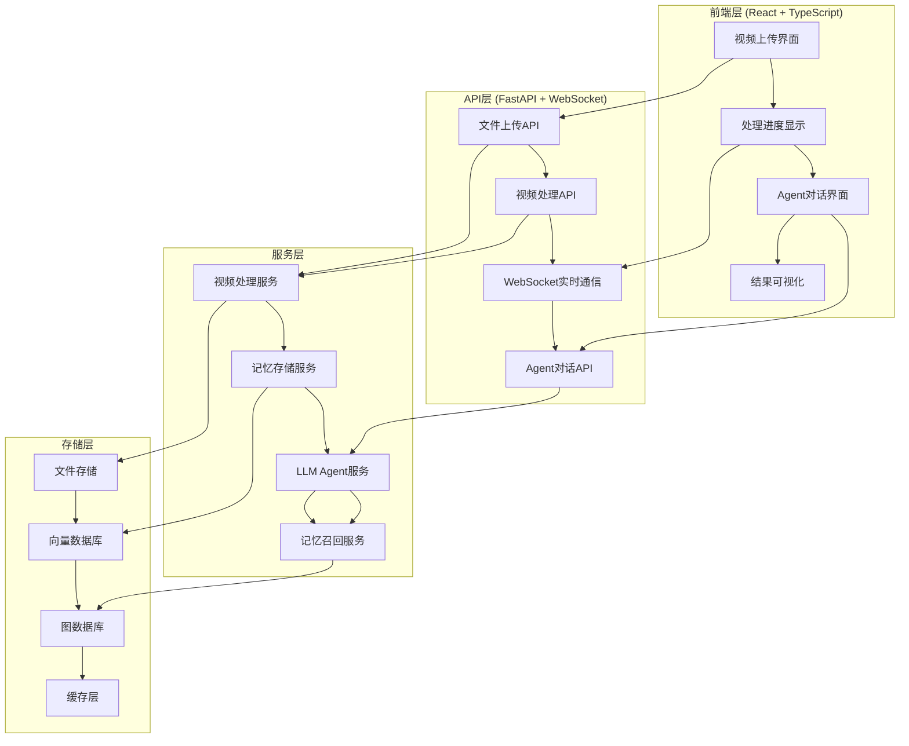
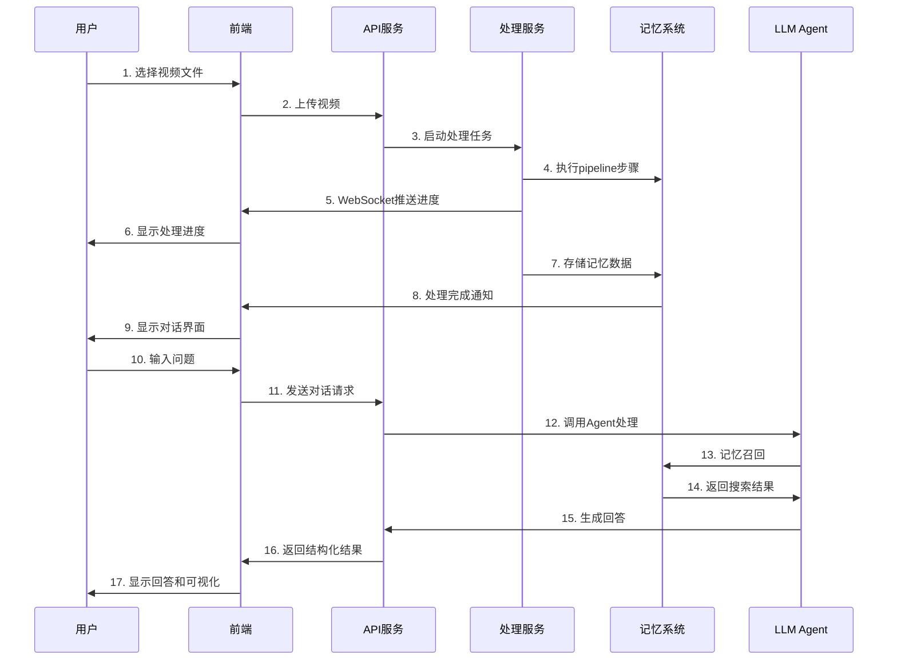

# MOYAN记忆测试体验系统设计方案

## 📋 项目概述

基于现有的React Memory Agent和视频处理pipeline，设计一个完整的记忆测试体验系统，让用户能够：

1. **🎥 上传视频** - 支持多种视频格式
2. **⚡ 实时处理** - 显示视频处理进度和状态
3. **🤖 智能对话** - 与LLM驱动的记忆Agent进行交互
4. **📊 可视化展示** - 直观展示记忆召回和处理过程

## 🏗️ 系统架构设计

### 整体架构图


## 🎨 前端设计方案

### 技术栈选择
- **框架**: React 18 + TypeScript
- **UI组件库**: Ant Design 5.x
- **状态管理**: Zustand
- **HTTP客户端**: Axios
- **WebSocket**: Socket.io-client
- **视频处理**: FFmpeg.wasm (前端预览)
- **构建工具**: Vite

### 界面布局设计
```
┌─────────────────────────────────────────────────────────────┐
│  🎯 MOYAN记忆测试体验系统                                    │
├─────────────────────────────────────────────────────────────┤
│  [📁选择视频文件] [🎥上传] [⚙️处理设置] [🤖开始对话]        │
├─────────────────────────────────────────────────────────────┤
│  📊 处理进度区域                                            │
│  ████████████████████░░░░ 75%                              │
│  步骤: 视频解析 → 场景分割 → 特征提取 → 记忆存储              │
├─────────────────────────────────────────────────────────────┤
│  💬 Agent对话区域                                           │
│  ┌─────────────────────────────────────────────────────────┐ │
│  │ 用户: 拍摄者去了几次厨房？                              │ │
│  │ 🤖 Agent: 正在分析...                                 │ │
│  │    🔍 搜索: 拍摄者 厨房                               │ │
│  │    📊 充足度: 45%                                     │ │
│  │    🔄 继续搜索中...                                   │ │
│  └─────────────────────────────────────────────────────────┘ │
│  [输入框...] [🚀发送] [🧠显示思考过程]                      │
├─────────────────────────────────────────────────────────────┤
│  📈 结果可视化区域                                          │
│  [📊记忆图谱] [📋搜索历史] [🧠决策过程] [⏱️性能分析]         │
└─────────────────────────────────────────────────────────────┘
```

### 核心组件设计

#### 1. 视频上传组件 (VideoUpload)
```typescript
interface VideoUploadProps {
  onVideoSelect: (file: File) => void;
  onUploadStart: () => void;
  onUploadProgress: (progress: number) => void;
  onUploadComplete: (videoId: string) => void;
}

const VideoUpload: React.FC<VideoUploadProps> = ({
  onVideoSelect,
  onUploadStart,
  onUploadProgress,
  onUploadComplete
}) => {
  // 支持拖拽上传
  // 视频格式验证
  // 文件大小限制
  // 上传进度显示
};
```

#### 2. 处理进度组件 (ProcessingProgress)
```typescript
interface ProcessingStep {
  id: string;
  name: string;
  status: 'pending' | 'running' | 'completed' | 'error';
  progress: number;
  message?: string;
  duration?: number;
}

const ProcessingProgress: React.FC = () => {
  const [steps, setSteps] = useState<ProcessingStep[]>([
    { id: '1', name: '视频解析', status: 'pending', progress: 0 },
    { id: '2', name: '场景分割', status: 'pending', progress: 0 },
    { id: '3', name: '特征提取', status: 'pending', progress: 0 },
    { id: '4', name: '记忆存储', status: 'pending', progress: 0 },
    { id: '5', name: '索引构建', status: 'pending', progress: 0 }
  ]);

  // WebSocket实时更新进度
};
```

#### 3. Agent对话组件 (AgentChat)
```typescript
interface Message {
  id: string;
  type: 'user' | 'agent' | 'system';
  content: string;
  timestamp: Date;
  metadata?: {
    searchQuery?: string;
    sufficiencyScore?: number;
    llmThinking?: string;
    apiResponse?: any;
  };
}

const AgentChat: React.FC = () => {
  const [messages, setMessages] = useState<Message[]>([]);
  const [input, setInput] = useState('');
  const [isProcessing, setIsProcessing] = useState(false);

  // 实时显示Agent思考过程
  // 支持流式响应
  // 显示搜索历史和决策过程
};
```

#### 4. 结果可视化组件 (ResultVisualization)
```typescript
const ResultVisualization: React.FC = () => {
  return (
    <Tabs defaultActiveKey="memory-graph">
      <TabPane tab="📊 记忆图谱" key="memory-graph">
        <MemoryGraphVisualization />
      </TabPane>
      <TabPane tab="📋 搜索历史" key="search-history">
        <SearchHistory />
      </TabPane>
      <TabPane tab="🧠 决策过程" key="decision-process">
        <DecisionProcessVisualization />
      </TabPane>
      <TabPane tab="⏱️ 性能分析" key="performance">
        <PerformanceAnalysis />
      </TabPane>
    </Tabs>
  );
};
```

## 🔧 后端API设计

### 核心API端点

#### 1. 文件上传API
```python
@app.post("/api/v1/video/upload")
async def upload_video(
    file: UploadFile = File(...),
    config: Optional[VideoProcessingConfig] = None
):
    """上传视频文件并开始处理"""
    # 验证文件格式和大小
    # 生成唯一视频ID
    # 异步启动处理任务
    # 返回处理任务ID
    pass

@app.get("/api/v1/video/{video_id}/progress")
async def get_processing_progress(video_id: str):
    """获取视频处理进度"""
    # 从Redis或数据库获取处理状态
    # 返回详细进度信息
    pass
```

#### 2. 视频处理API
```python
@app.post("/api/v1/video/{video_id}/process")
async def process_video(video_id: str, config: VideoProcessingConfig):
    """启动视频处理任务"""
    # 调用现有的pipeline_steps
    # 实时更新处理进度
    # 处理完成后存储到记忆系统
    pass

async def process_video_pipeline(video_id: str, config: VideoProcessingConfig):
    """视频处理流水线"""
    steps = [
        ("视频解析", memo_steps.step_probe),
        ("场景分割", memo_steps.step_scene_segmentation),
        ("特征提取", memo_steps.step_feature_extraction),
        ("记忆存储", memo_steps.step_memory_storage),
        ("索引构建", memo_steps.step_index_building)
    ]

    for step_name, step_func in steps:
        # 执行步骤并通过WebSocket推送进度
        await execute_step_with_progress(video_id, step_name, step_func)
```

#### 3. Agent对话API
```python
@app.post("/api/v1/agent/chat")
async def chat_with_agent(request: ChatRequest):
    """与Agent对话"""
    # 使用现有的OpenEndedAgent
    # 支持流式响应
    # 返回结构化的记忆召回结果
    pass

@app.websocket("/ws/agent/{session_id}")
async def agent_chat_websocket(websocket: WebSocket, session_id: str):
    """WebSocket实时对话"""
    # 实时推送Agent思考过程
    # 流式返回搜索结果
    # 支持中断和重新开始
    pass
```

### WebSocket事件设计
```typescript
// WebSocket消息类型
interface WebSocketMessage {
  type: 'progress' | 'thinking' | 'search_result' | 'final_answer' | 'error';
  data: any;
}

// 进度更新
{
  type: 'progress',
  data: {
    step: '场景分割',
    progress: 0.75,
    message: '正在分析场景边界...',
    estimated_time_remaining: 30
  }
}

// Agent思考过程
{
  type: 'thinking',
  data: {
    stage: 'search_planning',
    content: '正在规划搜索策略...',
    metadata: {
      search_query: '拍摄者 厨房',
      sufficiency_score: 45
    }
  }
}
```

## 🗄️ 数据库设计

### 处理任务表
```sql
CREATE TABLE processing_tasks (
    id UUID PRIMARY KEY,
    video_id VARCHAR(255) NOT NULL,
    status ENUM('pending', 'processing', 'completed', 'failed') DEFAULT 'pending',
    current_step VARCHAR(100),
    progress DECIMAL(5,2) DEFAULT 0.0,
    config JSON,
    created_at TIMESTAMP DEFAULT CURRENT_TIMESTAMP,
    started_at TIMESTAMP NULL,
    completed_at TIMESTAMP NULL,
    error_message TEXT NULL
);
```

### 处理步骤记录表
```sql
CREATE TABLE processing_steps (
    id UUID PRIMARY KEY,
    task_id UUID REFERENCES processing_tasks(id),
    step_name VARCHAR(100) NOT NULL,
    status ENUM('pending', 'running', 'completed', 'failed') DEFAULT 'pending',
    progress DECIMAL(5,2) DEFAULT 0.0,
    start_time TIMESTAMP NULL,
    end_time TIMESTAMP NULL,
    metadata JSON,
    created_at TIMESTAMP DEFAULT CURRENT_TIMESTAMP
);
```

## 🚀 部署方案

### 开发环境部署
```yaml
# docker-compose.dev.yml
version: '3.8'
services:
  frontend:
    build: ./frontend
    ports:
      - "3000:3000"
    volumes:
      - ./frontend:/app
    environment:
      - REACT_APP_API_URL=http://localhost:8000

  backend:
    build: ./backend
    ports:
      - "8000:8000"
    volumes:
      - ./backend:/app
      - ./modules:/app/modules
    environment:
      - DATABASE_URL=postgresql://user:pass@db:5432/memory_demo
      - REDIS_URL=redis://redis:6379
    depends_on:
      - db
      - redis

  db:
    image: postgres:15
    environment:
      - POSTGRES_DB=memory_demo
      - POSTGRES_USER=user
      - POSTGRES_PASSWORD=pass
    volumes:
      - postgres_data:/var/lib/postgresql/data

  redis:
    image: redis:7-alpine
    ports:
      - "6379:6379"

volumes:
  postgres_data:
```

### 生产环境部署
```yaml
# docker-compose.prod.yml
version: '3.8'
services:
  nginx:
    image: nginx:alpine
    ports:
      - "80:80"
      - "443:443"
    volumes:
      - ./nginx.conf:/etc/nginx/nginx.conf
      - ./ssl:/etc/nginx/ssl
    depends_on:
      - frontend
      - backend

  frontend:
    build:
      context: ./frontend
      dockerfile: Dockerfile.prod
    environment:
      - REACT_APP_API_URL=https://api.memory-demo.com

  backend:
    build:
      context: ./backend
      dockerfile: Dockerfile.prod
    environment:
      - DATABASE_URL=${DATABASE_URL}
      - REDIS_URL=${REDIS_URL}
      - GLM_API_KEY=${GLM_API_KEY}
    deploy:
      replicas: 3

  db:
    image: postgres:15
    environment:
      - POSTGRES_DB=${DB_NAME}
      - POSTGRES_USER=${DB_USER}
      - POSTGRES_PASSWORD=${DB_PASSWORD}
    volumes:
      - postgres_data:/var/lib/postgresql/data

  redis:
    image: redis:7-alpine
    command: redis-server --appendonly yes
    volumes:
      - redis_data:/data
```

## 📱 用户体验流程

### 完整用户旅程


## 🎯 关键功能特性

### 1. 智能视频处理
- **格式支持**: MP4, AVI, MOV, MKV等主流格式
- **大文件处理**: 支持最大2GB视频文件
- **断点续传**: 支持上传中断后继续
- **处理配置**: 可自定义处理参数和质量

### 2. 实时进度显示
- **步骤级进度**: 显示每个pipeline步骤的详细进度
- **时间估算**: 基于历史数据估算剩余时间
- **错误处理**: 友好的错误提示和重试机制
- **取消功能**: 支持用户中途取消处理

### 3. 智能对话体验
- **流式响应**: 实时显示Agent思考过程
- **上下文记忆**: 保持对话历史和上下文
- **多轮交互**: 支持复杂的多轮对话
- **思考过程可视化**: 显示LLM的决策路径

### 4. 结果可视化
- **记忆图谱**: 交互式的记忆关系图
- **搜索历史**: 时间线形式的搜索记录
- **性能分析**: 处理时间和质量指标
- **导出功能**: 支持结果导出和分享

## 🛠️ 技术实现要点

### 1. 前端状态管理
```typescript
// 使用Zustand进行状态管理
interface AppState {
  // 视频处理状态
  videoProcessing: {
    currentVideo: string | null;
    processingStatus: 'idle' | 'uploading' | 'processing' | 'completed' | 'error';
    progress: ProcessingStep[];
    config: VideoProcessingConfig;
  };

  // Agent对话状态
  agentChat: {
    messages: Message[];
    currentSession: string | null;
    isProcessing: boolean;
    thinkingProcess: ThinkingStep[];
  };

  // 可视化状态
  visualization: {
    activeTab: string;
    memoryGraph: GraphData;
    searchHistory: SearchRecord[];
    performanceMetrics: PerformanceData;
  };
}
```

### 2. WebSocket连接管理
```typescript
class WebSocketManager {
  private socket: Socket | null = null;
  private reconnectAttempts = 0;
  private maxReconnectAttempts = 5;

  connect(sessionId: string) {
    this.socket = io(`${API_URL}/agent/${sessionId}`, {
      transports: ['websocket'],
      upgrade: false
    });

    this.socket.on('connect', () => {
      console.log('WebSocket connected');
      this.reconnectAttempts = 0;
    });

    this.socket.on('disconnect', () => {
      this.handleReconnect();
    });

    this.setupEventHandlers();
  }

  private setupEventHandlers() {
    this.socket?.on('progress', this.handleProgressUpdate);
    this.socket?.on('thinking', this.handleThinkingUpdate);
    this.socket?.on('search_result', this.handleSearchResult);
    this.socket?.on('final_answer', this.handleFinalAnswer);
  }
}
```

### 3. 视频处理优化
```python
async def process_video_with_progress(video_id: str, config: VideoProcessingConfig):
    """带进度反馈的视频处理"""
    progress_callback = WebSocketProgressCallback(video_id)

    try:
        # 使用现有的pipeline_steps
        ctx = build_processing_context(video_id, config)

        # 步骤1: 视频解析
        await progress_callback.start_step("视频解析")
        probe_result = await memo_steps.step_probe(ctx)
        await progress_callback.complete_step("视频解析", probe_result)

        # 步骤2: 场景分割
        await progress_callback.start_step("场景分割")
        scenes = await memo_steps.step_scene_segmentation(ctx)
        await progress_callback.complete_step("场景分割", scenes)

        # 继续其他步骤...

    except Exception as e:
        await progress_callback.error_step(str(e))
        raise
```

## 📊 性能优化策略

### 1. 前端优化
- **代码分割**: 按路由和功能模块分割代码
- **懒加载**: 大型组件和图表库按需加载
- **缓存策略**: 合理使用浏览器缓存
- **虚拟滚动**: 大量数据列表使用虚拟滚动

### 2. 后端优化
- **异步处理**: 所有I/O操作使用异步方式
- **连接池**: 数据库和Redis连接池管理
- **任务队列**: 使用Celery处理长时间任务
- **缓存机制**: 热点数据缓存到Redis

### 3. 视频处理优化
- **并行处理**: 多进程并行处理视频片段
- **内存管理**: 及时释放大内存对象
- **进度估算**: 基于视频特征估算处理时间
- **错误恢复**: 支持从失败步骤恢复处理

## 🔒 安全考虑

### 1. 文件安全
- **文件类型验证**: 严格验证上传文件类型
- **病毒扫描**: 集成病毒扫描引擎
- **大小限制**: 合理设置文件大小上限
- **存储隔离**: 用户文件隔离存储

### 2. API安全
- **身份认证**: JWT token认证机制
- **权限控制**: 基于角色的访问控制
- **限流保护**: API调用频率限制
- **输入验证**: 严格的输入参数验证

### 3. 数据安全
- **数据加密**: 敏感数据加密存储
- **传输安全**: HTTPS/WSS加密传输
- **日志脱敏**: 日志中敏感信息脱敏
- **定期清理**: 过期数据自动清理

---

## 📅 开发计划

### 第一阶段 (2周)
- [ ] 前端基础框架搭建
- [ ] 视频上传功能实现
- [ ] 基础进度显示界面
- [ ] 后端API框架搭建

### 第二阶段 (2周)
- [ ] 视频处理pipeline集成
- [ ] WebSocket实时通信
- [ ] Agent对话界面开发
- [ ] 基础可视化组件

### 第三阶段 (2周)
- [ ] 高级可视化功能
- [ ] 性能优化和测试
- [ ] 部署配置和CI/CD
- [ ] 文档和用户指南

### 第四阶段 (1周)
- [ ] 用户测试和反馈
- [ ] Bug修复和优化
- [ ] 正式发布准备

这个设计方案提供了一个完整的、用户友好的记忆测试体验系统，充分利用了现有的视频处理pipeline和React Memory Agent技术，同时提供了优秀的用户体验和系统性能。