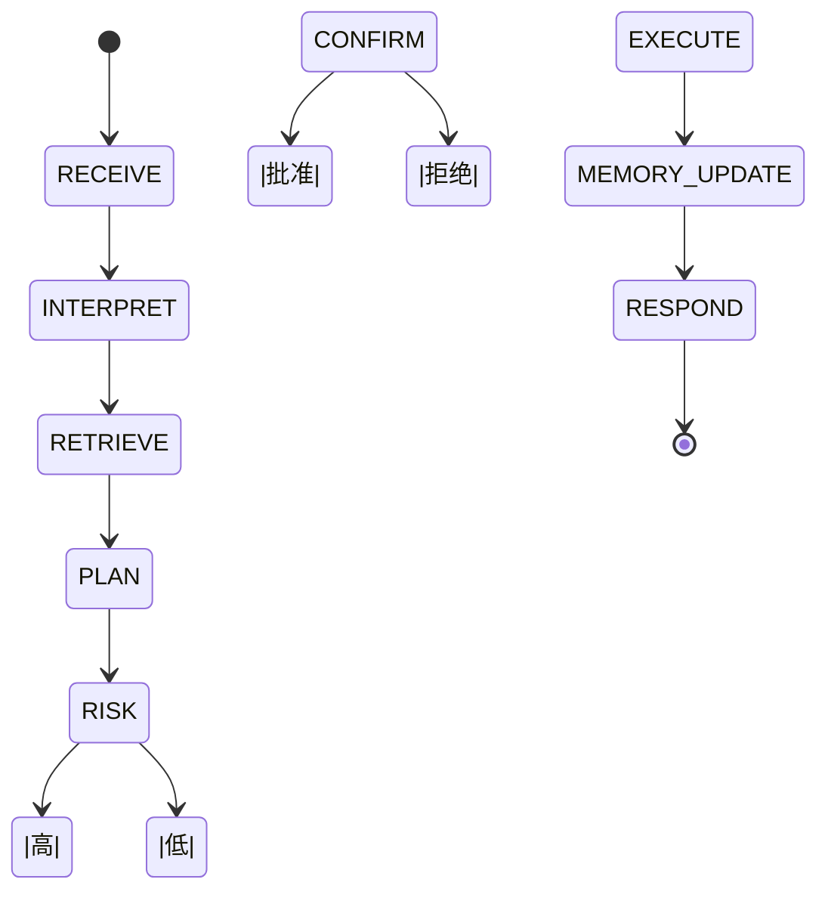

# Control Agent 数据流转模拟

> 目标：细化 Control Agent 从接收事件、检索记忆、规划、执行到反馈的完整流程，明确入参/出参、接口与异常策略，指导核心编排层的实现。

---

## 1. 触发与入站

### 1.1 事件触发类型
| 事件类型 | 来源 | 描述 |
| --- | --- | --- |
| `user_request` | 输入层 | 用户语音/文本请求。 |
| `observer_proposal` | Observer Agent | 主动提案需确认/执行。 |
| `memory_ready` | 记忆层 | 新记忆可用于回答（用于队列唤醒）。 |
| `system_alert` | EventBus | 需向用户反馈的系统异常。 |

### 1.2 控制上下文结构
```json
{
  "trace_id": "trace-user-001",
  "event": { ... Event ... },
  "session": {
    "conversation_id": "conv-abc",
    "user_id": "user1",
    "locale": "zh-CN"
  },
  "device_state": {
    "light.living_room": {"power": "on", "brightness": 80}
  },
  "observer_notes": ["temperature_high"]
}
```
- `session` 可由会话管理器提供，供多轮对话定位。
- `device_state` 通过设备快照或实时查询补全。

---

## 2. 核心流程概览



---

## 3. 步骤详解

### 3.1 解析 (INTERPRET)
- 将 `event.payload.text` 转为结构化意图：
```json
{
  "intent_id": "turn_off_light",
  "entities": {"room": "living_room"},
  "confidence": 0.92,
  "requires_confirmation": false
}
```
- 参考：规则 + LLM 混合，保留原始文本。
- 若置信度低，发布 `system_alert` 请求澄清，并返回暂存状态。

### 3.2 记忆检索 (RETRIEVE)
- 构造查询：`intent + entities + 上下文`。
- 调用 `MemoryPort.recall(query, k, filters)`：
```python
memory_slice = await memory_port.recall(
    query="客厅 灯 关闭",
    k=10,
    filters={"entities": ["device.light.living_room"]}
)
```
- 结果包含 `MemoryEntry` 列表 + 元数据（得分、版本）。
- 附加短期会话记忆（在 session manager 中）。

### 3.3 规划 (PLAN)
- 输入：意图、记忆片段、设备状态。
- 输出：步骤化 `Plan`。
```json
{
  "plan_id": "plan-20250212-001",
  "steps": [
    {"id": 1, "action": "turn_off", "target": "light.living_room", "args": {"power": "off"}},
    {"id": 2, "action": "compose_response", "args": {"template": "已为您关闭{room}灯。"}}
  ],
  "assumptions": ["用户在家", "无安全限制"],
  "confidence": 0.85
}
```
- 可调用 LLM 模型（R1/Qwen）或规则模板。
- 若无法生成计划 → 请求更多信息或返回失败响应。

### 3.4 风险评估 (RISK)
- 参照规则库 (`config/safety_rules.yaml`) + 动态策略。
- 输出 `RiskAssessment(level, requires_confirmation, note)`。
```json
{"level": "low", "requires_confirmation": false, "note": "常规操作"}
```
- 高风险示例：开门、禁区设备；需用户确认。

### 3.5 确认流程 (CONFIRM)
- 若 `requires_confirmation=true`：
  1. 生成确认卡片或语音询问。
  2. 等待用户响应（TTS + 输入层回传 `user_confirmation`）。
  3. 超时/拒绝 → `ControlResult.cancelled(reason)`。

### 3.6 执行 (EXECUTE)
- 对每个设备动作调用 `DevicePort.execute(action)`。
- 支持串行或并行（考虑依赖关系）。
- 聚合结果：成功/失败/超时。
- 失败时可重试或回滚（如再打开灯）。

### 3.7 记忆更新 (MEMORY_UPDATE)
- 将执行结果写入记忆：
```json
MemoryDraft {
  "source": "control_agent",
  "kind": "episodic",
  "content": {
    "plan_id": "plan-20250212-001",
    "actions": [ ... DeviceResult ... ],
    "response": "已为您关闭客厅主灯。"
  },
  "entities": ["user.owner", "device.light.living_room"],
  "timestamp": now
}
```
- 写入逻辑复用记忆层文本管线。

### 3.8 响应生成 (RESPOND)
- 合成多模态回应：文本/TTS/UI。
- 发布 `control.feedback` 事件供输出层处理。

---

## 4. 入参/出参摘要

| 步骤 | 入参 | 出参 | 接口 |
| --- | --- | --- | --- |
| INTERPRET | `Event`, `session` | `intent` | `IntentParser.parse()` |
| RETRIEVE | `intent`, `context` | `MemorySlice` | `MemoryPort.recall()` |
| PLAN | `intent`, `MemorySlice`, `device_state` | `Plan` | `PlanningService.propose()` |
| RISK | `Plan`, `session` | `RiskAssessment` | `RiskAssessor.evaluate()` |
| CONFIRM | `Plan`, `RiskAssessment` | `ConfirmationResult` | `ConfirmationService.request()` |
| EXECUTE | `Plan.steps` | `List[DeviceResult]` | `DevicePort.execute()` |
| MEMORY_UPDATE | `Plan`, `DeviceResult`, `intent` | `MemoryDraft` | `MemoryDraftBuilder.build()` |
| RESPOND | 所有上一步结果 | `ControlResult` + 反馈事件 | `ResponseComposer.compose()` |

---

## 5. 错误与恢复策略

| 场景 | 处理 |
| --- | --- |
| 意图解析失败 | 发送澄清提示，保持状态为 `awaiting_clarification`。 |
| 记忆检索超时 | 使用默认提示模板，记录告警。 |
| 规划失败 | 返回 "当前无法执行"，并在下一次输入时提示人工介入。 |
| 执行部分失败 | 回滚已执行步骤或输出部分成功信息。 |
| 记忆写入失败 | 重试并写入 `system_alert`。 |

---

## 6. 与其他层的交互

- **事件总线**：消费 `control.requests`, `observer.proposals`, `memory_ready`；发布 `control.feedback`, `system.alerts`, `memory_drafts`。
- **记忆层**：`MemoryPort.recall` 与 `MemoryDraft` 写入；订阅记忆更新事件。
- **设备层**：通过 `DevicePort` 发送动作；接收执行回执。
- **输出层**：根据 `ControlResult` 生成多模态反馈。

---

## 7. 监控指标
- `control_requests_total{intent}`
- `control_plan_latency_ms`
- `control_execution_success_ratio`
- `control_confirmation_rate`
- `control_memory_write_failures`

---

## 8. 一致性检查
- 与主架构图的 Control Agent Flow 一致：检索→规划→风险→确认→执行→记忆→反馈。
- 视频记忆入口通过 `memory_ready` 事件使 Control Agent 获得最新上下文，无需额外改动图表。

---

该模拟可直接指导 Control Agent 编排层的代码骨架，实现稳定的意图处理与执行闭环。
