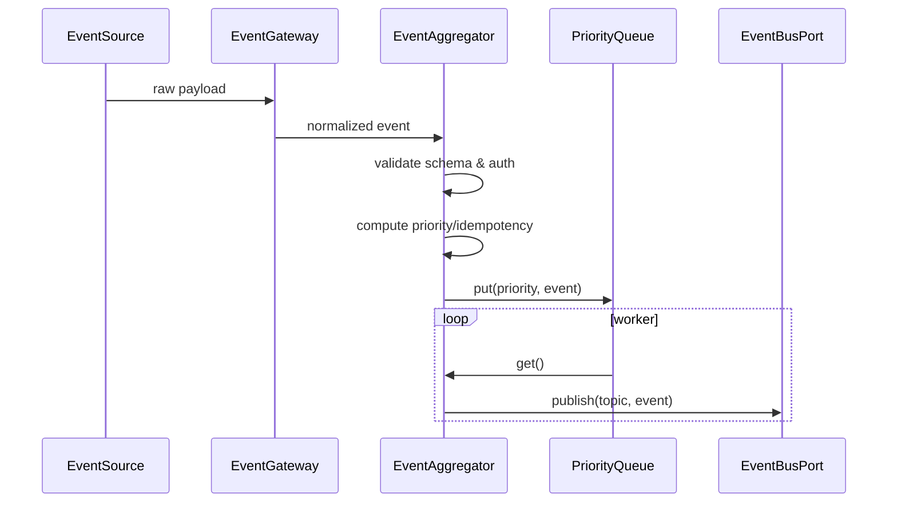

# 事件总线层数据流转模拟

> 目标：细化统一事件总线（Event Aggregator + EventBusPort 实现）的端到端数据流，验证多源事件如何进入队列、路由、背压与监控，并保证与主架构设计保持一致。

---

## 1. 事件来源与入口

| 来源 | 入站接口 | 描述 |
| --- | --- | --- |
| 输入层 (`InputNormalizer`) | `EventAggregator.ingest()` | 语音/文本/传感器/视频任务标准事件。 |
| 内部服务 (Control/Observer/Memory) | `EventBusPort.publish()` | 业务服务直接发布（如 `memory_ready`、`system_alert`）。 |
| 外部系统 (Home Assistant Webhook 等) | `EventGateway` → `EventAggregator` | 通过 REST/MQTT 适配器接入。 |

所有原始数据均需转换为统一 `Event` 契约（参见 Input 文档），否则被标记为 `ingestion_error`。

---

## 2. 摄取与验证流程



### 2.1 `EventAggregator.ingest(raw_event, source)`
- Schema 校验：对照 `shared/types/events.py`（版本号、必填字段）。
- 鉴权：检查 `meta.auth`、来源白名单、签名。
- idempotency：若队列中/最近窗口已有同 key，记录统计并丢弃或合并。
- 计算优先级：参考 Input 文档（1,3,5,7,9），支持自定义策略（如安全事件提权）。
- 将 `(priority, event)` 放入 `asyncio.PriorityQueue`，附带入队时间戳。

### 2.2 队列 worker
- 多协程/线程从队列取事件，调用 `dispatch(event)`：
  - `route = event_router.resolve(event)` → 返回主题列表（如 `control.events`, `memorization.jobs`）。
  - 对每个主题执行 `EventBusPort.publish(topic, event)`。
- 记录处理时延（`now - event.ingest_ts`）。
- 出现异常：重试 N 次后写入 `ingestion_error`，并将事件持久化到死信队列（DLQ）。

---

## 3. 路由策略

### 3.1 主题命名规范
| 主题 | 描述 |
| --- | --- |
| `control.requests` | 交互类用户请求。 |
| `observer.events` | 传感器/摄像头实时事件。 |
| `memorization.jobs` | `video_ingest` 等长任务投递。 |
| `memorization.updates` | `memory_ready` 通知。 |
| `system.alerts` | 低优先级提醒/降级信息。 |
| `audit.logs` | 记录重要操作（可选）。 |

### 3.2 路由决策函数
示例伪代码：
```python
def resolve(event: Event) -> list[str]:
    routes = []
    if event.type in {"user_request", "system_alert"}:
        routes.append("control.requests")
    if event.type in {"sensor_data", "camera_event"}:
        routes.append("observer.events")
    if event.type == "video_ingest":
        routes.append("memorization.jobs")
    if event.type == "memory_ready":
        routes.extend(["control.requests", "observer.events", "memorization.updates"])
    # ... 其他规则
    return routes
```

可根据 `event.meta.tags`（如 `safety_high`, `suppressed`）增加额外目标，例如发送到 `system.alerts`。

---

## 4. 背压与弹性控制

### 4.1 队列水位
- 低于 `low_watermark`：正常。
- 介于 `low` 与 `high`：触发监控告警。
- 超过 `high_watermark`：
  - 队列停止接受低优先级事件（priority >=7）。
  - 向源发送 `backpressure` 信号（HTTP 429 / MQTT NACK）。
  - 触发扩容逻辑（增加 worker）。

### 4.2 实例扩展
- 事件处理能力不足时，增开更多 aggregator worker 或水平扩展（使用共享消息队列如 NATS/Kafka）。
- `EventBusPort` 可基于 NATS/Redis Streams 等实现，支持持久化与回放。

---

## 5. 状态与持久化

| 状态 | 存储 | 生命周期 | 备注 |
| --- | --- | --- | --- |
| 优先级队列 | 内存 + 监控指标 | 入队→出队 | 可配置持久化备份（如 Redis）。 |
| DLQ | Redis/Kafka topic | 定期清理 | 存放失败事件、供人工排查。 |
| 路由配置 | YAML/DB | 随部署发布 | 支持热更新。 |
| 统计指标 | Prometheus | 长期 | QPS、延迟、丢弃率等。 |

---

## 6. 监控指标 & 日志

- `event_ingest_total{source,type}`
- `event_queue_depth{priority}`
- `event_dispatch_latency_ms{priority}`（P50/P95/P99）
- `event_backpressure_total{source}`
- `event_dlq_total{type}`
- 日志字段：`trace_id`, `event.id`, `priority`, `routes`, `attempt`, `latency`

---

## 7. 失败与重试策略

1. **发布失败**：`EventBusPort.publish` 抛异常 → 重试（指数退避），超过阈值写入 DLQ 并发 `system.alert`。
2. **路由为空**：记录警告并路由至 `audit.logs`。
3. **重复事件**：基于 `idempotency_key` 和时间窗过滤；可将事件合并统计。
4. **DLQ 处理**：提供手动/自动回放工具，需在恢复后重新入队。

---

## 8. 与其他层的交互

- 输入层：提供标准 `Event`；发生 backpressure 时收到反馈并节流。
- 控制层：订阅 `control.requests`、`memory_ready`，可发布 `system_alert`。
- 观察层：订阅 `observer.events`、`memory_ready`，可发布 `video_ingest`。
- 记忆层：消费 `memorization.jobs`，发布 `memorization.updates`。
- 执行层：可将设备状态变更发布为 `device_state` 事件。

---

## 9. 与总设计一致性检查

- Mermaid 图中的 “事件总线 Event Bus” 节点即该 aggregator + bus；视频记忆入口依赖 `memorization.jobs` 路由。
- 若后续扩展新通道（如 mobile push），在路由配置中新增主题即可，无需更改主架构。

---

## 10. 待验证点

- 在混合本地/云场景下，事件发布的幂等与顺序保障策略是否需要引入分布式 ID（如 Snowflake）。
- 对于批量事件（如批量传感器数据），是否需要拆分或使用批处理主题。
- NATS/Kafka 等实现的选择需根据吞吐与持久化要求评估。

---

该模拟为事件总线层的规范化实现提供了落地参考，可直接指导 `EventAggregator`/`EventBusPort` 的骨架编码与测试用例编写。
