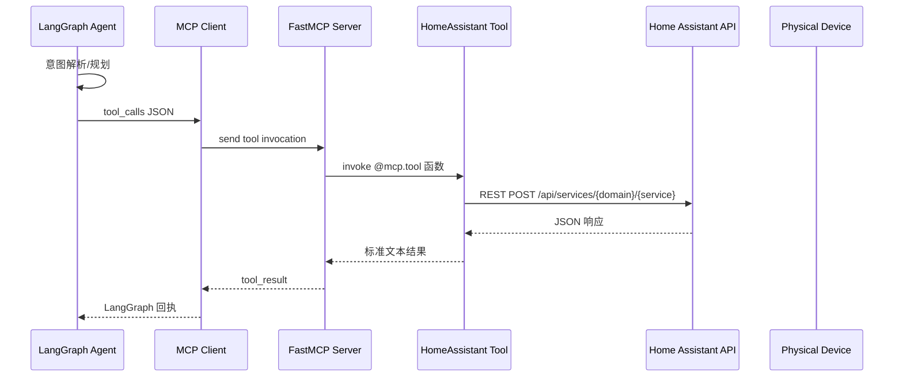

# 执行层（MCP + Home Assistant）数据流转模拟

> 目标：基于现有实现，梳理从 Agent 触发 LangGraph 工具调用到经 MCP Gateway 控制 Home Assistant 设备的完整链路，明确输入输出与异常处理策略。

---

## 1. 参与组件一览

| 组件 | 代码位置 | 职责 |
| --- | --- | --- |
| LangGraph Agent (`Exp_chat_agent`) | `Auto_genstudio/Agent_example.py` | 在对话流程中生成工具调用指令。 |
| MCPClient | `Auto_genstudio/exp_agent_structure/langgraph_custom.py` | 与本地 FastMCP Server 建立 stdio 连接，转发工具调用。 |
| FastMCP Server | `MCP_server.py` | 暴露硬件控制工具（基于 `mcp.server.fastmcp`）。 |
| HomeAssistantLight | `Hardware/device_list/ha_light_api.py` | 封装 HA REST API，执行具体设备控制。 |
| Home Assistant 实例 | 外部服务 | 接收 REST 调用完成真实设备动作。 |

---

## 2. 端到端流程概览



---

## 3. 上游：LangGraph 工具调用

### 3.1 LangGraph 输出格式
当 Control Agent 决定执行动作时，会返回一个 `AIMessage`，其中包含 tool call：
```json
{
  "tool_calls": [
    {
      "id": "toolcall-001",
      "name": "turn_on_lamp1",
      "args": {"brightness": 180}
    }
  ]
}
```
- `turn_on_lamp1` 是 MCP Server 注册的工具名称。
- LangGraph 通过 `agent.stream_graph_updates()` 将该工具调用流式输出。

### 3.2 MCPClient 处理流程
关键逻辑位于 `langgraph_custom.py`：
1. `MCPClient.connect()`：启动 FastMCP Server 进程（`python MCP_server.py`），建立 stdio 通道。
2. `get_tools()`：从服务器拉取工具 schema，并绑定到 LLM。
3. 当 LLM 返回 `tool_calls` 时，`MCPClient.get_context()` 逐个调用 `session.call_tool(name, args)`。

---

## 4. MCP Server 与工具实现

### 4.1 FastMCP Server 初始化
```python
mcp = FastMCP("Hardware Mcp Server", filesystem_roots=["./Model_bank"])
```
- Server 运行在同一进程，向 MCPClient 暴露工具集合。

### 4.2 Home Assistant 工具示例
虽然仓库中相关代码被注释，现有实践如下：
```python
from Hardware.device_list.ha_light_api import HomeAssistantLight

HA_URL = "http://<ha-host>:8123"
HA_TOKEN = "<long-lived-access-token>"
LIGHT_ENTITY_ID = "light.living_room"
light = HomeAssistantLight(HA_URL, HA_TOKEN, LIGHT_ENTITY_ID)

@mcp.tool()
def turn_on_lamp1(brightness: int = None):
    success = light.turn_on(brightness=brightness)
    return "灯光已打开" if success else "打开灯光失败"

@mcp.tool()
def turn_off_lamp1():
    success = light.turn_off()
    return "灯光已关闭" if success else "关闭灯光失败"
```
- `@mcp.tool()` 装饰器将函数注册为 MCP 工具，名称取函数名。
- 可根据需要新增参数或返回 JSON 结果。

### 4.3 HomeAssistantLight 详解
`Hardware/device_list/ha_light_api.py`：
- `turn_on(brightness=None)` → `POST {HA_URL}/api/services/light/turn_on`，携带 token。
- `turn_off()` → 同理调用 `light/turn_off`。
- 返回布尔值表示成功与否。

HTTP 请求示例：
```http
POST /api/services/light/turn_on HTTP/1.1
Host: 192.168.31.92:8123
Authorization: Bearer <TOKEN>
Content-Type: application/json

{"entity_id": "light.living_room", "brightness": 180}
```

---

## 5. 返回值与 Agent 反馈

1. MCP 工具返回字符串或结构化文本。
2. FastMCP 将结果包裹成 `ToolResult` 回传给 MCPClient。
3. MCPClient 将 tool result 注入 LangGraph 消息流，触发后续对话或响应生成。
4. Control Agent 根据工具结果更新对话、写记忆或提示用户。

示例返回：
```json
{
  "tool_call_id": "toolcall-001",
  "role": "tool",
  "content": "灯光已打开"
}
```

---

## 6. 异常与重试

| 环节 | 异常 | 处理策略 |
| --- | --- | --- |
| MCPClient 连接失败 | FastMCP 启动失败 | 记录错误并重试连接；连续失败提示用户。 |
| 工具执行异常 | HA 请求报错/超时 | 工具捕获异常，返回失败消息；Control Agent 据此反馈或改走其他策略。 |
| 凭证失效 | 401/403 | 工具返回“认证失败”，触发 `system_alert`。 |
| 网络超时 | Requests 超时 | 可重试 N 次，最终失败再反馈。 |

---

## 7. 监控与日志
- MCPClient 输出连接/工具调用日志（可扩展为结构化日志）。
- MCP Server 可在工具内部记录调用参数与响应。
- 建议暴露指标：
  - `mcp_tool_calls_total{name,status}`
  - `mcp_tool_latency_ms{name}`
  - `ha_api_failures_total`

---

## 8. 与主架构的对应关系
- 主架构图中的 “CAL Gateway - MCP Server” 节点即本流程。
- 记忆层、事件总线建模中提到的设备执行结果应从 MCP 工具返回的文本中解析或标准化。
- 若未来扩展 Matter/其他协议，可在 MCP Server 中注册新的工具，或在工具内部路由到其他适配器。

---

这套流程保持了 Agent → MCP → Home Assistant 的简洁调用路径，便于后续在工具层做扩展或接入更多协议。
