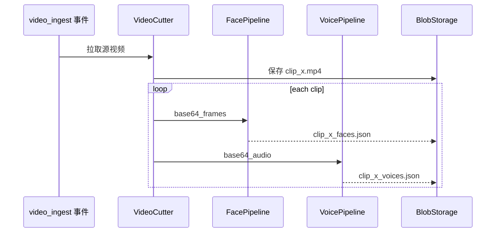
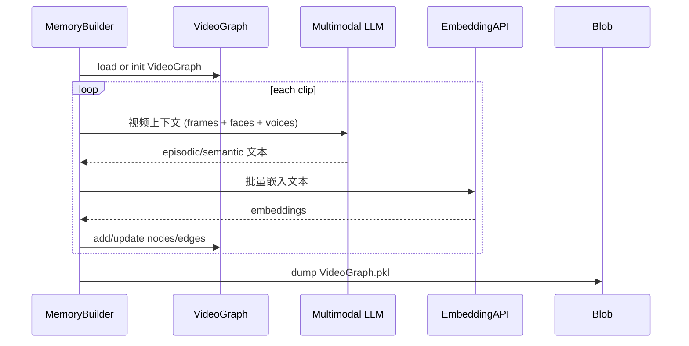

# 记忆层数据流转模拟（视频/多模态管线）

> 目标：模拟 “事件触发 → 媒体处理 → 记忆写入 → 记忆发布” 的全链路，验证 MemoryPort、Graph 结构及事件交互是否完善。

---

## 1. 场景概述

### 1.1 触发来源
- `video_ingest`：视频任务事件（由输入层或定时任务发布）。
- `sensor_data` + `camera_event`：Observer Agent 检测到异常后请求补充记忆。
- 用户手动上传视频回放。

### 1.2 核心服务
| 服务 | 责任 |
| --- | --- |
| MediaIngestionWorker | 切片、特征抽取（faces/voices）、调用记忆生成模型。 |
| MemoryBuilder | 将 episodic/semantic 记忆映射为 `MemoryEntry`。 |
| MemoryPort 实现 | 写入结构化数据库、向量库、Blob 存储。 |
| MemoryNotifier | 将 `memory_ready` 事件推送给控制/观察 agent。 |

---

## 2. 输入契约

### 2.1 触发事件：`video_ingest`
```json
{
  "version": "v1",
  "id": "evt-video-20250212-001",
  "type": "video_ingest",
  "source": "interfaces.camera_gateway",
  "priority": 6,
  "trace_id": "trace-vid-001",
  "source_ts": "2025-02-12T11:12:00Z",
  "ingest_ts": "2025-02-12T11:12:05Z",
  "idempotency_key": "hash(video_source + clip_plan + day_bucket)",
  "payload": {
    "video_source": "s3://house/cam1/2025-02-12.mp4",
    "clip_plan": {
      "interval_seconds": 30,
      "fps": 5
    },
    "output": {
      "clip_path": "blob://mem/cache/cam1/20250212",
      "intermediate_path": "blob://mem/intermediate/cam1/20250212",
      "mem_graph_path": "blob://mem/graph/cam1/20250212.pkl"
    }
  },
  "meta": {
    "auth": {"role": "system"},
    "requester": "ObserverAgent",
    "comment": "夜间巡检回放"
  }
}
```

### 2.2 中间特征引用
- 切片视频：`output.clip_path/*.mp4`
- 人脸 JSON：`output.intermediate_path/clip_{id}_faces.json`
- 语音 JSON：`output.intermediate_path/clip_{id}_voices.json`

---

## 3. 数据流详解

### 3.1 切片与特征抽取


- `VideoCutter`：根据 `clip_plan` 切片，并生成 base64 帧/音频。
- `FacePipeline`：InsightFace + 聚类，输出人脸 embeddings。
- `VoicePipeline`：Gemini ASR + ERes2Net 嵌入，输出语音段与声纹。
- 中间产物写入 Blob，路径在事件 payload 中指定。

### 3.2 记忆生成


- 视频上下文格式参考 `m3_memory_agent_input.md`。
- LLM 输出需经 `validate_and_fix_json` 清洗。
- Text 节点更新策略：episodic 直接追加，semantic 按相似度聚合。

### 3.3 MemoryEntry 构建

`VideoGraph` 转换为我们记忆系统的标准条目：

```json
{
  "entry_id": "mem-epi-20250212-001",
  "kind": "episodic",
  "modality": "structured",
  "content": {
    "clip_id": 3,
    "description": "<face_5> 执行了夜间巡检",
    "entities": ["face_5", "voice_2"],
    "media_refs": {
      "video": "blob://mem/cache/cam1/20250212/3.mp4",
      "faces": "blob://mem/intermediate/cam1/20250212/clip_3_faces.json"
    }
  },
  "embedding": [0.123, ...],
  "timestamp": "2025-02-12T11:12:30Z",
  "meta": {
    "source": "video_ingest",
    "confidence": 0.78,
    "trace_id": "trace-vid-001"
  }
}
```

- 时间戳默认 `clip_start + delta`，需结合切片信息。
- Semantic 记忆 `kind` 设置为 `semantic`，`modality` 可为 `text`。

### 3.4 MemoryPort 写入
1. `MemoryPort.write(entries, upsert=True)` → 返回版本号（UUID/递增）。
2. 结构化存储：SQLite/PG 存 `MemoryEntry` 元数据。
3. 向量库：写入 `embedding` 与 `entry_id`（用于召回）。
4. Blob：若 `content.media_refs` 指向本地临时路径，需复制到长期存储。

错误策略：
- 写入失败 → 回滚向量/Blob，并记录 `ingestion_error(type="memory_store")`。
- 重复写入（相同 `entry_id`）→ 需保证幂等。

---

## 4. 输出与通知

### 4.1 `memory_ready` 事件
```json
{
  "version": "v1",
  "id": "evt-mem-20250212-010",
  "type": "memory_ready",
  "source": "memory_ingestion",
  "priority": 4,
  "trace_id": "trace-vid-001",
  "payload": {
    "memory_version": "ver-20250212-001",
    "entries": [
      {"entry_id": "mem-epi-20250212-001", "kind": "episodic", "clip_id": 3},
      {"entry_id": "mem-sem-20250212-002", "kind": "semantic"}
    ],
    "related_trace": "trace-vid-001"
  },
  "meta": {
    "activated": true,
    "ttl_ms": 60000
  }
}
```

订阅者：
- Control Agent：可引用最新 episodic 记忆回应用户查询。
- Observer Agent：对高风险事件生成自动化提案。
- UI/日志系统：展示新记忆。

### 4.2 `memory_failed`（可选）
- 当 MediaIngestionWorker 或 MemoryBuilder 异常时发布。
- `payload` 包含错误类型、重试建议。

---

## 5. 状态管理

| 阶段 | 状态 | 存储 | 生命周期 | 备注 |
| --- | --- | --- | --- | --- |
| 切片任务 | 任务元数据 | Redis/DB | 处理完成即删除 | 支持重试 |
| 中间特征 | JSON/音视频 | Blob | 根据策略清理 | 可缓存加速 |
| VideoGraph | pickle | Blob | 长期保存 | 支持可视化 |
| MemoryEntry | 结构化记录 | SQLite/PG | 长期 | 标准化字段 |
| Embeddings | 向量库 | Qdrant/Faiss | 长期 | 与 entry_id 同步 |

---

## 6. 关键策略

1. **幂等**：
   - `video_ingest` idempotency_key 防止重复排队。
   - MemoryPort 写入需检查 `entry_id`，避免重复插入。

2. **重试/补偿**：
   - 切片失败 → 重试 N 次后发布 `memory_failed`。
   - LLM 调用失败 → 本地降级模型或跳过 semantic 记忆。

3. **安全**：
   - `video_source` 必须通过签名/权限验证。
   - 中间输出存储路径需要访问控制。

4. **可观测性**：
   - 指标：`media_ingest_duration`, `memory_write_duration`, `memory_ready_total`。
   - 日志：`trace_id`, `clip_id`, `memory_version`, `retry_count`。

---

## 7. 待验证点
- 切片服务是否支持多分辨率、多格式。
- LLM/Embedding 服务配额是否足够应对高频触发。
- MemoryPort 写入是否需要事务（结构化存储 + 向量库同步）。
- 记忆版本回滚策略（写入失败时如何恢复旧版本）。

---

此文档完成了记忆层从事件触发到记忆发布的模拟，确认我们可在现有架构下接入 M3-Agent 的视频记忆流程，并通过统一事件 (`video_ingest`/`memory_ready`) 与 MemoryPort 接口实现闭环。
