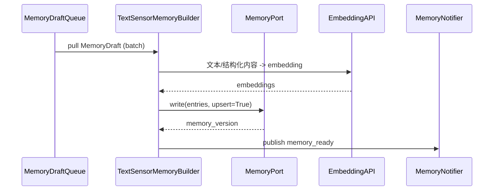

# 记忆层数据流转模拟（文本 / 传感器事件）

> 目标：模拟在无视频参与的场景下，如何将用户对话与传感器事件转化为情节/语义记忆，并与 MemoryPort 协同，确保与 Control/Observer Agent 的闭环。

---

## 1. 场景触发

### 1.1 文本来源
- `user_request`：Control Agent 在响应用户问题/指令时，提取重要上下文写入记忆。
- `system_alert`：Observer Agent 主动提醒的事件（如温度过高）。
- `memory_ready`：其他模块写回的记忆，需冗余记录（可选）。

### 1.2 传感器来源
- `sensor_data`：经过 Activation 筛选的高价值事件（如温湿度异常、门磁触发）。
- `camera_event`：有文本描述但不含视频（如 VLM 描述结果）。

---

## 2. 输入契约

### 2.1 Control Agent 生成的记忆草稿
Control Agent 在一次对话/任务完成后，输出 `MemoryDraft`：
```json
{
  "draft_id": "memdraft-20250212-001",
  "source": "control_agent",
  "kind": "episodic",
  "trace_id": "trace-user-001",
  "content": {
    "conversation_id": "conv-abc",
    "turn_id": 5,
    "user_intent": "关闭客厅灯",
    "assistant_action": "已关闭灯光",
    "final_response": "已为您关闭客厅主灯，如有需要可再次打开。"
  },
  "entities": ["device.light.living_room"],
  "priority": "medium",
  "timestamp": "2025-02-12T09:30:12Z"
}
```
- Control Agent 根据风险评估决定是否写入（例如高风险操作必须记录）。
- `entities` 提供与设备/用户/地点的关联。

### 2.2 传感器事件草稿
Observer Agent 或事件聚合器构造：
```json
{
  "draft_id": "sensor-memdraft-xy123",
  "source": "observer_agent",
  "kind": "episodic",
  "trace_id": "trace-sensor-009",
  "content": {
    "sensor_id": "sensor.living_room_temperature",
    "value": 31.8,
    "unit": "°C",
    "status": "overheat",
    "description": "客厅温度持续高于31°C已达5分钟",
    "recommendation": "建议开启空调或通风"
  },
  "entities": ["device.climate.living_room"],
  "priority": "high",
  "timestamp": "2025-02-12T11:05:00Z"
}
```

### 2.3 语义记忆草稿
当系统提炼长期规律时（定时任务或回顾分析）：
```json
{
  "draft_id": "semantic-memdraft-0823",
  "source": "observer_agent",
  "kind": "semantic",
  "trace_id": "trace-sem-005",
  "content": {
    "summary": "用户更偏好晚上 22:00 关闭客厅灯",
    "evidence": ["mem-epi-20250201-01", "mem-epi-20250205-03"],
    "confidence": 0.7
  },
  "entities": ["user.owner", "device.light.living_room"],
  "priority": "medium",
  "timestamp": "2025-02-12T12:00:00Z"
}
```
- 语义记忆建议在数据充足时生成，带上证据引用。

---

## 3. 数据流详解



### 3.1 草稿队列
- Drafts 可由 Control/Observer 直接调用 Builder，也可放入消息队列（Kafka/Redis）异步写入。
- 支持批量处理，以减少 embedding/API 调用成本。

### 3.2 MemoryEntry 构建规则
```json
{
  "entry_id": "mem-epi-20250212-001",
  "kind": "episodic",
  "modality": "structured",
  "content": {
    "type": "user_interaction",
    "conversation_id": "conv-abc",
    "turn_id": 5,
    "summary": "用户请求关闭客厅灯，系统执行并确认",
    "raw": {
      "user": "请帮我关灯",
      "assistant": "灯已关闭"
    }
  },
  "entities": ["user.owner", "device.light.living_room"],
  "embedding": [...],
  "timestamp": "2025-02-12T09:30:12Z",
  "meta": {
    "source": "control_agent",
    "trace_id": "trace-user-001",
    "priority": "medium"
  }
}
```
- `summary` 字段可由提示词生成或使用规则模板。
- 传感器事件同理，将数值/状态写入 `content.raw`，`summary` 使用规则语言描述。

### 3.3 Embedding 策略
- 文本内容（summary/raw）→ 通用向量模型（如 `text-embedding-3-large`）。
- 结构化字段可拼接成文本或按字段分别嵌入。
- 语义记忆可用多句嵌入（summary + evidence 列表）。

---

## 4. MemoryPort 写入流程

1. `MemoryPort.write(entries, upsert=True)`：批量写入，返回版本号。
2. 数据库层：
   - 表 `memory_entries`：字段包括 `entry_id`, `kind`, `modality`, `content_json`, `entities`, `timestamp`, `meta_json`。
   - 表 `memory_entity_links`：`entry_id` ↔ `entity_id`（支持按实体查询）。
3. 向量库层：
   - 每条记忆存一条向量；语义记忆可能具有多向量（多个句子）。
4. 错误处理：
   - DB 写入成功、向量写入失败 → 需要补偿（删除 DB 或重试向量）。
   - upsert=true 时需按 `entry_id` 覆盖旧记录。

---

## 5. 输出通知

### `memory_ready`
```json
{
  "version": "v1",
  "id": "evt-mem-20250212-020",
  "type": "memory_ready",
  "source": "memory_ingestion",
  "priority": 4,
  "payload": {
    "memory_version": "ver-20250212-005",
    "entries": [
      {"entry_id": "mem-epi-20250212-001", "kind": "episodic", "summary": "用户关闭客厅灯"},
      {"entry_id": "mem-sem-20250212-002", "kind": "semantic", "summary": "晚间 22:00 习惯关灯"}
    ]
  },
  "meta": {"activated": true}
}
```

订阅者动作：
- Control Agent：可在后续对话中检索 `mem-epi-20250212-001`。
- Observer Agent：对 semantic 记忆做进一步分析或生成自动化规则。
- UI：展示“新的记忆条目”。

---

## 6. 策略与约束

1. **幂等性**：
   - `draft_id` → `entry_id` 映射，确保重复草稿不会生成多条记忆。
   - 语义记忆需检查相似内容（embedding 余弦 > 阈值）避免冗余。

2. **优先级**：
   - 生活安全类事件（烟雾/门磁）优先写入。
   - 一般对话可异步写入（低优先级批处理）。

3. **合规与隐私**：
   - 对话记录写入前需脱敏（个人信息、隐私内容）。
   - 提供记忆清除接口（按用户/Bucket）。

4. **可观测性**：
   - 统计：`memory_drafts_total{source,kind}`、`memory_write_duration`、`memory_duplicates_total`。
   - 日志：包含 `draft_id`, `entry_id`, `entities`, `trace_id`。

---

## 7. 待验证点
- 多语言文本是否需要分别嵌入及语言标记。
- 传感器连续数据是否需要聚合成单条记忆（如“过去1小时温度曲线”）。
- 语义记忆更新策略（强化/衰减）是否需要定期再训练。
- 记忆版本回滚：语义记忆错误时如何撤销。

---

通过本数据流模拟，记忆层可以与 Control/Observer 紧密配合，将每次用户交互与关键传感器事件转化为标准 `MemoryEntry`，并通过 MemoryPort 与事件总线保持数据同步，支撑个性化响应、趋势分析与自动化决策。
