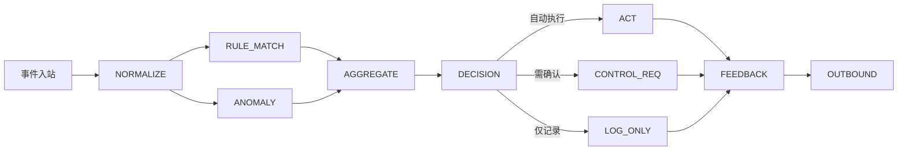

# Observer Agent 数据流转模拟

> 目标：详解 Observer Agent 如何监听事件、执行规则与异常检测、生成提案、触发自动化或请求确认，并与记忆系统联动。

---

## 1. 输入与订阅

### 1.1 订阅主题
| 主题 | 说明 | 事件类型 |
| --- | --- | --- |
| `observer.events` | 经 Event Bus 转发的传感器/摄像头事件 | `sensor_data`, `camera_event` |
| `memorization.updates` | 新记忆更新通知 | `memory_ready` |
| `system.alerts` | 其他服务发出的警告（供辅助判断） | `system_alert` |

### 1.2 事件入站结构
```json
{
  "id": "evt-sensor-9342",
  "type": "sensor_data",
  "payload": {
    "sensor_id": "sensor.living_room_temperature",
    "value": 31.4,
    "unit": "°C",
    "provider": "home_assistant"
  },
  "trace_id": "trace-sensor-9342",
  "priority": 4,
  "meta": {
    "activated": true,
    "suppressed": false
  }
}
```

---

## 2. 内部管线概览



---

## 3. 步骤详解

### 3.1 预处理 (NORMALIZE)
- 标准化数值单位、填充缺失字段。
- 将 `payload` 映射成统一结构：
```json
{
  "entity": "sensor.living_room_temperature",
  "value": 31.4,
  "unit": "°C",
  "status": "overheat",
  "timestamp": "2025-02-12T11:05:00Z"
}
```
- 补充上下文：最近历史数值（从缓存或时序数据库获取）。

### 3.2 规则匹配 (RULE_MATCH)
- 规则来源 `config/observer_rules.yaml`：
```yaml
- name: overheat_warning
  match:
    entity: sensor.living_room_temperature
    condition: value > 30
  priority: 2
  actions:
    - type: proposal
      intent: "turn_on_air_conditioner"
      params:
        target: climate.living_room
        temperature: 24
    - type: notify
      message: "客厅温度过高"
  requires_confirmation: false
```
- 输出 `RuleMatch`：匹配规则名称、建议动作、是否需确认。

### 3.3 异常检测 (ANOMALY)
- 使用滑动窗口/统计模型。
- 示例：门磁连续频繁开关 → `AnomalyResult`：
```json
{
  "type": "frequency_spike",
  "severity": "medium",
  "description": "客厅门磁 5 分钟内触发 10 次",
  "evidence": {...}
}
```
- 可调用轻量模型或利用 M3-Agent 记忆图的时间序列信息。

### 3.4 聚合 (AGGREGATE)
- 合并来自规则和异常的 `Trigger`，去除重复、按优先级排序。
- `Trigger` 结构：
```json
{
  "trigger_id": "trig-20250212-001",
  "source": "rule|anomaly",
  "priority": 2,
  "payload": {...},
  "requires_confirmation": false
}
```

### 3.5 决策 (DECISION)
- 对每个 trigger 判断执行策略：
  - `auto_execute`：立即调用 `DevicePort`（例如安全自动化）。
  - `request_confirmation`：发给 Control Agent 处理。
  - `log_only`：写入记忆或发送提示但不执行。
- 需要参考策略：`config/safety_rules.yaml`、`user_preferences`。

### 3.6 自动执行 (ACT)
- 将 trigger 转换为 `Action`：
```json
{
  "id": "action-20250212-010",
  "target": "climate.living_room",
  "name": "turn_on",
  "args": {"mode": "cool", "temperature": 24},
  "risk_level": "medium",
  "requires_confirmation": false
}
```
- 调用 `DevicePort.execute()`；失败时发 `system_alert`。

### 3.7 请求确认 (CONTROL_REQ)
- 构造 `observer_proposal` 事件：
```json
{
  "type": "observer_proposal",
  "payload": {
    "summary": "客厅温度过高，建议开启空调",
    "intent": "turn_on_air_conditioner",
    "entities": ["climate.living_room"],
    "priority": 2,
    "reason": "overheat_warning"
  },
  "meta": {"requires_confirmation": true}
}
```
- 发布到 `control.requests` 主题，等待 Control Agent 处理。

### 3.8 记录 (LOG_ONLY)
- 生成 `MemoryDraft`：
```json
{
  "source": "observer_agent",
  "kind": "episodic",
  "content": {
    "event": "sensor.living_room_temperature overheat",
    "summary": "检测到客厅温度过高，已通知用户",
    "actions": []
  },
  "entities": ["sensor.living_room_temperature"],
  "timestamp": "2025-02-12T11:05:10Z"
}
```
- 通过记忆管线写入。

### 3.9 反馈 (FEEDBACK)
- 无论自动执行还是提案，都生成反馈事件：
```json
{
  "type": "observer_feedback",
  "payload": {
    "trigger_id": "trig-20250212-001",
    "status": "executed",
    "details": "空调已开启至 24°C"
  }
}
```
- 输出给 Control Agent/UI/TTS 等。

---

## 4. 入参/出参表

| 步骤 | 入参 | 出参 | 接口 |
| --- | --- | --- | --- |
| NORMALIZE | `Event` | `NormalizedEvent` | `EventNormalizer.normalize()` |
| RULE_MATCH | `NormalizedEvent` | `List[RuleMatch]` | `RuleEngine.match()` |
| ANOMALY | `NormalizedEvent` | `List[AnomalyResult]` | `AnomalyDetector.detect()` |
| AGGREGATE | `RuleMatch`, `AnomalyResult` | `List[Trigger]` | `TriggerAggregator.merge()` |
| DECISION | `Trigger`, `context` | 决策结果 | `DecisionEngine.decide()` |
| ACT | `Trigger` | `DeviceResult` | `DevicePort.execute()` |
| CONTROL_REQ | `Trigger` | `observer_proposal` 事件 | `EventBus.publish()` |
| LOG_ONLY | `Trigger` | `MemoryDraft` | `MemoryDraftBuilder` |

---

## 5. 异常与降级

| 场景 | 处理 |
| --- | --- |
| 规则引擎加载失败 | 使用默认兜底规则，记录 `system_alert`。 |
| 异常检测服务不可用 | 暂停异常检测，定期重试。 |
| 自动执行失败 | 将 trigger 转成 `observer_proposal`，请求 Control Agent。 |
| 记忆写入失败 | 重试/记录告警，不阻塞主流程。 |

---

## 6. 监控指标
- `observer_events_total{entity,type}`
- `observer_trigger_total{source,decision}`
- `observer_auto_execution_success_ratio`
- `observer_proposal_pending_total`
- `observer_memory_write_failures`

---

## 7. 与主架构一致性
- Mermaid 图的 “Observer Agent Flow” 与本流程一致：规则匹配→异常检测→提案→执行/记录。
- 视频记忆入口通过 `memory_ready` 加强上下文（无需修改图表）。
- `video_ingest` 事件由 Observer 发布，已在事件总线与记忆层文档中覆盖。

---

本模拟可作为 Observer Agent 设计与实现的蓝本，确保自动化与安全控制可被验证与追踪。
