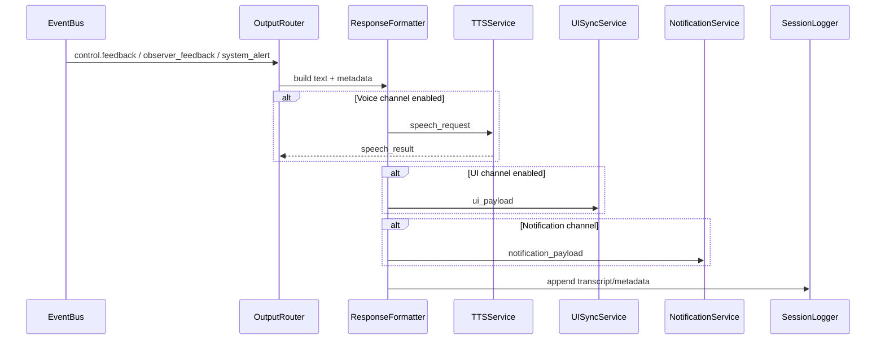
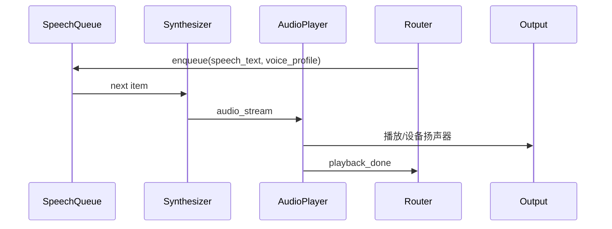

# 输出层（TTS / UI / 通知）数据流转模拟

> 目标：模拟 Control/Observer/系统事件如何通过输出层转换为用户可感知的文本、语音、通知，并确保与输入层/会话管理的一致性。

---

## 1. 输出触发源

| 事件类型 | 来源 | 描述 |
| --- | --- | --- |
| `control.feedback` | Control Agent | 任务执行结果/回答内容。 |
| `observer_feedback` | Observer Agent | 自动化执行或提案状态。 |
| `system_alert` | 各层 | 系统异常、失败警报。 |
| `memory_ready` | 记忆层 | 可选，用于 UI 展示新记忆。 |

每个事件需包含 `channel_preference`（如 voice/ui/notification）或通过会话状态决定。

---

## 2. 组件总览

| 组件 | 职责 |
| --- | --- |
| OutputRouter | 决定输出渠道（语音/TTS、UI、移动通知）。 |
| ResponseFormatter | 格式化文本、富媒体消息。 |
| TTSService | 文本转语音，控制播放队列。 |
| UISyncService | 更新前端或 Web UI（WebSocket/REST）。 |
| NotificationService | 推送移动端或第三方通知。 |
| SessionLogger | 记录输出内容（用于记忆/审计）。 |

---

## 3. 数据流详解



### 3.1 OutputRouter
- 输入：事件 + 会话信息（用户偏好、设备上下文）。
- 输出：多渠道任务列表，带优先级与依赖。
- 策略示例：
  - 语音对话优先播放 TTS，同步展示 UI 字幕。
  - 系统报警 -> 移动通知 + 语音提示。
  - 夜间模式 -> 静默通知（仅 UI 推送）。

### 3.2 ResponseFormatter
- 负责文本模板化与富媒体合成。
- 输入：
```json
{
  "text": "已为您关闭客厅灯。",
  "entities": ["device.light.living_room"],
  "attachments": {
    "images": [],
    "actions": [{"label": "再次打开", "intent": "turn_on_light"}]
  }
}
```
- 输出：
  - `speech_text`：适配 TTS 朗读（去除指令符号、调整语调）。
  - `ui_payload`：JSON 结构（标题、正文、按钮、图标）。
  - `notification_payload`：移动设备所需字段（标题、body、deep link）。

### 3.3 TTSService 管线

- 支持排队、打断（高优先级打断当前播放）。
- 语音合成接口：腾讯 TTS / 本地模型；需凭证配置。
- 错误：合成失败 → fallback 文本输出 + `system_alert`。

### 3.4 UISyncService
- 将 `ui_payload` 通过 WebSocket 推送或写入状态服务供前端轮询。
- 支持多用户 session，需包含 `conversation_id`。
- 可附加记忆、上下文信息（如来自 `memory_ready`）。

### 3.5 NotificationService
- 调用移动端推送（FCM/APNs）或第三方平台。
- Payload 举例：
```json
{
  "title": "客厅温度偏高",
  "body": "已开启空调降温。",
  "deep_link": "app://scene/living_room"
}
```
- 支持静默推送、带动作按钮。

### 3.6 SessionLogger
- 将最终输出写入对话日志：
```json
{
  "turn_id": 6,
  "role": "assistant",
  "channels": ["voice", "ui"],
  "text": "已为您关闭客厅灯。",
  "timestamp": "2025-02-12T09:30:12Z"
}
```
- 供记忆层或分析使用。

---

## 4. 入参/出参与接口

| 步骤 | 入参 | 出参 | 接口 |
| --- | --- | --- | --- |
| Router | `Event`, `session` | `OutputPlan` | `OutputRouter.route()` |
| Formatter | `OutputPlan` | `FormattedOutput` | `ResponseFormatter.format()` |
| TTS | `speech_text` | 播放状态 | `TTSService.speak()` |
| UI | `ui_payload` | ack | `UISyncService.push()` |
| Notification | `notification_payload` | ack | `NotificationService.send()` |
| Logger | `FormattedOutput` | - | `SessionLogger.append()` |

---

## 5. 错误与降级

| 场景 | 策略 |
| --- | --- |
| TTS 凭证失效 | 自动切换云端/本地备用；若失败记录 `system_alert`，仅用文本输出。 |
| UI 推送失败 | 重试 + 记录，必要时降级为通知。 |
| 通知发送失败 | 标记到重试队列；超过阈值提醒用户检查设备。 |
| 多渠道冲突 | 根据优先级策略（例如勿扰模式停止语音）。 |

---

## 6. 监控指标
- `output_requests_total{channel}`
- `tts_latency_ms`, `tts_failures_total`
- `ui_push_latency_ms`
- `notification_failures_total`
- `output_channel_selection{mode}`（统计 voice/ui/notification 的选择比例）

---

## 7. 与其他层的交互
- 输入层：若语音输出被打断，可能需要通过事件通知输入层重新唤醒。
- 记忆层：SessionLogger 产出的记录可供记忆写入使用。
- 事件总线：输出层若发生严重错误，可发布 `system_alert`。

---

## 8. 一致性检查
- 主架构 “输出层 Output Layer” 节点即该流程：响应生成 → TTS → UI → 通知。
- 无需修改主 mermaid 图；若后续新增渠道（如智能音箱），在 Router/Formatter 配置即可。

---

该模拟为输出层带来了明确的通路和接口定义，可直接用于实现多渠道反馈服务。
