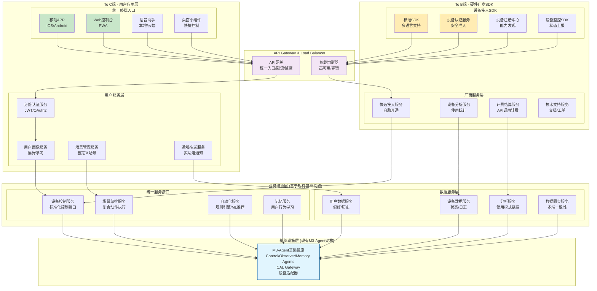
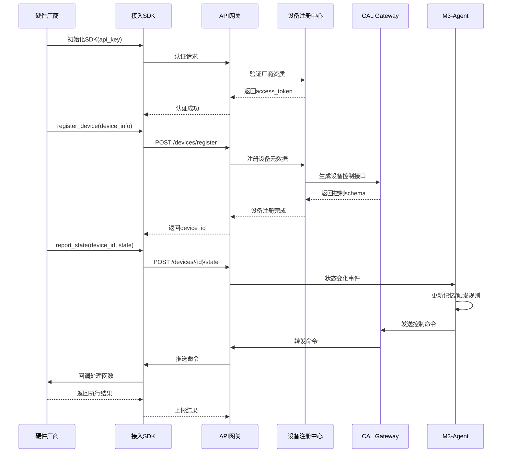
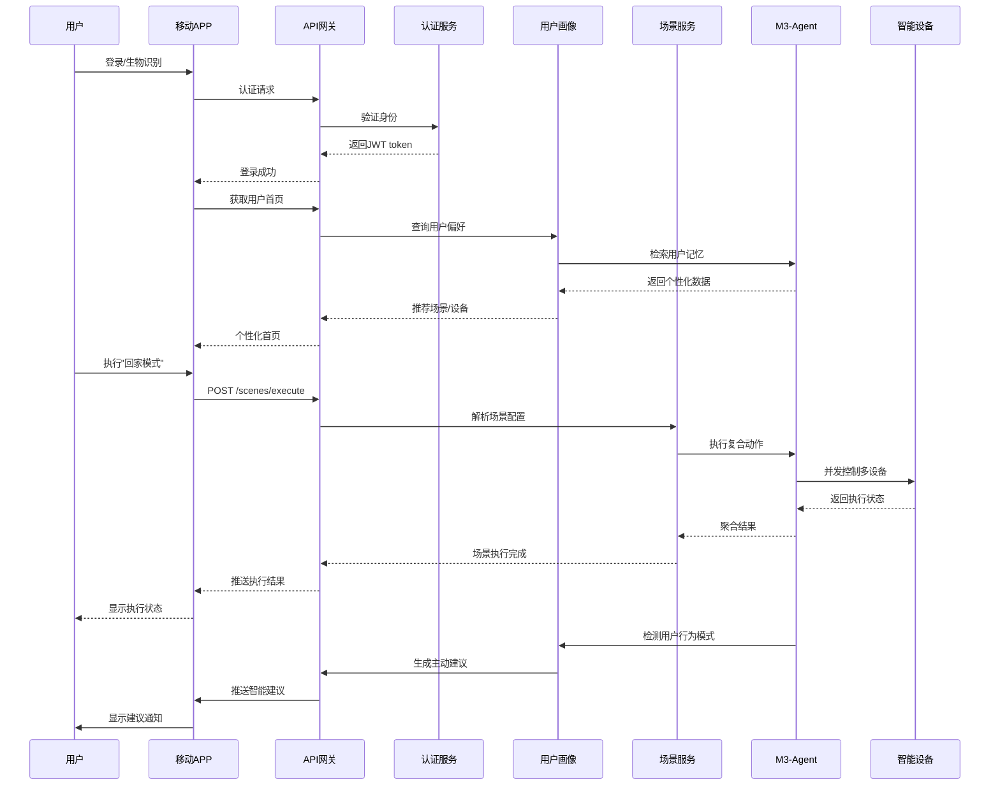
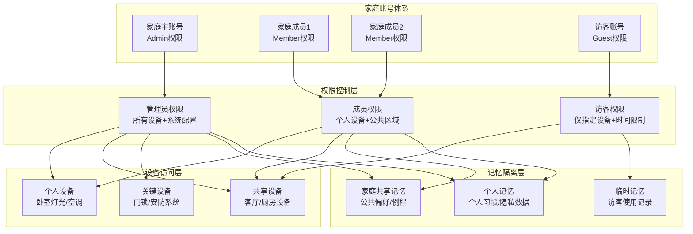

# 应用服务层架构设计

## 总体架构



## To B端 - 硬件厂商接入流程

### 1. 设备接入SDK设计

**核心接口抽象**：
```python
# 设备SDK核心接口
class DeviceSDK:
    def register_device(self, device_info: DeviceInfo) -> str:
        """注册设备到平台，返回设备ID"""
        
    def report_state(self, device_id: str, state: DeviceState) -> bool:
        """上报设备状态变化"""
        
    def handle_command(self, callback: Callable[[Command], CommandResult]):
        """注册命令处理回调"""
        
    def subscribe_events(self, event_types: List[str]) -> EventStream:
        """订阅平台事件"""

# 使用示例 - 厂商只需几行代码
sdk = DeviceSDK(api_key="vendor_key", secret="vendor_secret")
device_id = sdk.register_device({
    "name": "智能灯泡",
    "type": "light",
    "capabilities": ["on_off", "brightness", "color"],
    "model": "LightBulb-Pro-2024"
})

@sdk.handle_command
def on_command(cmd: Command) -> CommandResult:
    if cmd.action == "turn_on":
        hardware_light.turn_on()
        return CommandResult(success=True, new_state={"on": True})
```

### 2. 厂商服务数据流



## To C端 - 用户应用层设计

### 1. 统一终端体验

**多端一致性**：
- **移动APP**：主要控制终端，支持离线操作
- **Web控制台**：高级配置和管理界面
- **语音助手**：自然语言交互，支持本地处理
- **桌面小组件**：快捷控制，一键执行常用场景

### 2. 用户服务数据流



### 3. 账号层级隔离设计



## 业务价值与问题解决

### To B端解决的问题

1. **技术门槛高**：
   - 问题：硬件厂商需要适配多种智能家居协议
   - 解决：提供统一SDK，一次接入支持所有协议

2. **开发成本高**：
   - 问题：每个平台都需要单独开发适配
   - 解决：标准化接口，减少90%重复开发工作

3. **运维复杂**：
   - 问题：设备状态监控、故障诊断困难
   - 解决：内置监控SDK，自动化运维支持

4. **生态封闭**：
   - 问题：各厂商设备无法互联互通
   - 解决：统一协议抽象，打破生态壁垒

### To C端解决的问题

1. **APP碎片化**：
   - 问题：每个品牌一个APP，用户体验割裂
   - 解决：统一控制入口，一个APP控制所有设备

2. **缺乏智能**：
   - 问题：设备只能被动控制，缺乏主动服务
   - 解决：AI记忆学习，主动提供个性化服务

3. **隐私担忧**：
   - 问题：数据上云，用户担心隐私泄露
   - 解决：本地处理，用户完全掌控数据

4. **配置复杂**：
   - 问题：智能家居配置门槛高，普通用户难以上手
   - 解决：AI自动学习，越用越智能，无需复杂配置

## 技术架构特点

### 1. 微服务架构
- 每个服务独立部署，支持水平扩展
- 服务间通过标准API通信，松耦合设计
- 支持灰度发布，降低升级风险

### 2. 多租户设计
- 物理隔离：不同家庭数据完全隔离
- 逻辑隔离：家庭内部成员权限分级
- 资源隔离：防止单租户影响整体性能

### 3. 事件驱动
- 设备状态变化实时推送
- 用户行为触发智能建议
- 异常情况自动告警处理

### 4. 渐进式增强
- 基础功能本地运行，保证可用性
- 高级功能云端增强，提升体验
- 网络异常时平滑降级

这种设计将现有的M3-Agent基础设施包装成面向不同用户群体的服务，既保持了技术先进性，又提供了商业化的可能性。