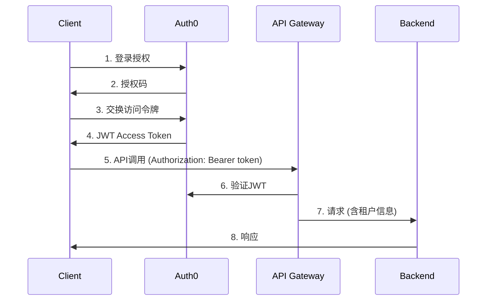

# API网关与认证授权系统设计

## 🏗️ 整体架构

### API网关职责
```
客户端请求 → API网关 → 认证 → 授权 → 限流 → 路由 → 后端服务
                      ↓
              租户上下文注入 → 审计日志
```

## 🔐 认证方案选型

### 方案对比

| 方案 | 复杂度 | 成本 | 可扩展性 | 维护成本 | 推荐度 |
|------|--------|------|----------|----------|--------|
| **Auth0** | 低 | 中 | ⭐⭐⭐⭐⭐ | 低 | ✅ |
| **Keycloak** | 中 | 低 | ⭐⭐⭐⭐ | 中 | ⭐ |
| **AWS Cognito** | 低 | 低 | ⭐⭐⭐ | 低 | ⭐⭐ |
| **自研** | 高 | 低 | ⭐ | 高 | ❌ |

**推荐方案：Auth0**
- ✅ 开箱即用的多租户支持
- ✅ 丰富的SDK和集成
- ✅ 灵活的权限模型
- ✅ SOC2/SOC3合规
- ❌ 成本：$200/月 + 按用户计费

**备选：Keycloak（企业版）**
- ✅ 完全自控
- ✅ 无外部依赖
- ❌ 需要专业团队维护

## 🔑 认证流程设计

### OAuth 2.0 + OIDC流程


### JWT Token结构
```json
{
  "sub": "user123",
  "tenant_id": "tenant_abc",
  "email": "user@example.com",
  "scope": "read:messages write:videos",
  "role": "developer",
  "permissions": [
    "memory:read",
    "video:process",
    "video:view"
  ],
  "exp": 1234567890,
  "iat": 1234567890
}
```

## 🎭 授权模型 (RBAC)

### 角色定义
```yaml
角色层级:
  超级管理员 (Super Admin):
    - 所有权限
    - 管理租户

  租户管理员 (Tenant Admin):
    - 用户管理
    - 配置管理
    - 账单查看
    - API密钥管理

  开发者 (Developer):
    - 调用API
    - 查看使用统计
    - 管理自有资源

  观察者 (Observer):
    - 只读访问
    - 查看使用统计

  最终用户 (End User):
    - 基础功能使用
    - 个人数据管理
```

### 权限矩阵
| 资源 | 超级管理员 | 租户管理员 | 开发者 | 观察者 | 最终用户 |
|------|------------|------------|--------|--------|----------|
| **用户管理** | ✅ | ✅ | ❌ | ❌ | ❌ |
| **API密钥** | ✅ | ✅ | 自有 | ❌ | ❌ |
| **记忆系统** | ✅ | ✅ | ✅ | 只读 | ✅ |
| **视频处理** | ✅ | ✅ | ✅ | ❌ | ✅ |
| **账单** | ✅ | ✅ | ❌ | ❌ | ❌ |
| **统计数据** | ✅ | ✅ | 自有 | 只读 | 自有 |

## 🌐 API网关实现

### Kong Gateway (推荐)

#### 安装配置
```yaml
# docker-compose.yml
version: '3.8'
services:
  kong-database:
    image: postgres:13
    environment:
      POSTGRES_DB: kong
      POSTGRES_USER: kong
      POSTGRES_PASSWORD: kong

  kong-migrations:
    image: kong:latest
    command: ["kong", "migrations", "bootstrap"]
    depends_on:
      - kong-database
    environment:
      KONG_DATABASE: postgres
      KONG_PG_HOST: kong-database

  kong:
    image: kong:latest
    ports:
      - "8000:8000"  # Proxy
      - "8001:8001"  # Admin API
    environment:
      KONG_DATABASE: postgres
      KONG_PG_HOST: kong-database
      KONG_PROXY_ACCESS_LOG: /dev/stdout
      KONG_ADMIN_ACCESS_LOG: /dev/stdout
      KONG_PROXY_ERROR_LOG: /dev/stderr
    depends_on:
      - kong-migrations
```

#### 插件配置
```yaml
# JWT验证插件
plugins:
  - name: jwt
    config:
      secret_is_base64: false
      key_claim_name: tenant_id

  # 限流插件
  - name: rate-limiting
    config:
      minute: 1000
      hour: 10000
      policy: local
      fault_tolerant: true

  # 请求大小限制
  - name: request-size-limiting
    config:
      allowed_payload_size: 100

  # CORS插件
  - name: cors
    config:
      origins:
        - "https://app.moyan.ai"
        - "https://dashboard.moyan.ai"
      methods:
        - GET
        - POST
        - PUT
        - DELETE
      headers:
        - Accept
        - Authorization
        - Content-Type
      exposed_headers:
        - X-Auth-Token
      credentials: true
      max_age: 3600

  # 请求/响应转换插件
  - name: request-transformer
    config:
      add:
        headers:
          - "X-Tenant-ID:$(jwt.tenant_id)"

  # 访问日志插件
  - name: http-log
    config:
      http_endpoint: https://logs.moyan.ai/ingest
      method: POST
      content_type: application/json
```

### Nginx替代方案（轻量级）
```nginx
server {
    listen 443 ssl;
    server_name api.moyan.ai;

    # JWT验证
    auth_request /auth;
    auth_request_set $tenant_id $upstream_http_x_tenant_id;

    location /auth {
        proxy_pass http://auth-service/verify;
        proxy_pass_request_body off;
        proxy_set_header Content-Length "";
        proxy_set_header X-Original-URI $request_uri;
    }

    location / {
        # 注入租户ID
        proxy_set_header X-Tenant-ID $tenant_id;

        # 限流
        limit_req zone=api burst=20 nodelay;

        # 后端服务
        proxy_pass http://backend;
    }
}
```

## 🚦 限流与配额管理

### 限流算法 (Token Bucket)
```python
import redis
from datetime import datetime, timedelta

class RateLimiter:
    def __init__(self, redis_client):
        self.redis = redis_client

    async def check_rate_limit(
        self,
        tenant_id: str,
        api_key: str,
        limit_per_minute: int = 1000,
        limit_per_hour: int = 10000
    ) -> bool:
        now = datetime.now()

        # 每分钟窗口
        minute_key = f"rate:{tenant_id}:{api_key}:minute:{now.minute}"
        minute_count = await self.redis.incr(minute_key)
        if minute_count == 1:
            await self.redis.expire(minute_key, 60)

        if minute_count > limit_per_minute:
            return False

        # 每小时窗口
        hour_key = f"rate:{tenant_id}:{api_key}:hour:{now.hour}"
        hour_count = await self.redis.incr(hour_key)
        if hour_count == 1:
            await self.redis.expire(hour_key, 3600)

        return hour_count <= limit_per_hour
```

### 配额模型
```yaml
配额层级:
  Free:
    每分钟: 100
    每小时: 1,000
    每天: 10,000
    存储: 100MB

  Pro:
    每分钟: 1,000
    每小时: 50,000
    每天: 500,000
    存储: 10GB

  Enterprise:
    每分钟: 10,000
    每小时: 500,000
    每天: 5,000,000
    存储: 100GB

  Custom:
    根据合同定制
```

### 配额超限处理
```python
class QuotaExceededException(Exception):
    pass

async def check_quota_before_request(tenant_id: str, operation: str):
    current_usage = await get_daily_usage(tenant_id)
    quota = await get_quota(tenant_id)

    if current_usage >= quota[operation]:
        raise HTTPException(
            status_code=429,
            detail={
                "error": "quota_exceeded",
                "message": "API调用配额已用完",
                "reset_time": get_tomorrow_utc(),
                "upgrade_url": "https://billing.moyan.ai/upgrade"
            }
        )
```

## 🔍 审计日志

### 审计事件类型
```yaml
认证事件:
  - 用户登录
  - 密码重置
  - API密钥生成

授权事件:
  - 权限变更
  - 角色分配
  - 资源访问

API事件:
  - 所有API调用
  - 限流触发
  - 错误响应

数据事件:
  - 数据创建/更新/删除
  - 文件上传/下载
  - 配置修改
```

### 审计日志结构
```json
{
  "timestamp": "2024-01-15T10:30:00Z",
  "event_type": "api_call",
  "tenant_id": "tenant_abc123",
  "user_id": "user_xyz789",
  "api_key": "ak_********",
  "ip_address": "192.168.1.1",
  "user_agent": "Mozilla/5.0...",
  "request": {
    "method": "POST",
    "path": "/api/v1/video/process",
    "headers": {...},
    "body_size": 1024
  },
  "response": {
    "status_code": 200,
    "response_time_ms": 150,
    "body_size": 2048
  },
  "metadata": {
    "trace_id": "abc123-def456",
    "span_id": "xyz789",
    "cpu_usage": 12.5,
    "memory_usage": 256
  }
}
```

### 日志存储与分析
```yaml
存储方案:
  实时: Kafka → Elasticsearch
  长期: S3 (Glacier) - 7年保留
  实时监控: Grafana仪表板

分析维度:
  按用户: 哪个用户最活跃
  按API: 哪个API最消耗资源
  按时间: 流量趋势分析
  按错误: 错误率统计
```

## 🛡️ 安全加固

### API安全最佳实践

#### 1. 输入验证
```python
from pydantic import BaseModel, Field, validator
from typing import Optional

class VideoProcessRequest(BaseModel):
    video_url: str = Field(..., regex=r'^https?://')
    memory_domain: Optional[str] = Field(None, max_length=100)
    user_id: Optional[str] = Field(None, max_length=50)

    @validator('video_url')
    def validate_url(cls, v):
        # 检查URL白名单
        allowed_domains = ['youtube.com', 'vimeo.com', 's3.amazonaws.com']
        if not any(domain in v for domain in allowed_domains):
            raise ValueError('URL域名不在白名单中')
        return v
```

#### 2. SQL注入防护
```python
# 使用参数化查询
query = """
    MATCH (n:Memory {tenant_id: $tenant_id, domain: $domain})
    RETURN n
"""
await session.run(query, tenant_id=tenant_id, domain=domain)
```

#### 3. XSS防护
```python
# 响应头设置
response.headers["X-Content-Type-Options"] = "nosniff"
response.headers["X-Frame-Options"] = "DENY"
response.headers["X-XSS-Protection"] = "1; mode=block"
response.headers["Content-Security-Policy"] = "default-src 'self'"
```

#### 4. 加密传输
```yaml
HTTPS要求:
  - 所有API调用必须使用HTTPS
  - TLS 1.3强制
  - 证书自动续期 (Let's Encrypt)
  - HSTS响应头

HTTP到HTTPS重定向:
  - 301永久重定向
  - 保留原始URL参数
```

## 📊 监控与告警

### 关键指标
```yaml
认证指标:
  - 登录成功率
  - JWT验证失败率
  - Token刷新频率

API指标:
  - QPS (每秒查询数)
  - P99延迟
  - 错误率 (按状态码)
  - 限流触发次数

安全指标:
  - 可疑请求数量
  - 失败认证尝试
  - IP黑名单命中率
```

### 告警规则
```yaml
告警策略:
  API错误率:
    条件: 5分钟内错误率 > 5%
    通知: Slack + PagerDuty
    严重性: High

  限流触发:
    条件: 1分钟内触发 > 100次
    通知: 邮件
    严重性: Medium

  认证失败:
    条件: 5分钟内失败 > 50次
    通知: Slack
    严重性: High
```

## ✅ 实施清单

### 阶段1：基础认证
- [ ] 部署Auth0
- [ ] 配置OAuth 2.0
- [ ] 实现JWT验证中间件
- [ ] 测试登录流程

### 阶段2：授权与限流
- [ ] 实现RBAC模型
- [ ] 配置Kong插件
- [ ] 实现限流算法
- [ ] 测试权限控制

### 阶段3：安全加固
- [ ] 配置审计日志
- [ ] 安全扫描
- [ ] 渗透测试
- [ ] 合规审计

### 阶段4：监控与优化
- [ ] 配置Prometheus指标
- [ ] 搭建Grafana仪表板
- [ ] 设置告警规则
- [ ] 性能调优

---

**核心原则**：安全第一，简单第二。让授权透明，让用户专注业务。
