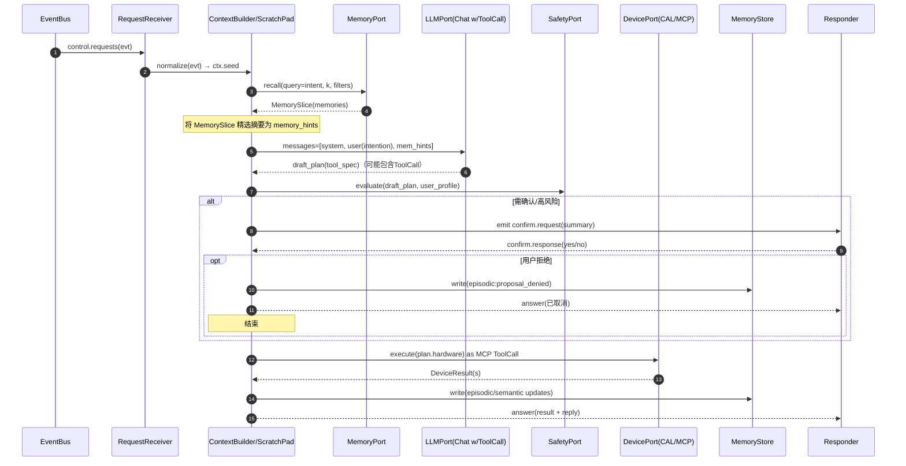
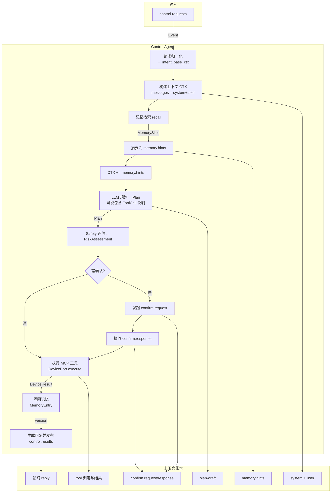
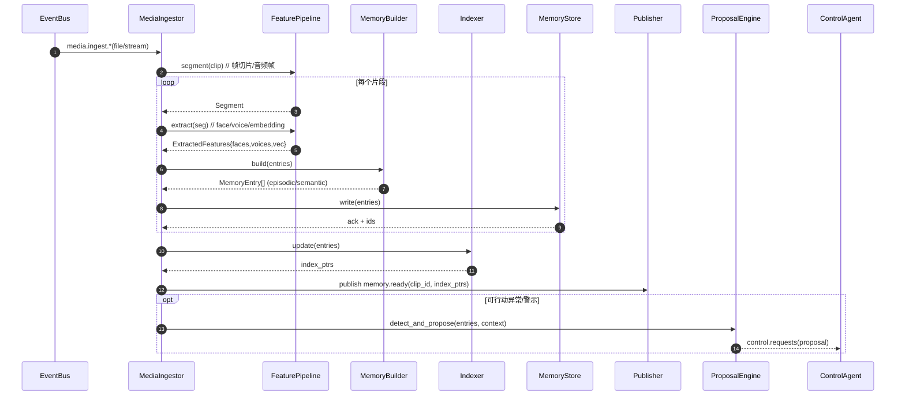
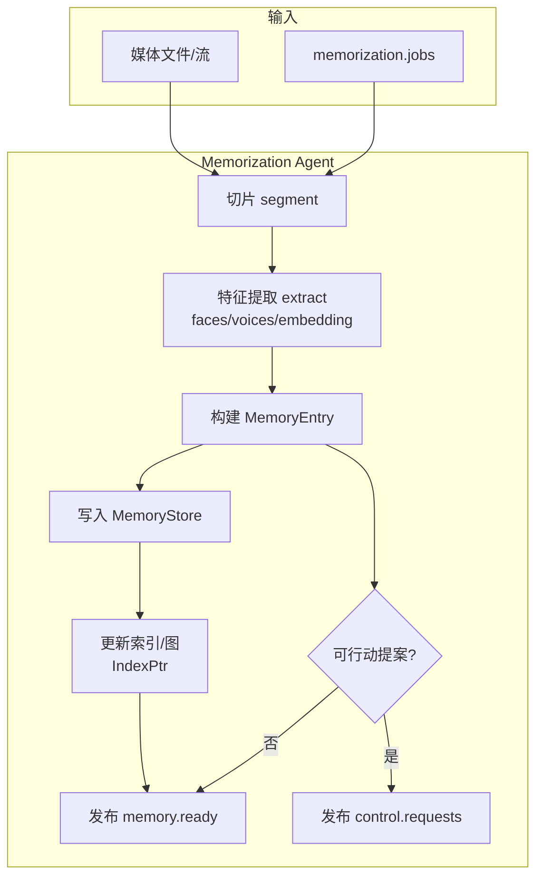
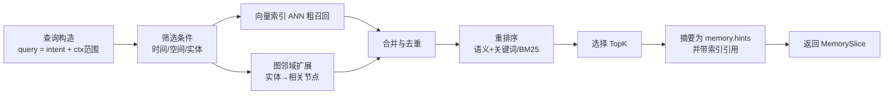
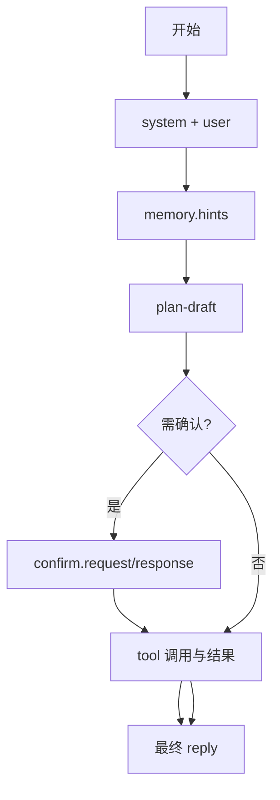
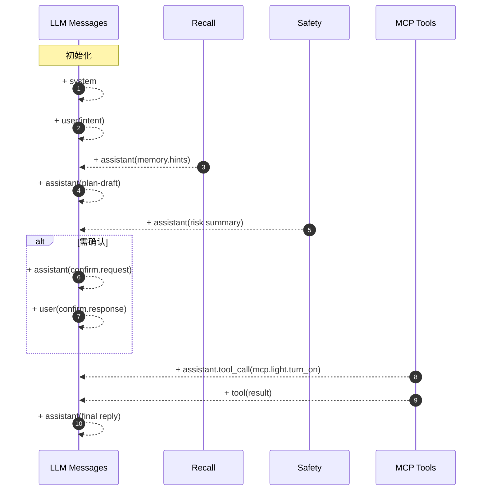

# Control Agent 与 Memorization Agent 内部数据流详解（模块化实现手册，基于 m3-agent 蓝本）

本手册面向工程落地，逐步给出：
- 两个模块的输入起点（EventBus / 视频音频文件）→ 内部工作流 → LLM 上下文工程 → MCP/ToolCall 调用 → 记忆回写的完整数据流；
- 每个抽象“原子组件”的方法签名、入参/出参契约（JSON/Type），及调用链；
- 精细化 Mermaid 时序图（以“内部消息/上下文窗口累积”为重点）；
- 与 `m3-agent` 的映射关系，便于替换与校准。

目录：
1) 总览与端口契约  2) Control Agent 内部工作流  3) Memorization Agent 内部工作流  4) 上下文工程（Context Engineering）  5) 失败恢复与可观测性  6) 与 m3-agent 的对应关系  7) 渐进落地指南  8) m3-agent 实践输入与入口（证据）  9) m3-agent 记忆存储模型（图与向量）  10) 方案选型与最终决议

---

## 1. 总览与端口契约（Ports & Contracts）

端口抽象（强内聚、低耦合）：
- EventBusPort: 发布/订阅事件主题（control.requests、control.results、memorization.jobs、memory.ready、media.ingest）。
- MemoryPort: recall()/write() 统一读写长期记忆（记忆图 + 向量索引 + 时序）。
- LLMPort: chat() 抽象（支持 Tool/Function Call；支持流式/分段返回）。
- DevicePort: execute()/get_status()，对接 CAL Gateway（MCP→HA/Matter/WoT）。
- SafetyPort: evaluate() 风险评估/ACL/确认策略。

关键事件与数据契约（节选）：

```json
// control.requests（来自 Router/Observer/Memorizer 的被动请求/提案）
{
  "id": "evt-123",
  "type": "user_request|proposal|automation",
  "source": "router|observer|memorizer",
  "time": 1726900000,
  "modality": "text|voice|sensor",
  "utterance": "打开客厅主灯",
  "context_keys": ["room:living", "user:alice"],
  "priority": 5,
  "trace": {"span": "...", "parent": "..."}
}
```

### 2.6 与架构文档函数名对齐（便于落地）
- `_build_memory_hints(intent, context)`: 对应本手册的 `summarize_slice()` + 上下文范围选择；
- `_generate_plan(intent, memories, context)`: 对应 `llm.chat(messages+tools)` 并解析为 `Plan`；
- `_assess_risk(plan)`: 对应 `safety.evaluate(plan, user_profile)`；
- `_request_confirmation(plan, risk)`: 对应 `emit_confirm_request()` + `wait_confirm_response()`；
- `device_port.execute(action)`: 对应 MCP ToolCall 执行并写回 `tool` 消息；
- `_create_episodic_memories(intent, plan, results)`: 对应 `build_episodic_from_results()`；
- `memory_port.write(entries)`: 统一写入并返回版本号/批次ID。

```json
// memory.entry（Memorization 的写入产物）
{
  "kind": "episodic|semantic",
  "timestamp": 1726900001,
  "contents": ["18:02 用户进入客厅并开灯"],
  "entities": ["user:alice", "room:living", "device:light.living_main"],
  "features_ref": {"face": "id:face#123", "voice": "id:voice#456"},
  "weight": 0.7,
  "indexes": {"graph_id": "...", "vec_id": "..."}
}
```

```json
// plan（Control 规划产物，LLM/规则生成）
{
  "hardware": [
    {
      "action": "light.turn_on",
      "target": {"device": "light.living_main"},
      "params": {"brightness": 180},
      "critical": true
    }
  ],
  "reply": {"voice": true, "text": "已为你打开客厅主灯。", "emotion": "cheerful"}
}
```

---

## 2. Control Agent 内部工作流（事件→上下文→检索→规划→确认→执行→回写）

### 2.1 入口与出参

- 输入：`control.requests` 事件或直接函数调用 `ControlAgent.run(intent, context)`。
- 输出：`control.results` 事件、执行回执、应答文本、记忆回写版本号。

函数签名与类型（与架构文档保持一致）：

```python
class ControlAgent:
    async def run(self, intent: str, context: Dict[str, Any]) -> ControlResult: ...

class MemoryPort(Protocol):
    async def recall(self, query: str, k: int, filters: Dict[str, Any]) -> MemorySlice: ...
    async def write(self, entries: List[MemoryEntry]) -> str: ...  # 返回版本号/批次ID

class LLMPort(Protocol):
    async def chat(self, messages: List[LLMMessage], tools: List[ToolSpec]|None=None,
                   streaming: bool=True) -> LLMResponse: ...

class DevicePort(Protocol):
    async def execute(self, action: Action) -> DeviceResult: ...

class SafetyPort(Protocol):
    async def evaluate(self, plan: Plan, user_ctx: Dict[str, Any]) -> RiskAssessment: ...
```

### 2.2 内部时序（含上下文窗口累积）



上下文窗口在每一步如何累积：
- 初始化：`system`（Agent 角色/边界） + `user`（intent + 环境上下文）。
- 检索后：追加 `assistant`(memory-hints) + `tool`(recall meta)。
- 规划：追加 `assistant`(plan-draft)；若触发 ToolCall（MCP），以 `assistant.tool_call` 形式输出。
- 安全/确认：追加 `assistant`(risk) + `user`(confirm)；若拒绝，写入 episodic 并结束。
- 执行：`tool`(DeviceResult) 逐条附加；失败/重试信息进入 `assistant` 反思。
- 应答：`assistant` 生成最终 `reply` 并投递 `control.results`。

调用记忆检索的过滤建议（与实现一致）
- 在构建 `filters` 时，请优先填充三键：`user_id(list[str])`、`memory_domain(str)`、`run_id(str)`；
- 若同时给出多个 user_id，可通过 `user_match='any'|'all'` 控制匹配策略；
- 建议 Control/Memorization 在“当前会话”中携带固定的 `run_id`，以便作用域 `session` 的优先命中；
- 示例：
```python
filters = {
  "user_id": [ctx.user],
  "user_match": "any",
  "memory_domain": ctx.domain or "work",
  "run_id": ctx.session_id,
  "modality": ["text"],
}
slice = await memory_port.recall(query=intent, k=8, filters=filters)
```

### 2.2b 流程图（面向新人，标注数据与上下文）



### 2.4 参考伪代码（含上下文累积与 ToolCall）

```python
async def run_control(intent: str, base_ctx: Dict[str, Any]) -> ControlResult:
    # 1) 初始化上下文与消息
    scratch = ScratchPad(trace=new_trace())
    messages = [
        sys_msg("你是Control Agent…边界/约束…"),
        user_msg(intent, ctx=redact(base_ctx))
    ]

    # 2) 记忆检索与摘要
    sl = await memory_port.recall(query=intent, k=20, filters={"th": 0.7})
    hints = summarize_slice(sl, budget=1024)
    scratch.memory_hints = hints
    messages.append(assistant_msg(name="memory.hints", content=to_text(hints)))

    # 3) 生成计划（可携带 ToolSpec）
    tools = device_tools_specs_from_registry()  # MCP tools → ToolSpec[]
    resp = await llm.chat(messages=messages, tools=tools, streaming=True)
    plan = parse_json(resp.content, model=Plan)
    messages.append(assistant_msg(content=resp.content))

    # 4) 风险评估与确认
    risk = await safety.evaluate(plan, base_ctx.get("user_profile", {}))
    messages.append(assistant_msg(content=f"risk: {risk.level}, confirm={risk.requires_confirmation}"))
    if risk.requires_confirmation:
        ask = confirmation_summary(plan, risk)
        emit_confirm_request(ask)
        user_ok = await wait_confirm_response()
        messages.append(user_msg(f"confirm: {user_ok}"))
        if not user_ok:
            await memory_port.write([episodic("proposal_denied", intent, plan)])
            return ControlResult.cancelled("user_denied")

    # 5) 执行动作（MCP ToolCall）
    results = []
    for action in plan.hardware:
        tool_call = tool_invoke("mcp." + action.action, args=action.params|action.target)
        messages.append(assistant_tool_call(tool_call))
        r = await device_port.execute(action)
        results.append(r)
        messages.append(tool_msg(name=tool_call.name, content=json.dumps(r.to_dict())))
        if action.critical and r.status == "failed":
            break

    # 6) 写回记忆并生成应答
    await memory_port.write(build_episodic_from_results(intent, plan, results))
    reply = final_reply(intent, results, plan.reply)
    messages.append(assistant_msg(content=reply))
    emit_control_results(reply, results)
    return ControlResult(success=all_ok(results), response_text=reply, actions_executed=len(results))
```

### 2.5 ToolSpec/DeviceResult 契约示例

```json
// ToolSpec（用于 LLM 的工具描述，映射 MCP 工具）
{
  "name": "mcp.light.turn_on",
  "description": "打开指定灯光，可选亮度/色温",
  "parameters": {
    "type": "object",
    "properties": {
      "device": {"type": "string"},
      "brightness": {"type": "integer", "minimum": 1, "maximum": 255},
      "color_temp": {"type": "integer", "minimum": 150, "maximum": 500}
    },
    "required": ["device"]
  }
}
```

```json
// DeviceResult（标准化执行结果）
{
  "action": "light.turn_on",
  "target": "light.living_main",
  "status": "success|failed|timeout",
  "elapsed_ms": 123,
  "error": null,
  "before": {"is_on": false},
  "after": {"is_on": true, "brightness": 180},
  "trace": {"span": "..."}
}
```

### 2.3 原子组件与契约（入参/出参）

1) RequestReceiver
- 入参：`Event`（见 control.requests）
- 出参：`intent: str`、`context: Dict`
- 规则：解析 `utterance/context_keys/priority/trace`，附加 `user_profile/device_states`。

2) ContextBuilder / ScratchPad
- 入参：intent、context
- 出参：`messages: List[LLMMessage]`、`memory_hints: Dict`、`token_budget: Dict`、`trace_id`
- 规则：
  - 基于 `context_keys` 获取空间/时间/实体范围；
  - 设定 token 预算与分层摘要策略（long→hint）；
  - 构造 `system + user + hints` 的初始消息序列。

3) MemoryRetriever（MemoryPort）
- 入参：`query: str`、`k: int`、`filters`
- 出参：`MemorySlice`（含文本片段、实体指针、时间戳、权重）
- 规则：可多轮检索（topk、阈值、before/after clip），对齐 `mmagent/retrieve.py` 的策略。

4) Planner（LLMPort.chat）
- 入参：`messages + tools(=Device Actions via MCP)`
- 出参：`Plan`（含 hardware[]、reply），以及可能的 `tool_calls`
- 规则：
  - Prompt 模板：见“4. 上下文工程”；
  - 强制输出 JSON（校验后再用）；
  - 对不确定项返回 `需确认` 标记。

5) SafetyEvaluator（SafetyPort）
- 入参：`Plan`、`user_ctx`
- 出参：`RiskAssessment{level, requires_confirmation, reasons[]}`
- 规则：基于 `safety_rules.yaml`（级别/ACL/黑白名单/时间段等）。

6) Confirmer（通过 Router/Interactor）
- 入参：`Plan`、`RiskAssessment`
- 出参：`Confirmation{approved: bool, reason?: str}`
- 规则：文本/语音二选一；超时/多轮；审计到记忆。

7) Actor（DevicePort→CAL→MCP）
- 入参：`Action` 列表
- 出参：`DeviceResult[]`（标准化状态/错误码/耗时/溯源）
- 规则：
  - 每个 `Action` 映射为 MCP ToolCall：`name=light.turn_on args={...}`；
  - 关键动作失败即短路；幂等键 `idempotency_key` 保障重试安全；
  - 设备状态查询 `get_status()` 用于前后对比与补救。

8) MemoryWriter（MemoryPort.write）
- 入参：`MemoryEntry[]`（执行轨迹/结果/偏好）
- 出参：`version/batch_id`
- 规则：
  - episodic：写入“谁-在何时何地-做了什么-结果如何”；
  - semantic：提炼稳定偏好（例如“晚间默认 180 亮度”）。

9) Responder（control.results）
- 入参：`response_text`、`execution_summary`、`trace/spans`
- 出参：下行到 UI/语音合成/日志。

---

## 3. Memorization Agent 内部工作流（媒体→特征→记忆→索引→事件/提案）

### 3.1 入口与出参

- 输入 A：直接文件/流（`media.ingest.video`, `media.ingest.audio`）；
- 输入 B：`memorization.jobs`（任务参数：片段范围、采样率、模型开关）。
- 输出：`memory.ready`（索引可用通知）与可选的 `control.requests`（主动提案）。

核心组件签名：

```python
class MemorizationAgent:
    async def start(self): ...  # 订阅 ingest/jobs
    async def on_media(self, media: MediaChunk): ...
    async def on_job(self, job: MemJob): ...

class FeaturePipeline:
    async def segment(self, media: MediaChunk) -> List[Segment]: ...
    async def extract(self, seg: Segment) -> ExtractedFeatures: ...  # face/voice/embedding

class MemoryBuilder:
    async def build(self, event: Event|MediaChunk, feats: ExtractedFeatures) -> List[MemoryEntry]: ...

class Indexer:
    async def update(self, entries: List[MemoryEntry]) -> IndexPtr: ...

class ProposalEngine:
    async def detect_and_propose(self, entries, context) -> Optional[ControlRequest]: ...
```

### 3.2 内部时序（含中间产物）



### 3.2b 流程图（面向新人，标注数据）



### 3.2c 记忆检索近似可视化（用于 Control 的 RECALL）


### 3.3 原子组件与契约

1) MediaIngestor
- 入参：`MediaChunk{path|stream_id, ts_range, modality}` / `MemJob`
- 出参：分片后的 `Segment[]`
- 规则：缓存 clips、对齐时间轴、产生可追溯 `clip_id`。

2) FeaturePipeline
- 入参：`Segment`
- 出参：`ExtractedFeatures{faces[], voices[], embedding(vec), entities[]}`
- 规则：参考 m3-agent 的 `video_processing/face_processing/voice_processing`，输出统一结构。

3) MemoryBuilder
- 入参：`Event|MediaChunk`、`ExtractedFeatures`
- 出参：`MemoryEntry[]`
- 规则：
  - episodic：记录“发生了什么”; semantic：提炼“这意味着/长期规律”。
  - 实体对齐：基于 `entities` 将文本节点与实体节点连接。

4) Indexer
- 入参：`MemoryEntry[]`
- 出参：`IndexPtr{graph_id, vec_id, ts_id}`
- 规则：更新图与向量索引，返回只读指针供检索。

5) Publisher（memory.ready）
- 入参：`clip_id, index_ptrs`
- 出参：事件 `memory.ready`
- 规则：用于 Control/Observer 的候选检索范围提示。

6) ProposalEngine（可选）
- 入参：`entries, context`
- 出参：`control.requests`（如“检测到煤气泄漏，建议开启排风”）
- 规则：阈值/规则/模型驱动，优先级高的直接提案。

### 3.4 参考伪代码（与 m3-agent 对齐）

```python
async def on_media(chunk: MediaChunk):
    clip_id = make_clip_id(chunk)
    segments = await pipeline.segment(chunk)
    all_entries = []
    for seg in segments:
        feats = await pipeline.extract(seg)  # face/voice/embedding
        entries = await builder.build(event=chunk.as_event(), feats=feats)
        await memory_port.write(entries)
        all_entries.extend(entries)
    idx_ptrs = await indexer.update(all_entries)
    await event_bus.publish("memory.ready", {"clip_id": clip_id, "index_ptrs": idx_ptrs})
    if await proposer.should_propose(all_entries):
        req = await proposer.detect_and_propose(all_entries, context_from_clip(chunk))
        await event_bus.publish("control.requests", req)
```

---

## 4. 上下文工程（Context Engineering）

本节说明“数据如何被不断加入上下文窗口”，以及与 LLM SDK 的交互细节。

### 4.1 消息结构与 ToolCall

```json
// LLM messages（片段示例）
[
  {"role": "system", "content": "你是Control Agent，…边界…约束…"},
  {"role": "user", "content": "打开客厅主灯"},
  {"role": "assistant", "content": "已检索到相关记忆摘要：…", "name": "memory.hints"},
  {"role": "assistant", "content": "计划：开灯→设置亮度=180"},
  {"role": "assistant", "tool_call": {"name": "mcp.light.turn_on", "arguments": {"device": "light.living_main", "brightness": 180}}},
  {"role": "tool", "tool_name": "mcp.light.turn_on", "content": "{\"status\":\"success\"}"}
]
```

注意：
- 所有外部调用均以 ToolCall 表达（MCP 映射为 tool 名称空间）；
- 每次 tool 返回都会作为 `tool` 角色写回消息序列，供后续 LLM 推理参考；
- 需要确认时插入 `assistant(confirm.request)` 与 `user(confirm.response)`。

### 4.2 Prompt 模板（示例）

```text
System:
你是家庭控制的 Control Agent。严格遵循：先检索记忆→再给出结构化计划(JSON)→必要时请求确认→以 MCP ToolCall 执行→回写记忆→总结反馈。
若不确定，必须显式标记需确认。

User:
{intent}

Assistant(memory.hints):
{topk episodic/semantic 摘要}

Assistant(请输出 JSON 计划):
字段：hardware[], reply{voice,text,emotion}
```

### 4.3 Token 预算与增量汇总
- 采用 ScratchPad（环形缓冲）记录最近 N 步工具观测；
- 对长记忆与多工具输出做分层摘要（raw→hint→summary）；
- 超过阈值触发压缩，将旧对话转换为“语义摘要消息”。

### 4.4 LLM SDK 适配层
- 统一将 `ToolSpec` 转换为底层 SDK 的函数/工具描述；
- 解析返回：处理 `tool_calls` 与普通文本响应；
- 流式分段：增量将片段追加到 `assistant(stream)`，当发现结构化 JSON 片段时先校验再合并；
- 守护：若模型输出不合规 JSON，回退到“纠错提示”并二次请求（少量补发 token）。

### 4.5 上下文累计可视化（消息账本增长）



---

## 5. 失败恢复与可观测性

- 幂等与重试：为每个 Action 注入 `idempotency_key`；重试策略（指数退避）仅在设备无副作用时启用。
- 失败补偿：关键动作失败后尝试回滚或通知人工；写入失败原因到 episodic。
- 追踪与日志：所有步骤携带 `trace/span`，在 Event/Memory/Result 中贯穿；
- 背压：Control/Memorization 各自有队列与速率限制，防止互相阻塞；
- 死信队列：入库失败/执行超时进入 `deadletter.*`，后台对账修复。

---

## 6. 与 m3-agent 的对应关系

- 检索策略：对应 `m3-agent/mmagent/retrieve.py` 的多轮检索与合并。
- 记忆构建：对应 `mmagent/memory_processing.py#process_memories()`（文本节点↔实体节点连接、强化/弱化）。
- 可视化/验证：可借助 `m3-agent/visualization.py` 对 `memory_graphs` 进行抽查。

---

## 7. 渐进落地指南（强可执行）

1) 在 `shared/ports/` 下固化 `EventBusPort/MemoryPort/LLMPort/DevicePort/SafetyPort` 协议（若未落地）。
2) Scaffold：
   - `agents/control/{controller.py, reasoner.py, safety.py, actor.py}`；
   - `agents/memorization/{ingest.py, features.py, builder.py, proposer.py}`。
3) 打通 Memorization → `memory.ready`（最小可用管线：segment→extract→build→write→publish）。
4) Control 接 `control.requests`，最小能力：`recall→plan(LLM)→execute(MCP)→write→respond`。
5) 引入确认与安全策略；补充失败/重试与幂等。
6) 建立 e2e 回归用例：
   - 输入一段包含“进客厅-开灯”的视频片段；
   - 通过 `control.requests("打开客厅灯")` 能正确执行并写回；
   - 验证 memory.graph/index 更新与可视化输出。

以上内容即为两个 Agent 模块从“接收信号”到“内部细化流转”的工程化说明书，可直接指导代码骨架搭建与联调。

---

## 8. m3-agent 实践输入与入口（证据）

本节回答：m3-agent 在“实践代码”里，Memorization 与 Control 各自的输入是什么？入口在哪里？二者是否统一路由？

- 并行与共享结论
  - m3-agent 将 Memorization 与 Control 视为两条并行流程，各自有独立入口；不经统一事件路由。
  - 二者共享的是“持久化的记忆图文件（mem_path，通常是 pkl）”，而非同一进程内的内存。

- Memorization（输入与入口）
  - 入口（README 与脚本）：
    - 准备 `data/data.jsonl`，每行一个视频样本，字段包含 `id, video_path, clip_path, mem_path, intermediate_path`（参见 README 的 Prepare/Generate 步骤：m3-agent/README.md:109）
    - 生成中间结果：`python m3_agent/memorization_intermediate_outputs.py --data_file data/data.jsonl`（m3-agent/m3_agent/memorization_intermediate_outputs.py:86）
    - 生成记忆图：`python m3_agent/memorization_memory_graphs.py --data_file data/data.jsonl`（README 中的 Step 5 描述）
  - 输入类型（代码证据）：
    - 视频与音频：`process_video_clip()` 同时抽取帧与音频基底（m3-agent/mmagent/utils/video_processing.py:69–106）
    - 语音处理：说话人分段/嵌入/匹配并写入 graph 的 voice 节点（m3-agent/mmagent/voice_processing.py:160–187, 200–214, 234–245）
    - 人脸处理：人脸检测/框选与人脸片段输出（m3-agent/m3_agent/memorization_intermediate_outputs.py:48–53，配套 `mmagent/face_processing.py`）
  - 未见的输入：
    - 传感器输入：基线实现未检出传感器事件/订阅路径。
    - 用户自由文本：基线未提供“用户文本直接写入长期记忆”的通道。

- Control（输入与入口）
  - 入口（README 与脚本）：
    - 运行：`python m3_agent/control.py --data_file data/annotations/robot.json`（m3-agent/m3_agent/control.py:1–25, 232–300）
    - 数据文件内包含：`question`（文本问题）、`mem_path`（记忆图路径）、可选 `before_clip`（时间裁剪）等（m3-agent/m3_agent/control.py:236–262）
  - 输入类型（代码证据）：
    - 文本问题（question）+ 记忆图（mem_path）；控制过程是“检索→回答”的循环（m3-agent/m3_agent/control.py:304–348, 355–373）
    - 使用 vLLM 加载控制模型、用内置检索 `mmagent.retrieve.search` 从记忆图召回证据；未见外部设备/工具调用（无 MCP）（m3-agent/m3_agent/control.py:300–340, 348–359）

- 统一路由的结论
  - m3-agent 基线没有统一的“用户输入→事件总线→路由到两个 Agent”的机制；
  - 我们的 MOYAN 架构会引入 Router/EventBus，将用户/视频/传感器统一事件化再分发到 Control/Memorization。

小结对照（基线 vs 我们）：
- Memorization 输入：视频+音频（有）/传感器（无）/用户文本（无）；入口是 data.jsonl 驱动的批处理/流式切片脚本。
- Control 输入：文本问题 + mem_path；不带 MCP/工具（基线）。在 MOYAN 中我们将其扩展为“带 MCP 的控制 Agent”。

---

## 9. m3-agent 记忆存储模型（图与向量）

核心对象：`VideoGraph`（内存图 + 序列化落盘）
- 文件持久化：记忆图以 `*.pkl` 落在 `data/memory_graphs`，控制链路以 `mem_path` 加载使用。
- 节点类型：
  - `img`（人脸实体）— embeddings: 多个图像向量；metadata.contents: 图像相关文本（可选）
  - `voice`（语音实体）— embeddings: 多个音频向量；metadata.contents: ASR 文本片段
  - `episodic`（情节文本）— embeddings: 文本向量；metadata.contents: 事件句子；metadata.timestamp: clip_id
  - `semantic`（语义文本）— embeddings: 文本向量；metadata.contents: 规律/偏好/等价关系等
- 结构字段：
  - `nodes` 字典：node_id → {type, embeddings[], metadata{contents[], timestamp?}}
  - `edges` 字典：双向带权，连接“文本节点 ↔ 实体节点”（禁止同类文本直接相连）
  - `text_nodes` 列表：保持文本节点插入顺序
  - `text_nodes_by_clip`：按片段分桶的文本节点索引
  - `event_sequence_by_clip`：情节事件在片内的顺序
  - `character_mappings`/`reverse_character_mappings`：将 `face_x/voice_y` 映射为 `character_k`，便于跨片检索引用
- 操作方法（举例）：
  - `add_img_node`/`add_voice_node`/`add_text_node`：新增节点（文本带 embeddings 与 timestamp）
  - `add_edge`/`update_edge_weight`：连接实体与文本，或强化/弱化边
  - `reinforce_node`/`weaken_node`：对某节点相关的边做全局增/减权
  - `get_connected_nodes(node_id)`：取邻接节点
  - `search_text_nodes(query_embeddings, range_nodes, mode)`：用余弦相似度对文本节点召回
  - `truncate_memory_by_clip(clip_id)`：限制检索范围在某个 clip 之前

嵌入与检索
- 文本嵌入：使用 `text-embedding-3-large`（或配置项 text-embedding），对 memories/queries 批量求向量。
- 语音嵌入：ERes2NetV2 说话人向量（speakerlab），归一化后入库到 voice 节点。
- 人脸嵌入：由 `face_processing` 产生、保存到 img 节点。
- 检索流程：
  - 查询构造：必要时做实体名/ID 的“来回翻译”以匹配图里的 `character_*` 占位符；
  - 限定范围：可基于实体邻域/时间片；
  - 相似度计算：`search_text_nodes` 用 numpy + sklearn 计算多 query × 多节点 × 多嵌入的相似度，支持 max/mean/sum 聚合；
  - clip 级排序：将节点分桶到 clip，聚合得分选 TopK；
  - 结果翻译：将 `character_*` 回译成人类可读的实体（若存在映射）。

记忆生成（从视频/音频到文本记忆）
- 视频上下文构造：将帧/人脸图片（base64）和语音分段（ASR 文本 + 音频嵌入）拼成多模输入（video_context）。
- LLM 生成：调用大模型（如 `gemini-1.5` 或 `Qwen2.5-Omni`）生成两类列表：`episodic_memory[]` 与 `semantic_memory[]`；
- 嵌入计算：对上述文本逐条求嵌入，构造成 `{'contents':[text], 'embeddings':[vec]}`；
- 图更新：
  - `episodic`：直接新建文本节点并连到相关实体；
  - `semantic`：若相似度>阈值则强化既有节点，否则建新节点；实体 → 文本的边根据相关性调整。

向量库/图数据库说明
- m3-agent 基线不使用外部向量数据库/图数据库；嵌入保存在节点内存结构中，检索用 numpy/sklearn 完成；
- 序列化为 pkl 文件，供控制流程加载检索；在我们的 MOYAN 架构中可替换为 FAISS/PGVector/Neo4j 等后端以获得可扩展性与并发能力。

---

## 10. 方案选型与最终决议（mem0/Memory OS/m3-agent 对比）

背景与目标
- 我们需要“实体中心 + 多模（图像/语音/文本） + 图关系（人/地/设备/事件） + 执行轨迹 + 审计/版本 + 安全确认”的长期记忆层，并与 Memorization/Control 两个 Agent 解耦协作。
- 业界已有组件（mem0/Memory OS）提供了开源的“记忆策略/治理 + 可插拔向量库/嵌入 +（可选）图后端（Neo4j）”。

对比要点
- m3-agent：研究复现型，内存图 + pkl 落盘；明确区分 episodic/semantic，具备实体对齐（face/voice），但缺少外部 ANN/图后端、TTL/合并/审计与事务能力。
- mem0/Memory OS：统一 Memory API、可插拔向量库与嵌入、常见内置“重要性/去重/合并/分层（短期/长期）”策略；部分版本支持图（以 Neo4j 为主）。对“文本/会话”记忆上手极快，但对“多模实体图 + 设备轨迹”的深度建模需要较多扩展。

成熟可用的后端（最佳实践推荐）
- 向量库：
  - Qdrant（推荐）：HNSW、多向量字段、强过滤、易部署；中大型规模首选。
  - PGVector：最易运维；中小规模、需要事务/权限/SQL 的场景。
  - Milvus：IVF/HNSW/PQ/GPU；大规模吞吐强，但运维相对重。
  - Weaviate：对象+引用（轻量“图”）、GraphQL、混合检索；关系简单时可一体化。
  - OpenSearch k-NN：与全文/过滤融合；已有 OS 堆栈时可选。
- 图数据库：
  - Neo4j（推荐）：图+向量同库；支持向量索引与路径/子图检索。
  - ArangoDB：多模型 DB（图/文档/向量）；AQL 混合查询。
  - Weaviate：对象引用可作轻量图，简单关系够用。

两种路线（讨论与结论）
1) 基于 mem0 魔改：
   - 快速上手，继承短/长期记忆分层、去重/合并与可插拔后端；
   - 但在“多模实体图 + 设备轨迹 + 深度安全/审计 + 与视频/音频 Memorization 的紧耦合”方面代价较高，后续升级与定制成本偏大。
2) 复刻策略到 MemoryPort（最终决议）：
   - 在我们的 MemoryPort 层“复刻并增强”记忆策略引擎（重要性/TTL/去重/合并/分层），同时采用“向量 + 图”现代后端（Qdrant/PGVector + Neo4j）；
   - 为 Control/Memorization 提供统一 memory.* 工具（search/write/update/delete/link），挂接 Safety 审批与审计/版本；
   - 保留一个 mem0 适配器（可选）作为“会话/短期文本记忆层”的旁路，以加速对话偏好的落地。

最终决议（采纳方案 2，保留 mem0 适配）：
- 构建自有 MemoryPort.core（向量 + 图），按 m3-agent 的 img/voice/episodic/semantic 模型精准建模；
- Control 与 Memorization 均通过 MemoryPort 访问记忆层；
- 对 Control 开放 memory.search/write/update/delete/link 工具与 MCP 并列，形成“检索→计划→确认→执行→回写→（必要时）编辑记忆”的闭环；
- 引入 SafetyPort 与审计/版本机制，关键编辑需确认；
- 同时集成 MemoryPort.mem0 适配器，用于“会话/短期文本记忆”的快速接入（可配置开关与同步策略）。

迁移与落地路径（摘要）
1) 选后端：优先 Qdrant + Neo4j（扩展优先）或 PGVector 一体（运维优先）。
2) 写 ETL：m3-agent pkl → 向量库/图库（nodes/edges/embeddings/clip/timestamp）。
3) Memorization：写入改走 MemoryPort.write/link；发布 memory.ready。
4) Control：检索改走 MemoryPort.search（ANN 粗召回 → 图邻域扩展 → 重排 → memory.hints）；开放记忆编辑工具，接 Safety 审批与审计。
5) 存储卡监听：文件事件 → media.ingest → memorization.jobs → 索引更新。
6) 可选接入 mem0：作为文本/会话层插件；逐步沉淀“偏好/摘要”的同步策略。

备注：本节总结了我们在本文件编制过程中的讨论，并固化了架构与实施的最终决议，供后续开发与评审参考。

## 附录 A：核心数据结构（typed 约定）

```python
from dataclasses import dataclass
from typing import List, Dict, Any, Optional, Literal

@dataclass
class LLMMessage:
    role: Literal['system','user','assistant','tool']
    content: str
    name: Optional[str] = None  # memory.hints / tool_name 等
    tool_call: Optional[Dict[str, Any]] = None

@dataclass
class ToolSpec:
    name: str
    description: str
    parameters: Dict[str, Any]  # JSON Schema

@dataclass
class Action:
    action: str
    target: Dict[str, Any]
    params: Dict[str, Any]
    critical: bool = True

@dataclass
class Plan:
    hardware: List[Action]
    reply: Dict[str, Any]

@dataclass
class DeviceResult:
    action: str
    target: str
    status: Literal['success','failed','timeout']
    elapsed_ms: int
    error: Optional[str]
    before: Dict[str, Any]
    after: Dict[str, Any]

@dataclass
class MemoryEntry:
    kind: Literal['episodic','semantic']
    timestamp: float
    contents: List[str]
    entities: List[str]
    features_ref: Dict[str, str]
    weight: float
    indexes: Dict[str, str]

@dataclass
class MemorySlice:
    entries: List[MemoryEntry]
    summary: str
    scope: Dict[str, Any]

@dataclass
class RiskAssessment:
    level: Literal['low','medium','high']
    requires_confirmation: bool
    reasons: List[str]

@dataclass
class Confirmation:
    approved: bool
    reason: Optional[str]

@dataclass
class ScratchPad:
    trace: str
    memory_hints: Dict[str, Any] = None
    current_plan: Optional[Plan] = None
    tool_logs: List[Dict[str, Any]] = None
    risk: Optional[RiskAssessment] = None
    confirmations: List[Confirmation] = None
    device_results: List[DeviceResult] = None
    token_budget: Dict[str, int] = None
```

```json
// control.results（下行事件示例）
{
  "id": "evt-123",
  "reply": {
    "text": "已为你打开客厅主灯。",
    "voice": true,
    "emotion": "cheerful"
  },
  "executions": [
    {"action": "light.turn_on", "target": "light.living_main", "status": "success", "elapsed_ms": 123}
  ],
  "memory_version": "v-20240921-001",
  "trace": {"span": "..."}
}
```

---

## 附录 B：上下文窗口增长可视化（内部消息账本）


