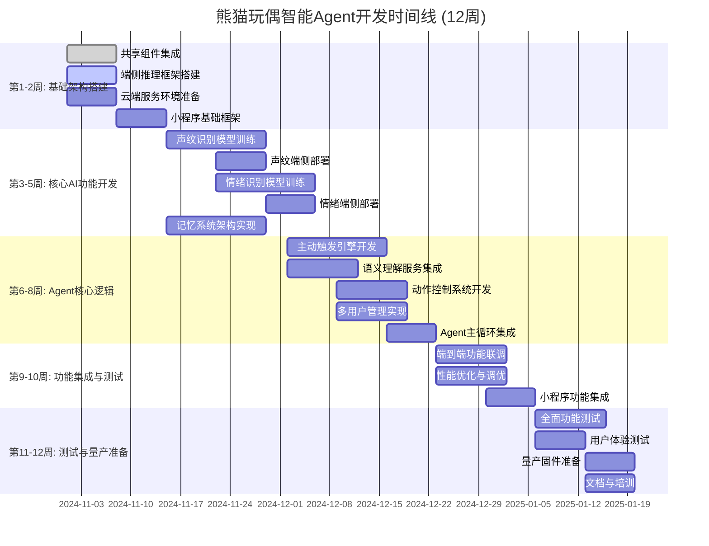
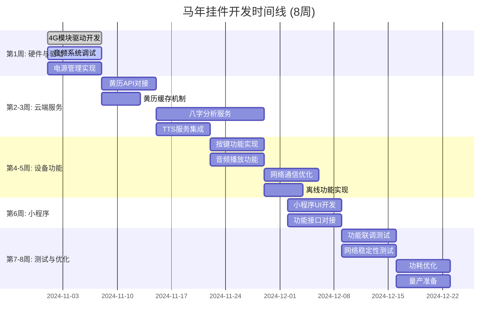
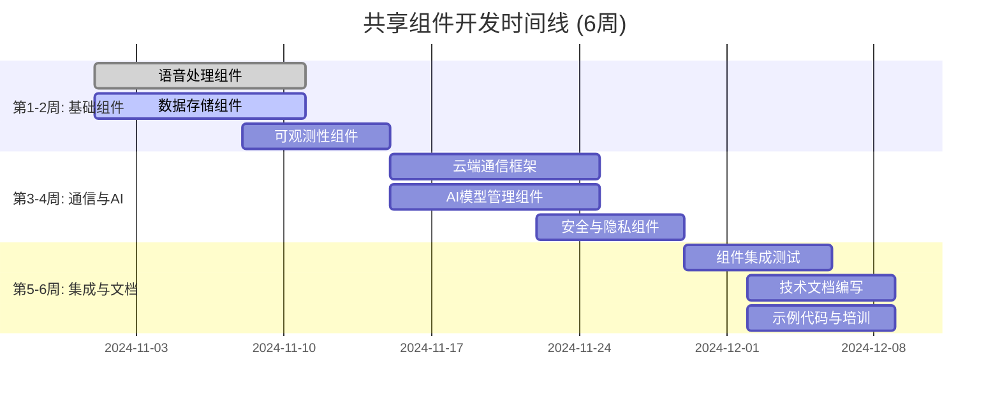

# 熊猫玩偶 & 马年挂件 开发工作量与团队配置评估

## 📊 工作量汇总分析

### 1.1 功能点统计总览

| 项目 | 功能点数 | 总工作量(人天) | P0工作量(人天) | P1工作量(人天) | P2工作量(人天) |
|------|----------|----------------|----------------|----------------|----------------|
| **熊猫玩偶智能Agent** | 115 | 600 | 360 (60%) | 180 (30%) | 60 (10%) |
| **马年挂件** | 53 | 161 | 110 (68%) | 40 (25%) | 11 (7%) |
| **共享组件** | 41 | 153 | 100 (65%) | 40 (26%) | 13 (9%) |
| **合计** | **209** | **914** | **570** | **260** | **84** |

### 1.2 工作量分布分析

#### 熊猫玩偶工作量分布
```
声纹识别: 101人天 (16.8%)
情绪识别: 107人天 (17.8%)
主动触发: 102人天 (17.0%)
记忆系统: 127人天 (21.2%) ⭐最大模块
语义理解: 93人天 (15.5%)
动作控制: 47人天 (7.8%)
多用户管理: 45人天 (7.5%)
小程序: 42人天 (7.0%)
系统优化: 50人天 (8.3%)
```

#### 马年挂件工作量分布
```
黄历服务: 27人天 (16.7%)
八字分析: 42人天 (26.0%) ⭐最大模块
语音合成: 25人天 (15.5%)
4G通信: 31人天 (19.3%)
设备端功能: 31人天 (19.3%)
小程序: 32人天 (19.9%)
```

#### 技术难度分布
| 难度等级 | 熊猫玩偶 | 马年挂件 | 共享组件 | 合计 |
|----------|----------|----------|----------|------|
| **高** | 35个功能点 (30%) | 8个功能点 (15%) | 12个功能点 (29%) | 55个功能点 (26%) |
| **中** | 58个功能点 (50%) | 32个功能点 (60%) | 23个功能点 (56%) | 113个功能点 (54%) |
| **低** | 22个功能点 (20%) | 13个功能点 (25%) | 6个功能点 (15%) | 41个功能点 (20%) |

---

## 👥 团队配置方案

### 2.1 熊猫玩偶智能Agent团队配置 (6-8人)

```
团队结构:
├── AI算法组 (2人) ⭐核心
│   ├── AI算法工程师 #1 (资深)
│   │   ├── 负责: 声纹识别模型优化、情绪识别算法
│   │   ├── 技术: TensorFlow Lite, 模型量化, 知识蒸馏
│   │   └── 工作量: 100人天
│   │
│   └── AI算法工程师 #2 (中级)
│       ├── 负责: 主动触发算法、记忆检索优化
│       ├── 技术: NLP, 向量检索, 推荐算法
│       └── 工作量: 80人天
│
├── 嵌入式AI组 (2人) ⭐核心
│   ├── 嵌入式AI工程师 #1 (资深)
│   │   ├── 负责: 端侧推理框架、模型部署、性能优化
│   │   ├── 技术: FreeRTOS, ESP32, TFLite Micro
│   │   └── 工作量: 90人天
│   │
│   └── 嵌入式AI工程师 #2 (中级)
│       ├── 负责: 硬件接口适配、动作控制、功耗管理
│       ├── 技术: C/C++, 驱动开发, 电源管理
│       └── 工作量: 70人天
│
├── 云端后端组 (1-2人)
│   ├── 后端工程师 #1 (全栈)
│   │   ├── 负责: 大模型服务集成、记忆同步服务、API开发
│   │   ├── 技术: Python, FastAPI, Redis, Qdrant
│   │   └── 工作量: 60人天
│   │
│   └── 后端工程师 #2 (可选, 中级)
│       ├── 负责: 数据存储、性能优化、监控告警
│       ├── 技术: PostgreSQL, InfluxDB, Prometheus
│       └── 工作量: 40人天
│
├── 小程序前端组 (1人)
│   └── 前端工程师 (中级)
│       ├── 负责: 声纹注册界面、记忆管理、个性化配置
│       ├── 技术: 微信小程序, JavaScript, WXML
│       └── 工作量: 42人天
│
└── 测试与QA组 (1人)
    └── 测试工程师 (中级)
        ├── 负责: AI算法测试、端到端测试、用户体验测试
        ├── 技术: Python测试框架, 性能测试工具
        └── 工作量: 50人天
```

**团队配置要点**:
- **核心力量**: AI算法组 + 嵌入式AI组 (4人，占团队50%)
- **技术栈**: 端侧AI推理、大模型集成、嵌入式系统
- **协作模式**: AI算法组提供模型，嵌入式组负责部署优化

### 2.2 马年挂件团队配置 (4-5人)

```
团队结构:
├── 嵌入式开发组 (2人) ⭐核心
│   ├── 嵌入式工程师 #1 (资深)
│   │   ├── 负责: 4G模块驱动、网络协议、功耗优化
│   │   ├── 技术: FreeRTOS, 4G通信, MQTT
│   │   └── 工作量: 45人天
│   │
│   └── 嵌入式工程师 #2 (中级)
│       ├── 负责: 音频系统、设备功能、电源管理
│       ├── 技术: 音频编解码, I2S, 充电管理
│       └── 工作量: 35人天
│
├── 云端服务组 (1-2人)
│   ├── 后端工程师 #1 (全栈)
│   │   ├── 负责: 黄历API、八字分析服务、TTS集成
│   │   ├── 技术: Python, FastAPI, 大模型API
│   │   └── 工作量: 40人天
│   │
│   └── 后端工程师 #2 (可选, 初级)
│       ├── 负责: 数据缓存、日志管理、简单接口
│       ├── 技术: Redis, MySQL
│       └── 工作量: 20人天
│
└── 小程序前端组 (1人)
    └── 前端工程师 (中级)
        ├── 负责: 八字输入、内容查看、设备管理
        ├── 技术: 微信小程序, JavaScript
        └── 工作量: 32人天
```

**团队配置要点**:
- **核心能力**: 嵌入式4G开发、云端服务集成
- **技术栈**: 4G通信、音频处理、大模型API调用
- **协作模式**: 嵌入式组负责设备端，云端组负责服务集成

### 2.3 共享组件开发团队 (2-3人)

```
团队结构:
├── 基础架构组 (2人)
│   ├── 架构工程师 #1 (资深)
│   │   ├── 负责: 语音处理组件、AI模型管理、数据存储
│   │   ├── 技术: Python, C++, 模型优化
│   │   └── 工作量: 60人天
│   │
│   └── 架构工程师 #2 (中级)
│       ├── 负责: 云端通信、可观测性、安全组件
│       ├── 技术: MQTT, TLS, Prometheus
│       └── 工作量: 50人天
│
└── 技术支持 (1人, 兼职)
    └── 负责: 文档编写、示例代码、技术支持
        └── 工作量: 20人天
```

**协作模式**:
- 为两个项目提供基础组件支持
- 负责组件的抽象设计和接口标准化
- 提供技术文档和集成指导

---

## 📅 开发时间线规划

### 3.1 熊猫玩偶智能Agent开发时间线 (12周)



**关键里程碑**:
- **M1 (第3周末)**: 声纹识别基础功能完成
- **M2 (第5周末)**: 情绪识别基础功能完成
- **M3 (第8周末)**: Agent核心逻辑集成完成
- **M4 (第10周末)**: 端到端功能联调完成
- **M5 (第12周末)**: 量产版本发布

### 3.2 马年挂件开发时间线 (8周)



**关键里程碑**:
- **M1 (第2周末)**: 4G通信基础功能完成
- **M2 (第4周末)**: 云端服务集成完成
- **M3 (第6周末)**: 小程序功能完成
- **M4 (第8周末)**: 量产版本发布

### 3.3 共享组件开发时间线 (并行，6周)



---

## 💰 成本与资源估算

### 4.1 人力成本估算 (按月)

| 角色 | 人数 | 月薪(元) | 熊猫项目(月) | 马年项目(月) | 成本(元) |
|------|------|----------|--------------|--------------|----------|
| AI算法工程师(资深) | 1 | 35,000 | 3 | - | 105,000 |
| AI算法工程师(中级) | 1 | 25,000 | 3 | - | 75,000 |
| 嵌入式AI工程师(资深) | 1 | 30,000 | 3 | - | 90,000 |
| 嵌入式AI工程师(中级) | 1 | 22,000 | 3 | - | 66,000 |
| 后端工程师(全栈) | 1 | 28,000 | 3 | 2 | 84,000 |
| 后端工程师(中级) | 1 | 20,000 | 2 | - | 40,000 |
| 后端工程师(初级) | 1 | 15,000 | - | 2 | 30,000 |
| 嵌入式工程师(资深) | 1 | 25,000 | - | 2 | 50,000 |
| 嵌入式工程师(中级) | 1 | 18,000 | - | 2 | 36,000 |
| 前端工程师(中级) | 2 | 20,000 | 3 | 2 | 100,000 |
| 测试工程师(中级) | 1 | 18,000 | 3 | 2 | 54,000 |
| 架构工程师(资深) | 1 | 30,000 | 2 | - | 60,000 |
| 架构工程师(中级) | 1 | 22,000 | 2 | - | 44,000 |
| **合计** | **14** | - | - | - | **834,000** |

**注**: 部分人员在不同项目间共享，实际峰值团队规模为8-10人

### 4.2 其他成本估算

| 成本项 | 金额(元) | 说明 |
|--------|----------|------|
| 云服务费用 | 50,000 | 大模型API、数据库、存储等 (3个月) |
| 测试设备 | 30,000 | 开发板、测试仪器、样机等 |
| 第三方服务 | 20,000 | TTS API、黄历API等 |
| 开发工具 | 10,000 | IDE、调试工具、软件授权等 |
| 办公费用 | 15,000 | 3个月办公成本分摊 |
| **合计** | **125,000** | |

### 4.3 总成本估算

| 项目 | 金额(元) | 占比 |
|------|----------|------|
| 人力成本 | 834,000 | 87.0% |
| 其他成本 | 125,000 | 13.0% |
| **总成本** | **959,000** | **100%** |

**注**: 此为3个月开发周期的总成本估算，不含硬件成本和后续运维成本

---

## ⚠️ 风险评估与应对

### 5.1 技术风险

| 风险描述 | 概率 | 影响 | 应对措施 | 责任人 |
|----------|------|------|----------|--------|
| 端侧模型精度不足 | 中 | 高 | 1. 增加训练数据<br>2. 模型蒸馏优化<br>3. 云端fallback | AI算法组 |
| 声纹识别准确率低 | 中 | 高 | 1. 优化特征提取<br>2. 调整匹配阈值<br>3. 多样本注册 | AI算法组 |
| 主动触发过于频繁 | 中 | 中 | 1. 调整频率参数<br>2. 用户反馈学习<br>3. A/B测试优化 | AI算法组 |
| 4G网络不稳定 | 中 | 高 | 1. 增加重试机制<br>2. 离线功能增强<br>3. 多运营商支持 | 嵌入式组 |
| 大模型API延迟高 | 低 | 高 | 1. 本地缓存<br>2. 降级策略<br>3. 备用模型 | 后端组 |
| 内存占用超标 | 中 | 中 | 1. 模型量化<br>2. 内存优化<br>3. 分层存储 | 嵌入式组 |

### 5.2 项目风险

| 风险描述 | 概率 | 影响 | 应对措施 | 责任人 |
|----------|------|------|----------|--------|
| 开发周期紧张 | 高 | 高 | 1. 并行开发<br>2. MVP优先<br>3. 加班赶工 | 项目经理 |
| 人员流动 | 中 | 中 | 1. 代码规范<br>2. 文档完善<br>3. 知识分享 | 技术负责人 |
| 需求变更 | 中 | 中 | 1. 敏捷开发<br>2. 快速迭代<br>3. 变更控制 | 产品经理 |
| 硬件兼容性问题 | 低 | 高 | 1. 提前验证<br>2. 备选方案<br>3. 厂商支持 | 嵌入式组 |

---

## 🎯 成功标准

### 6.1 技术指标

| 指标 | 目标值 | 验证方法 |
|------|--------|----------|
| 声纹识别准确率 | >90% | 1000+样本测试 |
| 情绪识别准确率 | >80% | 500+样本测试 |
| 响应延迟 (端侧) | <200ms | 性能测试工具 |
| 响应延迟 (云端) | <2s | 端到端测试 |
| 主动触发满意度 | >70% | 用户调研 |
| 4G连接成功率 | >95% | 网络测试 |
| 电池续航 (熊猫) | >7天 | 功耗测试 |
| 电池续航 (马年) | >5天 | 功耗测试 |

### 6.2 产品指标

| 指标 | 目标值 | 验证方法 |
|------|--------|----------|
| 首次配网成功率 | >90% | 用户测试 |
| 日活跃用户比例 | >60% | 数据分析 |
| 用户满意度 | >4.2/5.0 | 问卷调查 |
| NPS推荐值 | >40 | 用户调研 |
| 功能完整度 | 100% P0 | 功能测试 |

---

## 📋 版本记录

| 版本 | 日期 | 编制人 | 主要变更 |
|------|------|--------|----------|
| v1.0 | 2024-11-12 | 技术架构团队 | 初始版本，完整工作量评估与团队配置 |