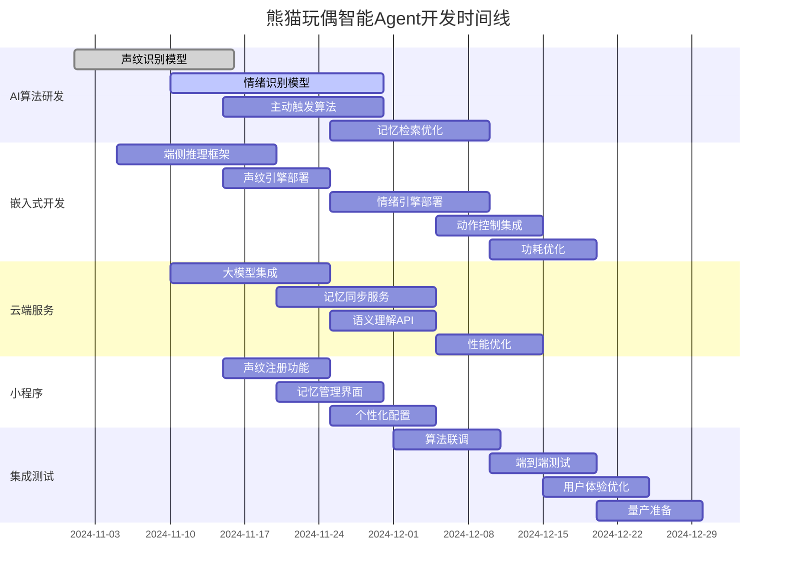

# 熊猫玩偶智能Agent软件架构设计

## 一、需求澄清与核心定位

### 1.1 项目现状
- **硬件状态**: 已完成开发，硬件方案固定不可更改
- **硬件配置**: 
  - 触摸传感器（头部/背部/腹部）
  - 红外传感器（鼻子，60cm检测）
  - 加速度传感器
  - 定位模块
  - MC芯片（NFC碰一碰）
  - 麦克风 + 扬声器
  - WiFi/BLE连接

### 1.2 软件服务需求
- **核心定位**: 内置智能Agent，提供高附加值软件服务
- **关键功能**:
  - ✅ 声纹识别 → 确定主人身份
  - ✅ 情绪识别 → 理解用户情绪状态
  - ✅ 语义判断 → 理解话语意图
  - ✅ 记忆能力 → 记住对话人和互动历史
  - ✅ 主动触发 → 基于关键词主动发起互动
  - ✅ 动作反馈 → 控制玩具动作（点头、叫声等）

### 1.3 技术挑战
- **回复时机**: 网络延迟 vs 实时响应需求
- **记忆管理**: 多用户记忆隔离与长期记忆存储
- **主动触发**: 如何平衡主动性与打扰度
- **端侧资源**: MCU算力有限，需要边缘-云端协同

## 二、智能Agent整体架构

```
┌─────────────────────────────────────────────────────────────┐
│                  应用层 (Application Layer)                  │
│  ┌──────────┐  ┌──────────┐  ┌──────────┐  ┌──────────┐  │
│  │ 互动管理 │  │ 记忆管理 │  │ 个性进化 │  │ 动作控制 │  │
│  │ 服务     │  │ 服务     │  │ 服务     │  │ 服务     │  │
│  └────┬─────┘  └────┬─────┘  └────┬─────┘  └────┬─────┘  │
│       │             │             │             │          │
└───────┼─────────────┼─────────────┼─────────────┼──────────┘
        │             │             │             │
┌───────▼─────────────▼─────────────▼─────────────▼──────────┐
│              Agent核心层 (Agent Core Layer)                 │
│  ┌──────────────────────────────────────────────────────┐  │
│  │  意图识别  │  情绪识别  │  声纹验证  │  主动触发  │  │
│  │  引擎      │  引擎      │  引擎      │  引擎      │  │
│  └────┬───────┴────┬───────┴────┬───────┴────┬─────────┘  │
│       │            │            │            │             │
│  ┌────▼────────────▼────────────▼────────────▼─────────┐  │
│  │          上下文管理器 (Context Manager)             │  │
│  │  - 当前对话状态  - 历史互动记忆  - 环境感知数据    │  │
│  └──────────────────────────────────────────────────────┘  │
└─────────────────────────────────────────────────────────────┘
        │            │            │            │
┌───────▼────────────▼────────────▼────────────▼──────────┐
│              适配器层 (Adapter Layer)                       │
│  ┌──────────┐  ┌──────────┐  ┌──────────┐  ┌──────────┐  │
│  │ 云端大   │  │ 端侧推理 │  │ 传感器   │  │ 动作执行 │  │
│  │ 模型适配 │  │ 引擎适配 │  │ 数据适配 │  │ 驱动适配 │  │
│  │ 器       │  │ 器       │  │ 器       │  │ 器       │  │
│  └────┬─────┘  └────┬─────┘  └────┬─────┘  └────┬─────┘  │
│       │             │             │             │          │
└───────┼─────────────┼─────────────┼─────────────┼──────────┘
        │             │             │             │
┌───────▼─────────────▼─────────────▼─────────────▼──────────┐
│              基础设施层 (Infrastructure)                    │
│  ┌──────────┐  ┌──────────┐  ┌──────────┐  ┌──────────┐  │
│  │ 通信协议 │  │ 数据存储 │  │ 任务调度 │  │ 电源管理 │  │
│  │ (MQTT)   │  │ (本地+云)│  │ (FreeRTOS)│  │ (低功耗) │  │
│  └──────────┘  └──────────┘  └──────────┘  └──────────┘  │
└─────────────────────────────────────────────────────────────┘
```

## 三、核心组件详解

### 3.1 声纹识别引擎

```python
class VoiceprintEngine:
    """
    声纹识别引擎 - 识别主人身份
    """
    
    def __init__(self):
        # 端侧轻量级模型 (约500KB)
        self.feature_extractor = LiteVoicePrintModel(
            model_path="models/voiceprint_lite.tflite"
        )
        
        # 声纹特征数据库 (存储在本地Flash)
        self.voiceprint_db = VoiceprintDatabase(
            storage="local_flash",
            max_users=10  # 最多支持10个用户
        )
        
        # 匹配阈值
        self.threshold = 0.75
        
        # 缓存最近识别结果
        self.recent_cache = LRUCache(max_size=100)
    
    def extract_features(self, audio_chunk):
        """
        提取声纹特征 (端侧实时)
        """
        # 1. 预处理
        processed_audio = self.preprocess_audio(audio_chunk)
        
        # 2. 特征提取 (使用轻量级模型)
        features = self.feature_extractor.predict(processed_audio)
        
        # 3. 特征压缩 (256维 -> 128维)
        compressed_features = self.compress_features(features)
        
        return compressed_features
    
    def verify_identity(self, audio_chunk, device_id):
        """
        验证身份 - 实时识别
        """
        # 1. 提取特征
        features = self.extract_features(audio_chunk)
        
        # 2. 查询已注册用户
        registered_users = self.voiceprint_db.get_users(device_id)
        
        if not registered_users:
            return {
                "verified": False,
                "user_id": None,
                "confidence": 0,
                "message": "no_registered_users"
            }
        
        # 3. 匹配识别
        best_match = None
        best_score = 0
        
        for user_id, user_template in registered_users.items():
            # 计算相似度
            similarity = self.calculate_similarity(features, user_template)
            
            if similarity > best_score:
                best_score = similarity
                best_match = user_id
        
        # 4. 判断结果
        if best_score >= self.threshold:
            # 缓存结果
            self.recent_cache.set(
                f"{device_id}:{hash(features)}",
                {"user_id": best_match, "confidence": best_score}
            )
            
            return {
                "verified": True,
                "user_id": best_match,
                "confidence": best_score,
                "message": "identity_verified"
            }
        else:
            return {
                "verified": False,
                "user_id": None,
                "confidence": best_score,
                "message": "unknown_user"
            }
    
    def enroll_user(self, device_id, user_id, audio_samples):
        """
        注册新用户 - 通过小程序完成
        """
        # 1. 收集多个样本 (建议5-10个)
        features_list = []
        for audio in audio_samples:
            features = self.extract_features(audio)
            features_list.append(features)
        
        # 2. 计算平均模板
        template = np.mean(features_list, axis=0)
        
        # 3. 计算质量分数
        quality_score = self.calculate_quality(features_list)
        
        if quality_score < 0.6:
            return {
                "success": False,
                "message": "audio_quality_too_low",
                "quality_score": quality_score
            }
        
        # 4. 存储模板
        self.voiceprint_db.save_template(
            device_id=device_id,
            user_id=user_id,
            template=template,
            quality_score=quality_score
        )
        
        return {
            "success": True,
            "message": "enrollment_successful",
            "quality_score": quality_score,
            "template_size": len(template)
        }
    
    def calculate_similarity(self, features1, features2):
        """
        计算声纹相似度 (余弦相似度)
        """
        return cosine_similarity(
            features1.reshape(1, -1),
            features2.reshape(1, -1)
        )[0][0]
```

### 3.2 情绪识别引擎

```python
class EmotionRecognitionEngine:
    """
    情绪识别引擎 - 理解用户情绪状态
    """
    
    def __init__(self):
        # 多模态情绪识别
        self.models = {
            "voice": VoiceEmotionModel(
                model_path="models/voice_emotion.tflite"  # 300KB
            ),
            "text": TextEmotionModel(
                model_path="models/text_emotion.tflite"   # 200KB
            ),
            "fusion": EmotionFusionModel()
        }
        
        # 情绪状态定义
        self.emotion_states = {
            "happy": {"valence": 0.8, "arousal": 0.6},
            "sad": {"valence": -0.8, "arousal": -0.3},
            "angry": {"valence": -0.6, "arousal": 0.9},
            "surprised": {"valence": 0.3, "arousal": 0.8},
            "neutral": {"valence": 0, "arousal": 0},
            "tired": {"valence": -0.4, "arousal": -0.6},
            "excited": {"valence": 0.7, "arousal": 0.9}
        }
    
    def recognize_emotion(self, audio_chunk, text_transcript):
        """
        多模态情绪识别
        """
        # 1. 语音情绪识别 (端侧)
        voice_emotion = self.models["voice"].predict(audio_chunk)
        
        # 2. 文本情绪识别 (云端或端侧)
        if len(text_transcript) > 0:
            text_emotion = self.models["text"].predict(text_transcript)
        else:
            text_emotion = None
        
        # 3. 情绪融合
        if text_emotion:
            fused_emotion = self.models["fusion"].fuse(
                voice_emotion, text_emotion
            )
        else:
            fused_emotion = voice_emotion
        
        # 4. 情绪状态映射
        emotion_state = self.map_to_emotion_state(fused_emotion)
        
        # 5. 置信度评估
        confidence = self.calculate_confidence(fused_emotion)
        
        return {
            "emotion": emotion_state,
            "confidence": confidence,
            "raw_scores": fused_emotion,
            "timestamp": time.time()
        }
    
    def map_to_action_feedback(self, emotion_state, confidence):
        """
        将情绪映射为动作反馈
        """
        if confidence < 0.6:
            return {"action": "none", "reason": "low_confidence"}
        
        action_map = {
            "happy": {
                "action": "nod_and_laugh",
                "duration": 2.0,
                "intensity": "medium",
                "sound": "happy_chirp"
            },
            "sad": {
                "action": "gentle_nod",
                "duration": 3.0,
                "intensity": "soft",
                "sound": "comforting_sound"
            },
            "angry": {
                "action": "calm_presence",
                "duration": 2.0,
                "intensity": "low",
                "sound": "soothing_tone"
            },
            "excited": {
                "action": "excited_movement",
                "duration": 4.0,
                "intensity": "high",
                "sound": "excited_chirp"
            },
            "tired": {
                "action": "gentle_sway",
                "duration": 3.0,
                "intensity": "soft",
                "sound": "soft_hum"
            }
        }
        
        return action_map.get(emotion_state, {"action": "neutral_nod"})
```

### 3.3 主动触发引擎

```python
class ProactiveTriggerEngine:
    """
    主动触发引擎 - 基于关键词和上下文主动发起互动
    """
    
    def __init__(self):
        # 触发规则库
        self.trigger_rules = {
            "greeting": {
                "keywords": ["你好", "嗨", "hello", "在吗"],
                "response": "friendly_greeting",
                "cooldown": 300  // 5分钟内不重复触发
            },
            "mood_check": {
                "keywords": ["累", "困", "烦", "不开心"],
                "response": "mood_support",
                "cooldown": 600
            },
            "encouragement": {
                "keywords": ["加油", "努力", "坚持"],
                "response": "encouragement",
                "cooldown": 300
            },
            "celebration": {
                "keywords": ["成功", "开心", "棒", "厉害"],
                "response": "celebration",
                "cooldown": 300
            },
            "loneliness": {
                "keywords": ["无聊", "孤单", "没人陪"],
                "response": "companionship",
                "cooldown": 900
            }
        }
        
        # 上下文记忆
        self.context_memory = ContextMemory()
        
        # 触发历史
        self.trigger_history = {}
    
    def analyze_conversation(self, device_id, user_id, text, emotion):
        """
        分析对话内容，检测触发点
        """
        triggers = []
        
        # 1. 关键词匹配
        for rule_name, rule in self.trigger_rules.items():
            if self.match_keywords(text, rule["keywords"]):
                # 检查冷却时间
                if self.is_cooldown_expired(device_id, rule_name, rule["cooldown"]):
                    triggers.append({
                        "type": "keyword",
                        "rule": rule_name,
                        "confidence": 0.8
                    })
        
        # 2. 情绪触发
        if emotion["confidence"] > 0.7:
            emotion_trigger = self.check_emotion_trigger(emotion["emotion"])
            if emotion_trigger:
                triggers.append({
                    "type": "emotion",
                    "rule": emotion_trigger,
                    "confidence": emotion["confidence"]
                })
        
        # 3. 上下文触发
        context_trigger = self.check_context_trigger(device_id, user_id, text)
        if context_trigger:
            triggers.append(context_trigger)
        
        # 4. 时间触发
        time_trigger = self.check_time_trigger(device_id)
        if time_trigger:
            triggers.append(time_trigger)
        
        # 5. 选择最高优先级的触发
        if triggers:
            selected_trigger = self.select_best_trigger(triggers)
            self.record_trigger(device_id, user_id, selected_trigger)
            return selected_trigger
        
        return None
    
    def match_keywords(self, text, keywords):
        """
        关键词匹配 - 支持模糊匹配
        """
        for keyword in keywords:
            if keyword in text:
                return True
            
            # 拼音匹配（处理同音字）
            if self.pinyin_match(text, keyword):
                return True
        
        return False
    
    def check_emotion_trigger(self, emotion):
        """
        基于情绪的触发
        """
        emotion_triggers = {
            "sad": "comfort",
            "angry": "calm_down",
            "excited": "share_excitement",
            "tired": "offer_rest"
        }
        
        return emotion_triggers.get(emotion)
    
    def check_context_trigger(self, device_id, user_id, text):
        """
        基于上下文的触发
        """
        # 获取最近对话历史
        recent_history = self.context_memory.get_recent_interactions(
            device_id, user_id, limit=10
        )
        
        # 检测重复话题
        topic = self.extract_topic(text)
        topic_frequency = self.count_topic_frequency(recent_history, topic)
        
        # 如果某个话题被频繁提及，主动深入
        if topic_frequency >= 3:
            return {
                "type": "context",
                "rule": "topic_followup",
                "topic": topic,
                "confidence": 0.7
            }
        
        return None
    
    def check_time_trigger(self, device_id):
        """
        基于时间的触发
        """
        current_time = time.time()
        hour = datetime.fromtimestamp(current_time).hour
        
        # 早安问候 (7-9点)
        if 7 <= hour < 9:
            if self.is_first_interaction_today(device_id):
                return {
                    "type": "time",
                    "rule": "morning_greeting",
                    "confidence": 0.9
                }
        
        # 晚安问候 (21-23点)
        if 21 <= hour < 23:
            if self.is_recently_active(device_id):
                return {
                    "type": "time",
                    "rule": "night_greeting",
                    "confidence": 0.8
                }
        
        return None
    
    def generate_proactive_response(self, trigger, context):
        """
        生成主动响应
        """
        response_templates = {
            "friendly_greeting": [
                "你好呀！今天过得怎么样？",
                "嗨！很高兴又见到你！",
                "你好！我在这儿陪着你哦～"
            ],
            "mood_support": [
                "听起来你有点累呢，要不要休息一下？",
                "别担心，一切都会好起来的，我在这里陪着你。",
                "累了就跟我说说话吧，我会一直陪着你的。"
            ],
            "encouragement": [
                "加油！我相信你一定可以的！",
                "你的努力我都看在眼里，继续坚持下去！",
                "每一次努力都值得被肯定，你真的很棒！"
            ],
            "comfort": [
                "别难过，我在这里陪着你呢。",
                "想哭就哭吧，哭完了会好受一些。",
                "没关系，不好的事情总会过去的。"
            ]
        }
        
        template = random.choice(response_templates[trigger["rule"]])
        
        # 个性化调整
        personalized = self.personalize_response(
            template, 
            context["user_profile"],
            context["personality"]
        )
        
        return {
            "text": personalized,
            "trigger_type": trigger["type"],
            "trigger_rule": trigger["rule"],
            "actions": self.get_actions_for_trigger(trigger["rule"])
        }
```

### 3.4 记忆系统

```python
class AgentMemorySystem:
    """
    Agent记忆系统 - 记住对话人和互动历史
    """
    
    def __init__(self):
        # 记忆分层
        self.memory_layers = {
            "sensory": SensoryMemory(),      # 感觉记忆 (秒级)
            "short_term": ShortTermMemory(), # 短期记忆 (分钟-小时级)
            "long_term": LongTermMemory(),   # 长期记忆 (天-月级)
            "episodic": EpisodicMemory()     # 情景记忆 (事件级)
        }
        
        # 记忆存储后端
        self.storage_backends = {
            "local": LocalStorage(),         # 本地Flash存储
            "cloud": CloudStorage(),         # 云端存储
            "vector": VectorDatabase()       # 向量数据库存储
        }
        
        # 记忆检索引擎
        self.retrieval_engine = MemoryRetrievalEngine()
    
    def store_interaction(self, device_id, user_id, interaction_data):
        """
        存储互动记忆
        """
        timestamp = time.time()
        
        # 1. 感觉记忆 (原始数据)
        sensory_record = {
            "device_id": device_id,
            "user_id": user_id,
            "timestamp": timestamp,
            "audio_raw": interaction_data["audio_raw"],
            "audio_features": interaction_data["audio_features"],
            "transcript": interaction_data["transcript"],
            "emotion": interaction_data["emotion"],
            "intent": interaction_data["intent"]
        }
        self.memory_layers["sensory"].store(sensory_record, ttl=60)
        
        # 2. 短期记忆 (最近对话)
        short_term_record = {
            "device_id": device_id,
            "user_id": user_id,
            "timestamp": timestamp,
            "transcript": interaction_data["transcript"],
            "emotion": interaction_data["emotion"]["emotion"],
            "intent": interaction_data["intent"],
            "response": interaction_data["response"],
            "actions": interaction_data["actions"]
        }
        self.memory_layers["short_term"].store(short_term_record, ttl=3600)
        
        # 3. 长期记忆 (重要信息)
        if interaction_data["importance_score"] > 0.7:
            long_term_record = {
                "device_id": device_id,
                "user_id": user_id,
                "timestamp": timestamp,
                "key_moments": self.extract_key_moments(interaction_data),
                "user_preferences": self.extract_preferences(interaction_data),
                "emotional_highlights": self.extract_emotional_highlights(interaction_data)
            }
            self.memory_layers["long_term"].store(long_term_record)
            
            # 同步到云端
            self.storage_backends["cloud"].upload(
                f"memories/{device_id}/{user_id}/{timestamp}",
                long_term_record
            )
        
        # 4. 情景记忆 (完整事件)
        episodic_record = {
            "event_id": f"{device_id}_{user_id}_{timestamp}",
            "device_id": device_id,
            "user_id": user_id,
            "timestamp": timestamp,
            "duration": interaction_data["duration"],
            "participants": [user_id],
            "location": interaction_data.get("location"),
            "context": {
                "time_of_day": self.get_time_of_day(timestamp),
                "day_of_week": self.get_day_of_week(timestamp),
                "environment": interaction_data.get("environment", {})
            },
            "event_sequence": [
                {
                    "time_offset": 0,
                    "action": "user_speak",
                    "content": interaction_data["transcript"],
                    "emotion": interaction_data["emotion"]
                },
                {
                    "time_offset": interaction_data["response_delay"],
                    "action": "agent_respond",
                    "content": interaction_data["response"],
                    "actions": interaction_data["actions"]
                }
            ],
            "emotional_arc": self.calculate_emotional_arc(interaction_data),
            "summary": self.generate_summary(interaction_data)
        }
        self.memory_layers["episodic"].store(episodic_record)
        
        # 5. 向量存储 (用于语义检索)
        vector_record = {
            "vector": interaction_data["semantic_vector"],
            "metadata": {
                "device_id": device_id,
                "user_id": user_id,
                "timestamp": timestamp,
                "emotion": interaction_data["emotion"]["emotion"],
                "intent": interaction_data["intent"]
            }
        }
        self.storage_backends["vector"].insert(
            collection="interactions",
            point=vector_record
        )
    
    def retrieve_relevant_memories(self, device_id, user_id, current_context):
        """
        检索相关记忆
        """
        # 1. 短期记忆检索 (最近对话)
        recent_interactions = self.memory_layers["short_term"].retrieve(
            device_id=device_id,
            user_id=user_id,
            limit=10
        )
        
        # 2. 相关记忆检索 (基于语义相似度)
        similar_memories = self.storage_backends["vector"].search(
            collection="interactions",
            query_vector=current_context["semantic_vector"],
            filter={
                "device_id": device_id,
                "user_id": user_id
            },
            limit=5
        )
        
        # 3. 重要记忆检索 (高重要性评分)
        important_memories = self.memory_layers["long_term"].retrieve_important(
            device_id=device_id,
            user_id=user_id,
            limit=3
        )
        
        # 4. 记忆融合与排序
        all_memories = self.fuse_memories(
            recent_interactions,
            similar_memories,
            important_memories
        )
        
        return self.rank_by_relevance(all_memories, current_context)
```

## 四、动作控制与反馈系统

### 4.1 动作控制引擎

```python
class ActionControlEngine:
    """
    动作控制引擎 - 控制玩具物理动作
    """
    
    def __init__(self):
        # 动作库
        self.action_library = {
            # 头部动作
            "nod": {
                "motor": "head_motor",
                "pattern": "single_nod",
                "duration": 1.0,
                "intensity_levels": ["soft", "medium", "strong"]
            },
            "shake_head": {
                "motor": "head_motor",
                "pattern": "shake_side_to_side",
                "duration": 1.5,
                "intensity_levels": ["soft", "medium"]
            },
            
            # 身体动作
            "wiggle": {
                "motor": "body_motor",
                "pattern": "gentle_wiggle",
                "duration": 2.0,
                "intensity_levels": ["soft", "medium", "strong"]
            },
            "dance": {
                "motor": "body_motor",
                "pattern": "rhythmic_movement",
                "duration": 3.0,
                "intensity_levels": ["medium", "strong"]
            },
            
            # 声音反馈
            "happy_chirp": {
                "type": "sound",
                "file": "sounds/happy_chirp.wav",
                "duration": 0.8,
                "volume_range": [0.6, 1.0]
            },
            "comforting_sound": {
                "type": "sound",
                "file": "sounds/comforting.wav",
                "duration": 1.5,
                "volume_range": [0.4, 0.7]
            },
            "excited_chirp": {
                "type": "sound",
                "file": "sounds/excited.wav",
                "duration": 1.2,
                "volume_range": [0.8, 1.0]
            }
        }
        
        # 动作组合模板
        self.action_compositions = {
            "friendly_greeting": [
                {"action": "nod", "intensity": "medium", "delay": 0},
                {"action": "happy_chirp", "volume": 0.8, "delay": 0.2}
            ],
            "excited_movement": [
                {"action": "wiggle", "intensity": "strong", "delay": 0},
                {"action": "excited_chirp", "volume": 1.0, "delay": 0.3},
                {"action": "nod", "intensity": "strong", "delay": 1.0}
            ],
            "gentle_comfort": [
                {"action": "wiggle", "intensity": "soft", "delay": 0},
                {"action": "comforting_sound", "volume": 0.5, "delay": 0.5}
            ]
        }
        
        # 硬件接口
        self.motor_controller = MotorController()
        self.audio_player = AudioPlayer()
    
    def execute_action(self, action_command):
        """
        执行动作命令
        """
        action_type = action_command["type"]
        
        if action_type == "single":
            # 单个动作
            return self.execute_single_action(action_command)
        
        elif action_type == "composition":
            # 动作组合
            return self.execute_action_composition(action_command)
        
        elif action_type == "sequence":
            # 动作序列
            return self.execute_action_sequence(action_command)
        
        else:
            logger.error(f"Unknown action type: {action_type}")
            return {"success": False, "error": "unknown_action_type"}
    
    def execute_single_action(self, action_command):
        """
        执行单个动作
        """
        action_name = action_command["name"]
        action_def = self.action_library.get(action_name)
        
        if not action_def:
            return {"success": False, "error": "action_not_found"}
        
        try:
            if action_def.get("motor"):
                # 执行电机动作
                self.motor_controller.execute(
                    motor=action_def["motor"],
                    pattern=action_def["pattern"],
                    duration=action_command.get("duration", action_def["duration"]),
                    intensity=action_command.get("intensity", "medium")
                )
            
            elif action_def.get("type") == "sound":
                # 播放声音
                self.audio_player.play(
                    file=action_def["file"],
                    volume=action_command.get("volume", 0.8),
                    loop=action_command.get("loop", False)
                )
            
            return {
                "success": True,
                "action": action_name,
                "duration": action_command.get("duration", action_def["duration"])
            }
            
        except Exception as e:
            logger.error(f"Action execution failed: {e}")
            return {"success": False, "error": str(e)}
    
    def execute_action_composition(self, action_command):
        """
        执行动作组合 (并行)
        """
        composition_name = action_command["composition"]
        composition = self.action_compositions.get(composition_name)
        
        if not composition:
            return {"success": False, "error": "composition_not_found"}
        
        results = []
        
        for item in composition:
            # 创建子动作命令
            sub_command = {
                "type": "single",
                "name": item["action"],
                "intensity": item.get("intensity"),
                "volume": item.get("volume"),
                "duration": item.get("duration")
            }
            
            # 延迟执行 (实现并行效果)
            if item.get("delay", 0) > 0:
                time.sleep(item["delay"])
            
            # 执行子动作
            result = self.execute_single_action(sub_command)
            results.append(result)
        
        return {
            "success": all(r["success"] for r in results),
            "composition": composition_name,
            "results": results,
            "total_duration": sum(r.get("duration", 0) for r in results)
        }
```

## 五、云端大模型服务

### 5.1 语义理解服务

```python
class SemanticUnderstandingService:
    """
    语义理解服务 - 深度理解用户意图
    """
    
    def __init__(self):
        # 大模型配置
        self.llm_config = {
            "primary": "qwen-max",           # 通义千问Max (主力)
            "fallback": "glm-4",             # 智谱GLM-4 (备用)
            "timeout": 3.0,
            "max_tokens": 1000
        }
        
        # 提示词模板
        self.prompt_templates = {
            "intent_understanding": """
            你是一位智能玩具的对话理解引擎。请分析以下对话内容：
            
            用户说: "{user_text}"
            用户情绪: {emotion}
            对话历史: {conversation_history}
            用户画像: {user_profile}
            
            请提供以下分析：
            1. 显性意图 (直接表达的需求)
            2. 隐性意图 (潜在的情感需求)
            3. 适合玩具回应的方式
            4. 是否需要动作反馈
            5. 回应的情感基调
            
            以JSON格式回复，包含以下字段：
            - explicit_intent: string
            - implicit_intent: string
            - response_approach: string
            - need_action_feedback: boolean
            - emotional_tone: string (happy/calm/empathetic/enthusiastic)
            - suggested_actions: list[string]
            """,
            
            "proactive_generation": """
            你是一位智能玩具的主动互动引擎。当前上下文：
            
            时间: {time_of_day}
            用户状态: {user_state}
            最近互动: {recent_interactions}
            用户偏好: {user_preferences}
            
            请判断是否适合主动发起互动。如果适合，请生成：
            1. 主动发起的话题
            2. 合适的语气风格
            3. 建议的动作配合
            
            以JSON格式回复：
            - should_proactive: boolean
            - topic: string (如果should_proactive为true)
            - tone: string
            - suggested_actions: list[string]
            - priority: string (high/medium/low)
            """
        }
        
        # 意图分类体系
        self.intent_categories = {
            "greeting": ["打招呼", "问候", "开场白"],
            "emotional_expression": ["情绪表达", "感受分享"],
            "question": ["询问信息", "寻求建议"],
            "play_request": ["玩耍请求", "互动游戏"],
            "goodbye": ["告别", "结束对话"],
            "unclear": ["意图不明", "需要澄清"]
        }
    
    def understand_intent(self, user_text, emotion, context):
        """
        深度语义理解
        """
        # 1. 构建提示词
        prompt = self.prompt_templates["intent_understanding"].format(
            user_text=user_text,
            emotion=emotion["emotion"],
            conversation_history=context.get("recent_history", []),
            user_profile=context.get("user_profile", {})
        )
        
        # 2. 调用大模型
        try:
            response = self.call_llm(prompt, model=self.llm_config["primary"])
            understanding = json.loads(response)
            
        except Exception as e:
            logger.error(f"LLM call failed: {e}, using fallback")
            
            # 备用模型
            response = self.call_llm(prompt, model=self.llm_config["fallback"])
            understanding = json.loads(response)
        
        # 3. 意图分类
        understanding["intent_category"] = self.classify_intent(
            understanding["explicit_intent"],
            understanding["implicit_intent"]
        )
        
        # 4. 计算置信度
        understanding["confidence"] = self.calculate_confidence(
            user_text, emotion, understanding
        )
        
        return understanding
    
    def generate_proactive_interaction(self, context):
        """
        生成主动互动
        """
        # 1. 构建提示词
        prompt = self.prompt_templates["proactive_generation"].format(
            time_of_day=self.get_time_of_day(),
            user_state=context["user_state"],
            recent_interactions=context["recent_interactions"],
            user_preferences=context["user_preferences"]
        )
        
        # 2. 调用大模型
        response = self.call_llm(prompt, model=self.llm_config["primary"])
        proactive_decision = json.loads(response)
        
        # 3. 评估是否真正需要主动触发
        if proactive_decision["should_proactive"]:
            # 检查触发频率
            if self.is_trigger_too_frequent(context["device_id"]):
                proactive_decision["should_proactive"] = False
                proactive_decision["reason"] = "trigger_frequency_limit"
        
        return proactive_decision
```

## 六、共享核心组件识别

### 6.1 与马年挂件共享的组件

```python
# 共享核心组件库
shared_components = {
    # 1. 语音处理组件
    "voice_processing": {
        "components": [
            "AudioPreprocessor",      # 音频预处理
            "FeatureExtractor",       # 特征提取
            "AudioCompressor",        # 音频压缩
            "VoiceActivityDetector"   # 语音活动检测
        ],
        "usage": "both",
        "location": "/shared/voice/"
    },
    
    # 2. 云端服务基础组件
    "cloud_infrastructure": {
        "components": [
            "MQTTClient",            # MQTT客户端
            "HTTPSClient",           # HTTP客户端
            "ConnectionManager",     # 连接管理
            "OfflineCache",          # 离线缓存
            "DataSyncManager"        # 数据同步
        ],
        "usage": "both",
        "location": "/shared/cloud/"
    },
    
    # 3. AI模型管理组件
    "ai_model_management": {
        "components": [
            "ModelDownloader",       # 模型下载
            "ModelQuantizer",        # 模型量化
            "ModelUpdater",          # 模型更新
            "InferenceEngine"        # 推理引擎
        ],
        "usage": "both",
        "location": "/shared/ai/"
    },
    
    # 4. 数据存储组件
    "data_storage": {
        "components": [
            "LocalDatabase",         # 本地数据库
            "KeyValueStore",         # KV存储
            "FileStorage",           # 文件存储
            "CacheManager"           # 缓存管理
        ],
        "usage": "both",
        "location": "/shared/storage/"
    },
    
    # 5. 可观测性组件
    "observability": {
        "components": [
            "Logger",                # 日志记录
            "MetricsCollector",      # 指标收集
            "PerformanceMonitor",    # 性能监控
            "ErrorTracker"           # 错误追踪
        ],
        "usage": "both",
        "location": "/shared/observability/"
    },
    
    # 6. 安全与隐私组件
    "security": {
        "components": [
            "DataEncryptor",         # 数据加密
            "IdentityManager",       # 身份管理
            "PermissionController",  # 权限控制
            "PrivacyProtector"       # 隐私保护
        ],
        "usage": "both",
        "location": "/shared/security/"
    }
}

# 熊猫玩偶特有组件
panda_specific = {
    "components": [
        "VoiceprintEngine",          # 声纹识别
        "EmotionRecognitionEngine",  # 情绪识别
        "ProactiveTriggerEngine",    # 主动触发
        "ActionControlEngine",       # 动作控制
        "PersonalityEvolution",      # 个性进化
        "MultiUserMemoryManager"     # 多用户记忆管理
    ],
    "location": "/modules/panda_agent/"
}

# 马年挂件特有组件
horse_specific = {
    "components": [
        "FortuneService",            # 黄历服务
        "BaziAnalysisService",       # 八字分析
        "TextToSpeechService",       # 语音合成
        "ProactiveTipsEngine"        # 主动提醒
    ],
    "location": "/modules/horse_agent/"
}
```

### 6.2 共享组件架构

```python
# 共享组件架构设计
class SharedComponentArchitecture:
    """
    共享组件架构 - 支持两个项目复用
    """
    
    def __init__(self):
        # 组件注册表
        self.component_registry = ComponentRegistry()
        
        # 加载共享组件
        self.load_shared_components()
        
        # 加载项目特有组件
        self.load_project_specific_components()
    
    def load_shared_components(self):
        """
        加载共享组件
        """
        # 语音处理组件
        self.component_registry.register(
            "audio_preprocessor",
            AudioPreprocessor(),
            category="voice",
            shared=True
        )
        
        self.component_registry.register(
            "feature_extractor",
            FeatureExtractor(),
            category="voice",
            shared=True
        )
        
        # 云端通信组件
        self.component_registry.register(
            "mqtt_client",
            MQTTClient(
                broker="mqtt.internal",
                port=1883,
                keepalive=60
            ),
            category="cloud",
            shared=True
        )
        
        self.component_registry.register(
            "offline_cache",
            OfflineCache(max_size=10*1024*1024),  # 10MB
            category="cloud",
            shared=True
        )
        
        # AI模型管理
        self.component_registry.register(
            "inference_engine",
            InferenceEngine(),
            category="ai",
            shared=True
        )
        
        # 数据存储
        self.component_registry.register(
            "local_db",
            LocalDatabase(path="/data/agent.db"),
            category="storage",
            shared=True
        )
        
        # 可观测性
        self.component_registry.register(
            "logger",
            Logger(level="INFO", output="console"),
            category="observability",
            shared=True
        )
        
        self.component_registry.register(
            "metrics_collector",
            MetricsCollector(endpoint="http://metrics.internal"),
            category="observability",
            shared=True
        )
    
    def load_project_specific_components(self):
        """
        加载项目特有组件
        """
        # 熊猫玩偶特有组件
        self.component_registry.register(
            "voiceprint_engine",
            VoiceprintEngine(),
            category="panda_specific",
            shared=False,
            project="panda"
        )
        
        self.component_registry.register(
            "emotion_engine",
            EmotionRecognitionEngine(),
            category="panda_specific",
            shared=False,
            project="panda"
        )
        
        self.component_registry.register(
            "proactive_engine",
            ProactiveTriggerEngine(),
            category="panda_specific",
            shared=False,
            project="panda"
        )
        
        # 马年挂件特有组件
        self.component_registry.register(
            "fortune_service",
            FortuneService(),
            category="horse_specific",
            shared=False,
            project="horse"
        )
        
        self.component_registry.register(
            "bazi_service",
            BaziAnalysisService(),
            category="horse_specific",
            shared=False,
            project="horse"
        )
    
    def get_component(self, component_name, project=None):
        """
        获取组件实例
        """
        component = self.component_registry.get(component_name)
        
        if not component:
            raise ComponentNotFoundError(f"Component {component_name} not found")
        
        # 检查项目权限
        if not component.shared and component.project != project:
            raise ComponentAccessError(
                f"Component {component_name} is not shared across projects"
            )
        
        return component.instance
```

## 七、开发工作量重新评估

### 7.1 熊猫玩偶Agent开发工作量

| 模块 | 功能点 | 工作量(人天) | 技术难度 |
|------|--------|-------------|----------|
| **声纹识别** | | | |
| | 端侧特征提取模型 | 15 | 高 |
| | 声纹注册流程 | 10 | 中 |
| | 实时验证优化 | 10 | 高 |
| **情绪识别** | | | |
| | 多模态情绪模型 | 20 | 高 |
| | 端侧部署优化 | 15 | 高 |
| | 动作映射逻辑 | 5 | 中 |
| **主动触发** | | | |
| | 触发规则引擎 | 10 | 中 |
| | 上下文分析 | 15 | 高 |
| | 时机判断算法 | 10 | 高 |
| **记忆系统** | | | |
| | 多层级记忆架构 | 20 | 高 |
| | 记忆检索优化 | 15 | 高 |
| | 云端同步机制 | 10 | 中 |
| **语义理解** | | | |
| | 大模型集成 | 15 | 中 |
| | 提示词工程 | 10 | 中 |
| | 意图分类体系 | 5 | 中 |
| **动作控制** | | | |
| | 动作库设计 | 5 | 低 |
| | 硬件接口适配 | 10 | 中 |
| | 动作组合逻辑 | 5 | 中 |
| **系统集成** | | | |
| | Agent主循环 | 10 | 中 |
| | 状态管理 | 10 | 中 |
| | 性能优化 | 15 | 高 |
| **测试验证** | | | |
| | 功能测试 | 10 | 中 |
| | 性能测试 | 10 | 中 |
| | 用户体验测试 | 5 | 中 |
| **总计** | | **200人天** | |

### 7.2 团队配置建议 (调整版)

```
核心团队 (6-8人):
├── AI算法工程师 (2人) ⭐重点
│   ├── 声纹识别优化
│   ├── 情绪识别模型
│   ├── 主动触发算法
│   └── 记忆检索优化
│
├── 嵌入式AI工程师 (2人) ⭐重点
│   ├── 端侧模型部署
│   ├── 推理引擎优化
│   ├── 硬件接口适配
│   └── 功耗管理
│
├── 云端后端工程师 (1-2人)
│   ├── 大模型服务集成
│   ├── 记忆同步服务
│   └── 数据分析
│
├── 小程序前端工程师 (1人)
│   ├── 声纹注册界面
│   ├── 记忆管理界面
│   └── 个性化配置
│
└── 测试工程师 (1人)
    ├── AI算法测试
    ├── 端到端测试
    └── 用户体验测试
```

### 7.3 开发时间线 (调整版)



## 八、关键技术挑战与解决方案

### 8.1 挑战1：端侧实时性 vs 云端智能性

**问题**：声纹识别和情绪识别需要实时响应，但大模型在云端有延迟

**解决方案**：
```python
class EdgeCloudOrchestrator:
    """
    边缘-云端协同编排器
    """
    
    def __init__(self):
        self.latency_threshold = 1.0  # 1秒延迟阈值
        
        # 端侧轻量级模型
        self.edge_models = {
            "voiceprint": LiteVoicePrintModel(),
            "emotion": LiteEmotionModel(),
            "wake_word": WakeWordModel()
        }
        
        # 云端大模型
        self.cloud_models = {
            "semantic": CloudLLM(),
            "personality": CloudPersonalityModel(),
            "memory": CloudMemoryModel()
        }
    
    def process_interaction(self, audio_chunk, context):
        """
        分层处理交互
        """
        start_time = time.time()
        
        # 1. 第一层：端侧实时处理 (必须 < 200ms)
        # 唤醒词检测
        if not self.edge_models["wake_word"].detect(audio_chunk):
            return {"response": "no_wake_word"}
        
        # 声纹快速验证
        voiceprint_features = self.edge_models["voiceprint"].extract(audio_chunk)
        user_id = self.quick_voiceprint_match(voiceprint_features)
        
        # 情绪快速识别
        emotion = self.edge_models["emotion"].predict(audio_chunk)
        
        # 2. 第二层：边缘缓存查询 (必须 < 500ms)
        cached_response = self.check_cache(
            user_id=user_id,
            emotion=emotion,
            context=context
        )
        
        if cached_response:
            # 缓存命中，快速响应
            return {
                "source": "cache",
                "response": cached_response,
                "latency": time.time() - start_time
            }
        
        # 3. 第三层：云端深度处理 (可接受 1-3s)
        if time.time() - start_time < self.latency_threshold:
            # 还有时间，调用云端
            cloud_result = self.cloud_models["semantic"].generate_response(
                audio_features=voiceprint_features,
                emotion=emotion,
                user_id=user_id,
                context=context
            )
            
            return {
                "source": "cloud",
                "response": cloud_result,
                "latency": time.time() - start_time
            }
        
        else:
            # 延迟过高，使用端侧简化逻辑
            simple_response = self.generate_simple_response(
                emotion=emotion,
                user_id=user_id
            )
            
            return {
                "source": "edge_simple",
                "response": simple_response,
                "latency": time.time() - start_time,
                "note": "high_latency_fallback"
            }
```

### 8.2 挑战2：多用户记忆隔离

**问题**：设备可能被多个用户使用，需要隔离记忆

**解决方案**：
```python
class MultiUserMemoryManager:
    """
    多用户记忆管理器
    """
    
    def __init__(self, device_id):
        self.device_id = device_id
        
        # 用户记忆空间
        self.user_memory_spaces = {}
        
        # 当前活跃用户
        self.active_user = None
        
        # 记忆隔离策略
        self.isolation_policy = {
            "strict": True,  # 严格隔离
            "shared_context": ["device_settings", "common_knowledge"],
            "max_users": 10
        }
    
    def switch_user(self, user_id, voiceprint_confidence):
        """
        切换用户上下文
        """
        if voiceprint_confidence < 0.7:
            # 置信度低，不切换
            return False
        
        # 加载用户记忆空间
        if user_id not in self.user_memory_spaces:
            self.user_memory_spaces[user_id] = self.create_user_space(user_id)
        
        self.active_user = user_id
        
        # 加载用户上下文
        self.load_user_context(user_id)
        
        return True
    
    def create_user_space(self, user_id):
        """
        创建用户记忆空间
        """
        return {
            "user_id": user_id,
            "profile": self.load_user_profile(user_id),
            "interaction_history": [],
            "preferences": {},
            "emotional_patterns": {},
            "memory_size": 0,
            "last_interaction": None
        }
    
    def store_interaction(self, user_id, interaction_data):
        """
        存储用户互动 (隔离存储)
        """
        if user_id not in self.user_memory_spaces:
            self.user_memory_spaces[user_id] = self.create_user_space(user_id)
        
        user_space = self.user_memory_spaces[user_id]
        
        # 存储到用户专属空间
        user_space["interaction_history"].append(interaction_data)
        user_space["last_interaction"] = time.time()
        user_space["memory_size"] += len(str(interaction_data))
        
        # 存储到持久化 (用户隔离的存储路径)
        storage_path = f"/data/{self.device_id}/users/{user_id}/"
        self.persist_interaction(storage_path, interaction_data)
        
        # 检查记忆大小限制
        if user_space["memory_size"] > 10*1024*1024:  # 10MB限制
            self.compress_old_memories(user_id)
    
    def get_user_context(self, user_id):
        """
        获取用户上下文 (隔离访问)
        """
        if user_id not in self.user_memory_spaces:
            return None
        
        user_space = self.user_memory_spaces[user_id]
        
        return {
            "profile": user_space["profile"],
            "recent_interactions": user_space["interaction_history"][-10:],
            "preferences": user_space["preferences"],
            "emotional_patterns": user_space["emotional_patterns"]
        }
```

### 8.3 挑战3：主动性与打扰度的平衡

**问题**：主动触发太频繁会打扰用户，太少则显得不智能

**解决方案**：
```python
class ProactivityBalancer:
    """
    主动触发平衡器 - 平衡主动性与用户体验
    """
    
    def __init__(self):
        # 用户反馈学习
        self.user_feedback_model = UserFeedbackModel()
        
        # 触发频率控制
        self.frequency_controller = FrequencyController(
            min_interval=300,      # 最少5分钟间隔
            max_per_hour=6,        # 每小时最多6次
            max_per_day=20         # 每天最多20次
        )
        
        # 上下文敏感度
        self.context_sensitivity = {
            "busy_hours": [9, 10, 11, 14, 15, 16],  # 工作时间段降低主动性
            "rest_hours": [7, 8, 12, 18, 19, 20],   # 休息时间段提高主动性
            "sleep_hours": [22, 23, 0, 1, 2, 3, 4, 5, 6]  # 睡眠时间段禁止主动
        }
    
    def should_proactive_trigger(self, device_id, user_id, trigger_type):
        """
        判断是否应主动触发
        """
        # 1. 检查频率限制
        if not self.frequency_controller.check_limit(device_id, user_id):
            return False
        
        # 2. 检查时间上下文
        current_hour = datetime.now().hour
        
        if current_hour in self.context_sensitivity["sleep_hours"]:
            return False  # 睡眠时间不打扰
        
        if current_hour in self.context_sensitivity["busy_hours"]:
            # 工作时间降低主动性
            if trigger_type not in ["important", "emergency"]:
                return False
        
        # 3. 检查用户历史反馈
        user_preference = self.user_feedback_model.get_preference(
            device_id, user_id, "proactivity_level"
        )
        
        if user_preference == "low" and trigger_type != "important":
            return False
        
        # 4. 检查最近互动效果
        recent_success_rate = self.user_feedback_model.get_success_rate(
            device_id, user_id, hours=24
        )
        
        if recent_success_rate < 0.5:
            # 最近主动互动效果不佳，降低主动性
            return False
        
        return True
    
    def learn_from_feedback(self, device_id, user_id, interaction_id, feedback):
        """
        从用户反馈学习
        """
        # 反馈类型: "positive", "neutral", "negative"
        self.user_feedback_model.record_feedback(
            device_id, user_id, interaction_id, feedback
        )
        
        # 更新用户偏好模型
        self.user_feedback_model.update_preference(
            device_id, user_id,
            feedback_type="proactivity_level",
            feedback_value=feedback
        )
        
        # 调整频率控制参数
        if feedback == "negative":
            self.frequency_controller.decrease_limit(device_id, user_id)
        elif feedback == "positive":
            self.frequency_controller.increase_limit(device_id, user_id)
```

## 九、总结与建议

### 9.1 架构核心亮点

1. **分层设计**: 应用层 → Agent核心 → 适配器 → 基础设施，职责清晰
2. **边缘-云端协同**: 端侧实时处理 + 云端深度理解，平衡性能与智能
3. **多用户隔离**: 严格的记忆隔离机制，保护用户隐私
4. **主动智能**: 基于关键词、情绪、上下文的主动触发机制
5. **可进化**: 通过互动历史学习用户偏好，持续优化体验

### 9.2 与马年挂件共享价值

- **语音处理基础**: 音频预处理、特征提取可复用
- **云端通信框架**: MQTT、离线缓存机制可复用
- **AI模型管理**: 模型量化、部署、更新机制可复用
- **数据存储**: 本地存储、缓存管理可复用
- **可观测性**: 日志、监控、错误追踪可复用

### 9.3 下一步行动建议

1. **立即开始**: 声纹识别和情绪识别的端侧模型选型与优化
2. **并行开发**: Agent核心逻辑与云端服务同步进行
3. **MVP优先**: 先实现基础对话能力，再逐步加入主动触发和记忆
4. **用户测试**: 尽早进行真实用户测试，收集反馈优化触发策略
5. **性能监控**: 建立完整的性能监控体系，确保回复时机达标

---

**架构设计总结**: 本架构聚焦于软件服务层面，通过智能Agent为已完成的硬件产品赋予高附加值。核心创新在于多模态理解、主动触发和记忆能力的结合，创造真正有"生命力"的智能玩具体验。