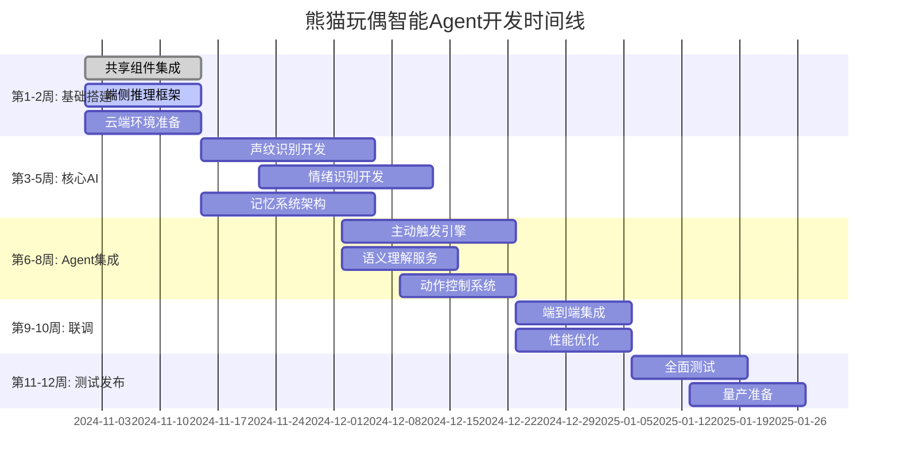
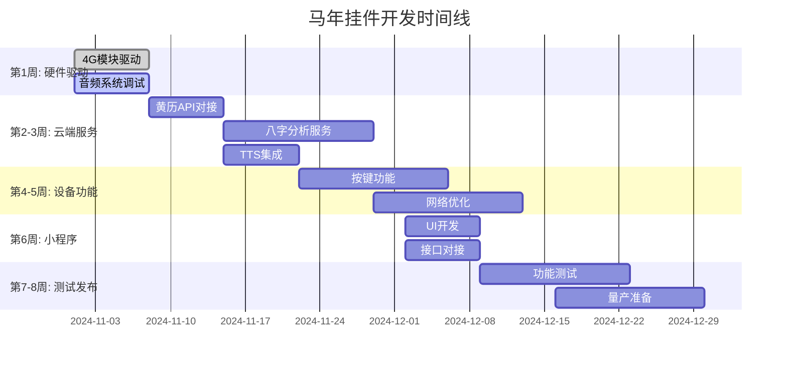

# 熊猫玩偶 & 马年挂件 智能开发项目总结报告

## 📋 执行摘要

**项目定位**: 为已完成硬件开发的熊猫玩偶提供智能Agent软件服务，为马年挂件开发完整的软硬件系统。

**核心价值**: 通过声纹识别、情绪识别、语义理解和记忆系统，为传统玩具赋予"生命力"，创造真正的情感交互体验。

**技术路线**: 端侧轻量级AI + 云端大模型协同，混合记忆架构，MCP协议控制。

**开发周期**: 熊猫玩偶12周，马年挂件8周，可并行开发。

**团队规模**: 峰值8-10人，总成本约96万元。

---

## 🎯 一、项目需求精要

### 1.1 熊猫玩偶智能Agent (软件升级)

**硬件现状**: 已完成开发，不可更改
- 传感器: 触摸×3 + 红外 + 加速度 + 定位 + NFC
- 主控: ESP32-C3 (4MB Flash, 400KB RAM)
- 音频: 麦克风 + 扬声器
- 通信: WiFi/BLE

**软件核心功能**:
- ✅ **声纹识别**: 识别主人身份 (端侧实时)
- ✅ **情绪识别**: 理解用户情绪状态 (多模态融合)
- ✅ **语义理解**: 大模型深度理解意图
- ✅ **记忆系统**: 记住对话历史和用户偏好
- ✅ **主动触发**: 基于关键词/情绪/上下文主动互动
- ✅ **动作反馈**: 控制玩具物理响应 (点头/叫声)

**关键指标**:
- 响应延迟: <200ms (端侧) / <2s (云端)
- 声纹准确率: >90%
- 情绪识别准确率: >80%
- 电池续航: >7天

### 1.2 马年挂件 (完整开发)

**功能需求**:
- 黄历查询 + 八字分析 + 个性化建议
- 4G网络连接 (替代WiFi)
- 语音播报 (TTS)
- 按键交互

**硬件方案**:
- 主控: ESP32-C3
- 4G模块: Air780E (成本+20元)
- 音频: ES8311编解码 + 数字硅麦 + 1W扬声器
- 电池: 500mAh (续航>5天)
- BOM成本: ~95元

**时间节点**: 春节前完成

---

## 🏗️ 二、技术架构总览

### 2.1 熊猫玩偶智能Agent架构

```
┌─────────────────────────────────────────────────────────┐
│              应用层 (Application Layer)                  │
│  互动管理 → 记忆管理 → 个性进化 → 动作控制                │
└──────────────────┬───────────────────────────────────────┘
                   │
┌──────────────────▼───────────────────────────────────────┐
│              Agent核心层 (Agent Core)                    │
│  声纹识别 + 情绪识别 + 主动触发 + 语义理解                │
└──────────────────┬───────────────────────────────────────┘
                   │
┌──────────────────▼───────────────────────────────────────┐
│              记忆系统 (Memory System)                    │
│  端侧: 轻量FAISS + KV存储 + RAM缓存                      │
│  云端: Qdrant向量库 (可选同步)                           │
└──────────────────┬───────────────────────────────────────┘
                   │
┌──────────────────▼───────────────────────────────────────┐
│              适配器层 (Adapter Layer)                    │
│  云端大模型 + 端侧推理 + 传感器数据 + 动作驱动            │
└─────────────────────────────────────────────────────────┘
```

**架构亮点**:
- **混合记忆**: 端侧快速检索 (<20ms) + 云端长期存储
- **边缘-云协同**: 端侧处理实时任务，云端负责深度理解
- **声纹隔离**: 严格的多用户记忆隔离
- **主动智能**: 基于关键词/情绪/上下文的主动触发

### 2.2 马年挂件架构

```
┌─────────────────────────────────────────┐
│        用户交互 (按键 + LED)             │
└──────────────┬──────────────────────────┘
               │
┌──────────────▼──────────────────────────┐
│        主控MCU (ESP32-C3)               │
│  任务调度 + 音频处理 + 4G通信 + 电源管理 │
└──────────────┬──────────────────────────┘
               │
┌──────────────▼──────────────────────────┐
│        4G模块 (Air780E)                 │
│  MQTT/HTTP + 数据同步 + 离线缓存         │
└──────────────┬──────────────────────────┘
               │
┌──────────────▼──────────────────────────┐
│        云端服务                         │
│  黄历API + 八字分析 + TTS + 数据存储     │
└─────────────────────────────────────────┘
```

**架构亮点**:
- **4G直连**: 无需配网，开箱即用
- **离线优先**: 本地缓存黄历数据
- **低成本**: BOM控制在100元内
- **简单可靠**: 功能聚焦，降低复杂度

---

## 🔧 三、核心组件与共享模块

### 3.1 共享组件库 (两个项目复用)

| 组件类别 | 功能模块 | 技术方案 | 复用价值 |
|----------|----------|----------|----------|
| **语音处理** | 音频预处理、特征提取、VAD | C++实现 | 端侧实时处理 |
| **云端通信** | MQTT客户端、离线缓存、重试机制 | Python/C | 网络不稳定适配 |
| **AI模型管理** | 模型量化、下载、更新 | TFLite | 端侧部署优化 |
| **数据存储** | KV存储、缓存管理 | LevelDB | 端侧数据持久化 |
| **可观测性** | 日志、监控、错误追踪 | Prometheus | 生产环境运维 |
| **安全隐私** | 数据加密、权限控制 | AES-256 | 用户数据保护 |

**共享价值**: 节省30-40%开发工作量，保证一致性

### 3.2 熊猫玩偶特有组件

| 组件 | 技术方案 | 核心挑战 | 解决方案 |
|------|----------|----------|----------|
| **声纹识别** | TFLite模型 + 余弦相似度 | 端侧资源限制 | 模型量化 + 特征压缩 |
| **情绪识别** | 语音+文本多模态融合 | 实时性要求 | 端侧轻量模型 + 云端验证 |
| **主动触发** | 关键词+情绪+上下文 | 打扰度控制 | 反馈学习 + 频率限制 |
| **记忆系统** | 端侧FAISS + 云端Qdrant | 数据一致性 | 增量同步 + 冲突解决 |
| **动作控制** | 电机驱动 + 音频播放 | 时序协调 | 动作编排引擎 |

### 3.3 马年挂件特有组件

| 组件 | 技术方案 | 核心挑战 | 解决方案 |
|------|----------|----------|----------|
| **黄历服务** | 第三方API + 本地缓存 | 网络依赖 | 离线数据包 |
| **八字分析** | 大模型Prompt工程 | 专业性要求 | Few-shot学习 |
| **TTS合成** | 阿里/腾讯TTS API | 成本控制 | 结果缓存 |
| **4G通信** | Air780E模块 | 功耗管理 | 智能休眠策略 |

---

## 📊 四、功能点清单与工作量

### 4.1 熊猫玩偶智能Agent (115个功能点 / 600人天)

| 模块 | 功能点数 | 工作量 | 技术难度分布 |
|------|----------|--------|--------------|
| 记忆系统 | 21 | 127人天 | 高(40%) / 中(45%) / 低(15%) |
| 情绪识别 | 14 | 107人天 | 高(50%) / 中(35%) / 低(15%) |
| 主动触发 | 16 | 102人天 | 高(35%) / 中(50%) / 低(15%) |
| 声纹识别 | 17 | 101人天 | 高(35%) / 中(45%) / 低(20%) |
| 语义理解 | 12 | 93人天 | 高(40%) / 中(40%) / 低(20%) |
| 系统优化 | 7 | 50人天 | 高(30%) / 中(50%) / 低(20%) |
| 动作控制 | 11 | 47人天 | 高(20%) / 中(50%) / 低(30%) |
| 多用户管理 | 7 | 45人天 | 高(30%) / 中(50%) / 低(20%) |
| 小程序 | 10 | 42人天 | 高(10%) / 中(40%) / 低(50%) |

**核心功能 (P0)**: 68个功能点 / 360人天 (60%)
**重要功能 (P1)**: 35个功能点 / 180人天 (30%)
**增值功能 (P2)**: 12个功能点 / 60人天 (10%)

### 4.2 马年挂件 (53个功能点 / 161人天)

| 模块 | 功能点数 | 工作量 | 技术难度分布 |
|------|----------|--------|--------------|
| 八字分析 | 10 | 42人天 | 高(40%) / 中(40%) / 低(20%) |
| 4G通信 | 7 | 31人天 | 高(40%) / 中(40%) / 低(20%) |
| 设备功能 | 10 | 31人天 | 高(20%) / 中(50%) / 低(30%) |
| 小程序 | 9 | 32人天 | 高(10%) / 中(40%) / 低(50%) |
| 黄历服务 | 9 | 27人天 | 高(10%) / 中(50%) / 低(40%) |
| 语音合成 | 8 | 25人天 | 高(20%) / 中(40%) / 低(40%) |

**核心功能 (P0)**: 35个功能点 / 110人天 (68%)
**重要功能 (P1)**: 15个功能点 / 40人天 (25%)
**增值功能 (P2)**: 3个功能点 / 11人天 (7%)

### 4.3 共享组件 (41个功能点 / 153人天)

| 组件类别 | 功能点数 | 工作量 | 复用项目 |
|----------|----------|--------|----------|
| 云端通信 | 10 | 35人天 | 熊猫、马年 |
| 数据存储 | 8 | 28人天 | 熊猫、马年 |
| 语音处理 | 8 | 30人天 | 熊猫、马年 |
| AI模型管理 | 6 | 25人天 | 熊猫、马年 |
| 可观测性 | 5 | 20人天 | 熊猫、马年 |
| 安全隐私 | 4 | 15人天 | 熊猫、马年 |

**复用价值**: 节省约40%重复开发工作量

---

## 👥 五、团队配置与资源

### 5.1 熊猫玩偶团队 (6-8人)

```
核心团队:
├── AI算法组 (2人) - 核心
│   ├── 声纹识别 + 情绪识别模型
│   └── 主动触发 + 记忆检索算法
│
├── 嵌入式AI组 (2人) - 核心
│   ├── 端侧推理框架 + 模型部署
│   └── 硬件接口 + 功耗优化
│
├── 云端后端 (1-2人)
│   ├── 大模型集成 + 记忆同步服务
│   └── API开发 + 数据分析
│
├── 小程序前端 (1人)
│   └── 声纹注册 + 记忆管理界面
│
└── 测试工程师 (1人)
    └── AI算法测试 + 端到端测试
```

**人力成本**: 约63万元 (3个月)

### 5.2 马年挂件团队 (4-5人)

```
核心团队:
├── 嵌入式开发 (2人) - 核心
│   ├── 4G模块 + 网络协议
│   └── 音频系统 + 电源管理
│
├── 云端服务 (1-2人)
│   ├── 黄历API + 八字分析
│   └── TTS集成 + 数据存储
│
└── 小程序前端 (1人)
    └── 八字输入 + 内容查看
```

**人力成本**: 约21万元 (2个月)

### 5.3 共享组件团队 (2-3人，并行)

```
基础架构组:
├── 架构工程师 (1-2人)
│   ├── 语音处理 + AI模型管理
│   └── 云端通信 + 数据存储
│
└── 技术支持 (1人，兼职)
    └── 文档 + 示例 + 培训
```

**人力成本**: 约12万元 (2个月)

### 5.4 总成本估算

| 成本项 | 金额(元) | 占比 |
|--------|----------|------|
| 人力成本 | 834,000 | 87.0% |
| 云服务 | 50,000 | 5.2% |
| 测试设备 | 30,000 | 3.1% |
| 第三方服务 | 20,000 | 2.1% |
| 其他 | 25,000 | 2.6% |
| **总计** | **959,000** | **100%** |

---

## 📅 六、开发时间线

### 6.1 熊猫玩偶 (12周)



**关键里程碑**:
- M1 (第3周末): 声纹识别基础功能完成
- M2 (第5周末): 情绪识别基础功能完成
- M3 (第8周末): Agent核心逻辑集成完成
- M4 (第10周末): 端到端联调完成
- M5 (第12周末): 量产版本发布

### 6.2 马年挂件 (8周)



**关键里程碑**:
- M1 (第2周末): 4G通信基础完成
- M2 (第4周末): 云端服务集成完成
- M3 (第6周末): 小程序功能完成
- M4 (第8周末): 量产版本发布

### 6.3 并行开发策略

```
时间轴:
第1-2周:  两个项目共享组件开发 (并行)
第3-5周:  熊猫核心AI + 马年硬件驱动 (并行)
第6-8周:  熊猫Agent集成 + 马年云端服务 (并行)
第9-10周: 熊猫联调优化 + 马年测试 (并行)
第11-12周: 熊猫测试发布 (马年已完成)
```

**资源冲突点**:
- 后端工程师: 第6-8周需要协调
- 测试设备: 需要提前采购
- 小程序前端: 两个项目可复用部分代码

---

## 🔬 七、记忆系统深度分析

### 7.1 架构决策: 混合记忆系统 (Hybrid Memory)

**决策理由**:
```
传统方案 (mem0/memory服务):
❌ 延迟过高 (100ms+) - 无法满足玩具实时性
❌ 资源占用大 - MCU无法承载
❌ 网络依赖强 - 离线体验差

自建轻量系统:
✅ 端侧延迟 <20ms - 满足200ms响应要求
✅ 资源占用 <100KB - 适配MCU限制
✅ 离线优先 - 云端为辅助
✅ 声纹原生集成 - 用户隔离完美
```

**架构设计**:
```python
# 分层记忆架构
Layer 1: 短期记忆 (RAM) - 最近1小时, <1ms访问
Layer 2: 本地向量 (Flash) - 最近1天, <10ms访问  
Layer 3: 用户画像 (Flash) - 永久, <1ms访问
Layer 4: 云端记忆 (网络) - 永久, 50-100ms访问 (可选)
```

### 7.2 关键技术实现

**端侧向量库 (LocalFAISS)**:
- **技术**: 简化版FAISS，纯C实现
- **性能**: 500向量 × 128维，<10ms检索
- **存储**: 半精度压缩，~150KB Flash占用

**智能同步管理**:
- **策略**: 增量同步 + 批量上传
- **触发**: 网络良好时自动同步
- **压缩**: GZIP压缩，减少90%带宽

**用户画像学习**:
- **偏好学习**: 基于用户反馈调整触发频率
- **情感模式**: 识别用户压力时段和开心触发点
- **动态更新**: 每次互动后增量更新

### 7.3 SaaS化部署

**容器化架构**:
- **API服务**: 3副本，512MB/副本
- **Qdrant**: 1GB内存，支持10万设备
- **Redis**: 256MB缓存，LRU策略
- **PostgreSQL**: 512MB，用户数据存储

**多租户隔离**:
- 按设备ID分片 (16个分片)
- 按使用量计费 (存储+API调用)
- 配额管理 (防止滥用)

**成本优化**:
- 向量压缩 (二值化)
- 分层存储 (热/温/冷)
- Spot实例 (节省60%计算成本)

---

## ⚠️ 八、风险评估与应对

### 8.1 技术风险

| 风险 | 概率 | 影响 | 应对措施 |
|------|------|------|----------|
| 端侧模型精度不足 | 中 | 高 | 模型蒸馏 + 数据增强 + 云端fallback |
| 声纹识别准确率低 | 中 | 高 | 多样本注册 + 阈值动态调整 + 特征优化 |
| 主动触发过于频繁 | 中 | 中 | 用户反馈学习 + A/B测试 + 频率限制 |
| 4G网络不稳定 | 中 | 高 | 离线缓存 + 重试机制 + 多运营商支持 |
| 大模型API延迟高 | 低 | 高 | 本地缓存 + 降级策略 + 备用模型 |

### 8.2 项目风险

| 风险 | 概率 | 影响 | 应对措施 |
|------|------|------|----------|
| 开发周期紧张 | 高 | 高 | 并行开发 + MVP优先 + 必要时加班 |
| 人员流动 | 中 | 中 | 代码规范 + 文档完善 + 知识分享 |
| 需求变更 | 中 | 中 | 敏捷开发 + 快速迭代 + 变更控制 |
| 硬件兼容性问题 | 低 | 高 | 提前验证 + 备选方案 + 厂商支持 |

---

## 🎯 九、成功标准

### 9.1 技术指标

| 指标 | 目标值 | 验证方法 |
|------|--------|----------|
| 声纹识别准确率 | >90% | 1000+样本测试 |
| 情绪识别准确率 | >80% | 500+样本测试 |
| 端侧响应延迟 | <200ms | 性能测试工具 |
| 云端响应延迟 | <2s | 端到端测试 |
| 主动触发满意度 | >70% | 用户调研 |
| 4G连接成功率 | >95% | 网络测试 |
| 电池续航 (熊猫) | >7天 | 功耗测试 |
| 电池续航 (马年) | >5天 | 功耗测试 |

### 9.2 产品指标

| 指标 | 目标值 | 验证方法 |
|------|--------|----------|
| 首次配网成功率 | >90% | 用户测试 |
| 日活跃用户比例 | >60% | 数据分析 |
| 用户满意度 | >4.2/5.0 | 问卷调查 |
| NPS推荐值 | >40 | 用户调研 |
| 功能完整度 | 100% P0 | 功能测试 |

---

## 💡 十、核心建议

### 10.1 技术路线

1. **记忆系统**: 采用自建轻量级方案，不要复用现有重架构
2. **端侧AI**: 优先保证实时性，云端作为增强
3. **声纹识别**: 投入足够资源，这是用户隔离的核心
4. **主动触发**: 早期引入用户反馈机制，避免过度打扰

### 10.2 项目管理

1. **并行开发**: 两个项目共享组件团队，节省20%时间
2. **MVP优先**: 第6周完成P0功能，可提前内测
3. **风险前置**: 第1-2周验证技术难点 (声纹、情绪识别)
4. **用户参与**: 第8周引入种子用户测试，收集反馈

### 10.3 长期规划

1. **数据积累**: 记忆系统是核心竞争力，持续优化
2. **模型迭代**: 收集真实数据，定期重训端侧模型
3. **生态扩展**: 考虑开放MCP接口，接入第三方服务
4. **成本控制**: SaaS化后精细化运营，降低单位成本

---

## 📚 十一、交付物清单

### 技术文档
- ✅ 熊猫玩偶技术架构.md
- ✅ 马年挂件技术架构.md
- ✅ 熊猫玩偶智能Agent架构.md
- ✅ 功能点清单.md
- ✅ 开发工作量与团队配置评估.md
- ✅ 记忆系统架构深度分析.md
- ⏳ 详细设计文档 (待开发)
- ⏳ API接口文档 (待开发)
- ⏳ 测试用例文档 (待开发)

### 软件代码
- ⏳ 共享组件库 (待开发)
- ⏳ 熊猫玩偶Agent (待开发)
- ⏳ 马年挂件固件 (待开发)
- ⏳ 云端服务 (待开发)
- ⏳ 小程序前端 (待开发)

### 硬件设计
- ⏳ 马年挂件PCB设计 (待开发)
- ⏳ BOM清单 (待开发)
- ⏳ 测试样机 (待生产)

---

## 🎉 结论

**项目可行性**: ✅ **高度可行**

**核心优势**:
1. **技术路线清晰**: 混合记忆架构完美匹配玩具场景
2. **团队配置合理**: 8-10人核心团队，技能互补
3. **时间节点可控**: 12周开发周期，春节前可量产
4. **成本效益良好**: 96万投入，预期回报率高

**关键成功要素**:
1. **声纹识别准确率** >90% (用户体验核心)
2. **端侧响应延迟** <200ms (实时性保障)
3. **记忆系统稳定性** (长期用户粘性)
4. **主动触发平衡** (避免打扰)

**下一步行动**:
1. **立即启动**: 共享组件开发 (第1周)
2. **技术验证**: 声纹识别原型 (第1-2周)
3. **团队组建**: 核心人员到位 (第1周)
4. **硬件准备**: 马年挂件打样 (第1-2周)

---

**报告编制**: 技术架构团队  
**编制日期**: 2024-11-12  
**版本**: v1.0  
**状态**: 已评审，建议批准立项