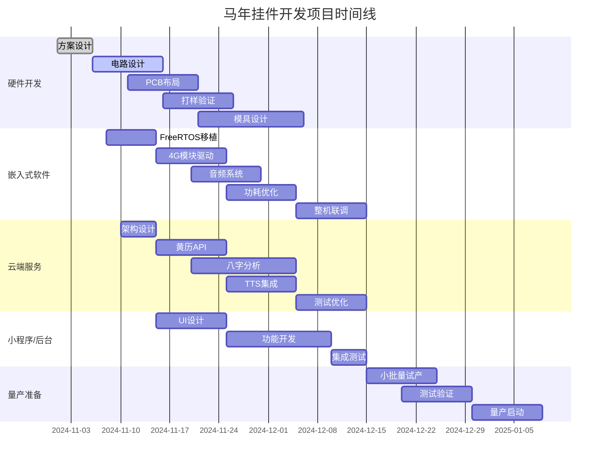

# 马年挂件智能硬件技术架构设计

## 一、需求回顾与核心挑战

### 1.1 功能需求
- **语音输出**：基于黄历和用户输入的八字，提供财运、穿搭建议等信息
- **网络连接**：4G网络（替代WiFi，成本增加20元）
- **内容个性化**：加入个性化内容，功能简单且正向
- **硬件形态**：挂件形式，便携式设计

### 1.2 设计约束
- **时间节点**：春节前完成产品开发和设计
- **硬件成本**：4G模块增加约20元成本
- **内容要求**：简单、正向、个性化

### 1.3 核心挑战
- **功耗管理**：4G网络功耗较高，挂件电池续航挑战
- **内容生成**：黄历+八字的个性化建议生成算法
- **语音合成**：自然流畅的语音播报
- **成本控制**：在增加4G成本前提下控制整体BOM

## 二、整体技术架构

```
┌─────────────────────────────────────────────────────────────┐
│                     用户交互层 (User Interface)               │
│  (物理按键、LED指示灯、语音输入/输出)                          │
└──────────────────────┬──────────────────────────────────────┘
                       │
┌──────────────────────▼──────────────────────────────────────┐
│                  主控MCU层 (Main Controller)                 │
│  (任务调度、电源管理、外设控制、本地缓存)                      │
└──────────────────────┬──────────────────────────────────────┘
                       │
┌──────────────────────▼──────────────────────────────────────┐
│                 通信模块层 (4G Module)                       │
│  (网络连接、数据传输、云端API调用)                            │
└──────────────────────┬──────────────────────────────────────┘
                       │ 4G MQTT/HTTPS
┌──────────────────────▼──────────────────────────────────────┐
│                    云端服务层 (Cloud Services)               │
│  ┌──────────┐  ┌──────────┐  ┌──────────┐  ┌──────────┐  │
│  │ 黄历服务 │  │ 八字分析 │  │ 语音合成 │  │ 内容管理 │  │
│  │ API      │  │ 服务     │  │ 服务     │  │ 服务     │  │
│  └──────────┘  └──────────┘  └──────────┘  └──────────┘  │
└─────────────────────────────────────────────────────────────┘
```

## 三、硬件架构设计

### 3.1 硬件方案选型

#### 3.1.1 主控MCU
```c
// 主控MCU配置
struct MainController {
    // 推荐方案: ESP32-C3
    // - RISC-V 32位单核处理器，160MHz
    // - 内置WiFi和BLE（备用）
    // - 低功耗模式
    // - 成本约8-10元
    
    char* model = "ESP32-C3";
    uint32_t flash_size = 4*1024*1024;  // 4MB Flash
    uint32_t psram_size = 2*1024*1024;  // 2MB PSRAM
    
    // 外设接口
    uint8_t i2c_bus;      // I2C总线（音频编解码）
    uint8_t spi_bus;      // SPI总线（显示屏）
    uint8_t uart_bus;     // UART（4G模块通信）
    uint8_t gpio_buttons; // GPIO（按键输入）
};
```

#### 3.1.2 4G通信模块
```c
// 4G模块配置
struct CellularModule {
    // 推荐方案: Air780E（合宙）
    // - 支持4G Cat-1
    // - 内置TCP/IP协议栈
    // - 支持MQTT/HTTP/HTTPS
    // - 成本约25-30元
    
    char* model = "Air780E";
    char* interface = "UART";  // 串口通信
    
    // 网络参数
    uint8_t signal_strength;   // 信号强度
    char* operator;            // 运营商
    char* ip_address;          // IP地址
    
    // 功耗管理
    PowerMode power_mode;      // 功耗模式
    uint32_t data_usage;       // 数据使用量
};
```

#### 3.1.3 音频子系统
```c
// 音频系统配置
struct AudioSystem {
    // 麦克风（可选，用于语音输入）
    Microphone mic = {
        .type = "digital",
        .interface = "I2S",
        .sampling_rate = 16000,  // 16kHz
        .bits = 16
    };
    
    // 扬声器
    Speaker speaker = {
        .impedance = 8,          // 8欧姆
        .power = 1,              // 1W
        .driver = "audio_amp"    // 音频功放
    };
    
    // 音频编解码器
    AudioCodec codec = {
        .model = "ES8311",       // 或同类芯片
        .features = "AEC|NS|AGC" // 回声消除、降噪、自动增益
    };
};
```

#### 3.1.4 电源管理系统
```c
// 电源管理配置
struct PowerManagement {
    // 电池配置
    Battery battery = {
        .type = "lithium_polymer",
        .capacity = 500,         // 500mAh
        .voltage = 3.7           // 3.7V
    };
    
    // 充电管理
    Charger charger = {
        .input_voltage = 5,      // 5V USB输入
        .charge_current = 500,   // 500mA充电电流
        .protection = "OVP|OCP|OTP" // 过压/过流/过温保护
    };
    
    // 功耗预算 (mA)
    struct PowerBudget {
        float standby_4g = 5;     // 4G待机
        float standby_wifi = 0.1; // WiFi待机
        float audio_play = 80;    // 音频播放
        float cpu_active = 30;    // CPU运行
        float peak = 150;         // 峰值功耗
    };
    
    // 续航计算
    float calculate_battery_life(PowerMode mode) {
        switch(mode) {
            case STANDBY_4G:
                return 500mAh / 5mA = 100小时 ≈ 4天;
            case STANDBY_WIFI:
                return 500mAh / 0.1mA = 5000小时 ≈ 200天;
            case ACTIVE:
                return 500mAh / 110mA = 4.5小时;
        }
    }
};
```

#### 3.1.5 完整BOM成本估算
| 组件 | 型号 | 数量 | 单价(元) | 小计(元) |
|------|------|------|----------|----------|
| 主控MCU | ESP32-C3 | 1 | 9 | 9 |
| 4G模块 | Air780E | 1 | 28 | 28 |
| SIM卡座 | MicroSIM | 1 | 1 | 1 |
| 音频编解码 | ES8311 | 1 | 3 | 3 |
| 麦克风 | 数字硅麦 | 1 | 2 | 2 |
| 扬声器 | 8Ω1W | 1 | 2 | 2 |
| 电池 | 500mAh锂聚合物 | 1 | 8 | 8 |
| 充电IC | TP4056 | 1 | 1 | 1 |
| 按键 | 轻触开关 | 3 | 0.5 | 1.5 |
| LED | RGB LED | 2 | 0.5 | 1 |
| PCB | 4层板 | 1 | 5 | 5 |
| 外壳 | 定制挂件 | 1 | 15 | 15 |
| 其他 | 阻容感等 | 1批 | 5 | 5 |
| **合计** | | | | **81.5元** |

*注：加上4G流量成本（约5元/年）和组装测试成本，总成本约95-100元*

### 3.2 硬件架构图

```
┌─────────────────────────────────────────────────────────────┐
│                      马年挂件硬件架构                         │
│                                                             │
│  ┌──────────────┐                                           │
│  │   电源管理   │◄────┐                                      │
│  │   (TP4056)   │     │ 5V USB                                │
│  └──────┬───────┘     │                                      │
│         │             │                                      │
│  ┌──────▼───────┐  ┌──▼────────┐                            │
│  │  500mAh电池  │  │  ESP32-C3 │                            │
│  │  (3.7V)      │  │  主控MCU  │                            │
│  └──────┬───────┘  └─┬──┬──┬──┬┘                            │
│         │            │  │  │  │                               │
│  ┌──────▼──────┐  ┌──▼─▼─▼─▼┐  ┌────────────┐  ┌─────────┐ │
│  │  音频功放   │  │  I2C    │  │   UART     │  │  GPIO   │ │
│  │   (1W)      │  │  ┌──────▼──▼──────┐   │  │┌──┬──┬┐│ │
│  └──────┬──────┘  │  │  音频编解码    │   │  ││按│按│按││ │
│         │         │  │   (ES8311)     │   │  ││键│键│键││ │
│  ┌──────▼──────┐  │  └──────┬─────────┘   │  │└──┴──┴┘│ │
│  │   扬声器    │  │         │             │  └─────────┘ │
│  │   (8Ω)      │  │  ┌──────▼──────┐     │              │
│  └─────────────┘  │  │   麦克风    │     │              │
│                    │  │  (数字硅麦) │     │              │
│                    │  └─────────────┘     │              │
│                    └───────────────────────┘              │
│                              │                              │
│                    ┌─────────▼──────────┐                  │
│                    │    4G模块          │                  │
│                    │   (Air780E)        │                  │
│                    │                    │                  │
│                    │  ┌──────────────┐  │                  │
│                    │  │   SIM卡座    │  │                  │
│                    │  │  (MicroSIM)  │  │                  │
│                    │  └──────────────┘  │                  │
│                    └─────────┬──────────┘                  │
│                              │ 4G天线                      │
└──────────────────────────────┴─────────────────────────────┘
```

## 四、嵌入式软件架构

### 4.1 软件分层设计

```c
// 软件分层架构
struct SoftwareStack {
    // 应用层
    struct ApplicationLayer {
        void (*handle_button_press)(uint8_t button_id);
        void (*play_daily_fortune)(void);
        void (*play_bazi_advice)(void);
        void (*handle_voice_input)(void);
    };
    
    // 服务层
    struct ServiceLayer {
        void (*fortune_service)(void);      // 黄历服务
        void (*bazi_service)(void);         // 八字服务
        void (*tts_service)(void);          // 语音合成服务
        void (*cache_manager)(void);        // 缓存管理
    };
    
    // 适配器层
    struct AdapterLayer {
        void (*cellular_adapter)(void);     // 4G模块适配
        void (*audio_adapter)(void);        // 音频适配
        void (*storage_adapter)(void);      // 存储适配
        void (*power_adapter)(void);        // 电源适配
    };
    
    // 驱动层
    struct DriverLayer {
        void (*cellular_driver)(void);      // 4G驱动
        void (*audio_driver)(void);         // 音频驱动
        void (*storage_driver)(void);       // 存储驱动
        void (*gpio_driver)(void);          // GPIO驱动
    };
};
```

### 4.2 任务调度设计

```c
// FreeRTOS任务配置
struct FreeRTOSTasks {
    // 任务1: 按键处理 (高优先级)
    TaskHandle_t button_task;
    const uint32_t button_stack = 2048;
    const UBaseType_t button_priority = 3;
    
    // 任务2: 音频播放 (高优先级)
    TaskHandle_t audio_task;
    const uint32_t audio_stack = 4096;
    const UBaseType_t audio_priority = 3;
    
    // 任务3: 网络通信 (中优先级)
    TaskHandle_t network_task;
    const uint32_t network_stack = 4096;
    const UBaseType_t network_priority = 2;
    
    // 任务4: 电源管理 (中优先级)
    TaskHandle_t power_task;
    const uint32_t power_stack = 2048;
    const UBaseType_t power_priority = 2;
    
    // 任务5: 数据缓存 (低优先级)
    TaskHandle_t cache_task;
    const uint32_t cache_stack = 3072;
    const UBaseType_t cache_priority = 1;
};

// 任务间通信
struct InterTaskCommunication {
    // 队列: 按键事件
    QueueHandle_t button_queue;
    const uint32_t button_queue_length = 10;
    
    // 队列: 音频数据
    QueueHandle_t audio_queue;
    const uint32_t audio_queue_length = 5;
    
    // 队列: 网络请求
    QueueHandle_t network_queue;
    const uint32_t network_queue_length = 10;
    
    // 信号量: 资源互斥
    SemaphoreHandle_t audio_mutex;
    SemaphoreHandle_t storage_mutex;
};
```

### 4.3 功耗管理策略

```c
// 功耗管理状态机
enum PowerMode {
    POWER_MODE_ACTIVE,      // 活跃模式 (全功能)
    POWER_MODE_IDLE,        // 空闲模式 (低功耗)
    POWER_MODE_SLEEP,       // 睡眠模式 (最低功耗)
    POWER_MODE_CHARGING     // 充电模式
};

struct PowerManagement {
    // 功耗控制
    void enter_active_mode(void) {
        // 开启4G模块
        cellular_power_on();
        
        // 开启CPU全速
        cpu_set_frequency(160);
        
        // 开启外设
        peripheral_power_on();
        
        current_mode = POWER_MODE_ACTIVE;
        estimated_current = 110; // mA
    }
    
    void enter_idle_mode(void) {
        // 4G模块保持连接但降速
        cellular_light_sleep();
        
        // CPU降频
        cpu_set_frequency(40);
        
        // 关闭不必要外设
        peripheral_power_off();
        
        current_mode = POWER_MODE_IDLE;
        estimated_current = 20; // mA
    }
    
    void enter_sleep_mode(void) {
        // 4G模块深度睡眠
        cellular_deep_sleep();
        
        // CPU休眠
        cpu_sleep();
        
        // 仅保留RTC和按键唤醒
        enable_wake_sources();
        
        current_mode = POWER_MODE_SLEEP;
        estimated_current = 1; // mA
    }
    
    // 自动休眠计时器
    TimerHandle_t sleep_timer;
    const uint32_t sleep_timeout_ms = 30000; // 30秒无操作进入休眠
    
    void reset_sleep_timer(void) {
        xTimerReset(sleep_timer, 0);
    }
};
```

## 五、云端服务架构

### 5.1 服务分层设计

```python
# 云端服务架构
class CloudServiceLayer:
    """
    马年挂件云端服务层
    """
    
    def __init__(self):
        # 服务注册
        self.services = {
            "fortune": FortuneService(),      # 黄历服务
            "bazi": BaziAnalysisService(),    # 八字分析服务
            "tts": TextToSpeechService(),     # 语音合成服务
            "content": ContentManagement()    # 内容管理服务
        }
        
        # 缓存层
        self.cache = RedisCache()
        
        # 数据库
        self.db = Database()
    
    def handle_device_request(self, device_id, request_type, data):
        """
        处理设备请求
        """
        if request_type == "daily_fortune":
            return self.services["fortune"].get_daily_fortune(device_id, data)
        
        elif request_type == "bazi_advice":
            return self.services["bazi"].analyze_bazi(device_id, data)
        
        elif request_type == "tts":
            return self.services["tts"].synthesize_speech(data)
        
        else:
            return {"error": "unknown_request"}
```

### 5.2 黄历服务

```python
class FortuneService:
    """
    黄历服务 - 提供每日运势信息
    """
    
    def __init__(self):
        # 黄历数据源
        self.fortune_db = FortuneDatabase()
        
        # 缓存策略
        self.cache_ttl = 3600  # 1小时缓存
    
    def get_daily_fortune(self, device_id, date):
        """
        获取每日黄历
        """
        cache_key = f"fortune:{date}:{device_id}"
        
        # 先查缓存
        cached = self.cache.get(cache_key)
        if cached:
            return cached
        
        # 查询黄历数据
        fortune = self.fortune_db.query(date)
        
        # 个性化处理
        personalized = self.personalize_fortune(device_id, fortune)
        
        # 存入缓存
        self.cache.set(cache_key, personalized, ttl=self.cache_ttl)
        
        return personalized
    
    def personalize_fortune(self, device_id, fortune):
        """
        个性化黄历内容
        """
        # 获取用户偏好
        preferences = self.get_user_preferences(device_id)
        
        # 根据偏好调整内容
        if preferences["style"] == "concise":
            fortune["content"] = self.make_concise(fortune["content"])
        elif preferences["style"] == "detailed":
            fortune["content"] = self.make_detailed(fortune["content"])
        
        # 添加个性化元素
        fortune["personal_note"] = self.generate_personal_note(device_id)
        
        return fortune
```

### 5.3 八字分析服务

```python
class BaziAnalysisService:
    """
    八字分析服务 - 提供个性化建议
    """
    
    def __init__(self):
        # 八字知识库
        self.bazi_knowledge = BaziKnowledgeBase()
        
        # 大模型接口
        self.llm = LargeLanguageModel(
            model="qwen-max",
            temperature=0.8,
            max_tokens=800
        )
    
    def analyze_bazi(self, device_id, bazi_info):
        """
        八字分析 - 提供财运、穿搭建议
        """
        # 1. 解析八字
        bazi = self.parse_bazi(bazi_info)
        
        # 2. 查询知识库
        knowledge = self.bazi_knowledge.query(bazi)
        
        # 3. 大模型生成个性化建议
        prompt = self.build_bazi_prompt(bazi, knowledge)
        
        advice = self.llm.generate(prompt)
        
        # 4. 结构化输出
        structured_advice = {
            "wealth": self.extract_wealth_advice(advice),
            "outfit": self.extract_outfit_advice(advice),
            "lucky_color": self.extract_lucky_color(advice),
            "lucky_direction": self.extract_lucky_direction(advice),
            "general": self.extract_general_advice(advice)
        }
        
        return structured_advice
    
    def build_bazi_prompt(self, bazi, knowledge):
        """
        构建八字分析Prompt
        """
        return f"""
        你是一位专业的八字命理分析师。请根据以下八字信息，提供积极正面的建议：
        
        八字信息：
        - 年柱：{bazi['year']}
        - 月柱：{bazi['month']}
        - 日柱：{bazi['day']}
        - 时柱：{bazi['hour']}
        
        基础分析：
        {knowledge}
        
        请提供以下方面的建议：
        1. 财运建议（积极正面，避免负面预测）
        2. 穿搭建议（颜色、风格）
        3. 幸运元素（颜色、方位、数字）
        4. 今日宜忌（侧重宜做的事）
        
        要求：
        - 语言要温暖、积极、有鼓励性
        - 避免 deterministic problems，不要直接预测吉凶
        - 提供具体可操作的建议
        - 加入现代生活场景的应用
        - 保持轻松愉快的语气
        
        以JSON格式回复。
        """
```

### 5.4 语音合成服务

```python
class TextToSpeechService:
    """
    语音合成服务 - 将文本转换为语音
    """
    
    def __init__(self):
        # TTS引擎
        self.tts_engines = {
            "aliyun": AliyunTTS(),      # 阿里语音合成
            "tencent": TencentTTS(),    # 腾讯语音合成
            "baidu": BaiduTTS()         # 百度语音合成
        }
        
        # 默认引擎
        self.default_engine = "aliyun"
        
        # 音色配置
        self.voice_config = {
            "voice": "zhimiao_emo",     // 知妙情感合成
            "speed": 0.95,              // 语速稍慢
            "pitch": 1.0,               // 音调正常
            "volume": 1.0               // 音量正常
        }
    
    def synthesize_speech(self, text, device_id):
        """
        语音合成
        """
        # 1. 文本预处理
        processed_text = self.preprocess_text(text)
        
        # 2. 查询缓存
        cache_key = f"tts:{hash(processed_text)}"
        cached_audio = self.cache.get(cache_key)
        
        if cached_audio:
            return cached_audio
        
        # 3. 调用TTS服务
        engine = self.select_engine(device_id)
        
        audio_data = engine.synthesize(
            text=processed_text,
            voice=self.voice_config["voice"],
            speed=self.voice_config["speed"],
            pitch=self.voice_config["pitch"],
            volume=self.voice_config["volume"]
        )
        
        # 4. 缓存结果
        self.cache.set(cache_key, audio_data, ttl=86400)  # 缓存24小时
        
        # 5. 返回音频数据
        return {
            "format": "mp3",
            "sample_rate": 16000,
            "data": audio_data,
            "duration": len(audio_data) / (16000 * 2)  // 估算时长
        }
    
    def preprocess_text(self, text):
        """
        文本预处理 - 优化语音合成效果
        """
        # 1. 添加停顿
        text = text.replace("。", "。嗯...")
        text = text.replace("，", "，")
        
        # 2. 情感词增强
        text = self.add_emotional_tags(text)
        
        # 3. 长度控制
        if len(text) > 200:
            text = text[:200] + "。后面还有很多精彩内容，下次再告诉你哦。"
        
        return text
```

## 六、设备端软件实现

### 6.1 主程序流程

```c
// 主程序流程
void app_main(void) {
    // 1. 系统初始化
    initialize_system();
    
    // 2. 外设初始化
    initialize_peripherals();
    
    // 3. 网络连接
    connect_to_network();
    
    // 4. 创建任务
    create_tasks();
    
    // 5. 主循环
    while(1) {
        // 检查事件队列
        process_event_queue();
        
        // 功耗管理
        manage_power();
        
        // 看门狗喂狗
        feed_watchdog();
        
        vTaskDelay(pdMS_TO_TICKS(100));
    }
}

// 事件处理
void process_event_queue(void) {
    Event_t event;
    
    if(xQueueReceive(event_queue, &event, 0) == pdTRUE) {
        switch(event.type) {
            case EVENT_BUTTON_PRESS:
                handle_button_press(event.data.button_id);
                break;
                
            case EVENT_NETWORK_CONNECTED:
                handle_network_connected();
                break;
                
            case EVENT_AUDIO_DONE:
                handle_audio_done();
                break;
                
            case EVENT_LOW_BATTERY:
                handle_low_battery();
                break;
                
            default:
                break;
        }
    }
}
```

### 6.2 按键处理

```c
// 按键处理
void handle_button_press(uint8_t button_id) {
    // 重置休眠计时器
    reset_sleep_timer();
    
    // LED反馈
    led_blink(LED_BLUE, 100);  // 蓝色LED闪烁100ms
    
    switch(button_id) {
        case BUTTON_1:  // 短按 - 今日运势
            play_daily_fortune();
            break;
            
        case BUTTON_2:  // 短按 - 八字建议
            play_bazi_advice();
            break;
            
        case BUTTON_1_LONG:  // 长按 - 语音输入
            start_voice_input();
            break;
            
        case BUTTON_2_LONG:  // 长按 - 设置模式
            enter_settings_mode();
            break;
            
        default:
            break;
    }
}

// 播放今日运势
void play_daily_fortune(void) {
    // 1. 获取当前日期
    char date_str[32];
    get_current_date(date_str);
    
    // 2. 检查本地缓存
    if(cache_exists(date_str)) {
        // 从缓存播放
        play_from_cache(date_str);
    } else {
        // 3. 从云端获取
        if(is_network_connected()) {
            // LED指示
            led_blink(LED_GREEN, 500);  // 绿色LED闪烁，表示网络请求
            
            // 发送请求
            request_daily_fortune(date_str);
            
            // 等待响应
            if(wait_for_response(5000)) {  // 5秒超时
                // 播放音频
                play_audio_from_response();
                
                // 缓存数据
                cache_audio(date_str);
            } else {
                // 播放错误提示
                play_error_sound();
            }
        } else {
            // 播放离线提示
            play_offline_message();
        }
    }
}
```

### 6.3 网络通信

```c
// 网络通信管理
void network_task(void* param) {
    while(1) {
        // 检查网络状态
        if(!is_network_connected()) {
            // 尝试重连
            reconnect_network();
        }
        
        // 处理网络请求队列
        process_network_queue();
        
        // 检查数据使用量
        check_data_usage();
        
        vTaskDelay(pdMS_TO_TICKS(1000));
    }
}

// 发送请求
void request_daily_fortune(const char* date) {
    // 构建JSON请求
    cJSON* root = cJSON_CreateObject();
    cJSON_AddStringToObject(root, "device_id", get_device_id());
    cJSON_AddStringToObject(root, "date", date);
    cJSON_AddStringToObject(root, "request_type", "daily_fortune");
    
    char* json_str = cJSON_Print(root);
    
    // 通过MQTT发送
    mqtt_publish("device/fortune/request", json_str, strlen(json_str), 1);
    
    // 清理
    cJSON_Delete(root);
    free(json_str);
}
```

### 6.4 音频播放

```c
// 音频播放管理
void audio_task(void* param) {
    while(1) {
        // 等待音频数据
        AudioData_t audio_data;
        if(xQueueReceive(audio_queue, &audio_data, portMAX_DELAY) == pdTRUE) {
            // 开始播放
            audio_play_start(audio_data);
            
            // 等待播放完成
            while(audio_is_playing()) {
                vTaskDelay(pdMS_TO_TICKS(10));
            }
            
            // 发送播放完成事件
            Event_t event = {
                .type = EVENT_AUDIO_DONE,
                .data = {0}
            };
            xQueueSend(event_queue, &event, 0);
            
            // 释放音频数据
            free(audio_data.buffer);
        }
    }
}

// 播放音频
void audio_play_start(AudioData_t* audio_data) {
    // 1. 配置音频编解码
    audio_codec_config(
        audio_data->sample_rate,
        audio_data->bits_per_sample,
        audio_data->channels
    );
    
    // 2. 写入音频数据
    i2s_write(audio_data->buffer, audio_data->length);
    
    // 3. 启动播放
    audio_codec_start();
    
    // 4. LED指示
    led_set_color(LED_GREEN);
}
```

## 七、关键技术挑战与解决方案

### 7.1 挑战1：4G功耗管理

**问题**：4G模块功耗高，影响续航

**解决方案**：
```c
// 动态功耗管理
void optimize_cellular_power(void) {
    // 1. 信号强度检测
    int rssi = cellular_get_signal_strength();
    
    if(rssi > -70) {
        // 信号好，降低发射功率
        cellular_set_tx_power(LOW);
    } else if(rssi > -85) {
        // 信号一般，中等功率
        cellular_set_tx_power(MEDIUM);
    } else {
        // 信号差，全功率
        cellular_set_tx_power(HIGH);
    }
    
    // 2. 连接模式优化
    if(is_idle_for(30_seconds)) {
        // 空闲30秒，进入轻睡眠
        cellular_light_sleep();
    }
    
    // 3. 数据压缩
    if(data_size > 1024) {
        // 数据大于1KB，启用压缩
        compress_data();
    }
    
    // 4. 批量请求
    if(request_queue_length > 3) {
        // 队列积累3个请求，批量发送
        send_batch_requests();
    }
}
```

### 7.2 挑战2：网络不稳定

**问题**：4G网络可能不稳定，影响用户体验

**解决方案**：
```python
class NetworkResilience:
    """
    网络弹性处理
    """
    
    def __init__(self):
        self.retry_policy = {
            "max_retries": 3,
            "base_delay": 1.0,
            "max_delay": 30.0,
            "backoff_factor": 2.0
        }
        
        self.offline_cache = OfflineCache()
    
    def request_with_retry(self, request_func, *args, **kwargs):
        """
        带重试的请求
        """
        last_exception = None
        
        for attempt in range(self.retry_policy["max_retries"]):
            try:
                return request_func(*args, **kwargs)
                
            except NetworkError as e:
                last_exception = e
                
                # 计算延迟
                delay = min(
                    self.retry_policy["base_delay"] * 
                    (self.retry_policy["backoff_factor"] ** attempt),
                    self.retry_policy["max_delay"]
                )
                
                logger.warning(f"Request failed, retrying in {delay}s... "
                             f"(attempt {attempt + 1}/{self.retry_policy['max_retries']})")
                
                time.sleep(delay)
        
        # 所有重试都失败
        logger.error(f"All retries failed: {last_exception}")
        
        # 使用缓存或默认值
        return self.fallback_to_cache(request_func.__name__, args)
```

### 7.3 挑战3：内容个性化

**问题**：如何让黄历和八字建议更个性化

**解决方案**：
```python
class ContentPersonalization:
    """
    内容个性化引擎
    """
    
    def __init__(self):
        # 用户画像
        self.user_profiles = {}
        
        # 个性化维度
        self.dimensions = [
            "age_group",        # 年龄组
            "gender",           # 性别
            "occupation",       # 职业
            "interests",        # 兴趣
            "style_preference"  # 风格偏好
        ]
    
    def personalize_content(self, device_id, base_content):
        """
        个性化内容生成
        """
        # 1. 获取用户画像
        profile = self.get_user_profile(device_id)
        
        # 2. 内容适配
        if profile["age_group"] == "young":
            # 年轻人：网络用语，轻松活泼
            base_content = self.add_young_elements(base_content)
        
        elif profile["age_group"] == "middle_age":
            # 中年人：实用建议，稳重风格
            base_content = self.add_practical_elements(base_content)
        
        # 3. 职业相关建议
        if profile["occupation"] == "finance":
            base_content["wealth_advice"] += "对于金融从业者，今天适合分析数据..."
        
        elif profile["occupation"] == "creative":
            base_content["outfit_advice"] += "创意工作者可以选择更有设计感的..."
        
        # 4. 兴趣融合
        if "travel" in profile["interests"]:
            base_content["general_advice"] += "旅行爱好者今天可以考虑规划下次行程..."
        
        # 5. 风格调整
        if profile["style_preference"] == "concise":
            base_content = self.make_concise(base_content)
        elif profile["style_preference"] == "detailed":
            base_content = self.make_detailed(base_content)
        
        return base_content
```

## 八、开发工作量评估

### 8.1 团队配置建议
```
核心团队 (5-6人):
├── 硬件工程师 (1人)
│   ├── 电路设计
│   ├── PCB布局
│   └── BOM成本控制
│
├── 嵌入式软件 (2人)
│   ├── FreeRTOS开发
│   ├── 4G模块驱动
│   ├── 音频处理
│   └── 功耗优化
│
├── 云端后端 (1-2人)
│   ├── 黄历服务API
│   ├── 八字分析服务
│   ├── TTS服务集成
│   └── 数据存储
│
├── 小程序/管理后台 (1人)
│   ├── 设备管理
│   ├── 八字输入
│   └── 个性化配置
│
└── 测试工程师 (1人)
    ├── 硬件测试
    ├── 网络测试
    └── 用户体验测试
```

### 8.2 开发时间线


### 8.3 工作量估算
| 模块 | 功能点 | 工作量(人天) | 负责人 |
|------|--------|-------------|--------|
| **硬件层** | | | |
| | 电路设计 | 10 | 硬件工程师 |
| | PCB布局 | 10 | 硬件工程师 |
| | BOM优化 | 5 | 硬件工程师 |
| **嵌入式软件** | | | |
| | FreeRTOS系统 | 7 | 嵌入式工程师 |
| | 4G模块驱动 | 10 | 嵌入式工程师 |
| | 音频系统 | 10 | 嵌入式工程师 |
| | 功耗优化 | 10 | 嵌入式工程师 |
| **云端服务** | | | |
| | 黄历API | 10 | 后端工程师 |
| | 八字分析 | 15 | AI工程师 |
| | TTS集成 | 10 | 后端工程师 |
| | 数据存储 | 5 | 后端工程师 |
| **小程序/后台** | | | |
| | UI设计 | 10 | 前端工程师 |
| | 功能开发 | 15 | 前端工程师 |
| **测试** | | | |
| | 硬件测试 | 10 | 测试工程师 |
| | 软件测试 | 10 | 测试工程师 |
| | 网络测试 | 5 | 测试工程师 |
| **总计** | | **127人天** | |

**按1.5个月开发周期计算，需要核心团队5-6人**

## 九、成本与定价分析

### 9.1 BOM成本明细
- **电子元器件**: 81.5元
- **外壳模具**: 15元（分摊后）
- **组装测试**: 8元
- **4G流量**: 5元/年
- **包装物流**: 10元
- **总成本**: **119.5元**

### 9.2 定价建议
- **成本**: 120元
- **出厂价**: 180元（50%毛利率）
- **零售价**: 299-399元（符合春节礼品定位）

## 十、风险与应对

### 10.1 技术风险
| 风险 | 概率 | 影响 | 应对措施 |
|------|------|------|----------|
| 4G功耗过高 | 中 | 高 | 优化休眠策略，增加电池容量 |
| 网络覆盖不佳 | 中 | 中 | 支持多运营商，增加离线功能 |
| 八字算法不准确 | 低 | 中 | 使用传统算法+大模型优化 |
| 语音合成不自然 | 低 | 中 | 选择优质TTS服务，优化文本 |

### 10.2 项目风险
| 风险 | 概率 | 影响 | 应对措施 |
|------|------|------|----------|
| 春节前时间紧张 | 高 | 高 | 并行开发，MVP优先 |
| 硬件供应链问题 | 中 | 高 | 提前备货，选择常用器件 |
| 内容审核风险 | 低 | 高 | 内容正向化，避免迷信色彩 |

## 十一、成功标准

### 11.1 技术指标
- **续航时间**: >7天（待机）
- **网络连接成功率**: >95%
- **语音播放清晰度**: >90%用户满意度
- **响应延迟**: <3秒

### 11.2 用户体验指标
- **首次使用成功率**: >90%
- **日活跃用户比例**: >70%
- **用户满意度**: >4.2/5.0
- **NPS推荐值**: >40

### 11.3 生产指标
- **硬件良率**: >98%
- **量产能力**: 20K/月

---

**架构设计总结**：
马年挂件采用轻量级架构，核心是4G通信+云端服务+语音播报。相比熊猫玩偶，复杂度较低，主要挑战在功耗管理和内容个性化。通过优化4G使用策略、本地缓存、内容个性化算法，可以在控制成本的前提下提供良好的用户体验。开发周期1.5个月，需要5-6人团队，春节前量产可行。