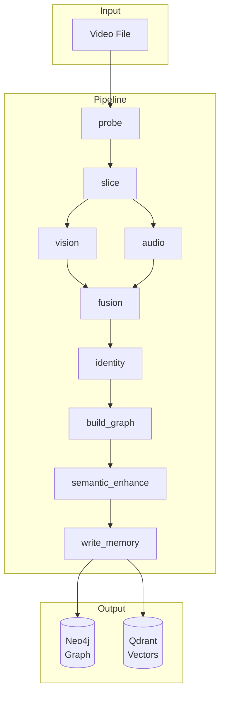

# Memorization Agent Pipeline

> **Status**: Pre-production. This doc covers current behavior + planned fixes.

## TL;DR

**Goal**: Video → Temporal Knowledge Graph → API-queryable memory

**Current Status**: `/ingest` writes Graph when `MEMA_MEMORY_API_URL` is set; missing config fails the job early.

**Priority**: Fix P0 (inject graph writer) → then P1 (validation) → P2/P3 (polish)

---

## Architecture

### Pipeline Flow

```
probe → slice → vision → audio → fusion → build_graph → semantic_enhance → write_memory → report
```

### Pipeline Steps Detail

| Step | Function | Input | Output |
|------|----------|-------|--------|
| **probe** | Extract video metadata | Video file | Duration, FPS, resolution |
| **slice** | Segment video into clips | Video + config | Frames, audio chunks per segment |
| **vision** | Face/Object/Scene detection | Frames | Evidence nodes with embeddings + bboxes |
| **audio** | Voice embedding + ASR | Audio chunks | Voice evidence + utterances with timestamps |
| **fusion** | Cross-modal tracking | Vision + Audio | Character mappings (voice↔face) |
| **build_graph** | Construct TKG | All evidence | Segments, Entities, Events, Places, Edges |
| **semantic_enhance** | LLM enrichment (optional) | Graph | Enhanced descriptions, event summaries |
| **write_memory** | Persist to storage | Graph | Qdrant vectors; Neo4j nodes/edges **only if** GraphUpsert is injected |

### Graph Schema (TKG v1)

**Nodes**:
- `MediaSegment`: Video clip with time range (`t_media_start`, `t_media_end`)
- `Evidence`: Detection result (face/voice/object/scene) with embedding
- `Entity`: Aggregated identity (`PERSON`, `OBJECT`, `SCENE`)
- `Event`: Semantic occurrence (action, dialog, scene change)
- `Place`: Location/scene classification
- `UtteranceEvidence`: ASR transcript with speaker association

**Edges**:
- `CONTAINS_EVIDENCE`: Segment → Evidence
- `BELONGS_TO_ENTITY`: Evidence → Entity
- `SPOKEN_BY`: Utterance → Entity (person)
- `INVOLVES`: Event → Entity
- `OCCURS_AT`: Event → Place
- `NEXT_SEGMENT`: Temporal chain (built in)
- `NEXT_EVENT`: Post-processing (admin API)

### Identity Resolution

1. **Face clustering**: InsightFace embeddings → cosine similarity → cluster per tenant
2. **Voice clustering**: Voice embeddings → cluster per tenant
3. **Cross-modal**: `character_mappings` from fusion (voice↔face co-occurrence)
4. **Stable ID**: `person::<tenant>::<uuid>` persisted in SQLite registry

### Data Flow (Mermaid)



---

## Resolved Gap (P0)

### Fix Summary

- ops `/ingest`: injects `memory_api_url` + `graph_write_required=True`
- SaaS `/v1/jobs/ingest`: injects `GraphApiClient` into pipeline runner
- GraphUpsert failures raise `AdapterError` → job status becomes `failed`

### Impact Matrix (Now)

| API Entry | Graph Target Injected? | Graph Written? | Vectors Written? |
|-----------|------------------------|----------------|------------------|
| `/ingest` (ops) | ✅ `memory_api_url` | ✅ (if Memory API reachable) | ✅ |
| `/v1/jobs/ingest` (SaaS) | ✅ `GraphApiClient` | ✅ (if Memory API reachable) | ✅ |
| `run_real_pipeline.py` | ✅ | ✅ | ✅ |
| `run_pipeline_stub.py` | ✅ | ✅ | ❌ (stub data) |

### Required Config

- `MEMA_MEMORY_API_URL` (preferred)
- Legacy fallbacks: `MEMA_MEMORY_BASE_URL`, `MEMA_MEMORY_API_BASE` (warned)

---

## Roadmap

### P0: Fix Graph Write (Done)

Status: implemented in ops + SaaS + pipeline steps.

| Task | File | Change |
|------|------|--------|
| Inject graph writer in ops | `api/server.py` | `extra_ctx={"memory_api_url": MEMA_MEMORY_API_URL}` |
| Inject `memory_client` in SaaS | `api/saas_server.py` | `extra_ctx={"memory_client": GraphApiClient(...)}` |
| Surface graph failures | `pipeline_steps.py` | `raise AdapterError` instead of `logging.warning` |

### P1: Validation & Polish — ~1h

| Task | File | Change |
|------|------|--------|
| E2E smoke test | `modules/memorization_agent/scripts/ci_ingest_smoke.sh` | Assert `/graph/v0/segments` non-empty; allow `MEMA_SKIP_GRAPH_CHECK=1` |
| Required field validation | `api/server.py`, `api/saas_server.py` | 400 if `tenant_id` missing; `run_id` default to `job_id` |
| Unify config | Global | Done: `MEMA_MEMORY_API_URL` + deprecation warnings for old names |
| Entity timeline query | `modules/memory/infra/neo4j_store.py` | Return timeline items instead of 500 (Evidence + UtteranceEvidence) |

### P2: Enhancements (Optional)

- Auto post-processing: trigger `build_timeslices`/`build_cooccurs` after write
- Offline mode: switch Memory embedding to local models
- CLI for batch post-processing

### P3: Production Readiness (Future)

- LLM caching & idempotency
- Task state persistence (currently in-memory, lost on restart)
- Observability & alerting
- Identity merge/rollback audit trail

---

## TODOs (Execute)

- [x] **P0.1 /ingest graph writer**: inject `memory_api_url` in ops (`api/server.py`).  
      DoD: `/ingest` → `/graph/v0/segments?source_id=<run_id>` returns non-empty.
- [x] **P0.2 SaaS graph writer**: inject `memory_client` in SaaS (`api/saas_server.py`).  
      DoD: `/v1/jobs/ingest` → `/graph/v0/segments` non-empty for same tenant/run_id.
- [x] **P0.3 Fail visibility**: GraphUpsert failure raises `AdapterError` (or marks job failed).  
      DoD: job status shows `failed` with `graph_write_failed` when Graph API is down.
- [x] **P1.1 Smoke test**: extend `modules/memorization_agent/scripts/ci_ingest_smoke.sh` to assert Graph segments after ingest.  
      DoD: CI fails if Graph is empty; add skip flag when graph write disabled.
- [x] **P1.2 Required fields**: enforce `tenant_id` in ops/SaaS; `run_id` defaults to `job_id`.  
      DoD: missing tenant returns 400; run_id omitted still works.
- [x] **P1.3 Config unification**: introduce `MEMA_MEMORY_API_URL` + deprecation warnings for old names.  
      DoD: old envs still work; logs warn once; docs updated.
- [x] **P1.4 Entity timeline query**: implement `/graph/v0/entities/{id}/timeline` in Neo4jStore.  
      DoD: endpoint returns list (may be empty), never 500 on missing data.

---

## Configuration Reference

### Current (Working)

| Variable | Purpose | Required | Default |
|----------|---------|----------|---------|
| `MEMA_MEMORY_API_URL` | Unified Memory API base (graph + vector) | Yes (graph write) | - |
| `MEMA_MEMORY_BASE_URL` | Legacy base for vectors / graph fallback | Deprecated | - |
| `MEMA_MEMORY_API_BASE` | Legacy graph API base (SaaS queries) | Deprecated | - |
| `MEMA_MEMORY_MODE` | `http` or `local` | No | `local` |
| `MEMA_TENANT_ID` | Default tenant_id | Scripts only | `test_tenant` |
| `MEMA_USER_ID` | Default user_id | Scripts only | - |
| `MEMA_MEMORY_DOMAIN` | Default memory_domain | Scripts only | `general` |
| `MEMA_RUN_ID` | Default run_id | Scripts only | `<video_filename>` |
| `MEMA_FORCE_HASH_EMBEDDINGS=1` | Use hash instead of real embeddings | No | `false` |
| `MEMA_PIPELINE_LLM_SEMANTIC_ENABLE` | Enable LLM enrichment | No | `true` |
| `MEMA_PIPELINE_ASR_DEVICE` | ASR device (`cpu`/`cuda`) | Scripts only | `auto` |
| `MEMA_VOICE_DEVICE` | Voice embedding device | Scripts only | `auto` |
| `MEMA_PIPELINE_ENABLE_CLIP_IMAGE` | Enable OpenCLIP features | No | `true` |

### Deprecated Names

| Name | Replacement |
|------|-------------|
| `MEMA_MEMORY_BASE_URL` | `MEMA_MEMORY_API_URL` |
| `MEMA_MEMORY_API_BASE` | `MEMA_MEMORY_API_URL` |

---

## Storage Destinations

| Storage | Content | Prerequisite |
|---------|---------|--------------|
| **Neo4j** | Graph nodes/edges (Segments, Evidences, Entities, Events, Places) | GraphUpsert must be called |
| **Qdrant** | Vector embeddings for similarity search | MemoryAdapter write (works with `/ingest`) |
| **Local Files** | Face crops at `.artifacts/memorization/evidence_media/faces/` | Always (vision step) |

---

## Quick Verification

```bash
# 1. Check Memory health
curl http://127.0.0.1:8000/health

# 2. Check Graph has data (after running pipeline with workaround)
curl -H 'X-Tenant-ID: test_tenant' \
  'http://127.0.0.1:8000/graph/v0/segments?source_id=Jian.mp4&limit=5'
# Expected: {"items": [...]} with non-empty array

# 3. Check Entity timeline
curl -H 'X-Tenant-ID: test_tenant' \
  'http://127.0.0.1:8000/graph/v0/entities/person::test_tenant::xxx/timeline?limit=10'
# Expected: {"items":[...]} (may be empty if entity has no evidences); should not 500.

# 4. Check Vector search works
curl -H 'X-Tenant-ID: test_tenant' -X POST http://127.0.0.1:8000/search \
  -H 'Content-Type: application/json' \
  -d '{"query":"speaker","top_k":5,"filters":{"run_id":"Jian.mp4"}}'

# 5. Check ingest status (if using /ingest API)
curl http://127.0.0.1:8081/ingest/Jian.mp4/status
```

---

## Code References

| Component | Path |
|-----------|------|
| Pipeline Steps | `modules/memorization_agent/application/pipeline_steps.py` |
| Identity Resolution | `modules/memorization_agent/application/services/identity_resolution.py` |
| SQLite Identity Registry | `modules/memorization_agent/adapters/sqlite_identity_registry.py` |
| Vision Extractor | `modules/memorization_agent/adapters/vision_extractor.py` |
| Audio Extractor | `modules/memorization_agent/adapters/audio_extractor.py` |
| Graph Mapper | `modules/memorization_agent/application/videograph_to_memory.py` |
| Ops Server | `modules/memorization_agent/api/server.py` |
| SaaS Server | `modules/memorization_agent/api/saas_server.py` |
| Working Script | `modules/memorization_agent/scripts/run_real_pipeline.py` |
| Stub Script | `scripts/run_pipeline_stub.py` |

---

## Execution Plan

### Phase 1: Validate Demo (Now, ~30min)

```bash
# 1. Start services
docker start qdrant neo4j
uv run uvicorn modules.memory.api.server:app --port 8000

# 2. Run pipeline
MEMA_MEMORY_MODE=http MEMA_MEMORY_API_URL=http://127.0.0.1:8000 \
MEMA_USER_ID=subject_1 MEMA_MEMORY_DOMAIN=general MEMA_RUN_ID=Jian.mp4 \
uv run python modules/memorization_agent/scripts/run_real_pipeline.py demo/data/Jian.mp4

# 3. Verify graph is populated
curl -H 'X-Tenant-ID: test_tenant' 'http://127.0.0.1:8000/graph/v0/segments?source_id=Jian.mp4&limit=5'

# 4. Open demo_website to visualize
cd demo_website && npm run dev
```

### Phase 2: Verify /ingest Graph Write (Done)

- Ops `/ingest`: run and check `/graph/v0/segments`
- SaaS `/v1/jobs/ingest`: run and check `/graph/v0/segments`

### Phase 3: Polish (~1h)

- Add E2E smoke test
- Required field validation (tenant_id/run_id)

---

## Completed Features

- ✅ Stable IDs: hash-based IDs for face/object/voice/utterance
- ✅ Tenant-isolated identity: `person::<tenant>::<uuid>` via SQLite registry
- ✅ Voice→Person chain: SPOKEN_BY edges from utterances
- ✅ Object whitelist: only specified labels promote to Entity
- ✅ Face image persistence: saved to artifacts, only `image_ref` in graph
- ✅ Neo4j map property fix: nested objects encoded as `*_json`
- ✅ Cache isolation: per-tenant/per-run cache directories
- ✅ Cache self-healing: failed empty caches don't persist
