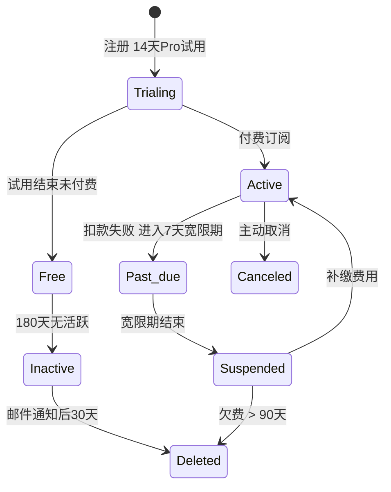

# MOYAN Memory SaaS 定价策略与商业化实施规范 (v1)

> **版本**：v1.0  
> **状态**：Draft  
> **定位**：指导产品定价、计费逻辑实现、风控策略落地的核心准则。补充 `SaaS控制面_顶层架构与计费用量策略_v1.md` 中缺失的商业化细节。

---

## 目录

1. 商业模式总览
2. 具体定价策略 (C端 / Partner / Enterprise)
3. 订阅生命周期状态机 (Status Lifecycle)
4. 权限 Scope 映射表
5. 欠费与超额降级策略 (Downgrade Policy)
6. 技术实施模型扩展
7. 分期落地计划

---

## 1. 商业模式总览

根据客户类型划分三个市场段，各自采用不同的商业模式：

| 模式 | 目标客户 | 收费模式 | 核心价值 |
| :--- | :--- | :--- | :--- |
| **C端 (Individual)** | 个人开发者、独立开发者、学习者 | **Freemium**：免费额度 + 订阅制/按量计费 | 低门槛、快速上手、灵活扩展 |
| **B-端 (Partner)** | SaaS 平台、Agent 框架商、集成商 (B2B2C) | **Revenue Share**：平台免费注册，按其终端用户用量分成 | 零前期成本、白标能力、共同增长 |
| **B端 (Enterprise)** | 中大型企业 (Direct Sales) | **License/Seat**：按座位数年费/月费 + 共享池 | 可控成本、数据隔离、统一管理、SLA |

---

## 2. 具体定价策略

### 2.0 计费/用量主轴（施工口径，必须先读）

本产品的“可计费/可限额”资源分两类：

1) **Memory 资源（我们的主收费维度）**
- **向量点（vector points）**：Qdrant 中的 point 数量（按租户聚合）。
- **图节点（graph nodes）**：Neo4j 中的节点数量（按租户聚合）。
- **吞吐/并发（throughput）**：RPM / 并发 ingest jobs（保护系统稳定性）。

> **记忆与账号共存亡**：记忆数据不设置单独的 TTL/保留期；只要账号存在，记忆就永久保留。账号清理（如 Free 用户 180 天不活跃被清理）时，记忆一并删除。

2) **LLM tokens（默认不计费，仅风控/透明度）**
- 对 **Free / Pro / Partner**：我们默认 **BYOK**（客户自行承担 LLM 账单）。  
  - tokens **不作为计费维度**；仅作为“平台处理上限/反滥用风控”与“控制台透明度（可选）”。
  - 本文档中出现的“tokens/月”均指：**MOYAN 在 Stage2/Stage3 抽取链路中，使用客户 Key 发起的模型调用所消耗的 usage（若 provider 返回）**。它不包含客户自己在其应用内调用模型的 tokens。
- 对 **Enterprise**：允许 **Managed Token 包**（由我们代付模型费用并结算给客户），此时 tokens 才可能进入商业结算（合同约定）。

> 结论：不要把 tokens 当成我们默认的"收费主轴"；我们的主轴是 **points/nodes/RPM**。

### 2.1 C端用户 (Individual)

面向个人的标准化 SaaS 服务。

| 套餐 | 价格 | LLM 模式 | 平台处理上限（风控，不计费） | 速率限制 (Rate Limits) | 存储限制（主计费/主限额） |
| :--- | :--- | :--- | :--- | :--- | :--- |
| **Free** | **¥0** | **BYOK 必须** | 1M tokens/月（仅 Stage2/Stage3 抽取） | • Ingest: 10 RPM<br>• Retrieval: 30 RPM | • 向量点: 10w<br>• 图节点: 10w |
| **Pro** | **¥XXX/月**<br>(年付 ¥XXX/月) | **BYOK 默认** | 20M tokens/月（仅 Stage2/Stage3 抽取） | • Ingest: 60 RPM<br>• Retrieval: 120 RPM | • 向量点: 100w<br>• 图节点: 100w |

**补充说明（避免误解）**
- “向量点/图节点”是工程上可执行的配额单位；文案侧如果想写“条记忆”，也必须映射回 points/nodes。
- “tokens/月”只用于平台反滥用风控：约束超长会话/超大抽取导致的后台压力；它不是收费项。

**增值服务 (Add-ons)**：
- **存储扩容包**: ¥XXX / 10w 向量点 / 月；¥XXX / 10w 图节点 / 月（如需更大容量）
- **Managed Token 包**（可选）: 为不想折腾 Key 的用户提供；由我们代付模型费用并结算，按 ¥XXX/1K tokens 收费（含服务溢价，价格后续测算）。

### 2.2 B-端合作伙伴 (Partner)

面向 B2B2C 平台的生态集成模式，核心逻辑为 **BYOK**。

- **账户费用**: ¥0 (免费注册)
- **计费模式**：
- **培养期 (首3个月)**:
  - **完全免费**: 免 API 请求费、免存储占用费。
  - **目的**: 鼓励 Partner 大规模接入并产生粘性数据。
  - **限制**: 需 Partner 签署排他性合作协议或数据留存承诺。
- **收费期 (3个月后)**:
  - **结算口径（推荐）**: 对 Partner **按月聚合结算**（按 tenant/sub-tenant 汇总），并提供按 `end_user_id`（=`user_tokens`）拆分的用量明细报表供 Partner 内部分账。
  - **计量口径**: 与 C 端一致（points/nodes/RPM），价格按合同（可为 C 端价格 × 折扣）。
  - **结算方式**:
    1. **Partner 代收代付**: Partner 向用户收费，MOYAN 按标准 C 端价格向 Partner 结算 (Partner 可加价)。
    2. **MOYAN 直收 (可选)**: 终端用户直接购买 MOYAN 存储包/Pro会员。
  - **Token**: 依然保持 **BYOK**（Partner 或其终端用户自行承担模型费用）；tokens 不作为 MOYAN 默认收费主轴，仅可用于平台风控。
- **功能**:
  - 多租户隔离
  - 用量审计（API 请求数、向量点、图节点）

### 2.3 B端企业 (Enterprise)

面向企业的坐席与资源包模式。

| 方案 | 价格 | 包含权益 | 超额/扩展 | 核心特性 |
| :--- | :--- | :--- | :--- | :--- |
| **Starter** | **¥XXX/月**<br>(年付 ¥XXX/月) | • 10 个标准座位<br>• **BYOK** 或 购买 Managed Token 包 | 座位: ¥XXX/月 | • 基础邮件支持<br>• 存储（执行口径）: points/nodes 共享池（合同填数） |
| **Business** | **¥XXX/月**<br>(年付 ¥XXX/月) | • 50 个标准座位<br>• **BYOK** 或 购买 Managed Token 包 | 座位: ¥XXX/月 | • SSO 单点登录<br>• 存储（执行口径）: points/nodes 共享池（合同填数）<br>• 24h 响应支持 |
| **Enterprise** | **¥XXX/月起**<br>(定制) | • 不限座位<br>• 混合模式 (BYOK + Managed) | 按合同约定 | • **单租户独立部署(可选)**<br>• 99.9% SLA<br>• 审计日志 & 合规<br>• 专属客户经理 |

**座位（Seat）定义（必须可执行）**
- Seat = 控制台/组织成员席位（SSO 用户/成员数上限），用于企业内部权限管理与审计责任归属。  
- Seat 不等于 end-user（最终用户）；end-user 仍通过 `user_tokens` 由企业自管。

---

## 3. 订阅生命周期状态机

### 3.1 状态定义

- **Trialing**: 试用期。享受完整功能。
- **Active**: 正常付费/服务中。
- **Past_due**: 扣款失败/欠费进入 **宽限期**。宽限期内服务可用但提示；宽限期结束转 `Suspended`。
- **Suspended**: 冻结。长期欠费或长期未活跃。服务仅只读或不可用。
- **Inactive**: **长期沉寂**。Free 用户连续 180 天无 API 调用。触发账户清理流程（邮件提醒）。
- **Canceled**: 主动取消。等待周期结束后删除。
- **Deleted**: 物理删除。不可恢复。

### 3.2 状态流转规则

#### C端 (Individual)


#### B-端 (Partner)
- **Active**: 注册即激活，无试用期。
- **Past_due**: 月结扣款失败。
- **Suspended**: 欠款 > ¥XXX 或 连续欠费 > 3个月。
- **Deleted**: Suspended 后 30天未补款。

#### B端 (Enterprise)
- **Trialing**: 签约前/部署初 30天试用 (Starter权益)。
- **Grace_Period (Past_due)**: 欠费后给予 **14天宽限期**，功能不降级，仅提示。
- **Suspended**: 宽限期后转只读。
- **Deleted**: Suspended 后 90天。

### 3.3 状态能力矩阵

| 状态 | 读写权限 | 数据保留 | 此状态持续时长 |
| :--- | :--- | :--- | :--- |
| **Trialing** | 完整 | 完整 | C端14天 / B端30天 |
| **Active** | 完整 | 永久（账号在即在） | - |
| **Past_due** | 宽限期内完整（带提醒） | 完整 | 7-14天（Grace Period） |
| **Suspended** | 只读/不可写入（或不可用，产品定） | 完整（待清理） | 90天缓冲（示例） |
| **Inactive (Free)** | 不保证可写入（可能直接清理） | 冷归档/删除 | 触发清理流程 |
| **Canceled** | 按套餐降级或只读（产品定） | 完整 | - |
| **Deleted** | 无 | **已清除** | - |

---

## 4. 权限 Scope 映射表

根据用户类型与套餐自动分配 API Scopes。

| 用户类型 | 套餐 | 默认 Scopes | 可申请 Scopes (需审批) | 说明 |
| :--- | :--- | :--- | :--- | :--- |
| **C端** | Free | `memory.read`, `memory.write` | 无 | 基础开发者权限 |
| **C端** | Pro | `memory.read`, `memory.write` | 无 | 基础开发者权限 |
| **B-端** | Partner | `memory.read`, `memory.write`, `partner.admin` | 无 | `partner.admin` 用于管理子租户 |
| **B端** | Starter | `memory.read`, `memory.write` | `memory.admin` | 基础企业权限 |
| **B端** | Business | `memory.read`, `memory.write`, `memory.admin` | - | 内置管理权限 |
| **B端** | Enterprise | `memory.read`, `memory.write`, `memory.admin` | 自定义 | 完全自定义 |

**Scope 定义补充**：
- `partner.admin`: 允许创建/删除子 Tenant、查看子 Tenant 用量、生成子 Tenant API Key、设置子 Tenant 配额。

---

## 5. 欠费与超额降级策略

### 5.1 欠费处理 (Payment Overdue)

#### C端用户
- **T+0 (扣款失败)**: 进入 **7天宽限期**。邮件通知，每天重试。功能不降级。
- **T+7**: 状态转 `Suspended`。服务暂停 (只读/不可写入)。
- **T+90 (数据清理)**: 若仍未补款，视为放弃账号。数据进入删除队列。
- **长期活跃度维护 (针对 Free)**:
  - 连续 **180天** 无 API 交互：标记为 `Inactive`。
  - 发送激活提醒邮件。
  - **T+30 (Inactivity)**: 若仍未登录/调用，执行数据清理以释放资源。

#### B-端 Partner
- **信用机制**: Partner 拥有信用额度 (如 ¥XXX) 和账期。
- **T+0**: 生成账单，T+15 付款截止。
- **触发熔断**: 累计欠费 > ¥XXX 或 账单逾期 > 3个月。
- **熔断后果**: Partner 及其 **所有子租户** 转 `Suspended` (只读)。客户经理介入。
- **理由**: 避免因 Partner 短期资金问题导致其终端用户大面积停服，损害生态信任。

#### B端 Enterprise
- **T+0 (逾期)**: 进入 **宽限期 (Grace Period)**。功能**不降级**。邮件/电话通知财务。
- **T+14**: 状态转 `Suspended`。只读模式。通知 CEO/CTO。
- **T+90**: 账户删除。发送律师函 (大额欠款)。

### 5.2 超额处理 (Quota Exceeded)

#### C端 Free
- **策略**: **Hard Reject (402)**。
- 行为: 存储配额（points/nodes）或平台处理配额（风控）满额时，拒绝写入；RPM 超限返回 429。

#### C端 Pro
- **策略**: **Hard Limit（默认）**；Auto-Scale（可选，需显式开启且必须配置预算上限）。
- 行为:
  - 默认：达到 points/nodes 配额则拒绝写入，并提示购买“存储扩容包”或升级套餐；
  - 可选：用户显式开启 Auto-Scale 后，允许自动购买扩容包；若触达 `hard_limit_budget` 则停止自动扩容并转只读/拒绝写入（产品定）。
- 风控: 单日用量突增 > 10倍，触发人工审核/临时阻断。

#### B-端 Partner
- **策略**: **Always On (累计计费)**。
- 行为: 不设硬性上限，全部超额用量计入 Partner 账单。Partner 可在自身系统对 End-User 设限。

#### B端 Enterprise
- **策略**: **Soft Limit + Alert**。
- 行为:
  - 消耗达 80%: 邮件提醒管理员。
  - 消耗达 100%: 邮件提醒，允许超额 20% (缓冲)。
  - 消耗达 120%:
    - Starter/Business: 拒绝请求，建议升级。
    - Enterprise: 按合同约定 (通常按量计费)。

---

## 6. 技术实施模型扩展

### 6.1 Tenant 模型扩展
在 `SaaS控制面_顶层架构与计费用量策略_v1.md` 的 Schema 基础上增加：
- `tenant_type`: `individual` | `partner` | `sub_tenant` | `enterprise`
- `parent_tenant_id`: 关联 Partner ID (仅 sub_tenant 有值)
- `billing_mode`: `prepaid` (C端) | `postpaid` (Partner/Ent)

### 6.2 Subscription 模型扩展
- `grace_period_ends_at`: 宽限期截止时间 (针对 B 端)
- `overdue_amount`: 当前欠费金额
- `auto_charge_overages`: bool (是否自动超额计费)
- `hard_limit_budget`: float (预算硬上限)

### 6.3 配额检查逻辑伪代码
```python
def check_quota(tenant, required_tokens):
    # 1. 状态阻断
    if tenant.status in ['suspended', 'deleted']:
        raise QuotaError("Account suspended")
        
    # 2. 计算剩余
    usage = get_current_usage(tenant.id)
    entitlement = tenant.plan.entitlement
    # 注意：BYOK 模式下 tokens 不是收费主轴；这里的 required_tokens 只能用于“平台处理配额（风控）”判断。
    # 主配额应以 points/nodes/RPM 为准（见下方）。
    
    # 3. 判决逻辑
    # 2.1 吞吐配额（RPM/并发）——建议在网关先拦，这里仅示意
    # assert usage.rpm_ingest <= entitlement.rpm_ingest
    # assert usage.rpm_retrieval <= entitlement.rpm_retrieval

    # 2.2 存储配额（主轴）
    if usage.vector_points > entitlement.max_vector_points:
        raise QuotaError("Vector storage quota exceeded")
    if usage.graph_nodes > entitlement.max_graph_nodes:
        raise QuotaError("Graph storage quota exceeded")

    # 2.3 平台处理配额（仅风控，BYOK；可选）
    if tenant.llm_mode == "byok" and entitlement.platform_processing_tokens_cap:
        if usage.stage23_tokens > entitlement.platform_processing_tokens_cap:
            raise QuotaError("Platform processing cap exceeded")

    return True
        
    # 4. 超额处理分支
    if tenant.type == 'individual':
        if tenant.auto_charge_overages:
             # Pro 自动计费，检查是否有硬预算上限
             if tenant.hard_limit_budget and current_cost > tenant.hard_limit_budget:
                 raise QuotaError("Budget limit reached")
             return True # 允许超额，记账
        else:
             raise QuotaError("Quota exceeded (Free/Pro-capped)")
             
    elif tenant.type == 'partner':
        return True # Partner 总是允许 (除非欠费熔断)
        
    elif tenant.type == 'enterprise':
        # 共享池逻辑
        return check_shared_pool(tenant)
```

---

## 7. 分期落地计划

### Phase 1: C端闭环 (4周)
- 实现 Free/Pro 套餐逻辑。
- 实现欠费宽限期（Grace Period）→ `Suspended(只读/不可写入)` 的状态机与执行点位。
- 对接 Stripe 个人支付。

### Phase 2: Partner 生态 (4-6周)
- 实现 `partner.admin` 权限与子租户管理 API。
- 实现 Partner 聚合账单与信用额度风控。

### Phase 3: Enterprise (6-8周)
- 实现 座位管理 (Seat Management) 与 共享配额池。
- 实现 宽限期 (Grace Period) 逻辑。
- SSO 与 审计日志。
