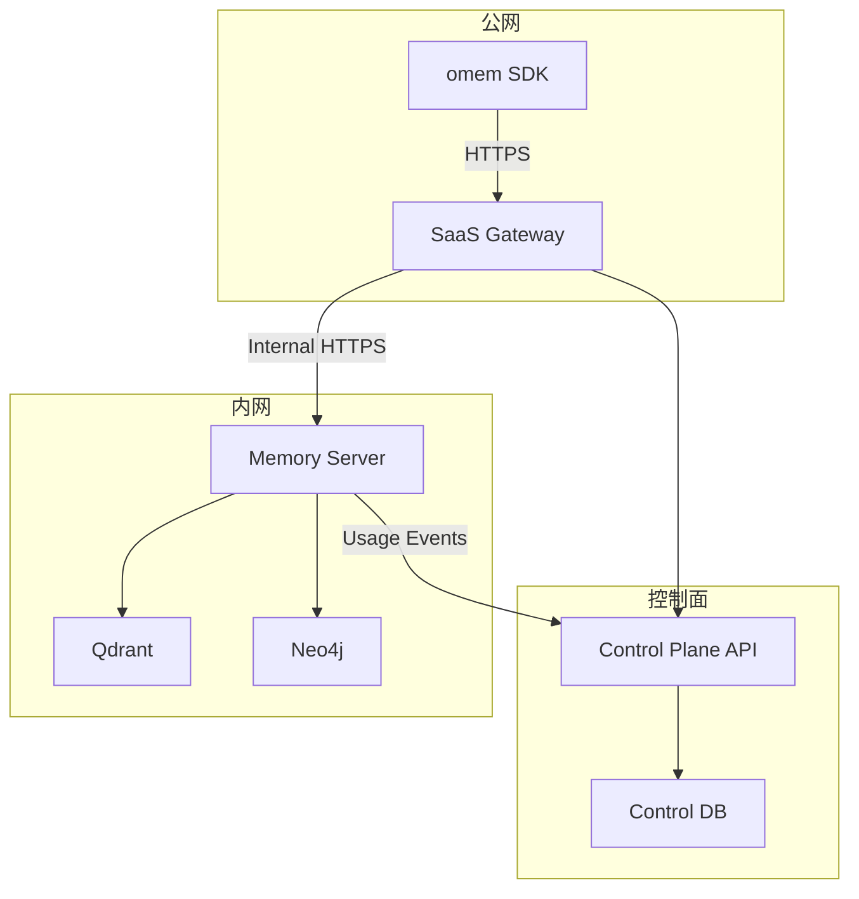

# SaaS 接线规范：`omem` SDK ↔ SaaS 网关/控制面 ↔ Memory 数据面（v1）
    
> **版本**：v1.0  
> **状态**：Draft（但本文是后续写代码的唯一依据）  
> **目标读者**：要实现 SaaS 网关/控制面/数据面/SDK 对接的工程师  
> **配套文档**：  
> - `docs/时空知识记忆系统构建理论/9. saas控制面策略/SaaS控制面_顶层架构与计费用量策略_v1.md`（控制面 Schema/JWT/配额矩阵/计量口径）  
> - `docs/时空知识记忆系统构建理论/9. saas控制面策略/SaaS定价策略与商业化实施规范_v1.md`（商业化口径：以 points/nodes 为主轴，tokens 仅平台处理上限）  
> - `开发者API 说明文档.md`、`SDK使用说明.md`（开发者视角的接口说明；SaaS 模式以本文为准）  
>
> **硬约束**：本文使用 MUST/SHOULD/MAY 描述约束。**凡与本文冲突的旧文档，一律以本文为准。**

---

## 目录

1. 背景与边界
2. 角色与信任边界（Topology）
3. 身份与数据归属（Tenant / APIKey / user_tokens）
4. 对外 Public Surface（SDK 调用的端口）
5. 三段 Header/Token 契约（外网 / 内网 / 回传）
6. 鉴权与授权（Public API Key → Internal JWT → Scopes）
7. Entitlement（套餐权益）下发与配额执行
8. 幂等与去重（commit_id / request_id / usage event_id）
9. 用量计量链路（强制 at-least-once，不允许 best-effort 丢单）
10. Partner/子租户与 Inactive 清理策略（避免误删资产）
11. 错误语义与重试策略（SDK 必须可稳定处理）
12. 端到端验收用例（E2E Checklist）

---

## 1. 背景与边界

我们要解决的真问题很简单：**把“开发者写 Agent 的 SDK 调用”可靠地接到“我们的 SaaS 控制面规则（鉴权/配额/计费）”并最终落到“Memory 数据面（写入/检索/建图）”。**

本接线规范只关心三件事：

1) SDK 如何发请求（对外协议）  
2) SaaS 网关/控制面如何解释/计量/限额并转发（中间层契约）  
3) 数据面如何信任网关、执行配额、并把用量回传（内网契约）

不在本文范围内（但会被本文依赖）：
- 控制台 UI/支付渠道（Stripe 等）具体实现细节
- 图谱建模细节（Event/Entity/TimeSlice…）与检索策略细节（在 `modules/memory` 内部）

---

## 2. 角色与信任边界（Topology）

### 2.1 一句话架构

**外网只暴露 SaaS 网关/控制面；Memory Server 不暴露公网。**



### 2.2 信任边界写死

- **SDK 不可信**：SDK 传来的 `tenant_id`、`scopes`、配额字段一律不可信，只能当作“建议/调试信息”。  
- **网关可信**：数据面只信任网关签发的内部 JWT（短 TTL）。  
- **控制面是真相源**：Tenant/APIKey/Plan/Entitlement/Usage 的最终解释权在控制面 DB。

---

## 3. 身份与数据归属（Tenant / APIKey / user_tokens）

### 3.1 Tenant（租户）

- `tenant_id` 是 SaaS 的**硬隔离边界**（计费、配额、数据隔离）。  
- SDK **不得**自行决定 `tenant_id`；`tenant_id` 必须由网关基于 Public API Key 解析得到。

### 3.2 APIKey（对外 Key vs 内部标识）

我们区分两个东西：

- **Public API Key（对外）**：开发者拿到的明文 key，用于调用 SaaS 网关。  
- **api_key_id（对内）**：控制面生成的稳定 ID（用于审计、计量、内部 JWT 的 `sub`）。

> 数据面与控制面之间只传 `api_key_id`，永不传明文 Public API Key。

### 3.3 user_tokens（终端用户/子账号隔离）

`user_tokens` 是“同一租户内不同终端用户”的隔离手段（B2B2C 必备）：

- SDK MUST 在每次 ingest/retrieval 请求体携带 `user_tokens[]`。  
- `user_tokens` SHOULD 使用稳定、非 PII 的格式，例如：`user:42`、`uid:9f3a…`。  
- Partner 的“子租户/终端用户”默认用 `user_tokens` 表达（不要求把每个 end-user 建成独立 tenant）。

---

## 4. 对外 Public Surface（SDK 调用的端口）

> 目标：对外端口越少越安全、越容易计量与支持。其余端口默认不对外开放。

### 4.1 SaaS 对外仅开放的端口（v1）

| 能力 | 方法 | Path | 说明 | 所需 Scope |
|---|---:|---|---|---|
| 探活 | GET | `/health` | 可公开（也可要求 auth） | public |
| 会话提交 | POST | `/ingest/dialog/v1` | 创建异步 job（Stage2/Stage3） | `memory.write` |
| job 状态 | GET | `/ingest/jobs/{job_id}` | 查询 ingest job 状态 | `memory.read` |
| session 状态 | GET | `/ingest/sessions/{session_id}` | 查询 session cursor/最新状态 | `memory.read` |
| 会话检索 | POST | `/retrieval/dialog/v2` | 默认 `with_answer=false` | `memory.read` |

> 说明：`/search`、`/graph/*`、`/admin/*`、`/config/*` 默认不对外。需要企业版能力时再加 scope + 白名单端口。

### 4.2 Ingest Job 状态机（SDK 必须处理）

> 状态枚举以数据面真实实现为准（`modules/memory/api/server.py` + `modules/memory/infra/ingest_job_store.py`）。  
> SDK MUST 只把 `COMPLETED` 当作“成功终态”；`PAUSED` 当作“失败终态”。

| `status` | 终态? | 说明 | SDK 建议行为 |
|---|---|---|---|
| `RECEIVED` | 否 | Job 已接收/入队 | 继续轮询 |
| `STAGE2_RUNNING` | 否 | Stage2 正在运行（turn marks/清洗） | 继续轮询 |
| `STAGE2_FAILED` | 否（可重试） | Stage2 失败；通常会在 `next_retry_at` 后自动重试；超过最大重试次数后转 `PAUSED` | 继续轮询（可根据 `next_retry_at` 增大 poll 间隔） |
| `STAGE3_RUNNING` | 否 | Stage3 正在运行（session_write/抽取/建图/写向量） | 继续轮询 |
| `STAGE3_FAILED` | 否（可重试） | Stage3 失败；通常会在 `next_retry_at` 后自动重试；超过最大重试次数后转 `PAUSED` | 继续轮询（可根据 `next_retry_at` 增大 poll 间隔） |
| `PAUSED` | 是（失败终态） | 已暂停：常见原因是 `llm_policy=require` 但缺 LLM 配置，或已达最大重试次数 | 停止轮询并报错（提示用户修复配置后重试/重新 commit） |
| `COMPLETED` | 是（成功终态） | ingest 完成 | 停止轮询并返回成功 |

建议 SDK 在 `GET /ingest/jobs/{job_id}` 的响应中记录并透传：

- `attempts`：各 stage 已尝试次数  
- `next_retry_at`：下次自动重试时间  
- `last_error`：最近一次错误（用于排障与客服）  
- `metrics`：`kept_turns`、`graph_nodes_written`、`vector_points_written` 等产出指标

---

## 5. 三段 Header/Token 契约（外网 / 内网 / 回传）

### 5.1 SDK → SaaS 网关（外网）

**认证方式（对外）**

- SDK MUST 使用 `Authorization: Bearer <public_api_key>` 调用网关。  
- 为兼容旧客户端，网关 MAY 同时接受 `X-API-Key: <public_api_key>`（但文档与 SDK 默认只写 `Authorization`）。

**必备 Headers**

| Header | 必填 | 说明 |
|---|---|---|
| `Authorization` | 是 | `Bearer <public_api_key>` |
| `Content-Type` | POST 必填 | `application/json` |
| `X-Request-ID` | 否 | SDK 可生成；若缺失由网关生成并回显 |

**可选 Headers**

| Header | 说明 |
|---|
| `Idempotency-Key` | 推荐给 ingest 使用；若缺失，以 body.commit_id 为准 |

> 关键约束：SDK 不需要传 `X-Tenant-ID`。即使传了，网关也必须忽略（以 key 解析为准）。

### 5.2 SaaS 网关 → Memory Server（内网）

**认证方式（内部）**

- 网关 MUST 为每个请求签发 `internal_jwt`（RS256），并使用 Header `X-API-Token: <internal_jwt>` 转发给数据面。  
  - 原因：当前数据面默认从 `X-API-Token` 读取 token，且不会自动剥离 `Bearer ` 前缀。

**必备 Headers**

| Header | 必填 | 说明 |
|---|---|---|
| `X-API-Token` | 是 | `<internal_jwt>` |
| `X-Request-ID` | 是 | 贯穿全链路的请求 ID（用于审计/计量/排障） |
| `X-Tenant-ID` | 建议 | 网关写入解析后的 `tenant_id`（用于兼容旧逻辑/日志对齐） |

**强制规则**

- 网关 MUST 覆盖/写入 `X-Tenant-ID`，不得透传外部传入的 `X-Tenant-ID`。  
- 网关 MUST 只转发 Public Surface 白名单端口（见第 4 节）。  

### 5.3 Memory Server → 控制面（用量回传）

数据面上报用量必须满足：

- **不阻断主流程**：上报失败不应让 `ingest/retrieval` 直接失败。  
- **不允许丢单**：上报失败必须进入可重放队列（WAL），直到成功落库（at-least-once）。

控制面必须提供内部端口（仅内网可达）：

- `POST /internal/usage/events`（批量写入 usage events，幂等）

### 5.4 Rate Limit 响应头（网关必须返回）

当网关以 `429` 拒绝请求时，MUST 返回：

| Header | 必填 | 说明 |
|---|---|---|
| `Retry-After` | 是 | 秒数（整数）；SDK 必须优先遵守 |

可选返回（便于控制台展示与 SDK 体验优化）：

| Header | 必填 | 说明 |
|---|---|---|
| `X-RateLimit-Limit` | 否 | 当前窗口配额（例如 60） |
| `X-RateLimit-Remaining` | 否 | 当前窗口剩余配额 |
| `X-RateLimit-Reset` | 否 | 窗口重置时间（unix timestamp） |

---

## 6. 鉴权与授权（Public API Key → Internal JWT → Scopes）

### 6.1 网关鉴权（外网）

网关 MUST 实现：

1) 校验 Public API Key（查控制面 DB）  
2) 得到：`tenant_id`、`api_key_id`、`scopes[]`、`plan_id`、`entitlement_version`  
3) 执行：RPM / 请求体大小 / Public Surface 白名单  
4) 生成：`internal_jwt` 并转发到数据面

### 6.2 内部 JWT Claims（写死）

```json
{
  "iss": "moyan-gateway",
  "sub": "<api_key_id>",
  "tenant_id": "<tenant_id>",
  "scopes": ["memory.read", "memory.write"],
  "plan_id": "<plan_id>",
  "entitlement_version": 1,
  "iat": 1700000000,
  "exp": 1700000300
}
```

硬约束：
- `exp - iat` MUST <= 300 秒（默认 5 分钟）
- `iss` MUST 为固定值 `moyan-gateway`

### 6.3 数据面鉴权（内网）

Memory Server MUST 配置为：

- `auth.enabled=true`
- `auth.jwt.jwks_url=<gateway_jwks_url>`
- `auth.header=X-API-Token`
- `auth.jwt.tenant_claim=tenant_id`

### 6.4 Scope 执行（网关 + 数据面双重校验）

- 网关 MUST 在转发前做一次 scope 校验（快拒绝）。  
- 数据面 MUST 在进入 handler 前做一次 scope 校验（防漏网）。

> 现状：数据面目前仅解析 tenant，不解析/不执行 scopes。要做 SaaS 必须补齐（否则是安全事故）。

---

## 7. Entitlement（套餐权益）下发与配额执行

### 7.1 关键原则

- **网关只做 Admission**：`rpm_*`、`max_request_bytes`。  
- **数据面做 Cost/Storage**：并发 job、平台处理 tokens、points/nodes 写入上限等。

### 7.2 数据面如何拿到 Entitlement（写死）

内部 JWT **只携带** `plan_id + entitlement_version`，不携带完整 entitlement 快照。

因此数据面 MUST 实现一个缓存层：

- 缓存 Key：`(plan_id, entitlement_version)`
- 缓存 TTL：建议 5 分钟（与 internal_jwt TTL 对齐）
- 缓存 Miss：调用控制面内部接口拉取

控制面内部接口（必须实现）：

- `GET /internal/plans/{plan_id}?version={entitlement_version}`
  - 返回 `Entitlement` JSON（与 `SaaS控制面_顶层架构与计费用量策略_v1.md` 的 Schema 对齐）
  - 支持 `ETag/If-None-Match`（可选）

失败语义（写死）：

- 若缓存中存在“最近一次成功拉取的 entitlement”，则可继续使用旧值（短时间容忍），并记录告警事件。  
- 若完全没有 entitlement 且控制面不可达：数据面 MUST 返回 `503 temporarily_unavailable`（宁可拒绝也不要放行无限制请求）。

---

## 8. 幂等与去重（commit_id / request_id / usage event_id）

### 8.1 ingest 幂等：commit_id

- SDK MUST 在 `POST /ingest/dialog/v1` 的 body 中携带 `commit_id`。  
- `commit_id` MUST 在同一个 `session_id` 下保持稳定（重复提交同一增量时不变）。  
- 数据面 MUST 以 `(tenant_id, session_id, commit_id)` 做 dedup，重复提交返回同一个 `job_id`（或语义等价的“已存在 job”响应）。

### 8.2 request_id：跨系统追踪与计量锚点

- 网关 MUST 为每个外部请求生成 `request_id`（UUIDv4 推荐），并通过 `X-Request-ID` 贯穿到数据面。  
- SDK MAY 自带 `X-Request-ID`，网关 SHOULD 直接复用并回显（便于端到端对账）。

### 8.3 usage event 幂等：event_id

- 控制面 `usage_events.id` MUST 全局唯一，并建立唯一索引。  
- 数据面/网关上报用量事件时 MUST 带 `event_id`，控制面 `INSERT ... ON CONFLICT DO NOTHING`。

建议的幂等 key（写死）：

| event_type | event_id 建议 |
|---|---|
| request | `hash(tenant_id + api_key_id + request_id)` |
| llm | `hash(tenant_id + api_key_id + job_id + stage + call_index)` |
| write | `hash(tenant_id + job_id + write)` |

---

## 9. 用量计量链路（强制 at-least-once，不允许 best-effort 丢单）

### 9.1 为什么必须做 at-least-once

如果 LLM 调用产生大量 tokens，但用量事件因网络抖动未落库，就会出现“账单少算/配额失效”。  
**这不是可接受的风险，是 Bug。**

### 9.2 计量责任划分（写死）

- 网关：记录 `request` 事件（HTTP 状态码、延迟、bytes、path）。  
- 数据面：记录 `llm` 与 `write` 事件（tokens、provider、stage、nodes/points 产出）。

### 9.3 数据面用量上报协议（控制面必须提供）

**Endpoint**

- `POST /internal/usage/events`

**Request**

```json
{
  "events": [
    {
      "id": "uuid-or-hash",
      "tenant_id": "t1",
      "api_key_id": "k1",
      "event_type": "llm",
      "ts": 1700000000,
      "status": "success",
      "latency_ms": 1234,
      "payload": {
        "stage": "stage3",
        "provider": "openrouter",
        "model": "google/gemini-2.5-flash",
        "prompt_tokens": 1000,
        "completion_tokens": 2000,
        "request_id": "same-as-x-request-id",
        "job_id": "job-123"
      }
    }
  ]
}
```

**Response**

```json
{
  "accepted": 20,
  "deduped": 3
}
```

### 9.4 数据面上报可靠性：WAL + 异步 Flush（短期必做）

数据面 MUST：

1) **先写 WAL**（本地持久化日志/队列）  
2) **再异步 flush** 到控制面  
3) 控制面落库成功后才 ack 并截断 WAL

> 语义：**at-least-once + 控制面幂等去重**，最终实现“不会丢、不会双算”。

最低实现（可施工）：

- WAL 存储：本地文件（JSONL）或 sqlite（推荐 sqlite，便于 ack）  
- Flush 触发：定时器 + 达到 batch_size（例如 50）  
- Flush 失败：指数退避重试，不丢数据

长期演进（可选）：
- 改为消息队列（Kafka/RabbitMQ/Redis Stream）实现天然 at-least-once。

---

## 10. Partner/子租户与 Inactive 清理策略（避免误删资产）

### 10.1 Individual（C 端）的 Inactive 清理

以 `SaaS定价策略与商业化实施规范_v1.md` 为准：Free 长期不活跃会进入清理流程。

### 10.2 Partner 的 end-user 数据不能按平台默认策略乱清

对 Partner：

- 平台 MUST 不主动按“180 天不活跃”清理 Partner 的 end-user 数据。  
- end-user 数据的保留期/清理策略 MUST 由 Partner 配置（控制面策略），平台仅提供执行能力（按策略清理）。

工程含义（写死）：

- 控制面需要 `retention_policy` 概念（可按 `tenant_id` 或按 `user_token` 细分）。  
- 数据面只负责执行删除（通过受控 admin 接口），不负责决定“删不删”。

---

## 11. 错误语义与重试策略（SDK 必须可稳定处理）

SDK 侧必须能基于 HTTP 状态码 + `error` 字段做确定性处理：

| HTTP | error | SDK 行为（建议） |
|---:|---|---|
| 400 | `validation_error` | 直接报错（代码问题） |
| 401 | `unauthorized` | 立刻失败（key 无效/过期） |
| 403 | `insufficient_scope` | 立刻失败（权限不足） |
| 413 | `payload_too_large` | 失败并提示压缩/切分 |
| 429 | `rate_limit_exceeded` | 按 `Retry-After` 退避重试 |
| 402 | `quota_exceeded` | 提示升级/扩容包（不自动重试） |
| 503/504 | `temporarily_unavailable` | 有限重试（指数退避 + 上限），降级为“无记忆” |

> 关键：检索失败不能阻断 Agent 回复；commit 失败必须可重试但不应影响当前对话。

### 11.1 SDK Retry 策略（推荐默认值）

默认值（SDK 内置；开发者可覆盖）：

- `max_retries`: 3（不含首请求）
- `max_wait_seconds`: 30（包含 sleep 的总等待上限）
- `base_backoff_seconds`: 0.5（指数退避基数）
- `jitter`: true（随机抖动，避免惊群）

重试范围（写死）：

- 仅对 `429/503/504` 进行重试。
- `429`：必须遵守 `Retry-After`；若缺失才使用指数退避。
- `503/504`：指数退避 + jitter（直到达到 `max_wait_seconds` 或 `max_retries`）。
- `400/401/403/402/413`：一律不重试（这是“配置/权限/输入问题”，重试只会放大事故）。

SDK 可提供的扩展点（MAY）：

- `retry_config=...`：覆盖默认重试参数
- `on_retry(callback)`：每次重试触发回调（用于开发者打点/日志）

---

## 12. 端到端验收用例（E2E Checklist）

### 12.1 最小闭环

1) 控制面创建 tenant + plan + api_key（拿到 public_api_key）  
2) SDK 配置 base_url=网关域名 + public_api_key  
3) SDK `commit` → `POST /ingest/dialog/v1` 返回 `job_id`  
4) SDK 轮询 `GET /ingest/jobs/{job_id}` 直到 `COMPLETED`  
5) SDK `retrieve` → `POST /retrieval/dialog/v2` 返回 evidences  
6) 控制面 usage_events 中能看到：
   - request events（网关）  
   - llm/write events（数据面，且无丢单）

### 12.2 配额生效验收

- Free 套餐写入超过 points/nodes 上限后，下一次写入返回 `402 quota_exceeded`。  
- RPM 超限返回 `429` 且带 `Retry-After`。  
- tokens 平台处理上限超过后，Stage2/Stage3 被拒绝或降级（产品策略定，但必须可解释且可审计）。
