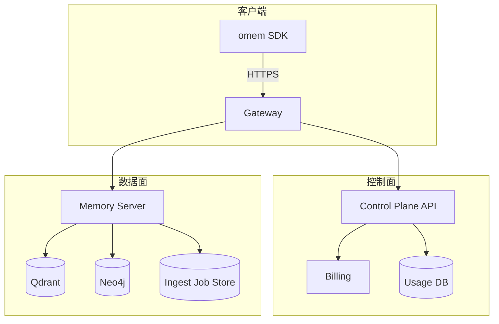

# SaaS 控制面（Control Plane）顶层架构与计费/用量策略（v0）

> **目的**：把 MOYAN Memory 从“能跑的服务”推进到“可卖的 SaaS”。  
> **范围**：仅做顶层架构与策略定义（控制面/数据面边界、租户/订阅/用量/风控/运维），不包含具体实现代码。  
> **硬约束**：Never break userspace——现有 `omem` SDK 与 Memory Server 的核心行为保持兼容；控制面以“外置网关/管理服务”方式叠加，而不是把 `modules/memory` 改造成巨型单体。

---

## 目录

1. 背景与目标
2. 现状盘点（基于代码的事实）
3. 设计原则（SaaS 版“好品味”）
4. 顶层架构：控制面 vs 数据面
5. 租户/身份/权限模型（Tenant / API Key / Scope）
6. 套餐与订阅（免费池 / 个人 / 企业）→ Entitlement
7. 用量计量（Metering）与结算（Billing）
8. 配额与风控（Admission / Cost / Storage）
9. 数据治理与合规（保留、删除、导出、审计）
10. 可靠性与运维（异步写入、重试、SLO）
11. 对外接口口径（Public Surface）与版本治理
12. 分期落地路线图（Phase 1–3）
13. TODO 清单（可执行）
14. 风险与待定项（必须显式写出来）

---

## 1. 背景与目标

我们已经具备：

- **SDK**：`omem` Python SDK，面向开发者提供 `append/commit/status/wait/retrieve` 的会话级接入；
- **服务端**：`modules/memory/api/server.py` 暴露 `/ingest/dialog/v1`（异步入队）与 `/retrieval/dialog/v2`（同步检索）等端口；
- **数据层**：Qdrant（向量召回）+ Neo4j（TKG 图结构）+ IngestJobStore（失败可重试）。

但要做 SaaS，必须补齐“控制面”：

- **谁能用**（租户/鉴权/权限/密钥管理）
- **用多少算钱**（用量计量、配额、订阅与结算）
- **用坏怎么办**（限流、并发控制、滥用治理、欠费/超额策略）
- **运营怎么做**（控制台、审计、工单与回溯、数据导出/删除）

本文件目标：把上述能力拆成清晰的组件与契约，指导后续实现，避免“先写一堆代码再补产品逻辑”的返工。

---

## 2. 现状盘点（基于代码的事实）

以下结论来自当前代码库（以 `modules/memory/api/server.py`、`modules/memory/infra/qdrant_store.py`、`modules/memory/infra/neo4j_store.py`、`modules/memory/infra/ingest_job_store.py` 为准）：

### 2.1 多租户隔离键已存在，但缺“控制面约束”

- HTTP 侧：
  - `auth.enabled=false` 时强制 `X-Tenant-ID`；
  - `auth.enabled=true` 时支持 **JWT(JWKS)** 或 **token_map** 或 **static_token** 解析 tenant。
- Qdrant 侧：过滤条件使用 `metadata.tenant_id`（硬边界）。
- Neo4j 侧：节点/关系都带 `tenant_id`；查询/约束以 `(tenant_id, id)` 为主。

**缺口**：租户之外的“Key/SCOPE/配额/套餐”并不存在；即使解析到 tenant，也无法按 Key 细分权限/用量。

### 2.2 关键对外端口已经形成“数据面 API”

面向接入闭环的最小端口：

- 写入（异步）
  - `POST /ingest/dialog/v1`：创建 ingest job，Stage2/Stage3 异步执行，可重试
  - `GET /ingest/jobs/{job_id}`：查询任务状态
  - `GET /ingest/sessions/{session_id}`：查询会话 cursor/最新任务
- 检索（同步）
  - `POST /retrieval/dialog/v2`：召回证据（可选 `with_answer` 做 QA，仅评测用）
- 通用能力（更灵活但更难控成本）
  - `POST /search`、`POST /graph/v1/search`、`POST /graph/v0/*`、`POST /write` 等

**SaaS 关键点**：必须冻结“对外公开的最小 Surface”，否则你会被自己的“全功能端口”拖死（安全、计量、兼容性、支持成本全部爆炸）。

### 2.3 现有安全/保护是“骨架”，但不是“可结算的 SaaS”

- 有速率限制（token bucket），但当前默认仅覆盖一部分 mutation 路径；
- 有高成本端点熔断（`/search`、`/retrieval`、`/graph/v1/search`），但这属于自保，不属于可计费的配额；
- 指标是进程内计数器（`modules/memory/application/metrics.py`），无法作为账单与审计依据。

---

## 3. 设计原则（SaaS 版“好品味”）

### 3.1 控制面与数据面解耦：别把 Memory Server 写成网关/计费系统

**数据面**（Memory Server）只做：写入/抽取/建图/检索/治理执行。  
**控制面**做：租户/密钥/订阅/用量/账单/风控/运营。

理由：数据面是性能与稳定性导向；控制面是规则与合规导向。混在一起是复杂性源头。

### 3.2 “可卖”优先于“全能”

先定义**能卖的一条闭环**：

1) 开发者拿到 API Key → 2) SDK `commit` 写入 → 3) SDK `retrieve` 检索 → 4) 控制台看到用量与账单 → 5) 超额/欠费策略明确

其他高级端口（如 `/graph/v0/admin/*`、动态调参 `/config/*`）默认只开放给内部/企业管理员。

### 3.3 计量必须“可审计、可对账”

进程内 metrics 只能用于观察，不可用于计费。计量必须写入持久存储（推荐 Postgres 起步）。

### 3.4 把 LLM 的不确定性关进笼子

LLM 是成本中心 + 不稳定源。SaaS 必须具备：

- per-tenant 的并发限制与 token 配额
- 失败可重试、可回放（你们已有 job store 基础）
- 可降级策略（例如：Stage3 失败暂存归档，后续重试；检索失败不阻断对话）

---

## 4. 顶层架构：控制面 vs 数据面

### 4.1 推荐的组件拓扑

### 4.2 核心边界（写死）

- **控制面**对外提供：
  - 创建租户、发放/轮换/吊销 API Key
  - 查询用量、剩余额度、账单与发票
  - 配置套餐（Entitlement）与欠费策略
- **数据面**对外提供（被网关保护后）：
  - `POST /ingest/dialog/v1`（写入）
  - `POST /retrieval/dialog/v2`（检索）
  - （可选）`POST /search`（高级检索，企业/内部才开放）

---

## 5. 租户/身份/权限模型（Tenant / API Key / Scope）

### 5.1 三层身份：Tenant / API Key / End-User

1) **Tenant（租户）**：SaaS 的计费与隔离边界。  
2) **API Key（开发者密钥）**：访问凭证与最小权限单元（要能吊销/审计/限流）。  
3) **End-User（用户）**：开发者自己的用户体系，透传为 `user_tokens`，由开发者在自己的系统里做权限控制。

> 关键：我们不接管客户的 end-user 账户体系，只提供 `user_tokens` 作为隔离标签。

### 5.2 Scope（权限）建议

最小可用：

- `memory.read`：允许 retrieval/search
- `memory.write`：允许 ingest/write
- `memory.admin`：允许 config/admin/graph upsert 等高危端口

默认对外（个人/免费池）：`memory.read + memory.write`，但不开放 `memory.admin`。

---

## 6. 套餐与订阅（免费池 / 个人 / 企业）→ Entitlement

### 6.1 Entitlement（权益）是套餐的唯一真相源

把套餐拆成“可计算的配置项”，而不是写死在代码里：

**A. Admission（入口）**
- `rpm_ingest`
- `rpm_retrieval`
- `max_request_bytes`
- `max_concurrent_ingest_jobs`

**B. Cost（成本：LLM）**
- `monthly_llm_tokens_in`
- `monthly_llm_tokens_out`
- `allowed_models`（白名单）
- `max_llm_max_tokens_per_call`

**C. Storage（资产）**
- `max_vector_points`
- `max_graph_nodes`
- `default_retention_days`（默认 TTL 策略）
- `max_retention_days`（强上限）

### 6.2 三档建议（示例，不是最终数值）

| 档位 | 目标用户 | 核心策略 |
|---|---|---|
| Free（免费池） | 试用/个人开发 | 低并发 + 强限流 + 低 tokens 上限 + 低保留期 |
| Personal（个人订阅） | 独立开发者/小应用 | 中等 RPM + 中等 tokens + 有基础审计/用量报表 |
| Enterprise（企业） | 生产系统 | 高并发/高 RPM + 可自带模型 key + SSO + 审计 + 导出/删除 + 可单租户部署 |

---

## 7. 用量计量（Metering）与结算（Billing）

### 7.1 为什么必须做“可审计计量”

- 进程内 metrics 会丢、会重启归零、无法对账；
- 计费/限额/风控都依赖“可追溯事实”。

### 7.2 三类用量事件（建议）

1) **RequestEvent（HTTP 请求）**
- tenant_id / api_key_id / path / status / latency_ms / req_bytes / resp_bytes

2) **LLMEvent（模型调用）**
- tenant_id / api_key_id / stage(stage2/stage3/retrieval_qa) / provider / model / prompt_tokens / completion_tokens / latency_ms / status / cost_estimate

3) **IngestWriteEvent（写入产出）**
- tenant_id / job_id / kept_turns / graph_nodes_written / vector_points_written

### 7.3 结算方式建议（起步版）

- 用 Postgres 存 `usage_events`，每日聚合到 `usage_daily`；
- 账单按月冻结 `usage_monthly`；
- Stripe/… 仅负责“收钱与发票”，不负责“你怎么计量”。

---

## 8. 配额与风控（Admission / Cost / Storage）

### 8.1 Enforcement 点：在哪一层拦？

- **网关（Gateway）**：限流、并发、请求体大小、Key 校验（快，省资源）
- **数据面（Memory Server）**：LLM token 配额、Stage2/3 并发、存储额度（只有这里看得到）

### 8.2 超额策略（必须明确）

建议统一返回：

- 超额：`429`（软限流）或 `402 Payment Required`（付费相关）  
- 并发满：`503` + `Retry-After`

并且控制台必须能展示“为什么被拒绝”（否则支持成本爆炸）。

---

## 9. 数据治理与合规（保留、删除、导出、审计）

SaaS 必须默认具备：

- **可配置的保留策略**：默认 TTL（按 domain/importance），企业可覆盖；
- **删除**：按 tenant 全量删除、按 user_tokens 删除、按 session 删除（合规/用户请求）；
- **导出**：企业至少提供“按 tenant/time_range 导出”；
- **审计**：写/删/配置/导出必须留痕（最小：谁、何时、做了什么、影响范围）。

---

## 10. 可靠性与运维（异步写入、重试、SLO）

### 10.1 异步写入（现状可用，但要明确扩展方向）

当前 `/ingest/dialog/v1` 是“接收 → job store → asyncio task 执行 Stage2/3 → 失败重试”。

SaaS 规模化后推荐演进：

- Job store 从本地 SQLite → Postgres
- 执行从 API 进程内 asyncio task → 独立 worker（队列：Redis/Rabbit/Kafka 任一）

### 10.2 可见性门闩（Published Gate）

对外可见的索引/节点必须具备“发布门闩”：

- 写入阶段：`published=false`
- 全部写成功后：批量 `publish=true`
- 读路径默认过滤 `published=true`（你们现在的默认过滤已具备雏形）

这条规则的意义：避免“Neo4j 写了、Qdrant 失败”这种部分写入对外可见，导致用户看到脏状态。

### 10.3 SLO（建议口径）

- 写入提交（ingest 接收）：P95 < 300ms（只入队）
- 检索（retrieval）：P95 < 2s（不含 QA；QA 默认关闭）
- 写入完成（Stage3 完成）：异步 SLA（例如 1–5 分钟内完成 99%）

---

## 11. 对外接口口径（Public Surface）与版本治理

### 11.1 对外公开的最小端口（建议）

- `POST /ingest/dialog/v1`
- `GET /ingest/jobs/{job_id}`
- `GET /ingest/sessions/{session_id}`
- `POST /retrieval/dialog/v2`
- `GET /health`（可不鉴权）

### 11.2 默认不公开（或仅企业/内部）

- `/config/*`（动态调参）
- `/admin/*`、`/graph/v0/admin/*`
- `/write`、`/delete` 等原子级写接口（除非你们明确要支持“非对话写入产品”）

### 11.3 版本治理

- 公开端口必须语义化版本：`/ingest/dialog/v1`、`/retrieval/dialog/v2`
- 向后兼容优先：新增字段可选、默认值稳定；破坏性变更只能出新版本路径

---

## 12. 分期落地路线图（Phase 1–3）

### Phase 1（最少可卖）

- API Key 管理（发放/轮换/吊销）
- 网关注入内部 JWT（tenant_id、key_id、scope、plan_id）
- Request/LLM/Write 三类用量事件落库
- 免费池与个人订阅的基础额度 + 超额返回

### Phase 2（个人订阅成体系）

- Stripe 等订阅闭环
- 控制台用量/账单展示
- 欠费/超额降级策略（只读/只检索/排队）

### Phase 3（企业）

- SSO + 成员/角色
- 审计日志
- 数据导出/删除（合规）
- 单租户部署（可选高价）

---

## 13. TODO 清单（可执行）

> 这是“工程可落地”的 TODO，不是愿望清单。

1) **冻结 Entitlement 字段**：把配额/特性定义成一个稳定 schema（控制面与数据面共同遵守）  
2) **冻结 UsageEvent schema**：三类事件字段、聚合口径、幂等 key  
3) **确定对外 Public Surface**：明确哪些端口对外 GA，哪些必须网关禁用  
4) **定义超额策略**：429/402/503 的语义、Retry-After、控制台展示口径  
5) **定义 Key scope**：read/write/admin 与端口映射表  
6) **定义 SLO**：retrieval P95、ingest 接收延迟、异步完成 SLA  

---

## 14. 风险与待定项（必须显式）

1) **Job store 与 worker 形态**：当前 sqlite + in-proc task 不适合多实例水平扩展（短期能跑，长期要拆）  
2) **高成本端点配额**：目前限流主要在写路径，SaaS 必须把 retrieval/search/graph_search 的 cost 纳入配额  
3) **LLM 账单爆炸风险**：必须有 per-tenant token 配额与 max_tokens 上限，否则一个租户就能把成本打穿  
4) **审计与合规**：企业客户会强制要求“谁写的/谁删的/导出了什么”，这不是可选项  
