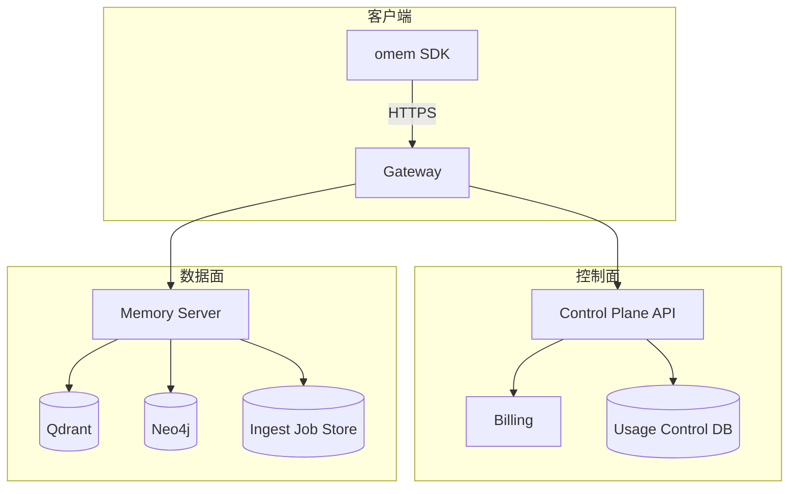

# SaaS 控制面（Control Plane）施工蓝图：Schema / JWT / 配额 / 计量 / 结算（v1）

> **定位**：本文件是“工程图”（可直接照着落地），不是“愿景/规划”。  
> **适用对象**：要把 `omem` SDK + `modules/memory` 数据面接入到 SaaS 的研发/运维/产品。  
> **不破坏兼容**：现有 `omem` SDK 与数据面核心端口（`/ingest/dialog/v1`、`/retrieval/dialog/v2`）不改语义。  
> **本版本相对 v0 的差异**：补齐了可施工的 **核心 Schema**、**网关→数据面内部 JWT 结构**、**配额执行矩阵**、**Scope/端点映射表**、**套餐默认数值**、**用量聚合口径（SQL）**、**错误响应规范**、**SLO 测量方法**、**分期交付物与验收场景**。

---

## 目录

1. 现状快照（基于当前代码）
2. 顶层架构：控制面 vs 数据面（边界写死）
3. 核心数据模型（Schema 定义，控制面真相源）
4. 内部通信协议：Gateway → DataPlane JWT（结构与校验）
5. Scope 与端点权限映射表（Public Surface 冻结）
6. 配额执行点位矩阵（在哪一层、何时拦、返回什么）
7. 用量计量（Metering）：事件类型、字段、幂等
8. 用量聚合口径（usage_daily / usage_monthly，SQL）
9. 套餐默认值（Free / Personal / Enterprise）
10. Ingest Job：从 SQLite → Postgres Worker 的最小演进方案
11. 统一错误响应规范（429/402/403/413/503…）
12. SLO 与可观测性（指标、PromQL、告警阈值）
13. 分期落地：产出物与验收场景（Phase 1–3）
14. 风险与硬约束（必须写死，避免事故）

---

## 1. 现状快照（基于当前代码）

### 1.1 数据面（Memory Server）已具备的能力

以 `modules/memory/api/server.py` 为准，当前对外（HTTP）最关键端口是：

- 会话写入（异步）
  - `POST /ingest/dialog/v1`：接收 turns，创建异步 ingest job（Stage2/Stage3）
  - `GET /ingest/jobs/{job_id}`：查 job 状态
  - `GET /ingest/sessions/{session_id}`：查 session cursor/最新状态
- 会话检索（同步）
  - `POST /retrieval/dialog/v2`：检索 evidences（默认 `with_answer=false`）
- 其他端口（能力全，但 SaaS 默认不开放）
  - `POST /search`、`POST /graph/v1/search`、`POST /graph/v0/upsert`、`POST /write|update|delete|…`、`POST /config/*`、`POST /admin/*`

### 1.2 鉴权/隔离骨架已存在，但缺控制面规则

- `auth.enabled=false`：要求 `X-Tenant-ID`，无 token 校验（开发模式）
- `auth.enabled=true`：支持 JWT(JWKS)/token_map/static_token 解析 tenant（生产骨架）
- 已有可选 HMAC 签名（写接口 `require_signature=True`），用于防误写/重放

SaaS 缺的不是“再造鉴权”，缺的是：

- **API Key 生命周期管理**（发放/轮换/吊销/审计）
- **Scope**（read/write/admin）与端点映射
- **Entitlement（套餐权益）**与配额执行
- **可审计用量（Usage）**与结算

---

## 2. 顶层架构：控制面 vs 数据面（边界写死）

### 2.1 推荐组件拓扑



### 2.2 边界（必须写死，否则系统会变成怪物）

- **控制面负责**：Tenant/Key/Plan/Entitlement/Usage/Billing/Audit（规则与合规）
- **网关负责**：外部鉴权、速率限制（RPM）、请求体大小、Public Surface 白名单、注入内部 JWT
- **数据面负责**：写入/抽取/建图/检索/治理执行（性能与稳定性）

> 关键语义：数据面不直接依赖 Stripe，也不直接提供“创建租户/生成 key”能力。

---

## 3. 核心数据模型（Schema 定义，控制面真相源）

> 目标：把“散文建议”变成“可复制到代码的契约”。  
> 说明：以下以 Pydantic 形式表达（便于直接搬到代码），也可等价转为 JSON Schema。

### 3.1 Tenant / APIKey / Plan / Subscription

```python
from __future__ import annotations

from datetime import datetime
from typing import Dict, List, Literal, Optional
from pydantic import BaseModel, Field


class Tenant(BaseModel):
    """租户：SaaS 的计费与隔离边界（硬边界）"""

    id: str = Field(..., description="唯一标识（建议 UUID 或短 ID）")
    name: str
    status: Literal["active", "suspended", "deleted"] = "active"
    plan_id: str = Field(..., description="绑定套餐")
    created_at: datetime
    metadata: Dict[str, object] = Field(default_factory=dict)


class APIKey(BaseModel):
    """API Key：访问凭证与最小权限单元（可吊销、可审计、可限流）"""

    id: str = Field(..., description="key_id（用于审计、JWT sub）")
    tenant_id: str
    key_hash: str = Field(..., description="SHA256(plain_key)，明文不落库")
    key_prefix: str = Field(..., description="前缀（UI 展示/排障），例如前 8 位")
    name: str = Field(default="", description="用户可读名称")
    scopes: List[str] = Field(default_factory=list, description="权限列表：memory.read/write/admin")
    status: Literal["active", "revoked"] = "active"
    created_at: datetime
    last_used_at: Optional[datetime] = None
    expires_at: Optional[datetime] = None


class Plan(BaseModel):
    """套餐定义：由运营维护，映射到 Entitlement"""

    id: str
    name: str
    entitlement: "Entitlement"
    status: Literal["active", "deprecated"] = "active"
    version: int = Field(1, description="计划版本（用于快照/缓存失效）")


class Subscription(BaseModel):
    """订阅：对接支付渠道（Stripe/…）"""

    tenant_id: str
    plan_id: str
    status: Literal["trialing", "active", "past_due", "canceled"] = "active"
    billing_provider: Optional[str] = None
    billing_customer_id: Optional[str] = None
    current_period_start: Optional[datetime] = None
    current_period_end: Optional[datetime] = None
```

### 3.2 Entitlement（权益：套餐可计算配置项）

> 原则：Entitlement 是“配置”，不是“代码常量”。  
> 同时必须定义：**默认值（fallback）** 与 **硬上限（hard limit）** 的关系。

```python
from pydantic import BaseModel, Field
from typing import List


class Entitlement(BaseModel):
    """权益：配额 + 功能开关。控制面与数据面共同遵守。"""

    # ---- Admission（入口保护，建议由网关执行）----
    rpm_ingest: int = Field(60, description="每分钟 ingest 请求上限")
    rpm_retrieval: int = Field(120, description="每分钟 retrieval 请求上限")
    rpm_search: int = Field(300, description="每分钟 search/graph_search 请求上限（若对外开放）")
    max_request_bytes: int = Field(10 * 1024 * 1024, description="单次请求体上限")
    max_concurrent_ingest_jobs: int = Field(5, description="每租户同时运行 ingest job 上限")

    # ---- LLM 平台处理配额（BYOK 默认不计费；数据面计量/执行）----
    monthly_llm_tokens_in: int = Field(1_000_000, description="月度输入 tokens 上限（平台后台处理，仅 Stage2/Stage3）")
    monthly_llm_tokens_out: int = Field(500_000, description="月度输出 tokens 上限（平台后台处理，事后计量）")
    allowed_models: List[str] = Field(default_factory=lambda: ["gpt-4o-mini"], description="允许的模型白名单")
    max_llm_max_tokens_per_call: int = Field(4096, description="单次 LLM 调用 max_tokens 上限（产品上限）")

    # ---- Storage（资产，数据面执行）----
    max_vector_points: int = Field(100_000, description="向量点数上限（主限额/主计费口径）")
    max_graph_nodes: int = Field(100_000, description="图节点数上限（主限额/主计费口径）")
    # 记忆与账号共存亡：默认不设置“按条目 TTL”的保留期；账号删除/清理时记忆一并删除（策略见商业化文档）。
```

### 3.3 UsageEvent（计量原子单位）

> 口径：先记“可对账的原始事实”（tokens/bytes/latency），成本美元估算放控制面离线算（避免价格表漂移与多 provider 差异）。

```python
from datetime import datetime
from typing import Dict, Literal, Optional
from pydantic import BaseModel, Field


class UsageEvent(BaseModel):
    id: str = Field(..., description="事件 UUID（幂等 key 的外显）")
    tenant_id: str
    api_key_id: str
    event_type: Literal["request", "llm", "write"]
    timestamp: datetime

    status: Literal["success", "error", "throttled"] = "success"
    latency_ms: int = 0

    # request fields
    path: Optional[str] = None
    method: Optional[str] = None
    req_bytes: Optional[int] = None
    resp_bytes: Optional[int] = None
    http_status: Optional[int] = None

    # llm fields
    stage: Optional[Literal["stage2", "stage3", "retrieval_qa"]] = None
    provider: Optional[str] = None
    model: Optional[str] = None
    prompt_tokens: Optional[int] = None
    completion_tokens: Optional[int] = None
    billable_units: Optional[Dict[str, float]] = None  # 兼容 Gemini chars 等

    # write fields
    job_id: Optional[str] = None
    kept_turns: Optional[int] = None
    graph_nodes_written: Optional[int] = None
    vector_points_written: Optional[int] = None
```

---

## 4. 内部通信协议：Gateway → DataPlane JWT（结构与校验）

### 4.1 目标

- 数据面无需每次请求都回查控制面（否则延迟与耦合爆炸）
- 数据面只信任网关签发的内部 JWT（短 TTL）
- 最坏生效窗口可控（例如 5 分钟内封禁/降额生效）

### 4.2 内部 JWT Claims（推荐）

```python
from pydantic import BaseModel, Field
from typing import List, Optional, Literal


class InternalJWTClaims(BaseModel):
    iss: Literal["moyan-gateway"] = "moyan-gateway"
    sub: str = Field(..., description="api_key_id（不是明文 key）")
    tenant_id: str
    scopes: List[str] = Field(..., description="['memory.read','memory.write',…]")
    plan_id: str
    entitlement_version: int = Field(..., description="Plan.version 或单独 entitlement 版本号")
    iat: int = Field(..., description="签发时间（unix seconds）")
    exp: int = Field(..., description="过期时间（建议 5 分钟）")

    # 可选：仅在“网关无状态、数据面无法快速拉取 entitlement”时启用
    # 默认不建议开启（JWT 变大 + 演进困难）
    entitlement_snapshot: Optional[dict] = None
```

### 4.3 传输方式（写死）

- Header（推荐，对齐当前数据面默认实现）：`X-API-Token: <internal_jwt>`（注意：直接放 JWT 原文，不带 `Bearer ` 前缀）
- 数据面配置：`auth.enabled=true` + `jwt.jwks_url` 指向网关 JWKS

> 说明：若后续要改为标准 `Authorization: Bearer <internal_jwt>`，需要数据面在取 token 时剥离 `Bearer ` 前缀（否则 JWT 解码会失败）。

### 4.4 校验规则（数据面）

最低要求：

1) 验签（RS256 推荐，便于轮换；JWKS 缓存 5–15 分钟）  
2) `iss == "moyan-gateway"`  
3) `exp > now`  
4) 提取：`tenant_id`、`sub(api_key_id)`、`scopes`、`plan_id`、`entitlement_version`

---

## 5. Scope 与端点权限映射表（Public Surface 冻结）

> 原则：**对外端口越少越安全、越便于计量与支持**。  
> 实施：网关只转发白名单端点；数据面再做 scope 二次校验（防漏网）。

### 5.1 Scope 定义

- `memory.read`：检索与状态查询
- `memory.write`：会话写入（ingest）
- `memory.admin`：配置/删除/图写入/导出等高危操作（默认不对外）

### 5.2 端点 → Scope 映射（建议默认）

| 端点 | 方法 | 所需 Scope | 说明 |
|---|---:|---|---|
| `/health` | GET | 公开 | 健康检查 |
| `/ingest/dialog/v1` | POST | `memory.write` | 会话提交（异步） |
| `/ingest/jobs/{job_id}` | GET | `memory.read` | job 状态 |
| `/ingest/sessions/{session_id}` | GET | `memory.read` | session cursor |
| `/retrieval/dialog/v2` | POST | `memory.read` | 会话检索（默认不做 QA） |
| `/search` | POST | `memory.read` | 高级检索（建议仅企业/内部） |
| `/graph/v1/search` | POST | `memory.read` | 图搜索（建议仅企业/内部） |
| `/write` | POST | `memory.admin` | 原子写入（默认不开放） |
| `/delete` | POST | `memory.admin` | 删除（默认不开放） |
| `/graph/v0/upsert` | POST | `memory.admin` | 图写入（默认不开放） |
| `/graph/v0/admin/*` | * | `memory.admin` | 图管理端点 |
| `/config/*` | * | `memory.admin` | 动态调参 |
| `/admin/*` | * | `memory.admin` | 运维端点 |

> 生产安全兜底策略（建议）：网关只允许 public surface；数据面对非白名单直接 404（避免泄露内部能力）。

---

## 6. 配额执行点位矩阵（在哪一层、何时拦、返回什么）

> 目标：施工时能直接定位“在哪个环节加检查”。  
> 规则：Admission 类在网关拦（快）；Cost/Storage 类在数据面拦（只有它看得到）。

| 配额/策略 | 执行层 | 执行时机 | 拒绝响应 | 施工锚点（建议） |
|---|---|---|---|---|
| `rpm_ingest` | 网关 | 请求进入 | 429 + Retry-After | gateway middleware |
| `rpm_retrieval` | 网关 | 请求进入 | 429 + Retry-After | gateway middleware |
| `rpm_search` | 网关 | 请求进入 | 429 + Retry-After | gateway middleware |
| `max_request_bytes` | 网关（优先）+ 数据面兜底 | 读取 Content-Length | 413 | data-plane 仍保留 `max_request_bytes` 兜底 |
| `max_concurrent_ingest_jobs` | 数据面 | `POST /ingest/dialog/v1` 入库前 | 429/503 | `ingest_dialog_v1`：按 tenant 统计 running jobs |
| `monthly_llm_tokens_in` | 数据面 | LLM 调用前 | 402 | LLM Adapter 调用入口 |
| `monthly_llm_tokens_out` | 数据面 | LLM 调用后（计量） | 不阻断（或下一次拒绝） | LLM Adapter 调用出口 |
| `max_llm_max_tokens_per_call` | 数据面 | 组装请求参数时 | 400/409 | 把 `max_tokens = min(req, entitlement, HARD_LIMIT)` |
| `max_vector_points` | 数据面 | 写入前（或每日巡检） | 402/409 | 写入路径（Stage3）检查当前占用 |
| `max_graph_nodes` | 数据面 | 写入前（或每日巡检） | 402/409 | 图写入路径（Stage3）检查当前占用 |

**重要修正（对齐工程现实）**

- `monthly_llm_tokens_out` 无法“调用前严格预测”，必须靠：
  1) `max_tokens` 上限（硬防线）  
  2) 调用后精确计量  
  3) 超额后下一次拒绝或降级（例如只做 Stage2，不做 Stage3）

---

## 7. 用量计量（Metering）：事件类型、字段、幂等

### 7.1 计量事件责任划分（建议）

- 网关：记录 `request` 类事件（RPS/RPM、延迟、状态码、bytes）
- 数据面：
  - 记录 `llm` 类事件（tokens/units、provider/model、stage）
  - 记录 `write` 类事件（job 产出：kept_turns/nodes/points）

### 7.2 幂等（避免重复计费/重复统计）

建议统一定义 `event_id` 幂等 key：

- `request`：`hash(tenant_id + api_key_id + request_id)`（request_id 由网关生成并透传）
- `llm`：`hash(tenant_id + api_key_id + job_id + stage + call_index)`  
- `write`：`hash(tenant_id + job_id + "write")`

> 规则：写入 `usage_events` 采用 `INSERT ... ON CONFLICT DO NOTHING`，保证重试不会双记。

---

## 8. 用量聚合口径（usage_daily / usage_monthly，SQL）

> 原则：账单与控制台读聚合表；原始事件可归档（降存储成本）。

### 8.1 `usage_events`（原始流水）

```sql
CREATE TABLE IF NOT EXISTS usage_events (
  id UUID PRIMARY KEY,
  tenant_id VARCHAR(64) NOT NULL,
  api_key_id VARCHAR(64) NOT NULL,
  event_type VARCHAR(16) NOT NULL, -- request|llm|write
  ts TIMESTAMPTZ NOT NULL DEFAULT NOW(),
  status VARCHAR(16) NOT NULL DEFAULT 'success',
  latency_ms INT,
  payload JSONB NOT NULL DEFAULT '{}'::jsonb
);

CREATE INDEX IF NOT EXISTS idx_usage_events_tenant_ts ON usage_events(tenant_id, ts);
CREATE INDEX IF NOT EXISTS idx_usage_events_key_ts ON usage_events(api_key_id, ts);
```

### 8.2 `usage_daily`（每日聚合，控制台主数据源）

```sql
CREATE TABLE IF NOT EXISTS usage_daily (
  tenant_id VARCHAR(64) NOT NULL,
  d DATE NOT NULL,

  requests_ingest_total INT DEFAULT 0,
  requests_retrieval_total INT DEFAULT 0,
  requests_search_total INT DEFAULT 0,
  requests_other_total INT DEFAULT 0,

  llm_calls_total INT DEFAULT 0,
  llm_tokens_in_total BIGINT DEFAULT 0,
  llm_tokens_out_total BIGINT DEFAULT 0,

  graph_nodes_written_total INT DEFAULT 0,
  vector_points_written_total INT DEFAULT 0,

  PRIMARY KEY (tenant_id, d)
);
```

### 8.3 每日聚合任务（示例）

```sql
INSERT INTO usage_daily(tenant_id, d,
  requests_ingest_total, requests_retrieval_total, requests_search_total, requests_other_total,
  llm_calls_total, llm_tokens_in_total, llm_tokens_out_total,
  graph_nodes_written_total, vector_points_written_total
)
SELECT
  tenant_id,
  DATE(ts) AS d,

  COUNT(*) FILTER (WHERE event_type='request' AND (payload->>'path')='/ingest/dialog/v1') AS requests_ingest_total,
  COUNT(*) FILTER (WHERE event_type='request' AND (payload->>'path')='/retrieval/dialog/v2') AS requests_retrieval_total,
  COUNT(*) FILTER (WHERE event_type='request' AND (payload->>'path') IN ('/search','/graph/v1/search')) AS requests_search_total,
  COUNT(*) FILTER (WHERE event_type='request' AND (payload->>'path') NOT IN ('/ingest/dialog/v1','/retrieval/dialog/v2','/search','/graph/v1/search')) AS requests_other_total,

  COUNT(*) FILTER (WHERE event_type='llm') AS llm_calls_total,
  COALESCE(SUM((payload->>'prompt_tokens')::bigint) FILTER (WHERE event_type='llm'),0) AS llm_tokens_in_total,
  COALESCE(SUM((payload->>'completion_tokens')::bigint) FILTER (WHERE event_type='llm'),0) AS llm_tokens_out_total,

  COALESCE(SUM((payload->>'graph_nodes_written')::int) FILTER (WHERE event_type='write'),0) AS graph_nodes_written_total,
  COALESCE(SUM((payload->>'vector_points_written')::int) FILTER (WHERE event_type='write'),0) AS vector_points_written_total
FROM usage_events
WHERE ts >= NOW() - INTERVAL '1 day'
GROUP BY tenant_id, DATE(ts)
ON CONFLICT (tenant_id, d) DO UPDATE SET
  requests_ingest_total = EXCLUDED.requests_ingest_total,
  requests_retrieval_total = EXCLUDED.requests_retrieval_total,
  requests_search_total = EXCLUDED.requests_search_total,
  requests_other_total = EXCLUDED.requests_other_total,
  llm_calls_total = EXCLUDED.llm_calls_total,
  llm_tokens_in_total = EXCLUDED.llm_tokens_in_total,
  llm_tokens_out_total = EXCLUDED.llm_tokens_out_total,
  graph_nodes_written_total = EXCLUDED.graph_nodes_written_total,
  vector_points_written_total = EXCLUDED.vector_points_written_total;
```

---

## 9. 套餐默认值（Free / Pro / Enterprise）

> 口径：这里给的是“默认值（fallback）”，可被 tenant policy 覆盖；若未覆盖则必须严格生效。

| 字段 | Free | Pro | Enterprise | 说明 |
|---|---:|---:|---:|---|
| `rpm_ingest` | 10 | 60 | 600 | 每分钟 ingest |
| `rpm_retrieval` | 30 | 120 | 1200 | 每分钟 retrieval |
| `rpm_search` | 60 | 300 | 3000 | 每分钟 search/graph_search |
| `max_request_bytes` | 1 MiB | 5 MiB | 20 MiB | 请求体上限 |
| `max_concurrent_ingest_jobs` | 2 | 5 | 50 | 并发 ingest jobs |
| `monthly_llm_tokens_in` | 1M | 20M | "按合同" | 平台处理上限（风控，BYOK 模式不计费） |
| `monthly_llm_tokens_out` | 500K | 10M | "按合同" | 平台处理上限（风控） |
| `allowed_models` | `[gpt-4o-mini]` | `[gpt-4o-mini,gpt-4o]` | `[*]` | 模型白名单 |
| `max_llm_max_tokens_per_call` | 2048 | 4096 | 8192 | 单次 max_tokens（产品上限） |
| `max_vector_points` | 100K | 1M | "按合同" | 向量点数（存储主轴） |
| `max_graph_nodes` | 100K | 1M | "按合同" | 图节点数（存储主轴） |

> 注意：enterprise 的“无限制”是销售话术，工程必须落到“按合同配置的数值”，否则就是事故。
>
> **记忆与账号共存亡**：默认不设置单条 TTL/保留期；账号进入清理流程时（例如 Free 长期不活跃），记忆一并删除（详见 `SaaS定价策略与商业化实施规范_v1.md` 的生命周期与清理策略）。

---

## 10. Ingest Job：从 SQLite → Postgres Worker 的最小演进方案

> 目标：支持多实例水平扩展；避免 `sqlite + in-proc asyncio task` 的单点与并发冲突。

### 10.1 推荐：Phase 1 用 Postgres + `FOR UPDATE SKIP LOCKED`

```sql
CREATE TABLE IF NOT EXISTS ingest_jobs (
  job_id VARCHAR(64) PRIMARY KEY,
  tenant_id VARCHAR(64) NOT NULL,
  session_id VARCHAR(128) NOT NULL,
  commit_id VARCHAR(128),
  status VARCHAR(32) NOT NULL, -- RECEIVED|STAGE2_RUNNING|STAGE3_RUNNING|COMPLETED|FAILED|RETRY
  attempts JSONB NOT NULL DEFAULT '{}'::jsonb,
  next_retry_at TIMESTAMPTZ,
  last_error JSONB,
  metrics JSONB NOT NULL DEFAULT '{}'::jsonb,
  payload JSONB NOT NULL, -- turns + client_meta + stage2_marks...
  created_at TIMESTAMPTZ NOT NULL DEFAULT NOW(),
  updated_at TIMESTAMPTZ NOT NULL DEFAULT NOW(),
  locked_by VARCHAR(64),
  locked_until TIMESTAMPTZ
);

CREATE INDEX IF NOT EXISTS idx_ingest_jobs_status_lock ON ingest_jobs(status, locked_until);
CREATE UNIQUE INDEX IF NOT EXISTS idx_ingest_commit_dedup ON ingest_jobs(tenant_id, session_id, commit_id);
```

### 10.2 Worker 抢占（伪代码）

核心语义：一次只让一个 worker 拿到一个 job，锁过期可被回收。

```sql
WITH picked AS (
  SELECT job_id
  FROM ingest_jobs
  WHERE status IN ('RECEIVED','RETRY')
    AND (locked_until IS NULL OR locked_until < NOW())
    AND (next_retry_at IS NULL OR next_retry_at < NOW())
  ORDER BY created_at
  LIMIT 1
  FOR UPDATE SKIP LOCKED
)
UPDATE ingest_jobs j
SET locked_by = $worker_id,
    locked_until = NOW() + INTERVAL '300 seconds',
    updated_at = NOW()
FROM picked
WHERE j.job_id = picked.job_id
RETURNING j.*;
```

> 轮询间隔 1–5s 对异步 ingest 足够（用户本就不期待秒级完成）。

---

## 11. 统一错误响应规范（429/402/403/413/503…）

> 目标：SDK 能机读处理；控制台能解释原因；用户知道何时重试/如何升级。

### 11.1 统一错误 Envelope（建议）

```json
{
  "error": "quota_exceeded",
  "message": "Monthly LLM token quota exceeded",
  "request_id": "req_01H...",
  "details": {
    "quota_type": "monthly_llm_tokens_in",
    "current": 1050000,
    "limit": 1000000,
    "reset_at_iso": "2025-02-01T00:00:00Z",
    "upgrade_url": "https://console.moyan.ai/upgrade"
  }
}
```

### 11.2 常见错误示例

**429 Too Many Requests**

```json
{
  "error": "rate_limit_exceeded",
  "message": "Request rate limit exceeded",
  "request_id": "req_...",
  "details": {
    "limit_type": "rpm_ingest",
    "retry_after_seconds": 12
  }
}
```

**403 Forbidden**

```json
{
  "error": "insufficient_scope",
  "message": "This endpoint requires scope: memory.admin",
  "request_id": "req_...",
  "details": {
    "required_scope": "memory.admin",
    "your_scopes": ["memory.read", "memory.write"]
  }
}
```

**413 Payload Too Large**

```json
{
  "error": "request_too_large",
  "message": "Request entity too large",
  "request_id": "req_...",
  "details": {
    "max_request_bytes": 1048576
  }
}
```

---

## 12. SLO 与可观测性（指标、PromQL、告警阈值）

### 12.1 SLO（建议）

- ingest 接收（仅入队）：P95 < 300ms
- retrieval（不含 QA）：P95 < 2s
- ingest 完成（异步）：99% < 5min

### 12.2 测量方法（建议）

> 当前 `modules/memory/application/metrics.py` 仍偏“实验性”，SaaS 需要补齐以下指标（至少 histogram）。

建议新增指标：

- `memory_ingest_accept_latency_ms_bucket`（/ingest 返回 job_id 的延迟）
- `memory_retrieval_latency_ms_bucket`（/retrieval 总延迟）
- `memory_ingest_complete_latency_ms_bucket`（job 创建 → COMPLETED 的耗时）

示例 PromQL（概念表达）：

- ingest P95：
  - `histogram_quantile(0.95, sum(rate(memory_ingest_accept_latency_ms_bucket[5m])) by (le))`
- retrieval P95：
  - `histogram_quantile(0.95, sum(rate(memory_retrieval_latency_ms_bucket[5m])) by (le))`

---

## 13. 分期落地：产出物与验收场景（Phase 1–3）

### Phase 1（最少可卖，建议 4 周）

**产出物**

- 控制面最小 API：Tenant / APIKey 生命周期（create/list/revoke）
- 网关：外部 key 校验 + 注入内部 JWT（含 scopes/plan_id/version）
- 用量落库：`usage_events` + `usage_daily` 聚合任务
- 免费池与个人档位的默认 Entitlement 生效（超额返回 429/402）
- 控制台 MVP：API Key 管理页 + 用量页（今日/本月）

**验收场景（端到端）**

1) 控制台创建租户与 API Key  
2) 用 SDK 写入：
   - `omem` commit → `POST /ingest/dialog/v1`  
3) 用 SDK 检索：
   - `omem` retrieve → `POST /retrieval/dialog/v2`  
4) 控制台可看到请求数与 tokens（至少次日聚合可见）  
5) 人为触发超额：连续请求 → 返回 429（含 retry_after）  

### Phase 2（个人订阅成体系，建议 4–6 周）

- Stripe 订阅闭环：支付成功自动升级 plan/entitlement
- 欠费/超额降级策略：past_due → 只读/限速（产品定）
- 账单页：月度用量 + 发票下载

### Phase 3（企业，建议 6–8 周）

- SSO + 成员/角色
- 审计日志 UI + 导出
- 数据导出/删除（合规）
- 可选单租户部署（高价）

---

## 14. 风险与硬约束（必须写死，避免事故）

1) **计费必须可对账**：所有计量必须落库；进程内 metrics 仅用于监控，不用于结算  
2) **LLM 成本必须有硬防线**：`max_tokens` 硬上限 + token 配额 + 超额拒绝/降级  
3) **Public Surface 必须冻结**：网关白名单 + 数据面兜底（非白名单 404）  
4) **审计从 Day 1 开始**：不记录就等于不存在（未来无法补历史）  
5) **in-proc ingest 不是终点**：一旦多实例部署，必须拆 worker + 可靠 job store（Phase 1 就应规划迁移路径）  
