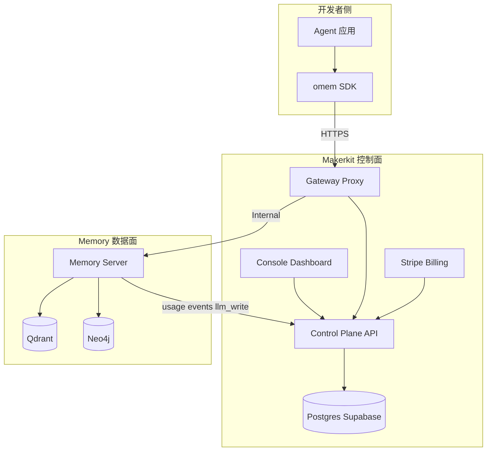
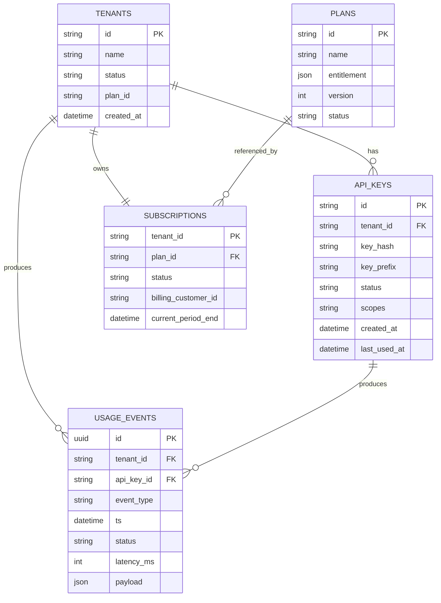
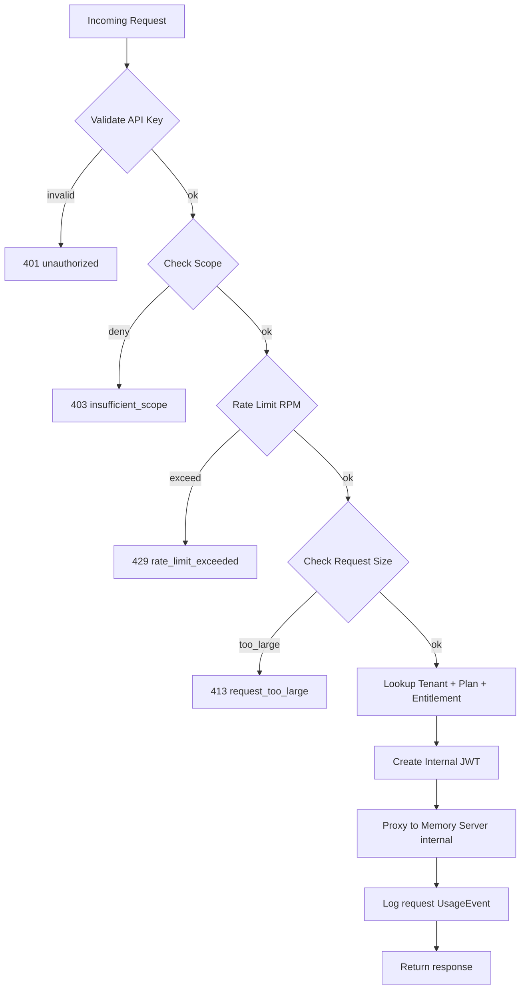
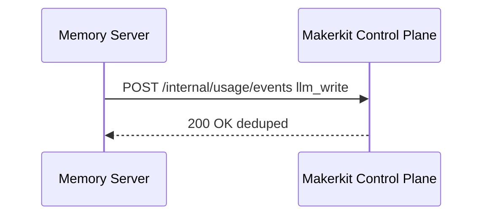
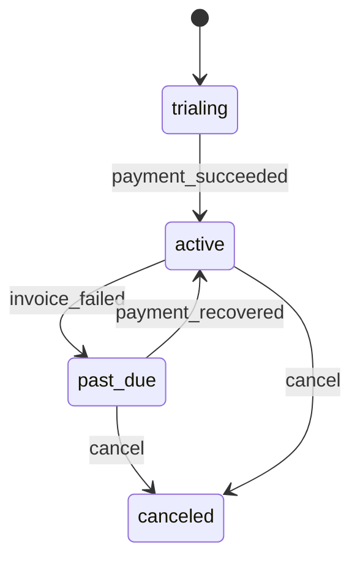
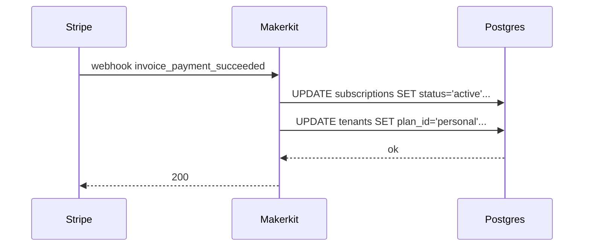
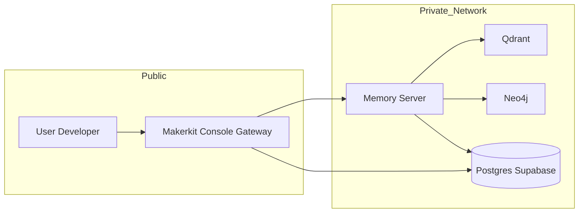

# 与 Makerkit 的适配（VR：可施工对接手册）

> **这是什么**：把 **Makerkit** 当作我们的 SaaS 控制面（Tenant / 订阅 / Billing / API Key / 用量统计 / 控制台），把现有 **MOYAN Memory** 当作数据面（写入/抽取/建图/检索）。  
> **目标**：给“小白”一套能照着做的步骤：从克隆 Makerkit → 跑起来 → 接到我们的 Memory Server → 按我们既定的计费/用量/配额策略落地。  
> **对齐的设计基线**：`SaaS控制面_顶层架构与计费用量策略_v1.md`（同目录）。

---

## 0. 先讲清楚：v0 与 v1 的关系（避免你们团队吵架）

- `SaaS控制面_顶层架构与计费用量策略_v0.md`：**规划口径**（告诉你“该做什么/为什么这么做”）。
- `SaaS控制面_顶层架构与计费用量策略_v1.md`：**施工蓝图**（把“散文”补齐为“可落地契约”：Schema/JWT/配额矩阵/错误响应/SQL/验收场景）。

一句话：**v1 是 v0 的可施工升级版；实现应以 v1 为准，v0 仅保留为历史背景与决策记录。**

---

## 1. 你要做的事（最小闭环）

你最终要得到这个闭环：

1) 开发者在 Makerkit 控制台创建 Workspace（= tenant）→ 生成 API Key  
2) 开发者在 Agent 里用 `omem` SDK：
   - 会话结束 `commit` → 打到 Makerkit 网关 → 转发到 Memory Server → 异步 ingest job  
   - 生成回答前 `retrieve` → 打到 Makerkit 网关 → 转发到 Memory Server → 返回 evidences  
3) Makerkit 控制台能看到：请求数、LLM tokens、写入产出（nodes/points）、当前套餐/剩余额度  
4) 超额/欠费时：有明确拒绝（429/402/403）+ 可解释原因（SDK 能处理）

---

## 2. 总体对接架构（大量可视化，不绕弯）

### 2.1 组件拓扑（控制面 + 数据面）



### 2.2 关键边界（写死）

- **外网只暴露 Makerkit（控制面+网关）**：SDK 永远打 Makerkit 域名。
- **Memory Server 不直接暴露公网**：只接受来自网关的内网请求。
- **所有计量落库在控制面 DB**（Postgres/Supabase）：可对账、可结算。

---

## 3. “最小可行适配”选型（别一上来就把自己整死）

### 3.1 你需要先做 2 个决定

**决定 A：Makerkit 以什么方式托管？**

- A1（推荐）：Makerkit 独立仓库/独立服务部署（更清晰，未来升级不互相拖累）
- A2（可选）：把 Makerkit vendor 到本仓库（submodule/subtree），作为 monorepo 的一部分

**决定 B：网关逻辑放哪？**

- B1（推荐）：直接在 Makerkit 内实现 Gateway/Proxy（同域、易做控制台/计量/配额）
- B2：额外上 Cloudflare/Kong 作为外层网关（更强，但小团队起步容易过度）

本手册按 **A1 + B1** 写（最小可落地、最省心）。

---

## 4. 手把手：从 0 到跑通（A1 + B1）

> 说明：Makerkit 有多个模板（Next.js + Supabase/DB/Stripe 等），具体命令以其 README 为准。  
> 本手册只负责告诉你“要改什么、要接什么、要验证什么”，不假设它内部一定用 Prisma/Drizzle/或某种目录结构。  
> 你要做的只是把下面的“功能模块”按 Makerkit 的技术栈落到对应位置。

### 4.1 准备依赖（你电脑上要有的）

- Node.js（建议 LTS）
- 一个 Postgres（本地 docker 或 Supabase）
- Stripe 账号（仅 Phase 2 才需要，但建议先把 webhook 留口）
- 本仓库里的 Memory Server（本地可启动）：
  - Qdrant + Neo4j 已跑起来
  - `modules/memory/api/server.py` 可监听在 `http://127.0.0.1:8000`

### 4.2 克隆 Makerkit（控制面仓库）

```bash
# 你有两种接法：独立仓库（推荐）或合并到本仓库（submodule/subtree）
```

#### 4.2.1 方案 A（推荐）：Makerkit 独立仓库（清晰、可升级）

```bash
# 1) 新建一个并列目录（推荐不要塞进本仓库，避免依赖纠缠）
mkdir -p ~/work/moyan && cd ~/work/moyan

# 2) 克隆 Makerkit（把 URL 换成你们实际选用的模板仓库）
git clone <MAKERKIT_REPO_URL> moyan-control-plane
cd moyan-control-plane
```

#### 4.2.2 方案 B（可选）：把 Makerkit 对接进本仓库（monorepo）

> 适用：你们希望“一个仓库管理部署与改动”，并接受后续升级 Makerkit 需要手动处理冲突。  
> 推荐优先用 **git submodule**（清晰隔离、升级可控）；subtree 次之（合并历史、但会污染仓库）。

**B1：git submodule（推荐）**

```bash
cd /path/to/MOYAN_AGENT_INFRA

# 建议放到 third_party 或 services 目录（按团队习惯）
mkdir -p third_party
git submodule add <MAKERKIT_REPO_URL> third_party/makerkit
git submodule update --init --recursive
```

**B2：git subtree（备选）**

```bash
cd /path/to/MOYAN_AGENT_INFRA

git subtree add --prefix=third_party/makerkit <MAKERKIT_REPO_URL> main --squash
```

**monorepo 目录建议（示例）**

```text
MOYAN_AGENT_INFRA/
  modules/memory/                     # 数据面：Memory Server + Qdrant/Neo4j 适配
  omem/                               # Python SDK
  third_party/makerkit/               # 控制面：Console + Gateway + Billing（本手册的 Makerkit）
  deployments/                        # docker-compose / k8s manifests（建议新增）
```

### 4.3 启动 Makerkit（先让它能登录进控制台）

```bash
# 以 Makerkit README 为准，一般会是：
pnpm install
pnpm dev
```

你此刻的验收标准非常简单：
- 你能打开控制台页面；
- 你能登录（Makerkit 自带的 Auth/组织/团队能力能跑起来）。

### 4.4 在 Makerkit DB 里加 4 组表（核心：Tenant/Key/Plan/Usage）

你要加的不是“业务逻辑”，而是**控制面真相源**（和 v1 蓝图一致）：



> 如果 Makerkit 已经有 “organizations/workspaces” 表：那就是 Tenant，不要重复造轮子；只需在其上补 `plan_id/status` 等字段。

### 4.5 实现 API Key 生命周期（控制台 + API）

你要给控制台提供 3 个动作：

1) 生成 Key（只展示一次明文，落库只存 hash+prefix）  
2) 吊销 Key（status=revoked）  
3) 列表展示 Key（prefix/name/scopes/last_used_at）

建议 Key 格式（便于运营与排障）：

```text
omem_live_<random>
omem_test_<random>
```

并且永远只展示 prefix：

```text
omem_live_abcd1234…
```

### 4.6 实现 Gateway/Proxy：把 SDK 的请求“变成”数据面可接受的请求

#### 4.6.1 入口请求（SDK → Gateway）

SDK 发来的请求具备：

- Header：`X-API-Token: <developer_api_key>`（外部 key）
- Header：`X-Tenant-ID: <tenant_id>`（当前 `omem` SDK 需要；你可用于校验/排障）
- Path：`/ingest/dialog/v1` 或 `/retrieval/dialog/v2`

#### 4.6.2 网关处理流程（硬执行）



#### 4.6.3 内部转发（Gateway → Memory Server）

你需要把外部 key 替换成内部 JWT（**不让数据面看到明文 API key**）：

- 转发 Header：
  - `X-API-Token: <internal_jwt>`（沿用数据面现有 header 配置，避免改 SDK/改服务）
  - `X-Tenant-ID: <tenant_id>`（可选；建议保留便于排障）
  - `X-Request-ID: <gateway_request_id>`（建议新增，贯穿日志/计量幂等）

数据面认证配置（Memory Server）：

- `auth.enabled=true`
- `auth.jwt.jwks_url=<makerkit_jwks_url>`（网关 JWKS）
- `auth.jwt.tenant_claim=tenant_id`（与内部 JWT claims 对齐）

#### 4.6.4 代理目标（Memory 内网地址）

在 Makerkit env 配置：

```text
MEMORY_INTERNAL_BASE_URL=http://memory:8000
MEMORY_INTERNAL_TIMEOUT_MS=15000
```

并确保这条链路是内网可达（同 VPC / docker network）。

### 4.7 用量计量：怎么做到“可对账”

#### 4.7.1 request 事件（网关记录）

网关每次请求都写 `USAGE_EVENTS(event_type=request)`，payload 至少包含：

```json
{
  "path": "/retrieval/dialog/v2",
  "method": "POST",
  "http_status": 200,
  "req_bytes": 1234,
  "resp_bytes": 5678
}
```

#### 4.7.2 llm/write 事件（数据面回传）

数据面（Memory Server）在 Stage2/Stage3/QA 时，会产生：

- `llm`：provider/model/prompt_tokens/completion_tokens/latency_ms
- `write`：kept_turns/graph_nodes_written/vector_points_written

推荐做法（最小实现）：

- Makerkit 增加一个“内部 ingestion”端口：`POST /internal/usage/events`
  - 仅允许内网调用（或用 HMAC 签名）
  - 接收 `UsageEvent` 列表批量写入（幂等）
- Memory Server **不得**以 best-effort 方式上报（丢单=少算账=事故）。必须按接线规范实现 **at-least-once**：
  - 先写本地 WAL/队列（可重放）→ 再异步 flush 到该端口；
  - 控制面落库使用幂等去重（`INSERT ... ON CONFLICT DO NOTHING`）确保“不会双算”。



---

## 5. SDK 侧怎么接（开发者视角，最小示例）

> 目标：开发者只需要：`base_url + api_token + tenant_id + user_tokens`。

```python
from omem import MemoryClient

client = MemoryClient(
    base_url="https://api.your-makerkit-domain.com",
    tenant_id="tenant_xxx",            # 控制台给
    user_tokens=["user:42"],           # 开发者自定义 end-user token
    memory_domain="dialog",
    api_token="omem_live_xxx",         # 控制台给（外部 API key）
)

session = client.session(session_id="sess_001", sync_cursor=True)
session.append_turn(role="user", text="你好，我明天上午10点开会。")
session.append_turn(role="assistant", text="好的，我记住了。")

# 会话关闭时提交（异步）
handle = session.commit()

# 回答前检索
resp = client.retrieve_dialog_v2(query="我什么时候开会？", session_id="sess_001", topk=10)
evidences = [e["text"] for e in resp.get("evidences", [])]
print(evidences)
```

---

## 6. 计费/订阅如何对齐（Stripe → Plan/Entitlement）

### 6.1 订阅状态机（控制台口径）



### 6.2 Stripe webhook（建议事件）

- `checkout.session.completed`：创建/激活订阅
- `invoice.payment_succeeded`：续费成功
- `invoice.payment_failed`：进入 past_due
- `customer.subscription.deleted`：取消订阅

Webhook 触发后，Makerkit 做两件事：

1) 更新 `subscription.status / current_period_end`
2) 更新 `tenant.plan_id`（映射到新的 `Entitlement`）



---

## 7. 部署形态（最小可跑的 docker-compose 视图）



> 关键：Memory Server 不在 Public 网络；Makerkit 才是唯一入口。

---

## 8. 验收清单（照着做，别靠感觉）

### 8.1 Day-1 验收（不含 Stripe）

1) 控制台能创建 tenant（workspace/org）  
2) 控制台能生成 API key（只展示一次）  
3) SDK 用 API key `commit` 成功返回 job_id  
4) `GET /ingest/jobs/{job_id}` 可查询状态变化  
5) SDK `retrieve` 能返回 evidences  
6) 控制台能看到 request 用量（usage_events）  
7) 超额触发：429（含 retry_after_seconds）

### 8.2 Phase-2 验收（含 Stripe）

1) 支付后 tenant plan 自动升级  
2) entitlement 立即/5min 内生效（取决于 JWT TTL）  
3) past_due 后触发降级策略（只读/限速/拒绝，产品定）  

---

## 9. 你接下来必须补的工程缺口（别装看不见）

1) **数据面 scopes 支持**：当前 Memory Server 的 auth context 没有 scope 字段；短期靠网关白名单即可，长期建议数据面也做二次校验。  
2) **usage_events 落库**：要么数据面回传到 Makerkit，要么共享 DB（但共享 DB 需要明确写权限与安全边界）。  
3) **Ingest job store 多实例**：现在数据面是 sqlite + in-proc task，规模化要迁移 Postgres + worker（参考 v1 蓝图第 10 节）。  
