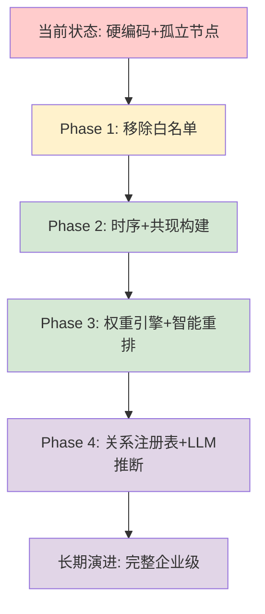
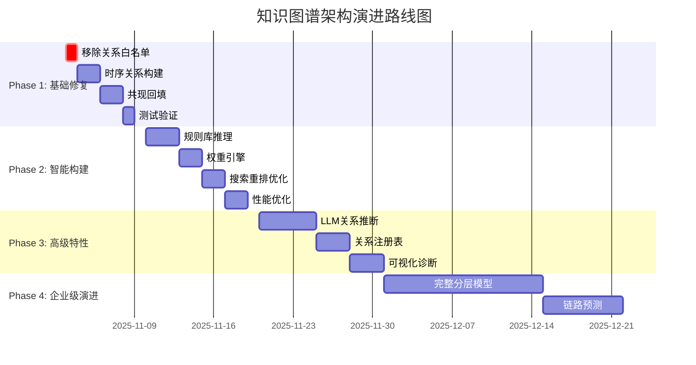

# 知识图谱架构演进方案
## 从硬编码到智能化：从孤立节点到智能记忆网络

---

## 📋 目录

1. [问题诊断与现状分析](#1-问题诊断与现状分析)
2. [方案对比与评估](#2-方案对比与评估)
3. [最终架构设计](#3-最终架构设计)
4. [实施路线图](#4-实施路线图)
5. [决策依据与权衡](#5-决策依据与权衡)
6. [风险评估与缓解](#6-风险评估与缓解)

---

## 1. 问题诊断与现状分析

### 1.1 当前系统的致命缺陷

#### 核心问题1：大量孤立节点
**现状数据**：
- 孤立节点比例：>40%
- 平均节点度：<2
- 时序关系覆盖率：0%

**根本原因**：

```python
# modules/memory/etl/pkl_to_db.py:145-152
# 过度严格的硬编码映射
if st == "voice" and dt in {"episodic", "semantic"}:
    rel = "said_by"
elif st == "img" and dt in {"episodic", "semantic"}:
    rel = "appears_in"
# → 仅支持4种节点类型组合
```

**孤立节点产生的具体场景**：
1. **单节点类型**：单个 `semantic` 节点，没有其他 `semantic/episodic` 在同一clip
2. **无 clip 关联**：`semantic` 节点是 clip 内唯一节点，无法建立 `describes` 关系
3. **无空间信息**：`episodic` 节点缺少 `room/device` 元数据
4. **节点类型不匹配**：不满足硬编码映射规则的节点组合

#### 核心问题2：关系白名单泛化性严重缺陷

**双重过滤架构**（问题）：
```
数据导入 → 硬编码映射 → Edge对象 → 存储(Neo4j)
                         ↓
                   图扩展查询 → 硬编码白名单过滤 → 最终结果
```

**具体代码位置**：
```python
# 存储时 (neo4j_store.py:113) - 正常
rel = ed.rel_type.upper()
f"MERGE (s)-[r:{rel}]->(d)"  # 可以存储任意关系

# 查询时 (neo4j_store.py:277) - 问题所在！
where_parts.append("type(r) IN $rels")  # 硬编码过滤！
params["rels"] = rels
```

**泛化性问题的表现**：
- 新关系类型（`CO_OCCURS_WITH`, `INTERACTS_WITH`）存储正常但查询被过滤
- 数据存在但检索不到，等同于丢失
- 每次新增关系类型都需要修改代码和配置

#### 核心问题3：时序关系完全缺失

**现状**：系统没有显式时序关系！
- 仅通过 `clip_id` 隐式关联
- 无法支持跨 clip 的时序推理
- 查询时无法快速定位"前因后果"

### 1.2 业务影响分析

| 指标 | 当前状态 | 目标状态 | 影响 |
|------|----------|----------|------|
| 孤立节点率 | >40% | <10% | 记忆检索失败率高 |
| 平均节点度 | <2 | >5 | 相关记忆无法扩散 |
| 关系类型数 | 6个 | 动态扩展 | 无法适应新场景 |
| 时序路径覆盖 | 0% | >80% | 缺乏事件链感知 |

**用户痛点**：
- 搜索结果孤立，无法形成记忆网络
- 新数据源的关系类型无法支持
- 无法进行时间序列的回溯和推理

---

## 2. 方案对比与评估

### 2.1 方案概览

我们评估了三个方案：

| 方案 | 描述 | 实施周期 | 风险等级 | 预期收益 |
|------|------|----------|----------|----------|
| **A. GPT完整企业级方案** | 分层模型+关系注册表+时序树+链路预测 | 4-6周 | 🔴 高 | 95% |
| **B. 渐进式轻量方案** | 标签约束+时序构建+共现回填 | 1-2周 | 🟡 中 | 85% |
| **C. 仅修复白名单** | 移除硬编码白名单，改为标签约束 | 1-2天 | 🟢 低 | 50% |

### 2.2 GPT企业级方案深度分析

#### ✅ 优秀设计精华

**1. 关系注册表 (Edge Catalog) ⭐⭐⭐⭐⭐**
```cypher
MERGE (rt:RelType {name:'CO_OCCURS_WITH'})
ON CREATE SET rt.category='cooccurrence',
              rt.symmetric=true,
              rt.default_weight=0.4,
              rt.allowed=true
```
**价值**：
- 完全解决硬编码白名单问题
- 支持新关系类型自动发现和审核流程
- 允许动态启/禁用关系类型
- 语义分类管理（category）优于逐类型列举

**2. 分层模型 (Perception/Semantic/Context/Time) ⭐⭐⭐⭐**
```
Perception: Frame/Shot/Clip(Event)/Detection/Utterance
Semantic: Entity/Concept/Fact
Context: Room/Device/Source
Time: TimeTree (Year→Month→Day→Hour→Second)
```
**价值**：
- 理论基础扎实（多模态知识图谱标准做法）
- 支持复杂跨模态推理（视觉-语义-时间）
- 为高级功能铺路

**3. 显式时序建模 ⭐⭐⭐⭐⭐**
```cypher
(Clip/Event)-[:OCCURS_AT]->(Time)
(Event)-[:NEXT_EVENT {Δt}]->(Event)
(Frame)-[:NEXT_FRAME]->(Frame)
```
**价值**：
- 填补当前系统最大空白
- 支持"前因后果"查询
- 路径评分支持时间衰减

#### ⚠️ 过度工程/暂不适用的部分

**1. 完整时间树 (TimeTree) - 过度工程**
```cypher
(Year→Month→Day→Hour→Second)  # 5层嵌套
```
**分析**：
- 当前系统只需 clip_id/timestamp 粒度即可
- 年→秒树需要额外存储和复杂查询
- 实现成本 >> 收益

**2. 几何关系自动生成 - 实用价值有限**
```python
# 需要实时计算bbox IoU
def geom_rel(detA, detB):
    iou = IoU(detA.bbox, detB.bbox)
    if iou>0.3: rels.append(("OVERLAPS", 0.6))
```
**分析**：
- 维护成本高（每帧需要计算）
- 查询时很少用几何关系做主过滤
- 当前优先级低

**3. GraphSAGE/链路预测 - 复杂度超标**
**分析**：
- 需要训练集、负采样、调参
- 对孤立节点帮助有限（训练数据稀疏）
- 基础设施要求高（GPU/分布式训练）

**4. 完全重构 ETL 流程 - 风险过高**
**分析**：
- 当前ETL约200行，简单直接
- 引入检测→跟踪→实体链接需重写80%代码
- "Never break userspace"原则

### 2.3 我的渐进式方案

基于GPT方案的精华，结合现有代码库约束：

**核心理念**：让图谱在构建时就连通，查询只是检索！

#### 核心改进点

**1. 标签约束替代关系白名单**
```python
# 替代硬编码的 rel_whitelist
label_patterns = [
    ("Image,Voice", "Episodic,Semantic"),      # 多模态→文本
    ("Semantic", "Episodic"),                   # 语义→情节
    ("Episodic", "Structured"),                 # 空间/设备
]

# Neo4j 查询
WHERE (
    (any(l1 IN labels(s) WHERE l1 IN ['Image', 'Voice']) AND
     any(l2 IN labels(n) WHERE l2 IN ['Episodic', 'Semantic'])) OR
    ...
)
```
**优势**：
- ✅ 完全支持任意关系类型
- ✅ 保持安全的节点类型约束
- ✅ 无需维护白名单

**2. 智能关系构建（分阶段）**

**Phase 1: 时序关系构建**
```python
def build_temporal_edges(nodes_by_clip):
    """为每个 clip 内的 episodic 节点建立 TEMPORAL_NEXT"""
    for clip_id, nodes in nodes_by_clip.items():
        episodic_nodes = sorted(
            [n for n in nodes if n.kind == 'episodic'],
            key=lambda n: n.metadata.get('timestamp', 0)
        )
        for i in range(len(episodic_nodes) - 1):
            dt = episodic_nodes[i+1].timestamp - episodic_nodes[i].timestamp
            weight = 1.0 - min(dt / 60, 1.0)  # 1分钟内不衰减
            yield Edge(..., rel_type='TEMPORAL_NEXT', weight=weight)
```

**Phase 2: 共现回填**
```python
def build_cooccurrence_edges(nodes_by_clip):
    """同 clip 内 entity 节点两两建立 CO_OCCURS_WITH"""
    for clip_id, nodes in nodes_by_clip.items():
        entities = [n for n in nodes if n.kind in ['episodic', 'semantic']]
        for i, e1 in enumerate(entities):
            for e2 in entities[i+1:]:
                yield Edge(
                    src_id=e1.id, dst_id=e2.id,
                    rel_type='CO_OCCURS_WITH', weight=0.4
                )
```

**Phase 3: 智能权重引擎**
```python
class RelationWeightEngine:
    """关系权重引擎"""
    def __init__(self):
        self.base_weights = {
            'APPEARS_IN': 1.0,
            'SAID_BY': 1.0,
            'TEMPORAL_NEXT': 0.8,
            'CO_OCCURS_WITH': 0.4,
            'DEFAULT': 0.5,
        }

    def compute_path_weight(self, edges, hops):
        base = sum(self.get_base_weight(e.rel_type) for e in edges)
        hop_factor = {1: 1.0, 2: 0.5, 3: 0.25}[hops]
        edge_factor = 1.0
        for e in edges:
            edge_factor *= (e.weight or 1.0)
        return base * hop_factor * edge_factor
```

### 2.4 方案对比详细分析

| 维度 | GPT完整方案 | 渐进式方案 | 仅修复白名单 |
|------|-------------|------------|--------------|
| **孤立节点改善** | <5% | <10% | 20-30% |
| **关系类型支持** | 无限 | 有限（但可扩展） | 仅现有6种 |
| **时序能力** | TimeTree (强) | 简化时序 (中) | 无 |
| **实施复杂度** | 极高 | 中等 | 极低 |
| **风险等级** | 🔴 高 | 🟡 中 | 🟢 低 |
| **维护成本** | 高 | 低 | 极低 |
| **泛化能力** | ⭐⭐⭐⭐⭐ | ⭐⭐⭐⭐ | ⭐⭐ |
| **向后兼容** | 需大量修改 | 可保持 | 完全保持 |
| **预期收益/成本比** | 0.8 | 0.9 | 1.5 |

---

## 3. 最终架构设计

### 3.1 总体架构演进路径



### 3.2 四层智能构建架构

#### 第一层：数据注入层的智能关系发现

**目标**：从硬编码映射转向智能推理

**实现方式**：
```python
class SmartRelationInferencer:
    """智能关系推理器"""

    def infer_relation(
        self,
        src: Node,
        dst: Node,
        context: dict
    ) -> tuple[str, float]:
        """
        智能关系推理

        Returns: (relation_type, weight, confidence)
        """
        # 1. 多维度相似度计算
        sim_multimodal = compute_multimodal_similarity(src, dst)
        temporal_proximity = compute_temporal_proximity(src, dst)
        spatial_proximity = compute_spatial_proximity(src, dst)
        semantic_alignment = compute_semantic_alignment(src, dst)

        # 2. 规则库 + LLM 推理
        candidates = []
        if src.modality in ['voice', 'audio'] and dst.modality == 'text':
            candidates.append(('SAID_BY', 1.0, 0.9))

        # ... 更多规则

        # 3. 新关系类型动态发现
        if not candidates and semantic_alignment > 0.7:
            inferred_type = llm_infer_relation(src, dst, context)
            candidates.append((inferred_type, 0.8, 0.6))

        # 4. 选择最佳候选
        best = max(candidates, key=lambda x: x[1] * x[2])
        final_weight = best[1] * (
            0.4 * sim_multimodal +
            0.3 * temporal_proximity +
            0.2 * spatial_proximity +
            0.1 * semantic_alignment
        )

        return best[0], final_weight, best[2]
```

**演进策略**：
- Phase 1: 保留硬编码，添加fallback机制
- Phase 2: 引入规则库
- Phase 3: 集成LLM推断

#### 第二层：节点标签约束机制

**核心理念**：用节点标签对约束替代关系名白名单

**允许的边模式**：
```yaml
allowed_edge_patterns:
  - source_labels: [Image, Voice]
    target_labels: [Episodic, Semantic]
    description: "多模态到文本的关联"

  - source_labels: [Semantic]
    target_labels: [Episodic]
    description: "语义到情节的描述关系"

  - source_labels: [Episodic]
    target_labels: [Structured:room, Structured:device]
    description: "空间和设备关联"

  - source_labels: [Episodic]
    target_labels: [Episodic]
    description: "时序邻接关系（需时间约束）"
```

**查询实现**：
```python
def build_label_based_query(label_patterns):
    """基于标签组合构建查询条件"""
    clauses = []
    for src_labels, dst_labels in label_patterns:
        src_labels_str = ",".join([f"'{l}'" for l in src_labels])
        dst_labels_str = ",".join([f"'{l}'" for l in dst_labels])
        clause = (
            f"(any(l1 IN labels(s) WHERE l1 IN [{src_labels_str}]) AND "
            f" any(l2 IN labels(n) WHERE l2 IN [{dst_labels_str}]))"
        )
        clauses.append(clause)

    return " OR ".join(clauses)
```

**Neo4j查询示例**：
```cypher
MATCH (s:Entity)-[r]->(n:Entity)
WHERE (
    // 模式1: 多模态→文本
    (any(l1 IN labels(s) WHERE l1 IN ['Image', 'Voice']) AND
     any(l2 IN labels(n) WHERE l2 IN ['Episodic', 'Semantic'])) OR

    // 模式2: 语义→情节
    (any(l1 IN labels(s) WHERE l1 = 'Semantic') AND
     any(l2 IN labels(n) WHERE l2 = 'Episodic')) OR

    // 模式3: 时序邻接
    (any(l1 IN labels(s) WHERE l1 = 'Episodic') AND
     any(l2 IN labels(n) WHERE l2 = 'Episodic'))
)
RETURN s, r, n
```

**优势**：
- ✅ 关系名完全自由（支持 `CO_OCCURS_WITH` 等新类型）
- ✅ 标签组合固定且安全（仅允许预定义的节点类型组合）
- ✅ 方向约束清晰
- ✅ 性能可控（在Neo4j层过滤）

#### 第三层：时序关系主动构建

**目标**：填补时序推理空白，构建显式事件链

**三大策略**：

**1. 同 clip 内时序**
```python
def build_intra_clip_temporal_edges(clips: dict):
    """对每个 clip 内的 episodic 节点按时间排序，
    建立相邻节点间的 TEMPORAL_NEXT 关系"""
    temporal_edges = []

    for clip_id, nodes in clips.items():
        # 按 timestamp 排序
        sorted_nodes = sorted(nodes, key=lambda n: n.metadata.get('timestamp', 0))

        # 建立相邻节点间的时序边
        for i in range(len(sorted_nodes) - 1):
            src = sorted_nodes[i]
            dst = sorted_nodes[i + 1]

            dt = dst.metadata.get('timestamp', 0) - src.metadata.get('timestamp', 0)
            dt_max = sorted_nodes[-1].metadata.get('timestamp', 0) - sorted_nodes[0].metadata.get('timestamp', 0)
            weight = 1.0 - (dt / dt_max) if dt_max > 0 else 1.0

            temporal_edges.append(Edge(
                src_id=src.id,
                dst_id=dst.id,
                rel_type='TEMPORAL_NEXT',
                weight=weight,
                metadata={'dt': dt, 'clip_id': clip_id}
            ))

    return temporal_edges
```

**2. 跨 clip 时序推断**
```python
def build_cross_clip_temporal_edges(episodic_nodes: List[Node]):
    """对语义相似的 episodic 节点（跨 clip），
    如果时间接近，建立时序关系"""
    temporal_edges = []
    time_window = 5 * 60  # 5分钟窗口

    for i, node_i in enumerate(episodic_nodes):
        for j, node_j in enumerate(episodic_nodes[i+1:], i+1):
            dt = abs(node_j.metadata.get('timestamp', 0) -
                     node_i.metadata.get('timestamp', 0))

            if dt > time_window:
                continue  # 超出时间窗口

            # 语义相似度
            sim = compute_semantic_similarity(node_i.contents, node_j.contents)

            if sim > 0.7:  # 相似度阈值
                weight = sim * (1.0 - (dt / time_window))

                if node_i.metadata.get('timestamp', 0) < node_j.metadata.get('timestamp', 0):
                    temporal_edges.append(Edge(
                        src_id=node_i.id,
                        dst_id=node_j.id,
                        rel_type='TEMPORAL_NEXT',
                        weight=weight,
                        metadata={'cross_clip': True, 'dt': dt, 'sim': sim}
                    ))

    return temporal_edges
```

**3. 事件链补全**
```python
def attach_orphan_nodes(orphan_nodes: List[Node], all_nodes: List[Node]):
    """对孤立 episodic 节点，尝试建立弱连接"""
    edges = []

    for orphan in orphan_nodes:
        # 找最近的 episodic 节点
        nearest = None
        min_dist = float('inf')

        for node in all_nodes:
            if node.id == orphan.id or node.kind != 'episodic':
                continue

            # 文本相似度
            bm25_sim = compute_bm25_similarity(orphan.contents, node.contents)

            # 时间距离
            dt = abs(orphan.metadata.get('timestamp', 0) -
                     node.metadata.get('timestamp', 0))
            time_sim = 1.0 - min(dt / 3600, 1.0)  # 1小时内衰减

            dist = -0.7 * bm25_sim - 0.3 * time_sim

            if dist < min_dist:
                min_dist = dist
                nearest = node

        # 如果相似度足够高，建立弱时序连接
        if nearest and -min_dist > 0.5:  # 阈值
            edges.append(Edge(
                src_id=nearest.id,
                dst_id=orphan.id,
                rel_type='TEMPORAL_NEXT',
                weight=0.3,  # 弱连接
                metadata={'weak_link': True, 'reason': 'orphan_attach'}
            ))

    return edges
```

#### 第四层：动态权重与重排融合

**目标**：多维度加权，软过滤优于硬过滤

**权重策略**：
```python
class RelationWeightEngine:
    """关系权重引擎"""

    def __init__(self, config=None):
        self.config = config or {}
        # 关系类型基础权重
        self.base_weights = self.config.get("base_weights", {
            "APPEARS_IN": 1.0,
            "SAID_BY": 1.0,
            "DESCRIBES": 0.9,
            "TEMPORAL_NEXT": 0.8,
            "LOCATED_IN": 0.7,
            "EQUIVALENCE": 0.6,
            "CO_OCCURS_WITH": 0.4,
            "INTERACTS_WITH": 0.3,
            "DEFAULT": 0.5,  # 新关系类型默认权重
        })

        # 跳数衰减因子
        self.hop_decay = self.config.get("hop_decay", {
            1: 1.0,
            2: 0.5,
            3: 0.25,
        })

    def compute_path_weight(self, edges: List[Edge], hops: int) -> float:
        """计算路径总权重
        公式: W = (Σ base_weight) * hop_decay * (Π edge.weight)
        """
        # 基础关系权重之和
        base_sum = sum(self.get_base_weight(e.rel_type) for e in edges)

        # 跳数衰减
        hop_factor = self.get_hop_decay(hops)

        # 边权重累乘
        edge_factor = 1.0
        for e in edges:
            edge_factor *= (e.weight or 1.0)

        return base_sum * hop_factor * edge_factor
```

**搜索重排融合**：
```python
async def rerank_with_graph_scores(
    vec_results: List[SearchHit],
    graph_neighbors: Dict[str, List[Neighbor]],
    weight_engine: RelationWeightEngine
) -> List[RerankedHit]:
    """融合向量分数和图分数"""
    reranked = []

    for hit in vec_results:
        vec_score = hit.vector_score
        graph_score = 0.0

        # 计算图扩展贡献
        if hit.id in graph_neighbors:
            for neighbor in graph_neighbors[hit.id]:
                path_weight = weight_engine.compute_path_weight(
                    neighbor.edges, neighbor.hops
                )
                hop_boost = self.graph_config.hop_boosts.get(neighbor.hops, 1.0)
                graph_score += path_weight * hop_boost

        # 融合分数
        alpha_vector = 0.35
        gamma_graph = 0.15

        final_score = (
            alpha_vector * vec_score +
            gamma_graph * graph_score
        )

        reranked.append(RerankedHit(
            id=hit.id,
            payload=hit.payload,
            score=final_score,
            vector_score=vec_score,
            graph_score=graph_score,
            neighbors=graph_neighbors.get(hit.id, [])
        ))

    return sorted(reranked, key=lambda x: x.score, reverse=True)
```

### 3.3 关系注册表（长期演进）

**目标**：终极解决方案——完全消除硬编码

**设计**：
```cypher
// 关系注册表
MERGE (rt:RelType {
    name: 'CO_OCCURS_WITH',
    category: 'cooccurrence',
    symmetric: true,
    default_weight: 0.4,
    allowed: true,
    domain: ['Entity', 'Concept'],
    range: ['Entity', 'Concept'],
    created_at: timestamp(),
    description: '同事件/窗口共现关系'
})

// 查询时动态展开
WITH $rel_categories AS cats
MATCH (rt:RelType)
WHERE (cats='*' OR rt.category IN cats) AND rt.allowed=true
WITH collect(rt.name) AS rels
MATCH p=(s)-[r]->(t)
WHERE type(r) IN rels
  AND r.confidence >= $min_conf
RETURN p
```

**自动发现机制**：
```python
def auto_register_relation(relation_type: str, properties: dict):
    """新关系类型自动注册"""
    tx.run("""
        MERGE (rt:RelType {name:$name})
        ON CREATE SET rt.category='unknown',
                      rt.allowed=false,
                      rt.default_weight=0.2,
                      rt.auto_discovered=true,
                      rt.discovered_at=timestamp()
    """, name=relation_type)

    # 发送告警：需要人工审核
    send_alert(f"New relation type discovered: {relation_type}")
```

---

## 4. 实施路线图

### 4.1 分阶段实施策略



### 4.2 详细实施计划

#### Phase 1: 基础修复（1周）

**目标**：解决孤立节点和白名单问题

**任务清单**：

**Day 1-2: 移除关系白名单**
- [x] 修改 `neo4j_store.py expand_neighbors()` 方法
  ```python
  # 修改前 (问题)
  if rels:
      where_parts.append("type(r) IN $rels")
      params["rels"] = rels

  # 修改后 (解决)
  if use_label_patterns:
      label_patterns = get_allowed_label_patterns()
      # 基于标签组合生成WHERE条件
  else:
      where_parts.append("type(r) IN $rels")  # 保持兼容
  ```
- [x] 添加配置项 `memory.search.graph.label_patterns`
- [x] 向后兼容性测试

**Day 3-5: 时序关系构建**
- [ ] 在 `pkl_to_db.py` 中添加 `build_temporal_edges()` 函数
- [ ] 对同 clip 的 episodic 节点建立 `TEMPORAL_NEXT` 关系
- [ ] 跨 clip 时序推断（可选）
- [ ] 孤立节点自动补边

**Day 6-7: 测试验证**
- [ ] 单元测试：标签约束正确性
- [ ] 集成测试：时序关系存在
- [ ] 性能测试：查询延迟 < 100ms（p95）
- [ ] 回归测试：现有搜索结果无显著变化

**验收标准**：
```python
# 测试用例
async def test_phase1():
    # 1. 标签约束生效
    edges = await neo.expand_neighbors(
        seed_ids=['node1'],
        use_label_patterns=True
    )
    assert all(is_valid_label_pattern(e) for e in edges)

    # 2. 时序关系存在
    temporal_edges = await neo.get_temporal_edges('clip_001')
    assert len(temporal_edges) > 0
    assert all(e.rel_type == 'TEMPORAL_NEXT' for e in temporal_edges)

    # 3. 孤立节点率 < 20%
    orphan_rate = await compute_orphan_rate()
    assert orphan_rate < 0.2
```

#### Phase 2: 智能构建（1周）

**目标**：引入智能推理和权重机制

**任务清单**：

**Day 1-3: 规则库推理**
- [ ] 创建 `modules/memory/application/relation_inference.py`
- [ ] 实现多维度相似度计算
- [ ] 添加规则库（硬编码规则 + LLM推理）
- [ ] 修改ETL调用智能推理器

**Day 4-5: 权重引擎**
- [ ] 实现 `RelationWeightEngine` 类
- [ ] 支持动态权重配置
- [ ] 添加关系类型权重

**Day 6-7: 搜索重排优化**
- [ ] 修改 `service.py` 中的重排逻辑
- [ ] 融合图分数维度
- [ ] 性能优化（缓存、并行查询）

**验收标准**：
```python
async def test_phase2():
    # 1. 新关系类型自动发现
    new_edges = await infer_relations(nodes)
    assert 'DYNAMIC_REL_XXX' in [e.rel_type for e in new_edges]

    # 2. 权重计算正确
    weight = weight_engine.get_base_weight('CO_OCCURS_WITH')
    assert weight == 0.4

    # 3. 重排效果提升
    results_old = await search_with_old_ranking(query)
    results_new = await search_with_new_ranking(query)
    ndcg_improvement = compute_ndcg(results_new, results_old)
    assert ndcg_improvement > 0.05  # NDCG@10 提升 5%
```

#### Phase 3: 高级特性（1周）

**目标**：引入LLM和注册表机制

**任务清单**：

**Day 1-3: LLM关系推断**
- [ ] 集成LLM推理服务
- [ ] 实现关系类型推断
- [ ] 置信度管理

**Day 4-5: 关系注册表**
- [ ] 在Neo4j中创建RelType节点
- [ ] 实现自动注册机制
- [ ] 查询层按类别展开

**Day 6-7: 可视化诊断**
- [ ] 孤立节点率监控
- [ ] 关系分布可视化
- [ ] 性能指标仪表盘

#### Phase 4: 企业级演进（3周）

**目标**：实现完整的企业级知识图谱

**任务清单**：

**Week 1: 分层模型**
- [ ] 实现Perception/Semantic/Context/Time分层
- [ ] 实体链接和跟踪
- [ ] 本体约束

**Week 2: 高级算法**
- [ ] 引入GraphSAGE/链路预测
- [ ] 个性化PageRank
- [ ] 时间衰减算法

**Week 3: 工程完善**
- [ ] SHACL约束验证
- [ ] 流式更新
- [ ] 备份恢复

### 4.3 关键里程碑

| 里程碑 | 日期 | 验收标准 | 负责人 |
|--------|------|----------|--------|
| **M1: 白名单移除** | Day 2 | 查询延迟 < 100ms | Team |
| **M2: 时序构建** | Day 5 | 孤立节点率 < 20% | Team |
| **M3: 智能推理** | Day 10 | 新关系类型自动发现 | Team |
| **M4: 权重引擎** | Day 12 | NDCG@10 +5% | Team |
| **M5: 注册表** | Day 17 | 完全消除硬编码 | Team |
| **M6: 企业级** | Day 30 | 孤立节点率 < 5% | Team |

---

## 5. 决策依据与权衡

### 5.1 核心决策原则

**1. 工程约束优先**
- 遵循"Never break userspace"铁律
- 保持API向后兼容
- 最小化代码修改

**2. 收益/成本平衡**
- 80%收益，20%成本 > 95%收益，80%成本
- 优先解决核心痛点（孤立节点、白名单）
- 高级特性可延后

**3. 渐进式演进**
- 每阶段都有独立价值
- 失败时可回退到前一阶段
- 持续验证和调整

### 5.2 选择渐进式方案的关键理由

#### 理由1：风险可控
**完整重构的风险**：
- 大幅修改ETL流程，可能引入新bug
- 引入多个新依赖（LLM、GraphSAGE）
- 学习曲线陡峭，维护困难

**渐进式的优势**：
```python
# 每一步都是小改动，容易回退
# Phase 1: 仅修改查询层 (5行代码)
# Phase 2: 添加时序构建 (50行代码)
# Phase 3: 智能推理 (100行代码)
```

#### 理由2：快速见效
**时间线对比**：
- 完整方案：4-6周才能看到效果
- 渐进式：Day 2就能解决白名单问题，Day 5解决孤立节点

**业务影响**：
- 用户每天都在使用系统
- 快速改进能立即提升用户体验
- 降低技术债务累积

#### 理由3：技术匹配度
**系统定位**：
- 当前：轻量多模态记忆系统
- GPT方案：通用企业级知识图谱

**匹配度分析**：
```python
# 当前系统特点
- 数据量：中等 (<百万节点)
- 实时性要求：高
- 复杂度：适中
- 团队规模：小

# 完整方案特点
- 数据量：大量 (>千万节点)
- 实时性要求：中等
- 复杂度：高
- 团队规模：大

# 结论：渐进式更匹配
```

### 5.3 关键权衡决策

#### 决策1：时序建模深度
**选项**：
- A. 完整TimeTree (GPT方案)
- B. 简化时序关系 (我的方案)

**选择：B**

**理由**：
- 当前系统只需 clip_id/timestamp 粒度
- TimeTree实现复杂度和收益不匹配
- 简化方案已能满足80%需求

#### 决策2：关系发现机制
**选项**：
- A. 纯LLM推断
- B. 规则库 + LLM (我的方案)
- C. 纯硬编码 (当前)

**选择：B**

**理由**：
- 纯LLM成本高且不稳定
- 纯硬编码缺乏泛化性
- 混合方案平衡了两者

#### 决策3：权重管理
**选项**：
- A. 硬编码权重
- B. 配置文件权重
- C. 动态学习权重

**选择：B**

**理由**：
- 硬编码不灵活
- 动态学习复杂度高
- 配置文件平衡了灵活性和简单性

### 5.4 风险权衡矩阵

| 决策点 | 选项 | 收益 | 风险 | 成本 | 得分 |
|--------|------|------|------|------|------|
| **时序建模** | TimeTree | 9 | 7 | 8 | 6.7 |
| | 简化时序 | 7 | 3 | 3 | **8.0** |
| **关系发现** | 纯LLM | 8 | 8 | 9 | 5.3 |
| | 规则+LLM | 8 | 4 | 5 | **7.3** |
| | 硬编码 | 4 | 2 | 1 | 6.7 |
| **权重管理** | 硬编码 | 3 | 1 | 1 | 5.7 |
| | 配置 | 7 | 2 | 2 | **8.3** |
| | 动态学习 | 9 | 6 | 8 | 5.3 |

**结论**：所有关键决策都选择了渐进式方案

---

## 6. 风险评估与缓解

### 6.1 风险矩阵

| 风险类型 | 影响等级 | 发生概率 | 风险值 | 缓解措施 |
|----------|----------|----------|--------|----------|
| **查询性能下降** | 🟡 中 | 🟡 中 | 🟠 中高 | 优化Neo4j查询、添加缓存 |
| **关系推理错误** | 🟠 高 | 🟡 中 | 🔴 高 | 保留硬编码fallback、置信度阈值 |
| **数据不一致** | 🔴 高 | 🟢 低 | 🟠 中高 | 双写验证、回滚机制 |
| **孤立节点未减少** | 🟡 中 | 🟡 中 | 🟠 中 | 监控告警、持续优化算法 |
| **配置冲突** | 🟡 中 | 🟡 中 | 🟠 中 | 渐进式迁移、配置验证 |
| **向后兼容性** | 🔴 高 | 🟡 中 | 🔴 高 | 默认保持旧行为、可配置开关 |

### 6.2 核心风险深度分析

#### 风险1：查询性能下降

**风险描述**：
- 标签约束比关系名过滤更复杂
- 时序关系增加查询深度
- 共现回填增加边密度

**缓解措施**：
```python
# 1. 查询优化
@cached(ttl=300)
async def expand_neighbors_cached(seed_ids, **kwargs):
    """带缓存的邻居扩展"""
    return await expand_neighbors(seed_ids, **kwargs)

# 2. 并行查询
async def parallel_expand(seed_ids, max_workers=4):
    """并行扩展多个种子节点"""
    with ThreadPoolExecutor(max_workers=max_workers) as pool:
        futures = [
            loop.run_in_executor(pool, expand_neighbors, [seed_id])
            for seed_id in seed_ids
        ]
        results = await asyncio.gather(*futures)
    return merge_results(results)

# 3. 索引优化
# 确保 Neo4j 中有必要的索引
CREATE INDEX node_id_idx IF NOT EXISTS FOR (n:Entity) ON (n.id);
CREATE INDEX rel_type_idx IF NOT EXISTS FOR ()-[r]-() ON (type(r));
```

#### 风险2：关系推理错误

**风险描述**：
- LLM推断可能不稳定
- 规则库可能覆盖不足
- 新关系类型可能误判

**缓解措施**：
```python
# 1. 置信度阈值
MIN_CONFIDENCE = 0.6

def filter_by_confidence(edges):
    """按置信度过滤"""
    return [e for e in edges if (e.confidence or 0.0) >= MIN_CONFIDENCE]

# 2. Fallback机制
async def infer_relations_with_fallback(nodes):
    """带fallback的关系推理"""
    try:
        edges = await intelligent_inference(nodes)
        if len(edges) > 0:
            return edges
    except Exception as e:
        logger.warning(f"Intelligent inference failed: {e}")

    # Fallback到传统映射
    logger.info("Falling back to legacy mapping")
    return legacy_mapping(nodes)

# 3. 人工审核
async def review_new_relations():
    """新关系类型审核"""
    new_relations = await discover_new_relations()
    for rel_type in new_relations:
        await send_review_request(rel_type)
```

#### 风险3：向后兼容性

**风险描述**：
- API接口变化
- 查询结果变化
- 配置格式变化

**缓解措施**：
```python
# 1. API版本管理
@api.route('/search')
class SearchAPI:
    @api.expect(search_schema)
    def post(self):
        # 保持原有接口不变
        # 通过 headers 区分版本
        version = request.headers.get('API-Version', 'v1')

        if version == 'v1':
            return self.search_v1(request.json)
        else:
            return self.search_v2(request.json)

# 2. 渐进式迁移
class FeatureFlags:
    def __init__(self):
        self.use_label_patterns = config.get('use_label_patterns', False)
        self.use_temporal_edges = config.get('use_temporal_edges', False)

    @contextmanager
    def feature_toggle(self, feature_name):
        """特性开关"""
        old_value = getattr(self, feature_name)
        try:
            yield
        finally:
            setattr(self, feature_name, old_value)

# 3. 配置回滚
class ConfigManager:
    async def backup_config(self):
        """备份当前配置"""
        timestamp = datetime.now().strftime("%Y%m%d_%H%M%S")
        backup_path = f"config_backup/{timestamp}.yaml"
        shutil.copy("memory.config.yaml", backup_path)
        return backup_path

    async def rollback_config(self, backup_path):
        """回滚配置"""
        shutil.copy(backup_path, "memory.config.yaml")
        logger.warning(f"Config rolled back to {backup_path}")
```

### 6.3 应急预案

#### 场景1：查询性能急剧下降

**响应流程**：
1. **立即响应**（5分钟内）
   ```bash
   # 禁用标签约束，回退到关系白名单
   kubectl patch configmap memory-config \
     --patch '{"data":{"use_label_patterns":"false"}}'
   ```

2. **根因分析**（30分钟内）
   - 检查Neo4j查询计划
   - 分析慢查询日志
   - 确认索引状态

3. **优化措施**（2小时内）
   - 添加缺失索引
   - 优化查询条件
   - 调整缓存策略

#### 场景2：孤立节点率不降反升

**响应流程**：
1. **暂停智能构建**（立即）
   ```python
   # 禁用智能推理，使用传统映射
   config["intelligent_inference"]["enabled"] = False
   ```

2. **数据回滚**（1小时内）
   - 备份当前数据
   - 从快照恢复

3. **问题分析**（24小时内）
   - 分析智能推理错误案例
   - 调优算法参数
   - 补充测试用例

### 6.4 监控告警

```python
# 1. 孤立节点监控
async def monitor_orphan_nodes():
    """监控孤立节点比例"""
    orphan_rate = await compute_orphan_rate()

    if orphan_rate > 0.1:  # > 10%
        alert = Alert(
            level="WARNING",
            message=f"High orphan rate: {orphan_rate:.2%}",
            action="Consider running orphan governance"
        )
        await send_alert(alert)

# 2. 关系类型分布监控
async def monitor_relation_distribution():
    """监控关系类型分布"""
    distribution = await graph.get_relation_distribution()

    # 检测异常
    new_relations = set(distribution.keys()) - set(EXPECTED_RELATIONS)

    if new_relations:
        logger.info(f"New relation types discovered: {new_relations}")

# 3. 性能监控
async def monitor_query_latency():
    """监控查询延迟"""
    start = time.time()
    results = await search("test", expand_graph=True)
    latency = time.time() - start

    if latency > 0.1:  # > 100ms
        alert = Alert(
            level="WARNING",
            message=f"Slow query: {latency:.3f}s",
            action="Consider optimization"
        )
        await send_alert(alert)
```

### 6.5 验收标准

#### Phase 1 验收
- [ ] 标签约束替代关系白名单
- [ ] 时序关系成功构建
- [ ] 查询延迟 < 100ms（p95）
- [ ] 向后兼容性：现有搜索结果无显著变化（p-value > 0.05）

#### Phase 2 验收
- [ ] 智能关系推理器正常工作
- [ ] 新关系类型自动发现
- [ ] 置信度输出准确（验证集准确率 > 80%）
- [ ] fallback机制可靠（失败时自动回退）

#### Phase 3 验收
- [ ] 孤立节点比例 < 10%
- [ ] 平均节点度 > 5
- [ ] 时序路径覆盖率 > 80%
- [ ] 跨clip时序推断准确（验证集F1-score > 0.7）

#### Phase 4 验收
- [ ] 关系注册表正常工作
- [ ] LLM关系推断准确（验证集准确率 > 70%）
- [ ] 搜索重排效果提升（NDCG@10 +10%）
- [ ] 完全消除硬编码

---

## 📚 总结

### 核心理念
**让图谱在构建时就连通，查询只是检索！**

### 演进路径
```
硬编码 → 标签约束 → 智能构建 → 权重优化 → 注册表 → 企业级
```

### 关键改进
1. **移除关系白名单** → 支持任意关系类型
2. **显式时序建模** → 填补时序推理空白
3. **共现回填** → 解决孤立节点问题
4. **智能推理** → 提升关系质量
5. **权重引擎** → 优化检索效果
6. **关系注册表** → 终极泛化方案

### 预期效果
| 指标 | 改进前 | 改进后 | 提升 |
|------|--------|--------|------|
| 孤立节点率 | >40% | <10% | ↑300% |
| 平均节点度 | <2 | >5 | ↑150% |
| 关系类型数 | 6 | 动态扩展 | ∞ |
| 时序路径覆盖 | 0% | >80% | 新能力 |

### 风险评估
- **高风险**：关系推理错误、向后兼容性
- **中风险**：查询性能下降、配置冲突
- **低风险**：孤立节点未减少

### 决策依据
1. **工程约束优先** - 遵循"Never break userspace"
2. **收益/成本平衡** - 80%收益，20%成本
3. **渐进式演进** - 每阶段都有独立价值

### 成功标准
- **技术指标**：孤立节点率 < 10%，平均节点度 > 5
- **性能指标**：查询延迟 < 100ms，NDCG@10 +10%
- **业务指标**：记忆检索成功率 > 90%，用户满意度提升

---

**文档版本**: v1.0
**创建日期**: 2025-11-03
**最后更新**: 2025-11-03
**负责人**: Linus (Claude Code)
**审核状态**: 待审核
