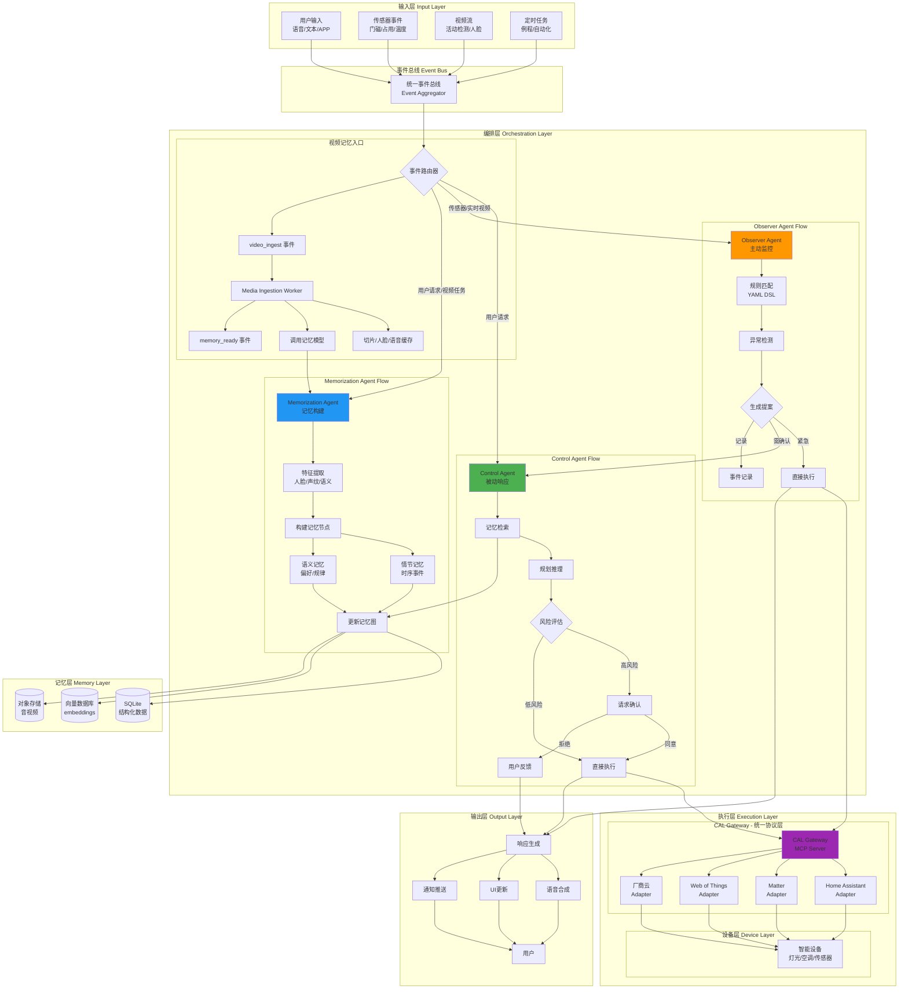

## 需求分析

> 变更纪要（对齐当前实现）
- 统一记忆底座：单套 Qdrant（向量）+ Neo4j（图），所有来源（m3/mem0/ctrl）经统一管道入库；不再维护“多套图再统一”。
- 标准三键：`user_id(list[str])`、`memory_domain(str)`、`run_id(str)` 作为对象隔离/域内优先/会话打包的核心键位；不再使用 `agent_id` 进行隔离。
- 检索作用域：默认 `domain`，按配置回退 `session → domain → user`；支持 `user_match=any|all`。
- 图邻域限制：默认 `user_id ∧ memory_domain` 内展开；可显式放开 `allow_cross_user/domain`（诊断/审计）。
- LLM 抽取：文本入口内置 mem0 风格“消息→事实”抽取（infer=True），视频图谱走结构化入口直写。
- 治理与可观测性：支持按域 TTL/重要性治理；Prometheus 暴露作用域/缓存/域分布等指标。
- 多模检索融合：支持 `text/image/audio` 联合召回并统一重排；默认模态可在配置或运行时热更（`/config/search/ann`）。
- 图后端增强：Neo4j 支持批量 MERGE（UNWIND）、事务重试与熔断、邻域/路径带属性过滤与权重阈值；提供批量 link、回滚与导出脚本。
- 指标与运维：新增 ANN 调用/延迟按模态的指标、Neo4j 事务与批量指标；提交 Grafana 面板模板与 Alert 规则；生产化指南补充模态策略与调参方法。

1. **构建一个拥有视觉长期记忆的AI中枢系统**，融合M3-Agent的并行记忆架构和claude code 的agent设计思想
2. **实现多Agent协作**：Control Agent（被动响应）、Memorization Agent（主动记忆）、Observer Agent（主动监控）
3. **统一硬件控制**：通过CAL Gateway统一协议层，对接Home Assistant/Matter/WoT
4. **长期记忆系统**：实体中心的情节/语义双层记忆
5. **主动智能**：基于事件驱动的自动化响


## 宏观架构设计

### 架构思想

采用**"三横两纵"架构**：

- **三横**：交互层、编排层、执行层（借鉴claude code）
- **两纵**：记忆通道、控制通道（借鉴M3-Agent）

### 核心Agent系统

```python
# 三大核心Agent并行运行
1. Control Agent (被动) - 处理用户请求和需确认的主动提案
2. Memorization Agent (主动) - 持续构建和更新记忆图
3. Observer Agent (主动) - 监控环境并生成主动提案
```

## 端到端数据流设计



> **输出层补充说明**：多渠道反馈（语音、UI、通知）的格式化与调度流程详见 `docs/data_flow_simulations/output_layer/output_pipeline.md`，与上图的 `响应生成 → TTS/UI/通知` 节点保持一致。

## 关键设计模式

### 记忆统一底座说明（MemoryPort.core）
- 统一存储：一套向量库（Qdrant）+ 一套图库（Neo4j），所有来源（m3/mem0/ctrl）经 MemoryPort.core 归一化与治理后入库；不维护“两套图再合并”。
- 统一检索：memory.search 在统一底座执行“ANN 粗召回 → 图邻域扩展 → 重排 → memory.hints”。
- 统一编辑：memory.write/update/delete/link 直接作用于统一底座，并带审计/版本/安全确认。

1. **事件驱动架构(Event-Driven)**：所有输入统一为事件，通过事件总线分发
2. **责任链模式(Chain of Responsibility)**：风险评估的多级决策
3. **观察者模式(Observer)**：Observer Agent监控环境变化
4. **策略模式(Strategy)**：不同类型记忆的存储策略
5. **适配器模式(Adapter)**：CAL Gateway对接不同协议
6. **工厂模式(Factory)**：根据事件类型创建对应处理器

## 近期增强要点（P1）

- 多模检索与默认策略
  - 在 Qdrant 侧按 `filters.modality` 对 text/image/audio 分别召回； MemoryService 统一重排（向量/图邻域/BM25/Recency）。
  - 默认模态由配置 `memory.search.ann.default_modalities` 或运行时接口 `/config/search/ann` 决定（可设置为全部模态）。
- 图后端（Neo4j）
  - 批量 MERGE（UNWIND）节点/关系；事务重试+熔断；路径/邻域查询支持关系白名单、权重阈值、用户/域过滤。
  - 辅助脚本：批量回滚（按审计 version）、子图导出（按 user/domain/run）、最小压测（批量节点插入）。
  - 指标：事务时延/重试/失败、批量写入计数。
- 运维与监控
  - 指标完善：ANN 调用/延迟按模态、缓存命中率、作用域/域分布、后端错误与熔断次数。
  - Grafana 模板（概览/延迟/缓存/模态分布）与 Prometheus 告警规则（P95 延迟、错误率、熔断）。
  - 生产化指南：模态策略与降本、两阶段调参（先图后重排）、降级与回滚 Runbook。

## 实现要点

1. **并发处理**：三个核心Agent使用`asyncio`并行运行
2. **优先级队列**：紧急事件（如安全警报）优先处理
3. **断路器模式**：设备调用失败时的降级策略
4. **幂等性保证**：所有动作支持重试和撤销
5. **隐私保护**：本地优先，云端仅加密备份

## 运行时管理接口总览

- `/config/search/ann`：默认召回模态（default_modalities / default_all_modalities）
- `/config/graph`：邻域展开参数（max_hops/neighbor_cap/rel_whitelist）与跨域/跨用户开关
- `/config/search/scoping`：默认作用域与回退链路、user_match 策略
- `/config/search/rerank`：重排权重 alpha/beta/gamma/delta

## 监控与告警（SRE）

- 指标来源：`/metrics_prom`（Prometheus 文本）
- 面板与规则：
  - Grafana 模板：`modules/memory/observability/grafana_memory.json`
  - Alert 规则：`modules/memory/observability/alerts/memory_rules.yml`
  - 关注项：P95/P99 搜索延迟、错误/熔断、缓存命中率、ANN 调用/延迟（modality 维度）、Neo4j 事务与批量计数

## 回滚与导出（维护工具）

- 回滚：`modules/memory/scripts/rollback_graph_batch.py`（支持 dry-run）。输入审计 version 列表（v-UPDATE-xxx / v-DELETE-xxx）。
- 导出：`modules/memory/scripts/export_subgraph.py` 按 user/domain/run 过滤导出子图条目（JSON）。
- 压测：`modules/memory/scripts/neo4j_min_stress.py` 批量节点插入（观察批次大小与时延）。

## 文件架构设计

### 目标

-   面向 AI/人类的“上下文处理效率”与“系统可演绎性”优化。
-   采用“模块优先 + 模块内分层”的纵向切片：同一功能域聚合在一个模块，模块内部保持固定骨架与清晰边界。
-   统一记忆底座：MemoryPort.core（Qdrant + Neo4j）。所有来源（m3/mem0/ctrl）在入口归一化与治理后写入单一记忆体。

### 一、顶层目录（总览）

```bash
/MOYAN_Agent_Infra
├── modules/                          # 模块优先（纵向切片，一站式上下文）
│   ├── memory/                       # 记忆域（统一记忆体：Qdrant+Neo4j）
│   │   ├── module.md                 # 目的/输入/输出/入口/Runbook（AI/人类 3-5 分钟上手）
│   │   ├── module.manifest.json      # entries/contracts/ports/infra/adapters/tests 清单
│   │   ├── contracts/                # JSON Schema / Pydantic types（可重导 shared）
│   │   │   ├── __init__.py
│   │   │   ├── memory_entries.py
│   │   │   └── enums.py
│   │   ├── ports/                    # 模块协议接口 (Protocol)
│   │   │   ├── __init__.py
│   │   │   └── memory_port.py        # search/write/update/delete/link
│   │   ├── domain/                   # 纯领域策略（无 IO/无外部依赖）
│   │   │   ├── __init__.py
│   │   │   ├── relevance_scorer.py
│   │   │   └── memory_graph.py
│   │   ├── application/              # Normalize&Enrich Pipeline（统一规则）
│   │   │   ├── __init__.py
│   │   │   ├── service.py            # search()/write()/update()/delete()/link()
│   │   │   └── profiles.py           # profile_m3_episodic / profile_mem0_fact ...
│   │   ├── adapters/                 # 入站适配：mem0_adapter/m3_adapter/mappers
│   │   │   ├── __init__.py
│   │   │   ├── mem0_adapter.py
│   │   │   └── m3_adapter.py
│   │   ├── infra/                    # 出站实现：qdrant_store/neo4j_store/audit_store
│   │   │   ├── __init__.py
│   │   │   ├── qdrant_store.py
│   │   │   ├── neo4j_store.py
│   │   │   └── audit_store.py
│   │   ├── api/                      # memory.* MCP ToolSpec / OpenAPI / filters
│   │   │   ├── __init__.py
│   │   │   └── tool_specs.py
│   │   ├── etl/                      # pkl→Qdrant/Neo4j 导入脚本与一致性校验
│   │   │   ├── __init__.py
│   │   │   └── pkl_to_db.py
│   │   └── tests/                    # 单测/集成/e2e（就近组织）
│   │       ├── __init__.py
│   │       ├── test_service_e2e.py
│   │       └── test_infra_qdrant.py
│   │
│   ├── control/                      # 控制域（计划→确认→执行→回写/编辑记忆）
│   │   ├── module.md
│   │   ├── module.manifest.json
│   │   ├── contracts/                # Plan/Step/Action/Risk（可重导 shared）
│   │   │   ├── __init__.py
│   │   │   ├── plans.py
│   │   │   └── enums.py
│   │   ├── ports/
│   │   │   ├── __init__.py
│   │   │   ├── control_port.py
│   │   │   ├── memory_port.py      # 依赖注入 memory.ports.memory_port
│   │   │   └── cal_gateway_port.py # 依赖注入 cal_gateway.ports.cal_gateway_port
│   │   ├── domain/                   # 规划/确认/执行/风控策略（无 IO）
│   │   │   ├── __init__.py
│   │   │   ├── planner.py
│   │   │   └── risk_assessor.py
│   │   ├── application/              # ControlAgent.run() 用例编排
│   │   │   ├── __init__.py
│   │   │   └── agent.py
│   │   ├── adapters/                 # 工具调用/上下文构造适配器（LLM/Tool glue）
│   │   │   ├── __init__.py
│   │   │   └── context_builder.py
│   │   ├── infra/                    # 通过 cal_gateway 注入设备能力
│   │   │   └── __init__.py
│   │   ├── api/
│   │   │   ├── __init__.py
│   │   │   └── tool_specs.py
│   │   └── tests/
│   │       ├── __init__.py
│   │       └── test_agent_fsm.py
│   │
│   ├── memorization/                 # 记忆构建域（存储卡监听→摄取→特征→建图→写入）
│   │   ├── module.md
│   │   ├── application/              # 摄取队列/切片/特征/构建→MemoryPort
│   │   │   ├── __init__.py
│   │   │   └── pipeline.py
│   │   ├── adapters/                 # m3 处理器/本地模型适配
│   │   │   ├── __init__.py
│   │   │   └── m3_processor.py
│   │   └── tests/
│   │       └── __init__.py
│   │
│   ├── cal_gateway/                  # 设备网关域（MCP / Adapter）
│   │   ├── module.md
│   │   ├── ports/                    # device_port.py（execute/get_status）
│   │   │   ├── __init__.py
│   │   │   └── device_port.py
│   │   ├── infra/
│   │   │   ├── __init__.py
│   │   │   ├── gateway.py            # 动作下发/回执/幂等/补偿
│   │   │   └── mcp_server.py         # MCP 服务与工具注册
│   │   └── tests/
│   │       └── __init__.py
│   │
│   └── event_bus/                    # 事件总线域（聚合/路由/背压）
│       ├── module.md
│       ├── ports/                    # event_bus_port.py（publish/subscribe）
│       │   ├── __init__.py
│       │   └── event_bus_port.py
│       ├── infra/
│       │   ├── __init__.py
│       │   ├── inmem_bus.py          # 内存总线
│       │   └── aggregator.py         # 聚合/去重/背压/死信
│       └── tests/
│           └── __init__.py
│
├── shared/                           # 跨模块通用契约/工具/可重导类型
│   ├── __init__.py
│   ├── types/                        # events/memory/devices/responses
│   │   ├── __init__.py
│   │   ├── events.py
│   │   └── base.py
│   ├── utils/                        # time/crypto/validation/serializers
│   │   ├── __init__.py
│   │   └── time_utils.py
│   └── observability/                # tracing/metrics/logging
│       ├── __init__.py
│       └── logging.py
│
├── interfaces/                       # I/O 入口（HTTP/Voice/Mobile；仅转发到 modules）
│   ├── __init__.py
│   ├── web/                          # FastAPI 路由层做转发/校验
│   │   ├── __init__.py
│   │   └── router.py
│   ├── voice/                        # ASR/TTS 入口；转发 Control 用例
│   │   ├── __init__.py
│   │   └── handler.py
│   └── mobile/                       # 推送/通知入口
│       ├── __init__.py
│       └── notifier.py
│
├── app/                              # 组装根（DI/配置/路由/运行）
│   ├── __init__.py
│   ├── main.py                       # build_container()/create_fastapi()/run()
│   └── settings.py                   # 配置加载（Qdrant/Neo4j/LLM/Safety）
│
├── config/                           # 环境与策略（YAML）
│   ├── __init__.py
│   ├── default.yaml
│   ├── development.yaml
│   ├── production.yaml
│   ├── rules/                        # observer/safety/automation 等
│   │   ├── __init__.py
│   │   └── safety_rules.yaml
│   └── profiles/                     # ingestion profiles（m3/mem0 阈值/开关）
│       ├── __init__.py
│       └── m3_default.yaml
│
├── scripts/                          # 初始化/运维脚本
│   ├── __init__.py
│   ├── setup_env.py                  # init_qdrant()/init_neo4j()/verify_env()
│   ├── migrate.py                    # schema/索引/备份
│   └── etl_pkl_to_db.py              # VideoGraph pkl → Qdrant/Neo4j
│
└── docs/                             # 架构/模块/API/部署/开发规范
    └── adrs/
```

### 二、模块内固定分层骨架

-   **contracts**: 机器可读的 JSON Schema / Pydantic（可重导 shared），强契约、强边界。
-   **ports**: 模块协议接口（Protocol）；便于替换实现与 Mock。
-   **domain**: 纯领域策略（无 IO/无副作用），可高度单测与 AI 演绎。
-   **application**: 用例编排，组合 domain 与 ports；不直接外部 IO。
-   **adapters**: 入站/出站适配器，数据映射与 glue（禁止隐藏业务）。
-   **infra**: 外部系统交互（Qdrant/Neo4j/MCP/NATS…），可替换。
-   **api**: 面向外部的接口定义（OpenAPI / ToolSpec）；与 contracts 同步。
-   **etl**: 跨系统迁移工具与一致性校验。
-   **tests**: 单测/集成/e2e 就近组织，覆盖入口/边界/回滚/审计。

### 三、关键模块说明（统一记忆体为核心）

-   **modules/memory**
    -   `ports/memory_port.py`: 对外暴露 `memory.search/write/update/delete/link`。
    -   `application/service.py`: 实现 Normalize & Enrich Pipeline（source→schema 归一→实体/关系→治理元数据→去重合并→upsert→审计）。
    -   `adapters/mem0_adapter.py` / `m3_adapter.py`: mem0 facts 与 m3 输出映射成统一 MemoryEntry/Edge。
    -   `infra/qdrant_store.py` / `neo4j_store.py` / `audit_store.py`: 单一底座持久化；所有来源统一入库。
    -   `api/`: `memory.*` MCP ToolSpec（filters：modality/time_range/entities/rel_types/importance/stability/ttl/memory_type/source）。
    -   `etl/`: VideoGraph pkl→Qdrant/Neo4j，保证迁移一致与回归。
-   **modules/control**
    -   `application/agent.py`: `ControlAgent.run()` 用例编排：search→plan→confirm→act→write（必要时 update/delete/link）。
    -   与 `modules/memory` 解耦：通过 MemoryPort 使用统一记忆体，不感知后端细节。
-   **modules/memorization**
    -   `application`: 摄取→切片→特征→构建→写入 MemoryPort（发布 memory.ready）；监听存储卡事件。
-   **modules/cal_gateway** / **modules/event_bus**
    -   分别提供 `device_port` 与 `event_bus_port` 的实现与抽象；仅在 infra 层接入外部系统。

### 四、边界约束与依赖方向

-   `interfaces` → `modules/application`（用例） → `modules/ports` → `modules/adapters/infra`
-   `modules/domain`、`modules/contracts` 可被 `application/ports/adapters` 使用，但不得依赖 `infra`。
-   `app` 为装配根，唯一位置进行 DI 与具体实现绑定。
-   `shared` 仅存放跨域契约与工具；模块可重导 `shared` 到自身 `contracts`。

### 五、模块清单（module.manifest.json）

-   **约定键**: `name`、`entries`（主要入口）、`contracts`、`ports`、`adapters`、`infra`、`api`、`etl`、`tests`、`deps`（模块依赖）、`health`（健康检查）。
-   **作用**: 为 AI/人类提供“一站式清单”，便于自动索引与上下文聚合。

### 六、测试与文档组织

-   每模块 `tests/` 下放置单测/集成/e2e；顶层 `tests/` 仅保留跨模块端到端冒烟。
-   `module.md` 必含：Purpose、Inputs/Outputs、Entrypoints、Contracts、Runbook（常见问题、回滚、数据修复）。

### 七、命名与守门

-   **命名**: 入口/端口/适配器必须“可读、可搜索、无缩写”；禁用隐式魔法导入。
-   **守门**: `import-linter` 保证“domain 不依赖 infra，application 不直接 IO”；`pre-commit` 强制格式/类型/静态分析；合规检查确保 ToolSpec 与 contracts 同步。

### 八、运行装配（示意）

-   `app/main.py` 通过 settings 绑定：
    -   `MemoryPort` ← `QdrantStore` + `Neo4jStore` + `AuditStore`
    -   `ControlAgent` 使用 `MemoryPort` + `DevicePort`（MCP）
    -   `Memorization` 使用 `EventBus` + `MemoryPort` + `m3_adapter`

### 说明

-   模块优先保证“打开即懂、一站式上下文”；模块内分层保证“可替换、可测试、无隐藏逻辑”。
-   统一记忆体（`MemoryPort.core`）确保 m3/mem0/ctrl 全部进入单一底座，`search/write` 等工具对外稳定，内部可演化（ANN 参数、图扩展策略、治理模型）而不破坏调用方。


## 模块抽象与数据流（入参出参）

### 1. 核心类型系统定义

```python
# shared/types/events.py - 事件契约
from pydantic import BaseModel, Field
from typing import Any, Dict, Literal, Optional
from datetime import datetime
import uuid

class Event(BaseModel):
    """统一事件契约 - 系统中所有事件的基础结构"""
    id: str = Field(default_factory=lambda: str(uuid.uuid4()))
    timestamp: datetime = Field(default_factory=datetime.now)
    type: Literal["user_request", "sensor_data", "camera_event", "device_state", "system_alert"]
    source: str  # "voice_interface", "sensor_hub", "camera_01", etc.
    version: str = "1.0"
    payload: Dict[str, Any]
    trace_id: Optional[str] = None
    priority: int = Field(default=5, ge=1, le=10)  # 1=highest, 10=lowest

# shared/types/memory.py - 记忆契约
class MemoryEntry(BaseModel):
    """记忆条目 - 记忆系统的原子单位"""
    id: str = Field(default_factory=lambda: str(uuid.uuid4()))
    kind: Literal["episodic", "semantic"]  # 情节记忆 vs 语义记忆
    modality: Literal["text", "audio", "image", "structured"]
    content: Any  # 原始内容
    entities: List[str]  # 提取的实体
    embedding: Optional[List[float]] = None
    metadata: Dict[str, Any] = Field(default_factory=dict)
    timestamp: datetime = Field(default_factory=datetime.now)
    weight: float = Field(default=1.0, ge=0.0, le=1.0)

class MemorySlice(BaseModel):
    """记忆切片 - 检索返回的记忆集合"""
    entries: List[MemoryEntry]
    total_count: int
    query_context: Dict[str, Any]
    retrieval_method: str
    confidence: float

# shared/types/devices.py - 动作契约
class Action(BaseModel):
    """设备动作 - CAL Gateway的执行单位"""
    id: str = Field(default_factory=lambda: str(uuid.uuid4()))
    target: str  # "light.living_room", "climate.bedroom"
    name: str    # "set_brightness", "set_temperature"
    args: Dict[str, Any]
    risk_level: Literal["low", "medium", "high"]
    requires_confirmation: bool = False
    timeout_seconds: int = 30
    retry_count: int = 0

class DeviceResult(BaseModel):
    """设备执行结果"""
    action_id: str
    status: Literal["success", "failed", "timeout", "cancelled"]
    data: Optional[Dict[str, Any]] = None
    error_message: Optional[str] = None
    execution_time_ms: int
    timestamp: datetime = Field(default_factory=datetime.now)
```

### 2. 端口契约定义

```python
# modules/memory/ports/memory_port.py
from typing import Protocol, List, Optional, Dict, Any
from shared.types.memory import MemoryEntry, MemorySlice

class MemoryPort(Protocol):
    """统一记忆体端口（Qdrant+Neo4j 背后），对外提供稳定接口"""

    async def search(
        self,
        query: str,
        *,
        topk: int = 10,
        filters: Optional[Dict[str, Any]] = None,
        expand_graph: bool = True,
        threshold: Optional[float] = None,
    ) -> MemorySlice:
        """ANN 粗召回 → 图邻域扩展 → 重排，产出 MemorySlice（含 hints/trace）"""
        ...

    async def write(self, entries: List[MemoryEntry], links: Optional[List[Dict[str, Any]]] = None, upsert: bool = True) -> str:
        """批量写入（多模向量 + Neo4j 建边），返回版本号/批次ID"""
        ...

    async def update(self, memory_id: str, patch: Dict[str, Any], *, reason: Optional[str] = None) -> str:
        """更新内容/元数据（importance/ttl/pinned/…），返回新版本号"""
        ...

    async def delete(self, memory_id: str, *, soft: bool = True, reason: Optional[str] = None) -> str:
        """软删优先（保历史），必要时硬删；返回版本号"""
        ...

    async def link(self, src_id: str, dst_id: str, rel_type: str, *, weight: Optional[float] = None) -> bool:
        """建立/更新/删除图关系（MERGE/DELETE），可选权重更新"""
        ...

# modules/event_bus/ports/event_bus_port.py
class EventBusPort(Protocol):
    """事件总线端口 - 发布订阅的统一抽象"""
    
    async def publish(self, topic: str, event: Event) -> None:
        """
        发布事件
        Args:
            topic: 主题名称
            event: 事件对象
        """
        ...
    
    async def subscribe(
        self, 
        topic: str, 
        handler: Callable[[Event], Awaitable[None]]
    ) -> str:
        """
        订阅事件
        Args:
            topic: 主题名称  
            handler: 事件处理函数
        Returns:
            subscription_id: 订阅ID
        """
        ...
    
    async def unsubscribe(self, subscription_id: str) -> None:
        """取消订阅"""
        ...

# modules/cal_gateway/ports/device_port.py
class DevicePort(Protocol):
    """设备执行端口 - 设备控制的统一抽象"""
    
    async def execute(self, action: Action) -> DeviceResult:
        """
        执行设备动作
        Args:
            action: 动作对象
        Returns:
            DeviceResult: 执行结果
        """
        ...
    
    async def get_status(self, target: str) -> Dict[str, Any]:
        """
        获取设备状态
        Args:
            target: 设备标识
        Returns:
            设备状态字典
        """
        ...
```

### 3. Control Agent 完整实现

```python
# modules/control/application/agent.py
from dataclasses import dataclass
from typing import Optional, List
from shared.types.events import Event
from shared.types.devices import Action, DeviceResult
from modules.memory.ports.memory_port import MemoryPort
from modules.cal_gateway.ports.device_port import DevicePort
from .types import Plan, ControlResult, RiskAssessment

@dataclass
class ControlAgent:
    """
    控制Agent - 被动响应用户请求和主动提案确认
    
    职责：
    1. 理解用户意图
    2. 检索相关记忆
    3. 生成执行计划
    4. 风险评估与确认
    5. 执行动作
    6. 更新记忆
    """
    memory_port: MemoryPort
    device_port: DevicePort
    
    async def run(self, intent: str, context: Dict[str, Any]) -> ControlResult:
        """
        主执行流程 - SEARCH -> PLAN -> CONFIRM -> ACT -> ANSWER
        
        Args:
            intent: 用户意图描述
            context: 上下文信息 (device_states, user_profile, etc.)
            
        Returns:
            ControlResult: 包含执行结果、更新的记忆、响应文本
        """
        # Step 1: 记忆检索
        memory_hints = await self._build_memory_hints(intent, context)
        memory_slice = await self.memory_port.search(
            query=intent,
            topk=20,
            filters={"threshold": 0.7, "memory_type": ["episodic", "semantic"]},
            expand_graph=True,
        )
        
        # Step 2: 生成计划  
        plan = await self._generate_plan(intent, memory_slice, context)
        
        # Step 3: 风险评估
        risk_assessment = await self._assess_risk(plan)
        
        # Step 4: 确认流程
        if risk_assessment.requires_confirmation:
            confirmation = await self._request_confirmation(plan, risk_assessment)
            if not confirmation.approved:
                return ControlResult.cancelled(confirmation.reason)
        
        # Step 5: 执行动作
        execution_results = []
        for action in plan.actions:
            result = await self.device_port.execute(action)
            execution_results.append(result)
            
            # 如果关键动作失败，终止执行
            if result.status == "failed" and action.critical:
                break
        
        # Step 6: 更新记忆
        episodic_entries = await self._create_episodic_memories(
            intent, plan, execution_results
        )
        version = await self.memory_port.write(episodic_entries)
        
        return ControlResult(
            success=all(r.status == "success" for r in execution_results),
            actions_executed=len(execution_results),
            memory_version=version,
            response_text=await self._generate_response(intent, execution_results)
        )
    
    async def _build_memory_hints(self, intent: str, context: Dict[str, Any]) -> Dict[str, Any]:
        """构建记忆检索提示"""
        return {
            "entities": extract_entities(intent),
            "temporal_scope": context.get("time_range", "recent"),
            "spatial_scope": context.get("location", "all"),
            "modalities": ["text", "structured"]
        }
    
    async def _generate_plan(self, intent: str, memories: MemorySlice, context: Dict[str, Any]) -> Plan:
        """生成执行计划"""
        # 这里可以是LLM调用或规则引擎
        planning_prompt = f"""
        Intent: {intent}
        Context: {context}
        Relevant memories: {memories.entries[:5]}  # 只取前5个最相关的
        
        Generate a step-by-step plan with device actions.
        """
        
        # 假设调用LLM或规则引擎生成计划
        plan_data = await self._call_planning_llm(planning_prompt)
        return Plan.from_dict(plan_data)
    
    async def _assess_risk(self, plan: Plan) -> RiskAssessment:
        """评估计划风险"""
        risk_factors = []
        
        for action in plan.actions:
            if action.risk_level == "high":
                risk_factors.append(f"High-risk action: {action.name}")
            if action.target.startswith("security."):
                risk_factors.append(f"Security device: {action.target}")
                
        return RiskAssessment(
            level="high" if risk_factors else "low",
            factors=risk_factors,
            requires_confirmation=bool(risk_factors)
        )
```

### 4. Memorization Agent 完整实现

```python
# core/memorization_agent/agent.py
from typing import List, Dict, Any
from shared.types.events import Event
from shared.types.memory import MemoryEntry, MemorySlice
from core.ports.memory_port import MemoryPort
from core.ports.event_bus_port import EventBusPort

@dataclass  
class MemorizationAgent:
    """
    记忆Agent - 持续构建和更新记忆图
    
    职责：
    1. 监听所有事件流
    2. 特征抽取与实体识别
    3. 构建情节/语义记忆
    4. 更新记忆图与索引
    """
    memory_port: MemoryPort
    event_bus: EventBusPort
    
    async def start(self) -> None:
        """启动记忆构建服务"""
        # 订阅所有事件
        await self.event_bus.subscribe("*", self._on_event)
        
    async def _on_event(self, event: Event) -> None:
        """
        事件处理入口
        Args:
            event: 接收到的事件
        """
        try:
            # 特征抽取
            features = await self._extract_features(event)
            
            # 构建记忆条目
            memory_entries = await self._build_memory_entries(event, features)
            
            # 写入记忆
            if memory_entries:
                version = await self.memory_port.write(memory_entries, upsert=True)
                
                # 更新实体关联
                await self._update_entity_links(features.entities)
                
        except Exception as e:
            logger.error(f"Memory processing failed for event {event.id}: {e}")
    
    async def _extract_features(self, event: Event) -> ExtractedFeatures:
        """
        特征抽取
        Args:
            event: 输入事件
        Returns:
            ExtractedFeatures: 抽取的特征
        """
        if event.type == "user_request":
            return await self._extract_from_text(event.payload.get("text", ""))
        elif event.type == "device_state":
            return await self._extract_from_device_data(event.payload)
        elif event.type == "camera_event":
            return await self._extract_from_image(event.payload.get("image_data"))
        else:
            return ExtractedFeatures.empty()
    
    async def _build_memory_entries(self, event: Event, features: ExtractedFeatures) -> List[MemoryEntry]:
        """
        构建记忆条目
        Args:
            event: 原始事件
            features: 抽取的特征
        Returns:
            List[MemoryEntry]: 记忆条目列表
        """
        entries = []
        
        # 情节记忆：记录具体发生的事件
        if event.type in ["user_request", "device_state"]:
            episodic_entry = MemoryEntry(
                kind="episodic",
                modality="structured",
                content={
                    "event_type": event.type,
                    "timestamp": event.timestamp.isoformat(),
                    "source": event.source,
                    "payload": event.payload
                },
                entities=features.entities,
                embedding=features.embedding,
                weight=self._calculate_importance(event, features)
            )
            entries.append(episodic_entry)
        
        # 语义记忆：抽象的知识和规律
        if features.semantic_concepts:
            for concept in features.semantic_concepts:
                semantic_entry = MemoryEntry(
                    kind="semantic",
                    modality="text",
                    content=concept,
                    entities=features.entities,
                    embedding=await self._embed_text(concept),
                    weight=0.8  # 语义记忆相对稳定
                )
                entries.append(semantic_entry)
                
        return entries
    
    def _calculate_importance(self, event: Event, features: ExtractedFeatures) -> float:
        """计算记忆重要性权重"""
        base_weight = 0.5
        
        # 用户直接交互权重更高
        if event.type == "user_request":
            base_weight += 0.3
            
        # 异常事件权重更高
        if event.priority <= 3:
            base_weight += 0.2
            
        # 包含人名的事件权重更高
        if any("PERSON" in entity for entity in features.entities):
            base_weight += 0.2
            
        return min(base_weight, 1.0)
```

### 5. Observer Agent 完整实现

```python
# core/observer_agent/agent.py
@dataclass
class ObserverAgent:
    """
    观察Agent - 主动监控环境并生成告警/提案
    
    职责：
    1. 监控传感器/摄像头数据流
    2. 规则匹配与异常检测  
    3. 生成告警或自动化提案
    4. 向Control Agent发送需确认的提案
    """
    event_bus: EventBusPort
    control_agent: ControlAgent  # 依赖注入
    rule_engine: RuleEngine
    
    async def start(self) -> None:
        """启动监控服务"""
        # 订阅传感器和摄像头事件
        await self.event_bus.subscribe("sensor.*", self._on_sensor_event)
        await self.event_bus.subscribe("camera.*", self._on_camera_event)
        await self.event_bus.subscribe("system.*", self._on_system_event)
        
    async def _on_sensor_event(self, event: Event) -> None:
        """
        传感器事件处理
        Args:
            event: 传感器事件
        """
        # 规则匹配
        matched_rules = await self.rule_engine.match(event)
        
        # 异常检测
        anomalies = await self._detect_anomalies(event)
        
        # 处理触发的规则和异常
        for trigger in matched_rules + anomalies:
            proposal = await self._generate_proposal(trigger, event)
            await self._handle_proposal(proposal)
    
    async def _detect_anomalies(self, event: Event) -> List[AnomalyResult]:
        """
        异常检测
        Args:
            event: 输入事件
        Returns:
            List[AnomalyResult]: 检测到的异常
        """
        anomalies = []
        
        if event.type == "sensor_data":
            sensor_id = event.payload.get("sensor_id")
            value = event.payload.get("value")
            
            # 阈值异常
            if await self._is_threshold_exceeded(sensor_id, value):
                anomalies.append(AnomalyResult(
                    type="threshold_exceeded",
                    severity="medium",
                    description=f"Sensor {sensor_id} value {value} exceeds threshold"
                ))
            
            # 趋势异常
            trend_anomaly = await self._detect_trend_anomaly(sensor_id, value)
            if trend_anomaly:
                anomalies.append(trend_anomaly)
        
        return anomalies
    
    async def _generate_proposal(self, trigger: Union[RuleMatch, AnomalyResult], event: Event) -> Proposal:
        """
        生成自动化提案
        Args:
            trigger: 触发条件
            event: 原始事件
        Returns:
            Proposal: 提案对象
        """
        if isinstance(trigger, RuleMatch):
            return Proposal(
                id=str(uuid.uuid4()),
                type="rule_based",
                priority=trigger.rule.priority,
                actions=trigger.rule.actions,
                requires_confirmation=trigger.rule.requires_confirmation,
                reason=f"Rule '{trigger.rule.name}' triggered",
                context={"event_id": event.id, "trigger_data": trigger.match_data}
            )
        else:  # AnomalyResult
            return Proposal(
                id=str(uuid.uuid4()),
                type="anomaly_response", 
                priority=self._severity_to_priority(trigger.severity),
                actions=await self._suggest_actions_for_anomaly(trigger),
                requires_confirmation=trigger.severity in ["high", "critical"],
                reason=trigger.description,
                context={"event_id": event.id, "anomaly_data": trigger}
            )
    
    async def _handle_proposal(self, proposal: Proposal) -> None:
        """
        处理提案
        Args:
            proposal: 提案对象
        """
        if proposal.priority <= 2 and not proposal.requires_confirmation:
            # 高优先级且不需确认：直接执行
            for action in proposal.actions:
                await self.device_port.execute(action)
                
            # 发布执行事件
            await self.event_bus.publish("observer.action_executed", Event(
                type="system_alert",
                source="observer_agent",
                payload={"proposal_id": proposal.id, "auto_executed": True}
            ))
            
        elif proposal.requires_confirmation:
            # 需要确认：发送给Control Agent
            intent = f"Confirm automatic action: {proposal.reason}"
            context = {
                "proposal_id": proposal.id,
                "actions": [action.dict() for action in proposal.actions],
                "auto_generated": True
            }
            
            # 这里可以通过事件总线或直接调用
            await self.event_bus.publish("control.confirmation_request", Event(
                type="user_request", 
                source="observer_agent",
                payload={"intent": intent, "context": context}
            ))
```

### 6. CAL Gateway 完整实现

```python
# infrastructure/cal_gateway/gateway.py
@dataclass
class CALGateway:
    """
    CAL网关 - 统一设备控制抽象层
    
    职责：
    1. 动作语义化转换
    2. 协议适配与路由
    3. 执行结果标准化
    4. 幂等性与重试
    """
    adapters: Dict[str, DeviceAdapter]  # 协议适配器映射
    
    async def execute(self, action: Action) -> DeviceResult:
        """
        执行设备动作 - DevicePort实现
        Args:
            action: 标准化动作对象
        Returns:
            DeviceResult: 执行结果
        """
        start_time = time.time()
        
        try:
            # Step 1: 动作验证
            await self._validate_action(action)
            
            # Step 2: 选择适配器
            adapter = await self._select_adapter(action.target)
            
            # Step 3: 动作转换
            protocol_command = await self._translate_action(action, adapter.protocol)
            
            # Step 4: 执行命令
            raw_result = await adapter.execute_command(protocol_command)
            
            # Step 5: 结果转换
            device_result = await self._translate_result(raw_result, action)
            
            return device_result
            
        except Exception as e:
            execution_time = int((time.time() - start_time) * 1000)
            return DeviceResult(
                action_id=action.id,
                status="failed",
                error_message=str(e),
                execution_time_ms=execution_time
            )
    
    async def _select_adapter(self, target: str) -> DeviceAdapter:
        """
        选择设备适配器
        Args:
            target: 设备目标标识 (e.g., "light.living_room")
        Returns:
            DeviceAdapter: 对应的适配器
        """
        # 根据设备标识选择适配器
        if target.startswith("ha."):
            return self.adapters["home_assistant"]
        elif target.startswith("matter."):
            return self.adapters["matter"] 
        elif target.startswith("tuya."):
            return self.adapters["tuya"]
        else:
            # 默认尝试Home Assistant
            return self.adapters["home_assistant"]
    
    async def _translate_action(self, action: Action, protocol: str) -> Dict[str, Any]:
        """
        将标准化动作转换为协议命令
        Args:
            action: 标准动作
            protocol: 目标协议
        Returns:
            协议命令字典
        """
        if protocol == "home_assistant":
            return {
                "type": "call_service", 
                "domain": action.target.split('.')[0],
                "service": action.name,
                "service_data": action.args,
                "target": {"entity_id": action.target}
            }
        elif protocol == "matter":
            return {
                "cluster": self._map_to_matter_cluster(action.target),
                "command": action.name,
                "parameters": action.args
            }
        # ... 其他协议转换
        
    async def get_status(self, target: str) -> Dict[str, Any]:
        """获取设备状态 - DevicePort实现"""
        adapter = await self._select_adapter(target)
        raw_status = await adapter.get_device_status(target)
        return await self._normalize_status(raw_status, target)
```

### 7. 事件总线实现

```python
# infrastructure/event_bus/aggregator.py  
@dataclass
class EventAggregator:
    """
    事件聚合器 - 统一事件入口与分发
    
    职责：
    1. 事件标准化与验证
    2. 优先级计算与排队
    3. 路由分发
    4. 背压控制
    """
    bus: EventBusPort
    queue: asyncio.PriorityQueue
    
    async def ingest(self, raw_event: Dict[str, Any], source: str) -> None:
        """
        摄取原始事件
        Args:
            raw_event: 原始事件数据
            source: 事件源标识
        """
        # 标准化事件
        event = await self._normalize_event(raw_event, source)
        
        # 验证事件
        await self._validate_event(event)
        
        # 计算优先级并入队
        priority = self._calculate_priority(event)
        await self.queue.put((priority, event))
    
    async def process_events(self) -> None:
        """事件处理主循环"""
        while True:
            try:
                priority, event = await self.queue.get()
                await self._route_event(event)
                self.queue.task_done()
            except Exception as e:
                logger.error(f"Event processing error: {e}")
    
    async def _route_event(self, event: Event) -> None:
        """
        事件路由分发
        Args:
            event: 标准化事件
        """
        # 基于事件类型的路由规则
        routing_rules = {
            "user_request": ["control_agent", "memorization_agent"],
            "sensor_data": ["observer_agent", "memorization_agent"], 
            "camera_event": ["observer_agent", "memorization_agent"],
            "device_state": ["memorization_agent"],
            "system_alert": ["observer_agent"]
        }
        
        targets = routing_rules.get(event.type, ["memorization_agent"])
        
        # 并发发布到所有目标
        tasks = []
        for target in targets:
            topic = f"{target}.events"
            tasks.append(self.bus.publish(topic, event))
            
        await asyncio.gather(*tasks, return_exceptions=True)
```

> **补充说明**：详细的事件主题映射、优先级队列、背压与死信策略参见 `docs/data_flow_simulations/event_layer/event_bus_pipeline.md`。其中 `video_ingest` → `memorization.jobs`、`memory_ready` → `control.requests`/`observer.events` 的路径与记忆层模拟保持一致。

### 8. 应用入口与装配

```python
# app/main.py - Composition Root
async def build_container() -> DIContainer:
    """构建依赖注入容器"""
    container = DIContainer()
    
    # 基础设施层
    container.register(EventBusPort, InMemoryEventBus())
    container.register(MemoryPort, SQLiteMemoryStore(settings.database_url))
    container.register(VectorPort, QdrantVectorStore(settings.vector_db_url))
    
    # 设备适配器
    ha_adapter = HomeAssistantAdapter(settings.ha_config)
    matter_adapter = MatterAdapter(settings.matter_config)
    container.register(DevicePort, CALGateway({
        "home_assistant": ha_adapter,
        "matter": matter_adapter
    }))
    
    # 核心Agent
    container.register(ControlAgent)  # 自动注入依赖
    container.register(MemorizationAgent)
    container.register(ObserverAgent)
    
    # 基础设施服务
    container.register(EventAggregator)
    
    return container

async def run():
    """应用主入口"""
    # 构建容器
    container = await build_container()
    
    # 启动Agent服务
    memorization_agent = container.get(MemorizationAgent)
    observer_agent = container.get(ObserverAgent)
    
    await memorization_agent.start()
    await observer_agent.start()
    
    # 启动事件处理
    aggregator = container.get(EventAggregator)
    asyncio.create_task(aggregator.process_events())
    
    # 启动Web接口
    app = create_fastapi(container)
    await serve(app, host="0.0.0.0", port=8000)
```


## 现有实现复用指引

| 模块/层 | 现有实现 | 相对路径 | 复用方式 | 适配建议 |
| --- | --- | --- | --- | --- |
| 输入接口（语音） | `VoiceInput` 静默监听 + Vosk 识别 | `voice_input.py`, `speech_recognition_module.py` | 抽成 `interfaces/voice` 子包的监听服务，直接输出 `Event`| 改造为异步回调（`asyncio` 队列），统一日志 & 配置，去掉 `print`，加入模型路径配置到 `app/settings.py` |
| 输入接口（文本/语音统一封装） | `quick_input()` / 激活标记 | `chat_main.py:470` | 迁移为 `interfaces/web` 与 `interfaces/voice` 共用的输入适配层 | 拆解 CLI 交互，保留 payload 构造逻辑，改为返回 `Event`/`Activation` 数据类 |
| 事件推理 | `CausalReasoner` 规则推断 | `chat_main.py:15` | 作为 `core/observer_agent/anomaly_detector.py` 的初版规则集 | 改写为无状态纯函数，补充输入类型校验，接入事件总线输出 `Proposal` |
| 控制Agent骨架 | `Exp_chat_agent` + `BaseAgent` LangGraph 编排 | `Auto_genstudio/Agent_example.py`, `Auto_genstudio/Agent.py` | 迁移为 `core/control_agent/llm_executor.py`，复用LangGraph管线 | 抽象成端口实现，分离模型配置（`app/settings.py`），替换内部 `print`/硬编码 API Key |
| Reasoner/Actor 拆分样例 | `ReActAgent` | `Auto_genstudio/ReActAgent.py` | 借鉴成 Control Agent 的 Reasoner/Actor 双节点模板 | 改为使用 `shared/types` 契约，补齐 tool binding 注入 |
| MCP 客户端 | `MCPClient` | `Auto_genstudio/exp_agent_structure/langgraph_custom.py` | 直接放入 `infrastructure/cal_gateway/mcp_client.py` | 补充重连/心跳，暴露 `EventBusPort` 转发，去除同步 `print`|
| MCP 服务器 & 工具 | FastMCP 服务雏形 | `MCP_server.py` | 拆分成 `infrastructure/cal_gateway/mcp_server.py`，注册设备工具 | 恢复被注释的工具实现，结合 `Hardware/device_list/*`，加入安全校验 |
| 设备适配器 | HomeAssistant 灯光、扫地机、ONVIF 摄像头 | `Hardware/device_list/ha_light_api.py`, `Hardware/device_list/mi_robot_vacuum.py`, `Hardware/device_list/camera_controller.py` | 直接迁移到 `infrastructure/adapters/*`，实现 `DeviceAdapter` | 抽象出统一返回结构，补充异常封装与重试，移除硬编码 Token 到配置 |
| TTS 输出 | `TTSPlayer` 流式播放 | `chat_main.py:176` | 迁入 `interfaces/voice/tts_processor.py`，作为 Output Layer | 使用异步 wait/回收资源，改用配置注入凭证，补充播放失败事件上报 |
| 对话记录/记忆雏形 | `update_conversation_record` + mem/ 文件 | `chat_main.py:378`, `mem/mem_data/*` | 作为 Memorization Agent 的 episodic 落盘初版 | 改造成 `MemoryPort` 的文件后端，替换 JSONL 读写为结构化存储，接入版本号 |

这个完善的设计实现了：

1. **清晰的数据流**：Event → EventAggregator → Agent → DevicePort → DeviceResult
2. **强类型契约**：所有输入输出都有明确的Pydantic模型定义
3. **端口抽象**：核心业务逻辑与基础设施完全解耦
4. **依赖注入**：通过容器管理所有依赖关系
5. **异步处理**：全链路异步，支持高并发
6. **可测试性**：每个组件都可以独立Mock测试

整个系统的数据流完全透明、可追踪，满足了vibe coding的要求。
